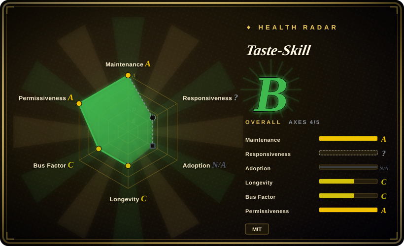
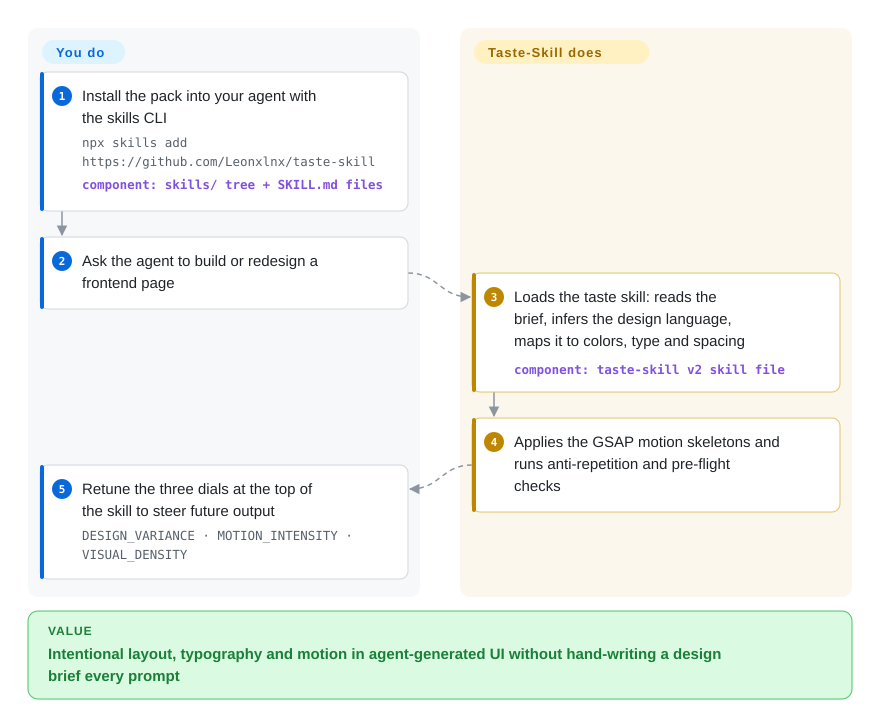

# Taste-Skill

Ask a coding agent for a landing page and you get the same dead template every AI ships — centered hero, purple gradient, zero motion. Taste-Skill is a set of portable skill files that load design taste into the agent before it writes code, so the output has intentional layout, typography and motion instead of slop.

## When to use

You're a developer or a vibe-coder using Claude Code, Codex, Cursor, or ChatGPT to scaffold a landing page or web app, and every time the agent produces a UI it looks the same: centered hero, three feature cards, a purple-to-blue gradient, default Tailwind spacing, zero motion. The output is technically correct but visually dead — it screams "an LLM made this." You don't want to hand-write a 2,000-word design brief every prompt, and you don't have a design system to point the agent at. You reach for Taste-Skill: you install it, and the agent loads a `SKILL.md` that injects an opinionated taste protocol — inferring a design direction from your brief, mapping it to a coherent design-system (color/type/spacing scale), laying in GSAP motion skeletons, and running anti-repetition checks so the next screen doesn't clone the last one.

It also ships tunable dials — `DESIGN_VARIANCE`, `MOTION_INTENSITY`, `VISUAL_DENSITY` on a 1–10 scale — so you can dictate "loud and animated" vs. "calm and dense" without rewriting the prompt. Beyond the default frontend skill, the pack includes stricter GPT/Codex-oriented rules (`gpt-taste`), named aesthetic variants (`high-end-visual-design` "soft", `minimalist-ui`, `industrial-brutalist-ui`), an `image-to-code` pipeline skill, a `redesign-existing-projects` skill, an output-completeness skill, and image-generation skills (`imagegen-frontend-web/mobile`, `brandkit`) for producing reference visuals before you write code. Install once via the skills CLI and the agent activates the right skill on demand.

## How it works

Taste-Skill is pure instruction text: each skill is a `SKILL.md` file that a skill-loading agent (Claude Code, Codex, Cursor, ChatGPT…) pulls into context when its description matches your request — there is no runtime, no server, and nothing to `import`. What the v2 default skill puts in front of the agent is a checklist-shaped protocol: read the brief and infer a design direction, map that direction onto concrete design-system values (color, type, spacing), follow canonical GSAP motion skeletons (the animation code patterns it wants reused) instead of inventing transitions ad hoc, then pass a strict pre-flight check and anti-repetition rules so screen two does not clone screen one. You set the coarse direction with three numeric dials at the top of the skill file — layout variance, motion intensity, visual density — and choose which specialized skill to install per job (image-first pipelines and redesign auditing are separate skills). What stays yours: everything the agent is still free to ignore — enforcement is advisory, and quality still depends on whether your harness loads and follows the markdown faithfully.

<!-- flow-steps:begin (generated from flows/taste-skill.json by tools/flow_card.py — do not edit) -->

Text version of the flow

1. **You**: Install the pack into your agent with the skills CLI — `npx skills add https://github.com/Leonxlnx/taste-skill` — component: `skills/ tree + SKILL.md files`
2. **You**: Ask the agent to build or redesign a frontend page
3. **Taste-Skill**: Loads the taste skill: reads the brief, infers the design language, maps it to colors, type and spacing — component: `taste-skill v2 skill file`
4. **Taste-Skill**: Applies the GSAP motion skeletons and runs anti-repetition and pre-flight checks
5. **You**: Retune the three dials at the top of the skill to steer future output — `DESIGN_VARIANCE · MOTION_INTENSITY · VISUAL_DENSITY`

**Value**: Intentional layout, typography and motion in agent-generated UI without hand-writing a design brief every prompt

<!-- flow-steps:end -->

## When NOT to use

- **You already run a design-taste / UI-critique skill you trust.** This overlaps heavily with sibling packs (designer-skills, stitch-skills, ui-ux-pro-max). Stacking two opinionated "make it look good" skills produces conflicting directives and double-routing — pick one taste source of truth.
- **You have a real design system or brand guide.** When colors, type scale, components, and tokens are already mandated, an inference-driven taste skill fights your constraints instead of serving them; encode the system directly (e.g. a `DESIGN.md`) and skip the guessing layer.
- **Backend, CLI, data, or non-visual work.** The pack only shapes frontend/visual output; it does nothing for an API, a migration, or a TUI.
- **Harness without a skill loader.** It activates through `SKILL.md` consumed by an agent (Claude Code, Codex, Cursor, ChatGPT); on a bespoke agent with no skill-loading mechanism the markdown won't auto-fire and you'd be pasting prompts by hand.
- **Advisory, not enforced.** Taste lives in prompt text the agent may ignore or dilute; "anti-slop protocol" is an instruction, not a lint gate. If you need deterministic enforcement, pair it with an artifact linter rather than relying on the skill alone.
- **Maintenance risk.** Single-author repo with no tagged releases; the v2 default is flagged experimental and skills get renamed/reorganized between pushes. Pin a commit if you need stability. [推断]

## Comparison

| Alternative | In index | Our verdict | Tradeoff |
|---|---|---|---|
| [designer-skills](designer-skills.md) | ✅ | When you want a whole design practice (research, UX strategy, design ops, 97 skills across 9 plugins), pick designer-skills; pick Taste-Skill when the job is narrower — make generated frontend output stop looking like AI slop. | Breadth vs. sharpness: designer-skills covers the designer's workflow, Taste-Skill spends its tokens on anti-slop aesthetics plus tunable variance/motion/density dials. |
| [stitch-skills](stitch-skills.md) | ✅ | If you design through Google's Stitch tooling — text/image → screens, code↔design conversion, `DESIGN.md` export — pick stitch-skills; pick Taste-Skill when there is no Stitch server in your loop. | Stitch-Skill drives an MCP-backed generation pipeline; Taste-Skill is serverless prompt-level taste that only shapes what your own agent writes. |
| [ui-ux-pro-max](ui-ux-pro-max.md) | ✅ | When you need product-type-to-design-system reasoning at scale (a local search engine over hundreds of rules, palettes and WCAG checklists), pick ui-ux-pro-max; pick Taste-Skill when the gap is purely visual — layout, type, motion — not UX architecture. | ui-ux-pro-max ships a retrieval engine + CSV rule databases and needs Python; Taste-Skill is markdown-only, zero-prerequisite, and stronger on aesthetic direction. |
| [make-interfaces-feel-better](make-interfaces-feel-better.md) | ✅ | Pick make-interfaces-feel-better when the UI already exists and needs ~16 concrete polish rules (radius, transitions, alignment); pick Taste-Skill when the agent is generating the screen from scratch. | Day-2 interaction polish vs. generation-time aesthetics; they compose rather than compete. |
| Anthropic / built-in agent skills | 未收录 | Pick the host's native skills when you want no third-party bundle to keep in sync; Taste-Skill exists because out-of-the-box agent UI output is generic. | Native ecosystem vs. specialized third-party taste layer — the latter can duplicate or conflict with native design skills. |

## Health & viability

- **Responsiveness**: Cannot be scored — type_na.
- **Maintenance (2026-09):** active — pushed within days of this check, not archived, but still zero tagged releases (GitHub reports no releases and no tags), so "version" means a moving commit. Treat it as best-effort, not a versioned product.
- **Governance & bus factor:** single-author `User` repo (`Leonxlnx`) carrying ~90k stars — a textbook bus-factor flag: outsized adoption resting on one maintainer. Sponsorship is real but ad-shaped: the README leads with paid-style Kimi/sponsor blocks and even carries a "no official token" disclaimer — revenue attention, not foundation governance. [推断]
- **Age & Lindy:** created 2026-02, so under 8 months old as of 2026-09 — young and star-hyped, with the v2 default still flagged experimental and skills renamed/reorganized between pushes. Unproven on the Lindy axis; the star count says nothing about longevity.
- **Risk flags:** advisory-only enforcement (prompt/markdown, not a lint gate) + no semver + single maintainer + sponsor-promoted README ⇒ pin a commit if you need stable behavior.

## Caveats (unverified)

- [未验证] License MIT and primary language JavaScript per GitHub metadata as of 2026-09-27; repo last pushed 2026-09-26 with no tagged release and no tags at all (`releases/latest` 404, `tags` empty) — re-verify before relying on a specific version's behavior.
- [未验证] Star count (~90.6k per GitHub on 2026-09-27) is unreliable and date-sensitive; treat as indicative only, never as a quality signal.
- [未验证] The skill inventory and install names (taste-skill → `design-taste-frontend` v2 experimental, `design-taste-frontend-v1`, `gpt-taste`, `image-to-code`, `redesign-existing-projects`, `high-end-visual-design`, `full-output-enforcement`, `minimalist-ui`, `industrial-brutalist-ui`, `stitch-design-taste`, plus image-only `imagegen-frontend-web/mobile` and `brandkit`) are read from the README as of 2026-09-27; install names and the v2-experimental status may change between pushes — verify the current `skills/` directory.
- [未验证] The tunable dials (`DESIGN_VARIANCE`, `MOTION_INTENSITY`, `VISUAL_DENSITY`, 1–10) and GSAP-motion/design-system-mapping behavior are described in the README; their actual effect on output quality is not independently confirmed here.
- [未验证] Supported agents (ChatGPT, Codex, Cursor, Claude Code) and the `npx skills add` install path are from the project README; activation fidelity per harness is not verified.
- [推断] Because the taste protocol lives in prompt/markdown skills loaded by the agent, enforcement is advisory — the agent can still produce slop; "anti-slop" steps are prompt-level instructions, not hard guarantees.
