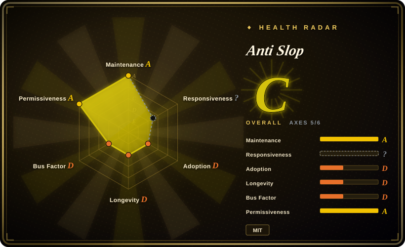
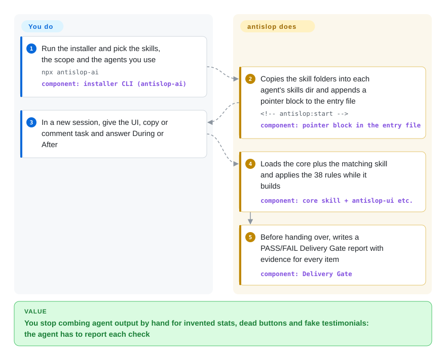

# Anti Slop

Your agent's landing page ships with "10K+ happy users", a five-star quote from a person who does not exist, a nav link to a section that was never built, and a button that does nothing. antislop is a rulebook the agent loads before it writes UI, copy or code comments: it forbids that invented content outright and makes the agent hand over a PASS/FAIL checklist with evidence before it calls the work done.

## When to use

You build product pages and small web apps through Claude Code, Codex, Cursor or a similar agent, and the part you keep fixing is not the colour scheme but the lies and the dead ends: a stat block reading "99.9% uptime" for a product that launched yesterday, testimonials with AI-generated avatars, an FAQ answering questions nobody asked, a dropdown wired to nothing, grey text that fails contrast. You already have (or intend to write) your own `DESIGN.md` for the look; what you need is a filter that stops the agent inventing things and forces it to prove the page works. You install antislop and the agent carries 38 numbered rules in three tiers: Hard Gate rules that are absolute (no unsourced statistics, no fictional testimonials, no ghost links, no dead controls, WCAG AA contrast, a real click-through of every control, no em dash in agent-written text), Purpose-Gate rules that allow a technique only with a written reason, and consistency locks. It ends every build with a four-block Delivery Gate report.

Pick it over the taste packs in this leaf when your problem is honesty and completeness rather than aesthetics. Taste-Skill and Hallmark push the agent toward a look; antislop deliberately refuses to choose one (the README calls it "a filter, not a style guide") and tells you to supply direction yourself. It also reaches past UI: the same rule set covers marketing copy (`antislop-copywriting`), accessibility with a bundled contrast checker (`antislop-human`), responsive layout, and cleaning AI-flavoured code comments without touching the code (`antislop-code`). That makes it the one pack in this leaf that covers a whole launch (page, copy and code) from a single install.

## How it works

antislop is instruction text, not a program: six skill folders, each a `SKILL.md` the agent reads into its context (the core is about 57 KB of Markdown and is meant to stay loaded; the other five load only when the task needs them). The interactive installer copies the folders into the skills directory of each agent you pick (12 are supported) and appends a marked "pointer block" to the agent's entry file, the `CLAUDE.md` or `AGENTS.md` it reads at the start of every session, so the rules come back each time. After that everything happens inside the agent: at the first UI, copy or comment task it asks whether to work **During** (apply the rules while building, then report) or **After** (audit existing work into a numbered findings file and fix only the numbers you approve). You can save that answer once with `npx antislop-ai --mode during`. Think of it as a building inspector's checklist handed to the builder: it does not design the house, it refuses to sign off on a missing staircase. What stays yours: the design direction (`DESIGN.md`), approving any asset the agent wants to invent, and trusting the report, because the agent fills it in itself. The only executable parts are the installer and a small Python contrast checker, also exposed as a local MCP tool (an MCP tool is a function the agent can call) in the Claude Code plugin.

<!-- flow-steps:begin (generated from flows/anti-slop.json by tools/flow_card.py — do not edit) -->

Text version of the flow

1. **You**: Run the installer and pick the skills, the scope and the agents you use — `npx antislop-ai` — component: `installer CLI (antislop-ai)`
2. **Anti Slop**: Copies the skill folders into each agent's skills dir and appends a pointer block to the entry file — `<!-- antislop:start -->` — component: `pointer block in the entry file`
3. **You**: In a new session, give the UI, copy or comment task and answer During or After
4. **Anti Slop**: Loads the core plus the matching skill and applies the 38 rules while it builds — component: `core skill + antislop-ui etc.`
5. **Anti Slop**: Before handing over, writes a PASS/FAIL Delivery Gate report with evidence for every item — component: `Delivery Gate`

**Value**: You stop combing agent output by hand for invented stats, dead buttons and fake testimonials: the agent has to report each check

<!-- flow-steps:end -->

## When NOT to use

- **You want the agent to make it look good.** antislop never picks a style; without a `DESIGN.md` its own rule R-37 labels the output "draft without direction" with every liveliness dial at 1, and the README's comparison shows the result as honest but plain. If you have no direction to give, use [Taste-Skill](taste-skill.md) or [Hallmark](hallmark.md), which infer or impose one, or copy a named site's look from [Awesome DESIGN.md](../design-to-code/awesome-design-md.md) and run antislop on top.
- **You need a check that cannot be talked past.** The Delivery Gate is a report the same agent writes about its own work; nothing outside the model verifies it (only the contrast ratio is computed by a script). For a CI gate or an editor-time linter use [Impeccable](../../../ai-design-generation/impeccable.md), whose detector engine runs rules without an LLM, or Playwright plus screenshot assertions.
- **You only want AI tells out of prose.** For blog posts, emails or docs, the core's 57 KB of UI rules is dead weight in the context window; [stop-slop](../../ai-writing/de-ai-writing/stop-slop.md) is a single prose-only skill file.
- **Your copy is Chinese, or your house style uses em dashes.** R-02 bans the em dash character (`—`) "in any text" as a Hard Gate, with no carve-out for CJK, and the standard Chinese dash `——` is two of those characters. Expect the agent to strip or refuse a normal Chinese dash; if that is wrong for your product, keep antislop for UI only and de-AI the Chinese copy with a Chinese-specific skill such as [humanizer-zh](../../ai-writing/de-ai-writing/humanizer-zh.md).
- **Tight context budget or a small model.** Loading a ~57 KB core plus a 16–27 KB skill before any code is written costs a sizeable slice of a small model's window [推断], and the rule set is dense enough that a weaker model may follow it partially. A short checklist skill such as [make-interfaces-feel-better](make-interfaces-feel-better.md) costs far less.
- **You do not want your agent's startup files edited, or a question at the start of every session.** The installer and the manual wizard append a pointer block to `CLAUDE.md`/`AGENTS.md` (always after asking), and by default each new session opens by asking During or After. Install through `npx skills add miqdadbadjuber/anti-slop` (copies folders only, no pointer) and save a mode, or pick a pack without a session protocol such as [Taste-Skill](taste-skill.md).
- **You need rules that stay put.** It is under two months old and shipped five releases in the last week of September 2026; rules are still being re-scoped after user reports (R-02 was narrowed in September after issue #32). Pin a tag and re-read the diff before updating.

## Comparison

| Alternative | In index | Our verdict | Tradeoff |
|---|---|---|---|
| [Taste-Skill](taste-skill.md) | ✅ | When the agent's UI is generic and you have no design direction to hand it, pick Taste-Skill, which infers a direction and tunes it with three dials; pick antislop when the direction exists and the problem is invented stats, dead controls and inaccessible contrast. | Taste-Skill adds aesthetic judgment but no honesty or click-through gate; antislop adds the gate and refuses to beautify, so it needs your `DESIGN.md` to produce anything lively. |
| [Impeccable](../../../ai-design-generation/impeccable.md) | ✅ | When the check has to run in CI or on every edit without trusting the model, pick Impeccable's deterministic detector engine; pick antislop when you want the rules applied during generation and a PASS/FAIL report per deliverable. | Impeccable gives machine-enforced detection but brings a CLI and engine binary to install; antislop is markdown the agent reads, cheap to add, but its gate is self-reported. |
| [Hallmark](hallmark.md) | ✅ | When you want an opinionated design brief, themes and a redesign workflow, pick Hallmark; pick antislop when you want a style-neutral filter that also covers copy, accessibility and code comments. | Hallmark decides how the page should look; antislop leaves the look to you and spends its rules on content honesty and working controls. |
| [stop-slop](../../ai-writing/de-ai-writing/stop-slop.md) | ✅ | For prose alone (articles, emails, docs), pick stop-slop; pick antislop's `antislop-copywriting` when the copy sits inside a UI you are also building under the same rules. | stop-slop is one small writing-focused file; antislop's copy rules come with a large always-loaded UI core and a session mode protocol. |
| [Awesome DESIGN.md](../design-to-code/awesome-design-md.md) | ✅ | Use Awesome DESIGN.md to supply the look (a named site's tokens and don'ts) and antislop to filter what the agent builds with it; they are complements, and antislop's own README shows the pair beating either alone. | Awesome DESIGN.md directs but does not filter invented content; antislop filters but does not direct, so running only one leaves one of the two failure modes in place. |

## Health & viability

- **Maintenance (2026-09-30):** very active. Last push and the v3.2.20 release were on 2026-09-29, with five tagged releases between 2026-09-24 and 2026-09-29 and commits on most days of September. The cadence is fast enough that behaviour changes between minor versions.
- **Governance & bus factor:** a personal `User` repo. The owner wrote 91 of the commits counted by GitHub; one regular contributor has 17 and three others have 1–3. The roadmap (ROADMAP.md) and release notes are the owner's. There is a CONTRIBUTING guide, a code of conduct and issue templates, and an outside report (issue #32, an R-02 rule conflict) was answered and fixed within a day.
- **Age & Lindy:** created 2026-08-07, under two months old at this check. No Lindy credit: the rules and the install paths are still being reshaped from release to release.
- **Adoption:** ~4.0k stars and 272 forks on GitHub; the `antislop-ai` npm installer had 7,715 downloads last month by the health scorer's count (the npm point API gave 8,433 for 2026-08-30..2026-09-28) and 28 published versions since 2026-08-15. It is listed on skills.sh. A star count this high this young is a hype signal, not proof of fitness.
- **Risk flags:** MIT, applied from v3.0.0 (the roadmap lists the MIT license as part of that release, so earlier tags may carry no license). By design it edits agent entry files and ships a Python script; its own SECURITY.md reports a Gen Agent Trust Hub "Warn (MEDIUM)" rating on exactly those two behaviours. Enforcement is advisory: the model grades its own Delivery Gate.

## Caveats (unverified)

- [未验证] Stars (~4.0k), forks (272), contributor commit counts and the npm figures (7,715 last-month downloads in the health block, 8,433 from the npm point API for 2026-08-30..2026-09-28, 28 versions) were read from the GitHub and npm APIs on 2026-09-30; they are date-sensitive and not a quality signal.
- [未验证] That output actually improves (the README's before/after images for UI, copy and code) is the author's demonstration; no independent reproduction was run for this page.
- [推断] The Delivery Gate is filled in by the same agent that built the work, so a PASS line is a claim, not a measurement; only the contrast ratio is recomputed by `contrast-check.py`.
- [推断] The context cost (core ~57 KB of Markdown, skills 9–27 KB each, measured as file sizes on 2026-09-30) and its effect on smaller models are estimates from file size, not measured token counts or model evaluations.
- [推断] The Chinese-dash collision follows from R-02's text (bans `—` in any text, no CJK carve-out) and the fact that `——` is two U+2014 characters; how a given agent actually behaves on Chinese copy was not tested.
- [未验证] Supported agents (12 in the installer; plugin doors for Claude Code, Antigravity, Codex, Cursor, Kimi Code, Cline, Oh My Pi; a Pi package) and each agent's skills folder are from `cli/lib/install.mjs` and the README at v3.2.20; per-agent activation was not tested.
- [未验证] Whether tags before v3.0.0 carry a license was not checked tag by tag; the statement rests on ROADMAP.md's v3.0.0 row.
- [未验证] The Gen Agent Trust Hub "Warn (MEDIUM)" rating is quoted from the project's own SECURITY.md ("as of v3.1.3"); the current third-party rating was not fetched.
