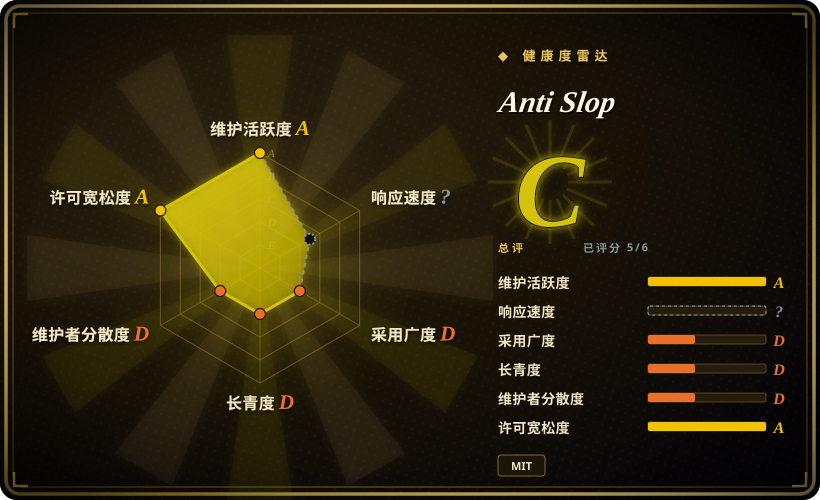
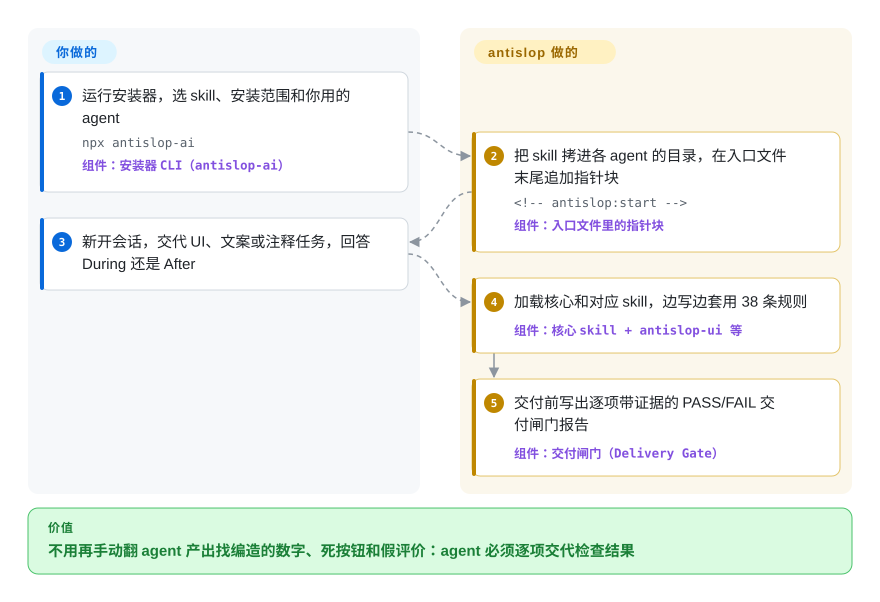

# Anti Slop

agent 给你做的落地页上写着“10K+ 用户好评”，挂着一条根本不存在的人给的五星评价，导航链到一个没做出来的区块，还有一个点了没反应的按钮。antislop 是 agent 在写 UI、文案或代码注释之前先读进去的一本规则书：这类编造内容一律禁止，并且要求 agent 交活前逐项给出带证据的 PASS/FAIL 清单。

## 何时使用

你用 Claude Code、Codex、Cursor 之类的 agent 做产品页和小型 web 应用，反复返工的不是配色，而是假话和死路：一个昨天才上线的产品挂着“99.9% 可用性”的数据块，评价区配着 AI 生成的头像，FAQ 回答的是没人问过的问题，下拉框什么也没连，灰字对比度不达标。页面长什么样，你已经有（或打算自己写）一份 `DESIGN.md`；你缺的是一道过滤：不让 agent 编东西，并逼它证明页面真能用。装上 antislop 后，agent 随身带着分三档的 38 条编号规则：Hard Gate 是绝对禁令（不许无来源的统计数字、不许虚构评价、不许幽灵链接、不许死控件、对比度要达到 WCAG AA、每个控件都要实际点一遍、agent 写的文字里不许出现 em dash），Purpose-Gate 允许某种手法但必须写明理由，最后一档是一致性锁。每次构建都以四块内容的交付闸门（Delivery Gate）报告收尾。

在这个叶子里，当你的问题是“诚实和完整”而不是“好不好看”时，选它而不是那些审美包。Taste-Skill 和 Hallmark 会把 agent 推向某种风格；antislop 刻意不替你选风格（README 原话是“a filter, not a style guide”），方向要你自己给。它也不止管 UI：同一套规则覆盖营销文案（`antislop-copywriting`）、带对比度检查脚本的无障碍（`antislop-human`）、响应式布局，以及只清理 AI 味代码注释、不碰代码本身（`antislop-code`）。所以在这个叶子里，只有它一次安装就能覆盖一次上线的页面、文案和代码三块。

## 怎么用起来

antislop 是说明文字，不是程序：六个 skill 目录，每个里面一份 agent 读进上下文的 `SKILL.md`（核心约 57 KB 的 Markdown，设计上常驻加载；另外五个只在任务需要时加载）。交互式安装器把这些目录拷进你选中的每个 agent 的 skills 目录（支持 12 个），再往 agent 的入口文件末尾追加一段带标记的“指针块”，入口文件就是 agent 每次开会话都会读的 `CLAUDE.md` 或 `AGENTS.md`，于是规则每次都会回来。之后的事全在 agent 内部发生：碰到第一个 UI、文案或注释任务时，它先问你用 **During**（边做边套规则，最后出报告）还是 **After**（审计已有产出，写成编号问题清单，只修你批准的编号）。这个回答可以用 `npx antislop-ai --mode during` 存成默认值。打个比方，它像是交给施工队的一份验收清单：不替你设计房子，但少了楼梯就不签字。仍然归你的部分：设计方向（`DESIGN.md`）、批准 agent 想要编造的任何素材，以及是否相信那份报告，因为报告是 agent 自己填的。真正会执行的只有安装器和一个小的 Python 对比度检查脚本；在 Claude Code 插件里，这个脚本还以本地 MCP 工具的形式提供（MCP 工具就是 agent 可以直接调用的一个函数）。

<!-- flow-steps:begin (generated from flows/anti-slop.json by tools/flow_card.py — do not edit) -->

流程文字版

1. **你**：运行安装器，选 skill、安装范围和你用的 agent — `npx antislop-ai` — 组件：`安装器 CLI（antislop-ai）`
2. **Anti Slop**：把 skill 拷进各 agent 的目录，在入口文件末尾追加指针块 — `<!-- antislop:start -->` — 组件：`入口文件里的指针块`
3. **你**：新开会话，交代 UI、文案或注释任务，回答 During 还是 After
4. **Anti Slop**：加载核心和对应 skill，边写边套用 38 条规则 — 组件：`核心 skill + antislop-ui 等`
5. **Anti Slop**：交付前写出逐项带证据的 PASS/FAIL 交付闸门报告 — 组件：`交付闸门（Delivery Gate）`

**价值**：不用再手动翻 agent 产出找编造的数字、死按钮和假评价：agent 必须逐项交代检查结果

<!-- flow-steps:end -->

## 何时不用

- **你想让 agent 把页面做好看。** antislop 从不替你选风格；没有 `DESIGN.md` 时，它自己的 R-37 会把产出标成“draft without direction”，所有活力旋钮都拨到 1，README 的对比图里这种结果诚实但平淡。你拿不出方向时，用会推断或给定风格的 [Taste-Skill](taste-skill.zh.md) 或 [Hallmark](hallmark.zh.md)，或者从 [Awesome DESIGN.md](../design-to-code/awesome-design-md.zh.md) 抄一个具名网站的外观，再叠上 antislop。
- **你需要一道糊弄不过去的检查。** 交付闸门是同一个 agent 给自己的活写的报告，模型之外没有任何东西去核对它（只有对比度是脚本算出来的）。要进 CI 或在编辑时拦截，用 [Impeccable](../../../ai-design-generation/impeccable.zh.md)，它的检测引擎不依赖大模型运行规则；或者用 Playwright 加截图断言。
- **你只想去掉散文里的 AI 味。** 写博客、邮件、文档时，核心那 57 KB 的 UI 规则只是白占上下文；[stop-slop](../../ai-writing/de-ai-writing/stop-slop.zh.md) 是只管散文的单个 skill 文件。
- **你的文案是中文，或者你的写作规范本来就用 em dash。** R-02 把 em dash 字符（`—`）“in any text”列为 Hard Gate 禁令，没有给中日韩文字留例外，而中文标准破折号 `——` 正是两个这样的字符。要预期 agent 会删掉或拒绝正常的中文破折号；如果这对你的产品不对，就只让 antislop 管 UI，中文文案改用专门的中文去 AI 味 skill，比如 [humanizer-zh](../../ai-writing/de-ai-writing/humanizer-zh.zh.md)。
- **上下文预算紧，或者用的是小模型。** 还没写一行代码就先加载约 57 KB 的核心再加一个 16–27 KB 的 skill，会吃掉小模型窗口里不小的一块 [推断]；规则又密，较弱的模型可能只执行一部分。像 [make-interfaces-feel-better](make-interfaces-feel-better.zh.md) 这样的短清单 skill 成本低得多。
- **你不想让人改 agent 的启动文件，也不想每次开会话先被问一句。** 安装器和手动向导都会往 `CLAUDE.md`/`AGENTS.md` 追加指针块（都会先征求同意），默认每个新会话开头都要问 During 还是 After。改用 `npx skills add miqdadbadjuber/anti-slop` 安装（只拷目录、不写指针）并存一个默认模式，或者换一个没有会话协议的包，比如 [Taste-Skill](taste-skill.zh.md)。
- **你需要规则稳定不动。** 它还不到两个月大，2026 年 9 月最后一周就发了五个版本；规则仍在根据用户反馈重新划定范围（R-02 在 9 月因 issue #32 被收窄）。请锁定一个 tag，升级前先读 diff。

## 横向对比

| 替代品 | 是否收录 | 我们的评价 | 取舍 |
|---|---|---|---|
| [Taste-Skill](taste-skill.zh.md) | ✅ | agent 做的 UI 千篇一律、你又给不出设计方向时，选 Taste-Skill，它会推断方向并用三个旋钮微调；方向已经有了、问题出在编造数字、死控件和对比度不达标时，选 antislop。 | Taste-Skill 带来审美判断，但没有诚实性和逐个点击的闸门；antislop 带来闸门却拒绝美化，所以要靠你的 `DESIGN.md` 才能做出有活力的东西。 |
| [Impeccable](../../../ai-design-generation/impeccable.zh.md) | ✅ | 检查必须在 CI 里或每次编辑时运行、不能信任模型自评时，选 Impeccable 的确定性检测引擎；想在生成过程中就套规则、并且每次交付都拿到 PASS/FAIL 报告时，选 antislop。 | Impeccable 由机器强制检测，但要装 CLI 和引擎二进制；antislop 只是 agent 读的 Markdown，加起来便宜，可闸门是自报的。 |
| [Hallmark](hallmark.zh.md) | ✅ | 想要一份有主见的设计 brief、主题和重设计流程时，选 Hallmark；想要不带风格倾向、同时覆盖文案、无障碍和代码注释的过滤器时，选 antislop。 | Hallmark 决定页面该长什么样；antislop 把外观留给你，把规则花在内容诚实和控件能用上。 |
| [stop-slop](../../ai-writing/de-ai-writing/stop-slop.zh.md) | ✅ | 只处理散文（文章、邮件、文档）时，选 stop-slop；文案嵌在一个你也在用同一套规则构建的 UI 里时，选 antislop 的 `antislop-copywriting`。 | stop-slop 是一个小而专注写作的文件；antislop 的文案规则连带一个常驻的大 UI 核心和一套会话模式协议。 |
| [Awesome DESIGN.md](../design-to-code/awesome-design-md.zh.md) | ✅ | 用 Awesome DESIGN.md 提供外观（某个具名网站的 token 和禁忌），再用 antislop 过滤 agent 据此做出来的东西；两者互补，antislop 自己的 README 就展示了两者合用胜过单用任何一个。 | Awesome DESIGN.md 给方向但不过滤编造内容；antislop 过滤却不给方向，只用其中一个就会留下两种失败中的一种。 |

## 健康度与可持续性

- **维护（2026-09-30）：** 非常活跃。最后一次推送和 v3.2.20 发布都在 2026-09-29，2026-09-24 到 2026-09-29 之间发了五个带 tag 的版本，9 月大多数日子都有提交。节奏快到小版本之间行为就会变。
- **治理与巴士因子：** 个人 `User` 仓库。GitHub 统计的提交里作者占 91 次；一位常驻贡献者 17 次，另外三人各 1–3 次。路线图（ROADMAP.md）和发布说明都由作者掌握。有 CONTRIBUTING 指南、行为准则和 issue 模板；一个外部报告（issue #32，R-02 规则冲突）在一天内得到回复并修复。
- **年龄与 Lindy：** 2026-08-07 创建，本次核查时不到两个月。没有 Lindy 加成：规则和安装路径还在一个版本接一个版本地调整。
- **采用度：** GitHub 上约 4.0k star、272 fork；`antislop-ai` npm 安装器按健康度评分器的统计上月下载 7,715 次（npm point API 给出 2026-08-30 至 2026-09-28 为 8,433 次），自 2026-08-15 起发布了 28 个版本。已上架 skills.sh。这么年轻就有这么多 star，是热度信号，不是好用的证明。
- **风险信号：** MIT 许可，从 v3.0.0 起生效（路线图把 MIT 许可列为那个版本的内容，所以更早的 tag 可能没有许可）。按设计它会改 agent 入口文件，并附带一个 Python 脚本；它自己的 SECURITY.md 报告 Gen Agent Trust Hub 恰好针对这两点给了“Warn (MEDIUM)”评级。约束是建议性的：交付闸门由模型给自己打分。

## 存疑（未验证）

- [未验证] star（约 4.0k）、fork（272）、贡献者提交数和 npm 数据（健康度块里上月下载 7,715 次，npm point API 给出 2026-08-30 至 2026-09-28 为 8,433 次，28 个版本）读自 2026-09-30 的 GitHub 与 npm API；这些数字随时间变化，也不是质量信号。
- [未验证] 产出确实变好（README 里 UI、文案、代码三组前后对比图）是作者自己的演示；本页没有做独立复现。
- [推断] 交付闸门由完成这份工作的同一个 agent 填写，所以一行 PASS 是声明而不是测量；只有对比度会被 `contrast-check.py` 重新计算。
- [推断] 上下文成本（核心约 57 KB Markdown、各 skill 9–27 KB，均为 2026-09-30 量得的文件大小）及其对小模型的影响是按文件大小估的，不是实测 token 数或模型评测。
- [推断] 与中文破折号冲突这一点，依据是 R-02 的原文（任何文字里禁用 `—`、没有中日韩例外）以及 `——` 由两个 U+2014 字符组成；具体某个 agent 在中文文案上怎么表现没有测试。
- [未验证] 支持的 agent（安装器里 12 个；Claude Code、Antigravity、Codex、Cursor、Kimi Code、Cline、Oh My Pi 的插件入口；一个 Pi 包）以及各 agent 的 skills 目录来自 v3.2.20 的 `cli/lib/install.mjs` 和 README；没有逐个 agent 测试激活情况。
- [未验证] v3.0.0 之前的 tag 是否带许可没有逐个检查；这一说法依据的是 ROADMAP.md 里 v3.0.0 那一行。
- [未验证] Gen Agent Trust Hub 的“Warn (MEDIUM)”评级引自项目自己的 SECURITY.md（“as of v3.1.3”）；没有去抓取第三方当前的评级。
