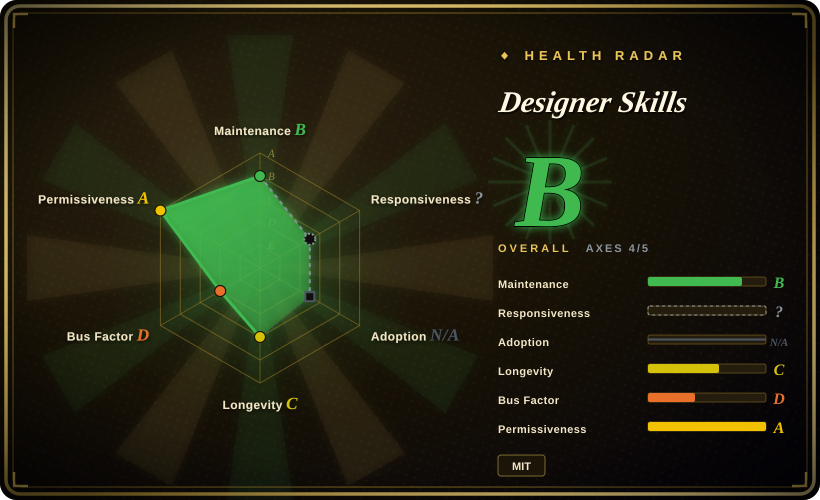
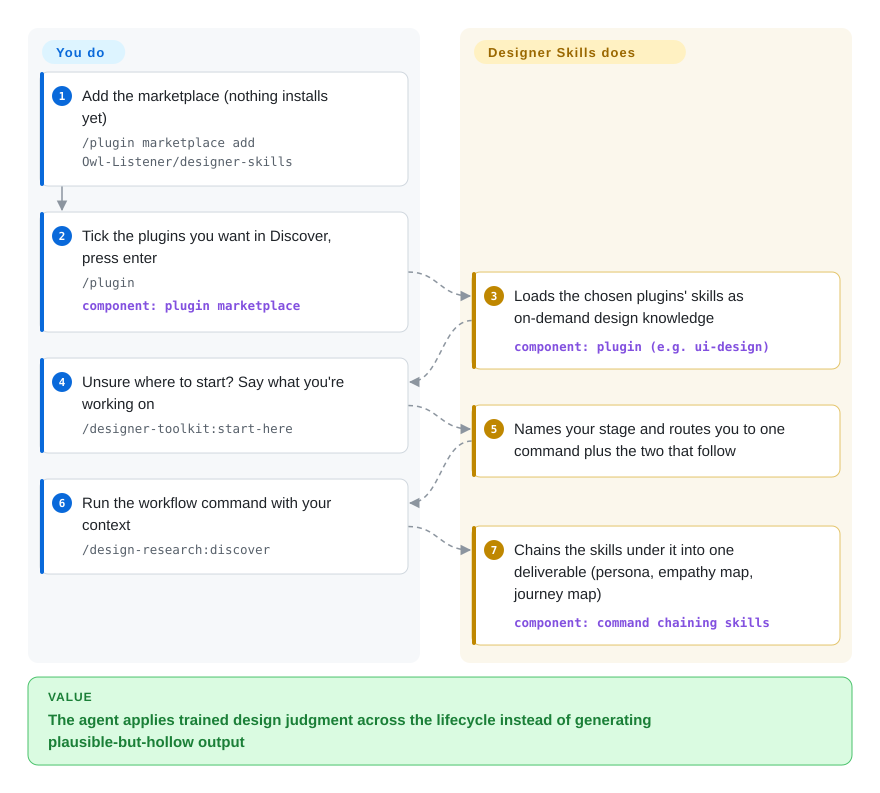

# Designer Skills

Your coding agent's design output looks plausible but falls apart when asked *why*: the "design system" is a color list, the critique says "looks clean". Designer Skills is a design-practice pack — 111 skills and 34 commands across 9 plugins covering research through visual critique — installed into Claude Code or Gemini CLI via a plugin marketplace, so the agent applies trained design judgment instead of guessing.

## When to use

You're a product designer (or a developer doing design work) running Claude Code, and your agent keeps producing design output that is competent in syntax but shallow in craft: a UI with no real layout-grid discipline, a "design system" that's just a color list, a usability test plan with no method behind it, a critique that says "looks clean" instead of naming hierarchy and affordance problems. You want the agent to reason like a trained designer across the *whole* lifecycle — frame the research, justify the IA, defend type and color choices, run a heuristic evaluation, write the handoff spec — not just generate a pretty screen. Designer Skills gives you that as a marketplace bundle: install with `/plugin marketplace add Owl-Listener/designer-skills`, then enable the plugins you need (e.g. `ui-design`, `design-systems`, `visual-critique`), and the agent loads the relevant skill on demand when it does design work.

You reach for it when you want *breadth* — one install that covers research → systems → UI → interaction → ops → critique — rather than hand-assembling separate single-purpose design skills. In this repo's framing, *skills are nouns* (domain-knowledge units like "color systems" or "Gestalt principles") and *commands are verbs* (workflows that chain skills into a complete job), so you get both reusable knowledge and ready-made procedures. It also ships a `.gemini/extensions/` layout, so the same packs work in Gemini CLI via a clone-and-copy install. Since 2026-09 the family spans five collections (~273 skills / 33 plugins in total — the other four live in sibling repos), and this repo added a router command (`/designer-toolkit:start-here`) that tells you which command to run when you don't know where to begin.

## How it works

Each plugin is a folder of Markdown skills (domain knowledge the agent loads on demand) plus slash-commands (fixed workflows that chain several skills into one deliverable). You do three things once: add the marketplace, tick the plugins you want from `/plugin` → Discover, and — when unsure — run `/designer-toolkit:start-here`, which names your stage and routes you to one command plus the two that follow. From then on the agent does the rest: when you run e.g. `/design-research:discover`, it walks personas → empathy map → journey map in one pass, pulling the underlying skill guidance as it goes, and outputs the deliverable. What stays yours: picking which plugins to enable, supplying the product context, and judging the output — nothing here is a hard gate, it is written-down designer judgment the agent reads.

<!-- flow-steps:begin (generated from flows/designer-skills.json by tools/flow_card.py — do not edit) -->

Text version of the flow

1. **You**: Add the marketplace (nothing installs yet) — `/plugin marketplace add Owl-Listener/designer-skills`
2. **You**: Tick the plugins you want in Discover, press enter — `/plugin` — component: `plugin marketplace`
3. **Designer Skills**: Loads the chosen plugins' skills as on-demand design knowledge — component: `plugin (e.g. ui-design)`
4. **You**: Unsure where to start? Say what you're working on — `/designer-toolkit:start-here`
5. **Designer Skills**: Names your stage and routes you to one command plus the two that follow
6. **You**: Run the workflow command with your context — `/design-research:discover`
7. **Designer Skills**: Chains the skills under it into one deliverable (persona, empathy map, journey map) — component: `command chaining skills`

**Value**: The agent applies trained design judgment across the lifecycle instead of generating plausible-but-hollow output

<!-- flow-steps:end -->

## When NOT to use

- **You already run a focused design skill you trust.** If you have a dedicated critique or design-system skill wired in, layering this broad pack on top invites overlapping guidance and double-routing — e.g. two competing definitions of "good hierarchy". Pick one source of truth per concern.
- **You only need one slice.** Wanting just visual critique, or just a design-system contract, makes a 111-skill / 9-plugin bundle heavier than the job — a single-purpose sibling skill is lighter to reason about and maintain. Enable only the plugins you use, or prefer a narrower pack.
- **You're not on a supported harness.** Activation depends on Claude Code's plugin/skill loader or the Gemini CLI extension mechanism. On an unsupported or bespoke agent there's no loader to fire the skills, and the markdown alone won't auto-activate. [推断]
- **You need enforcement, not advice.** Behavior lives in prompt/markdown skills the agent reads; nothing is a hard gate. The agent can ignore or partially apply a skill, and "do X" is an instruction, not a guarantee. [推断]
- **You need a pinned, stable surface.** There's no tagged release; the skill/command set changes over time on `main`, and the maintainer explicitly closes PRs (new skills / structural changes) that lack a corresponding issue — upstream evolves on the maintainer's terms. Pin a commit if you need reproducibility.

## Comparison

| Alternative | In index | Our verdict | Tradeoff |
|---|---|---|---|
| [stitch-skills](../design-to-code/stitch-skills.md) | ✅ | Choose stitch-skills when a focused Stitch-oriented design pack is lighter than a full lifecycle suite. | Compare on scope: Stitch-oriented pack vs. this broad full-lifecycle design suite. If your need is narrow, the focused pack is lighter; Designer Skills wins on breadth. |
| [ui-ux-pro-max](ui-ux-pro-max.md) | ✅ | Choose ui-ux-pro-max when its UI/interaction guidance or install path fits your harness better. | Another UI/UX skill pack; overlaps heavily on the "polished interface" surface. Pick by which one's UI/interaction guidance matches your taste and which install path fits your harness. |
| [taste-skill](taste-skill.md) | ✅ | Choose taste-skill when visual taste and critique judgment are the narrow job. | Centers visual *taste*/judgment; narrower than this multi-discipline suite. Use it for critique-flavored taste calls; use Designer Skills when you also need research/systems/ops. |
| [make-interfaces-feel-better](make-interfaces-feel-better.md) | ✅ | Choose make-interfaces-feel-better when micro-interaction polish matters more than lifecycle coverage. | Aimed at interaction polish / "feel"; overlaps Designer Skills' `interaction-design` plugin. The narrow pack is sharper on micro-interaction; Designer Skills covers the rest of the lifecycle too. |
| [Anthropic Skills](../../vendor-collections/anthropic-skills.md) / built-in skills | 部分已收录 | Choose Anthropic Skills or built-ins when platform-native guidance should avoid third-party bundle overlap. | The platform's own skill ecosystem; Designer Skills is a third-party bundle layered on top, so it can duplicate or conflict with native skills. |
| Companion collections (AI product design, UX program mgmt, design leadership, inclusive design) | 未收录 | Choose the author's companion collections when the task is an adjacent design discipline. | Same author's sibling repos in the family; this entry covers only the "design practice" collection. Reach for the others for adjacent disciplines. |

## Health & viability

- **Responsiveness**: Cannot be scored — type_na.
- **Maintenance (2026-09):** active on `main` — last pushed 2026-09-05, not archived — but still **no tagged release** (no tags at all), so there's no stable, versioned surface to pin to; the skill/command set evolves continuously and the maintainer closes PRs lacking a matching issue. A `CHANGELOG.md` now tracks changes in-tree as the de facto version anchor.
- **Governance / bus factor:** single-maintainer, `User`-owned repo (`Owl-Listener`, MC Dean per the README) at ~2.8k stars, part of a larger personal family of five design collections. One person's roadmap; no org or foundation backing.
- **Age & Lindy verdict:** young (created 2026-03, ~6.5 months old) — **unproven**, but momentum is real: stars roughly doubled (1.7k→2.8k) and the design-practice set grew (97→111 skills) between the 2026-06 and 2026-09 checks. Still no reproducibility anchor; pin a commit if you need stability.
- **Risk flags:** advisory-only prompt/markdown (no runtime enforcement), Claude-Code-first with README-claimed Gemini CLI support, and self-reported skill counts across a growing 33-plugin family. No relicense/CVE concerns for a skill bundle, but the no-release + single-author + breadth combination is the real fragility.

## Caveats (unverified)

- [未验证] Counts — 111 skills / 34 commands / 9 plugins (this collection, per the README plugin table) and the family total of 273 skills / 76 commands / 33 plugins — are from the project README as of 2026-09-28 and not independently audited file-by-file; the README itself is internally inconsistent (one line says "all 107 skills"). The live `main` tree may differ.
- [未验证] The plugin list (design-research, design-systems, ux-strategy, ui-design, interaction-design, prototyping-testing, design-ops, designer-toolkit, visual-critique) is from the README; verify against the current directory rather than relying on this list.
- [推断] Because skills are prompt/markdown loaded by the agent, enforcement is advisory — "do X" steps are instructions, not hard guarantees, and activation fidelity varies per harness (Claude Code vs Gemini CLI).
- [推断] Gemini CLI support via `.gemini/extensions/` clone-and-copy is described in the README but not confirmed working here; treat cross-harness parity with Claude Code as unverified.
