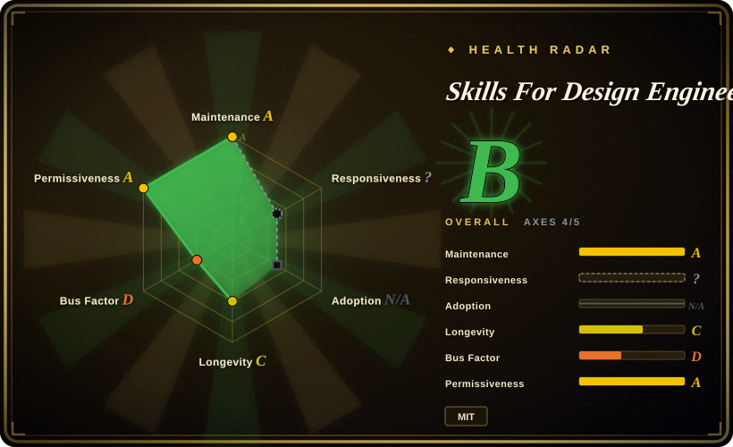
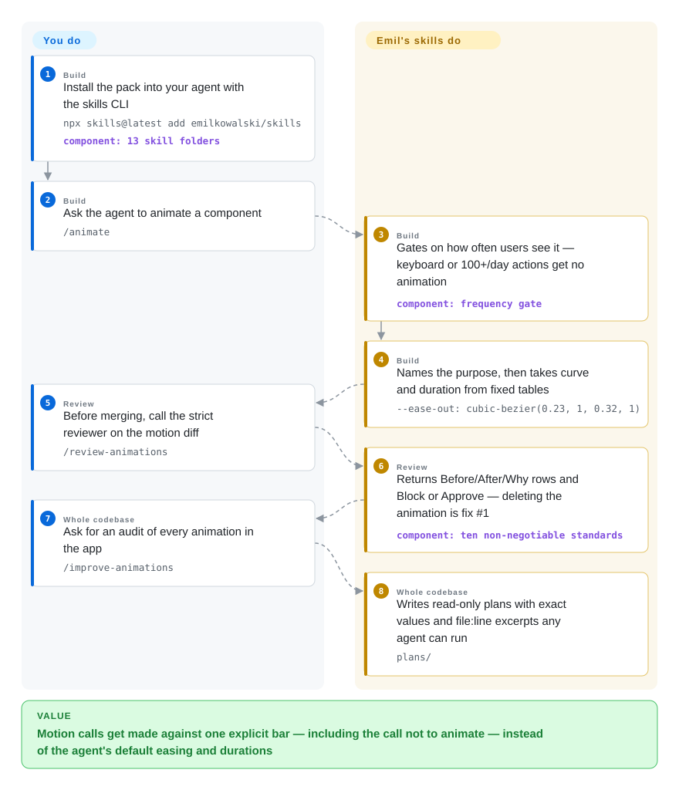

# Skills For Design Engineers

Your coding agent writes animations that run but feel wrong: dropdowns that start slow, popovers that grow out of nothing, a command palette that animates every time you press ⌘K. This pack gives the agent one author's explicit rules for when not to animate at all and, when it should, which curve, duration and origin to use — plus a strict reviewer that blocks the rest.

## When to use

You're a frontend or design engineer using Claude Code, Codex, Cursor or another skill-capable agent to build a web UI, and the agent can write React/CSS but its motion is off: `ease-in` on entrances, `transition: all`, 400ms dropdowns, keyframes on toasts that jump when triggered twice, hover effects that stick on phones. You reach for this pack when you want those calls made against one explicit bar — Emil Kowalski's, the author of Sonner and Vaul — rather than the model's defaults or a prompt you retype each time.

It is narrow on purpose: nearly everything is about motion. Of its 13 skills, the core set builds motion (`animate`, `animate-expo` for React Native), reviews a motion diff (`review-animations`), audits a whole codebase into executable plans (`improve-animations`), and hunts for the few places that should move (`find-animation-opportunities`). Around that sit `emil-design-eng` (the philosophy), `apple-design` (WWDC principles for the web), `animation-vocabulary`, `mobile-native` (making a web app feel installed on a phone), `prototype` (several variants behind a live picker), `pick-ui-library` (a curated library list), and two off-theme skills, `write-swift` and `ask-sonner`.

## How it works

Everything is instruction markdown — about 4.3k lines across 13 `SKILL.md` folders, no scripts — installed with the skills CLI and loaded by the agent when a request matches. The load-bearing idea is an ordered decision sequence: first, *should this animate at all?* by how often a user sees it (100+ times a day or keyboard-triggered: never; rare moments: this is where delight goes); then name the purpose; only then pick properties, curve and duration from fixed tables (`ease-out` for anything entering or leaving, never `ease-in` on UI, UI motion under 300ms, `scale(0.95)`+opacity instead of `scale(0)`, popovers scaling from their trigger, CSS transitions rather than keyframes for anything triggered rapidly). `review-animations`, `pick-ui-library` and `prototype` are marked `disable-model-invocation`, so you call them explicitly; the reviewer returns a Before/After/Why table and an explicit Block or Approve, and its first-choice fix is deleting the animation. `improve-animations` and `find-animation-opportunities` are read-only: they write plan files or a capped shortlist (at most 5–7 for a whole app), never source edits. What stays yours: deciding whether the author's taste fits your product, running and feeling the result (the skills keep saying "test on a real device", "review it the next day"), and any enforcement — none of the rules is checked by code.

<!-- flow-steps:begin (generated from flows/emilkowalski-skills.json by tools/flow_card.py — do not edit) -->

Text version of the flow

1. **You** (Build): Install the pack into your agent with the skills CLI — `npx skills@latest add emilkowalski/skills` — component: `13 skill folders`
2. **You** (Build): Ask the agent to animate a component — `/animate`
3. **Skills For Design Engineers** (Build): Gates on how often users see it — keyboard or 100+/day actions get no animation — component: `frequency gate`
4. **Skills For Design Engineers** (Build): Names the purpose, then takes curve and duration from fixed tables — `--ease-out: cubic-bezier(0.23, 1, 0.32, 1)`
5. **You** (Review): Before merging, call the strict reviewer on the motion diff — `/review-animations`
6. **Skills For Design Engineers** (Review): Returns Before/After/Why rows and Block or Approve — deleting the animation is fix #1 — component: `ten non-negotiable standards`
7. **You** (Whole codebase): Ask for an audit of every animation in the app — `/improve-animations`
8. **Skills For Design Engineers** (Whole codebase): Writes read-only plans with exact values and file:line excerpts any agent can run — `plans/`

**Value**: Motion calls get made against one explicit bar — including the call not to animate — instead of the agent's default easing and durations

<!-- flow-steps:end -->

<!-- flow-steps:begin (generated from flows/emilkowalski-skills.json by tools/flow_card.py — do not edit) -->
<!-- flow-steps:end -->

## When NOT to use

- **You need a full design lifecycle or UX research bundle.** Use [Designer Skills](designer-skills.md) when research, UX strategy, design systems, prototyping and design ops all need coverage; this pack is centered on motion craft.
- **You need deterministic UI quality enforcement.** Use a visual regression test, Storybook checks, Lighthouse, or a custom artifact linter when you need hard gates; "Block" here is a verdict the model writes, not a check that fails a build.
- **Your design system already fixes motion tokens that disagree.** The pack forbids `ease-in` on UI and caps UI motion at 300ms; a system that prescribes accelerating exits or longer entrances will fight it. Its own `animate` skill says to extend existing tokens, not fork them — decide which source wins before installing.
- **You mainly need generic anti-slop direction on layout, type and color.** Use [Taste-Skill](taste-skill.md); this pack says little about layout or palette.
- **You're designing product surfaces from scratch and need a direction, not motion rules.** Use [Interface Design](interface-design.md), which runs a domain-exploration and per-component checkpoint before building dashboards and settings pages.
- **You only need small mechanical polish.** Use [make-interfaces-feel-better](make-interfaces-feel-better.md) for concentric radii, tabular numbers and surface details in one compact checklist.
- **You don't want a single author's taste as a dependency.** One person wrote 96% of the commits and the rules are his opinions (with his own libraries, Sonner and Vaul, as recurring examples); skills were added and reworded on untagged commits all summer — pin a commit or copy only the skills you use.

## Comparison

| Alternative | In index | Our verdict | Tradeoff |
|---|---|---|---|
| [Designer Skills](designer-skills.md) | ✅ | Choose Designer Skills when you need research, UX strategy and design-system coverage; choose this pack when the agent's motion decisions are the bottleneck. | Designer Skills is far broader in process; this pack is narrower but gives exact curves, durations and a blocking motion review. |
| [Taste-Skill](taste-skill.md) | ✅ | Choose Taste-Skill when layouts, type and color look generic; choose this pack when the page looks right but moves wrong. | Taste-Skill is a general visual-taste overlay; this pack is motion-first with a frequency gate and a separate reviewer. |
| [Interface Design](interface-design.md) | ✅ | Choose Interface Design when building dashboards or admin surfaces needs a committed direction and cross-session design memory; choose this pack for how those surfaces animate. | Interface Design governs the whole product-UI decision with a mandatory checkpoint; this pack leaves visual direction to you and goes deep on motion only. |
| [make-interfaces-feel-better](make-interfaces-feel-better.md) | ✅ | Choose make-interfaces-feel-better when the UI is directionally right and needs a short list of mechanical fixes; choose this pack when you need motion built, reviewed or audited. | The former is one compact checklist; this pack splits build, review, audit and opportunity-finding into separate skills with fixed value tables. |
| [UI UX Pro Max Skill](ui-ux-pro-max.md) | ✅ | Choose UI UX Pro Max when you want pre-computed style, palette and font candidates from a local database; choose this pack for motion judgment. | UI UX Pro Max is broader and data-heavy; this pack is plain markdown you can read end to end. |
| [Stitch Skills](../design-to-code/stitch-skills.md) | ✅ | Choose Stitch Skills when generating or converting designs through Stitch MCP; choose this pack when the agent is already writing the UI code. | Stitch is a tool-backed design workflow; this pack is advisory text only. |

## Health & viability

- **Maintenance snapshot (2026-09-30):** GitHub reports `archived=false`, default branch `main`, last push on 2026-09-23; the repo has 54 commits since its 2026-03-16 creation, and seven of the 13 skills were added between 2026-07-21 and 2026-09-15.
- **Adoption snapshot:** GitHub reports 42,173 stars and 2,397 forks on 2026-09-30, up from ~14.0k on 2026-07-16; there is still no tagged release, and the pack is distributed through the skills CLI rather than a package registry.
- **License snapshot:** MIT, from GitHub metadata and the root `LICENSE` file.
- **Governance / bus factor:** single-owner repo; one contributor accounts for 96% of commits (the health scorer and `git shortlog` agree). The content is explicitly one person's taste and experience.
- **Lindy / age:** about six and a half months old — young, fast-growing and still changing shape; the star count reflects the author's reach more than evidence the rules improve outcomes.
- **Risk flags:** prompt-level guidance only, no evaluation in the repo; untagged changes can rename or reword skills between installs.

## Caveats (unverified)

- [未验证] This pass read the README, all 13 skill folders' headers and the full `emil-design-eng`, `review-animations`, `pick-ui-library` and `find-animation-opportunities` skills at `d16ebe6`, plus GitHub metadata; it did not run the install command or test activation in Claude Code, Codex, Cursor or other harnesses.
- [未验证] No evaluation shows that agents following these rules produce better-feeling UI; the repo offers the author's articles and examples only.
- [推断] Because every rule lives in markdown, an agent can still ignore, dilute or misapply it — including the "Block" verdict — so pair it with human review or visual tests for high-stakes UI.
