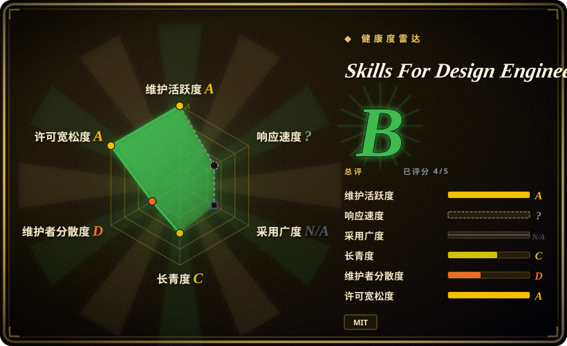
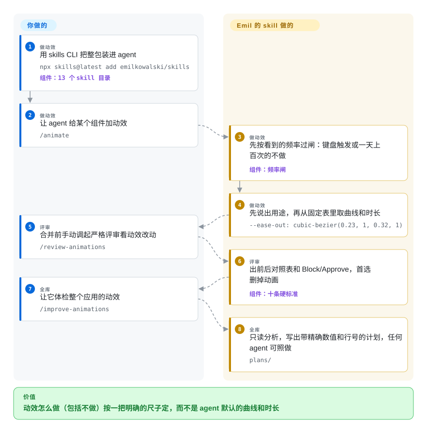

# Skills For Design Engineers

你的 coding agent 写的动画能跑，但手感不对：下拉菜单起步慢半拍，弹出层从一个点凭空长出来，每按一次 ⌘K 命令面板都要播一遍动画。这套 skill 把一位作者的明确规则交给 agent：什么情况干脆不做动画；要做时用什么曲线、多长时长、从哪里展开；再配一个严格评审，把不合格的拦下来。

## 何时使用

你是前端或 design engineer，用 Claude Code、Codex、Cursor 等支持 skill 的 agent 做 Web 界面。agent 会写 React/CSS，但动效总是差一点：入场用 `ease-in`，写 `transition: all`，下拉菜单 400ms，toast 用 keyframes 导致连点两次就跳，hover 效果在手机上卡住不消失。你想让这些决定按一把明确的尺子来定——Sonner 和 Vaul 的作者 Emil Kowalski 的那把——而不是靠模型默认值，或每次重新手写一遍提示词，这时就用它。

它刻意很窄，几乎全是动效。13 个 skill 里，核心几个分别负责：做动效（`animate`，React Native 版是 `animate-expo`）、评审一份动效改动（`review-animations`）、体检整个代码库并写成可执行计划（`improve-animations`）、找出少数真正该动的地方（`find-animation-opportunities`）。周边还有 `emil-design-eng`（总纲）、`apple-design`（把 WWDC 设计原则搬到 Web）、`animation-vocabulary`（动效术语反查）、`mobile-native`（让网页在手机上像装好的应用）、`prototype`（同一需求做几个版本、用切换器现场挑）、`pick-ui-library`（精选库清单），以及两个与主题无关的 `write-swift` 和 `ask-sonner`。

## 怎么用起来

全部是指令 markdown：13 个 `SKILL.md` 目录共约 4.3k 行，没有脚本。用 skills CLI 安装，请求对上时由 agent 加载。承重的是一个有先后顺序的决策链：先问“这里该不该动”，依据是用户多久看到一次（一天上百次或键盘触发的一律不动，少见的时刻才留给惊喜）；再说出用途；最后才从固定表里取属性、曲线和时长（进出场都用 `ease-out`，UI 上永不 `ease-in`，UI 动效 300ms 以内，用 `scale(0.95)` 加透明度代替 `scale(0)`，弹出层从触发点展开，频繁触发的元素用 CSS transition 不用 keyframes）。`review-animations`、`pick-ui-library`、`prototype` 设了 `disable-model-invocation`，要你手动调用；评审输出 Before/After/Why 表和明确的 Block 或 Approve，首选修法是删掉动画。`improve-animations` 和 `find-animation-opportunities` 只读：前者写计划文件，后者给一份有上限的候选（整个应用最多 5–7 条），都不改源码。留给你的：判断作者的口味是否适合你的产品，亲手跑一遍看手感（skill 里反复要求真机测、隔天再看），以及任何强制执行——没有一条规则由代码检查。

<!-- flow-steps:begin (generated from flows/emilkowalski-skills.json by tools/flow_card.py — do not edit) -->

流程文字版

1. **你**（做动效）：用 skills CLI 把整包装进 agent — `npx skills@latest add emilkowalski/skills` — 组件：`13 个 skill 目录`
2. **你**（做动效）：让 agent 给某个组件加动效 — `/animate`
3. **Skills For Design Engineers**（做动效）：先按看到的频率过闸：键盘触发或一天上百次的不做 — 组件：`频率闸`
4. **Skills For Design Engineers**（做动效）：先说出用途，再从固定表里取曲线和时长 — `--ease-out: cubic-bezier(0.23, 1, 0.32, 1)`
5. **你**（评审）：合并前手动调起严格评审看动效改动 — `/review-animations`
6. **Skills For Design Engineers**（评审）：出前后对照表和 Block/Approve，首选删掉动画 — 组件：`十条硬标准`
7. **你**（全库）：让它体检整个应用的动效 — `/improve-animations`
8. **Skills For Design Engineers**（全库）：只读分析，写出带精确数值和行号的计划，任何 agent 可照做 — `plans/`

**价值**：动效怎么做（包括不做）按一把明确的尺子定，而不是 agent 默认的曲线和时长

<!-- flow-steps:end -->

<!-- flow-steps:begin (generated from flows/emilkowalski-skills.json by tools/flow_card.py — do not edit) -->
<!-- flow-steps:end -->

## 何时不用

- **你需要完整设计生命周期或 UX research 包。** 研究、UX 策略、设计系统、原型、design ops 都要覆盖时，用 [Designer Skills](designer-skills.zh.md)；这套包的重心是动效手艺。
- **你需要确定性的 UI 质量闸门。** 需要硬性拦截时，用视觉回归测试、Storybook 检查、Lighthouse 或自定义 artifact linter；这里的“Block”是模型写出的结论，不会让构建失败。
- **你的设计系统已经规定了相反的动效 token。** 这套包禁止 UI 上用 `ease-in`，并把 UI 动效上限定在 300ms；如果你的体系规定退场加速或更长的入场，两边会打架。它自己的 `animate` 也要求沿用已有 token、不另起一套——装之前先定好以谁为准。
- **你主要需要布局、字体、配色上的通用 anti-slop 方向。** 用 [Taste-Skill](taste-skill.zh.md)；这套包几乎不谈布局和配色。
- **你在从零设计产品界面，缺的是方向而不是动效规则。** 用 [Interface Design](interface-design.zh.md)，它在做仪表盘、设置页之前先走行业探索和逐组件检查点。
- **你只需要小的机械打磨。** 用 [make-interfaces-feel-better](make-interfaces-feel-better.zh.md)，一份紧凑清单覆盖同心圆角、等宽数字和表面细节。
- **你不想把单一作者的口味当依赖。** 96% 的提交出自同一人，规则是他的观点（反复拿他自己的 Sonner、Vaul 做例子）；整个夏天都在未打 tag 的提交上增删、改写 skill——请 pin 住 commit，或只拷贝你用得到的那几个。

## 横向对比

| 替代品 | 是否收录 | 我们的评价 | 取舍 |
|---|---|---|---|
| [Designer Skills](designer-skills.zh.md) | ✅ | 需要研究、UX 策略和设计系统覆盖时选 Designer Skills；瓶颈是 agent 的动效决策时选这套包。 | Designer Skills 流程覆盖广得多；这套包更窄，但给出精确曲线、时长和会拦截的动效评审。 |
| [Taste-Skill](taste-skill.zh.md) | ✅ | 布局、字体、配色显得千篇一律时选 Taste-Skill；页面看着对、动起来不对时选这套包。 | Taste-Skill 是通用视觉口味覆盖层；这套包以动效为先，有频率闸和独立评审。 |
| [Interface Design](interface-design.zh.md) | ✅ | 做仪表盘、后台需要定下方向并跨会话记住设计决定时选 Interface Design；这些界面怎么动选这套包。 | Interface Design 用强制检查点管住整个产品界面决策；这套包把视觉方向留给你，只在动效上做深。 |
| [make-interfaces-feel-better](make-interfaces-feel-better.zh.md) | ✅ | 界面方向已对、只差一张短的机械修补清单时选 make-interfaces-feel-better；需要做、评审或体检动效时选这套包。 | 前者是一份紧凑清单；这套包把构建、评审、体检、找机会拆成独立 skill，并带固定数值表。 |
| [UI UX Pro Max Skill](ui-ux-pro-max.zh.md) | ✅ | 想要从本地数据库里取现成的风格、配色、字体候选时选 UI UX Pro Max；要动效判断时选这套包。 | UI UX Pro Max 更宽、数据更重；这套包是能从头读到尾的纯 markdown。 |
| [Stitch Skills](../design-to-code/stitch-skills.zh.md) | ✅ | 通过 Stitch MCP 生成或转换设计时选 Stitch Skills；agent 已经在写 UI 代码时选这套包。 | Stitch 是工具支撑的设计工作流；这套包只是建议性文本。 |

## 健康度与可持续性

- **维护快照（2026-09-30）：** GitHub 显示 `archived=false`，默认分支 `main`，最近 push 为 2026-09-23；自 2026-03-16 创建以来共 54 个提交，13 个 skill 里有 7 个是 2026-07-21 到 2026-09-15 之间加的。
- **采用快照：** 2026-09-30 GitHub 显示 42,173 stars、2,397 forks，2026-07-16 时约 14.0k；仍没有 tagged release，通过 skills CLI 分发而非包仓库。
- **许可证快照：** MIT，来自 GitHub metadata 和根目录 `LICENSE`。
- **治理 / bus factor：** 单一 owner 仓库；一位贡献者占 96% 的提交（健康度评分器与 `git shortlog` 结果一致）。内容明确是一个人的口味和经验。
- **Lindy / 年龄：** 约六个半月，年轻、增长快、形态还在变；star 数反映的是作者影响力，不是规则能改善结果的证据。
- **风险信号：** 只有提示词层面的指导，仓库里没有评测；未打 tag 的改动可能在两次安装之间重命名或改写 skill。

## 存疑（未验证）

- [未验证] 本轮读了 README、全部 13 个 skill 的开头，以及 `d16ebe6` 版本的 `emil-design-eng`、`review-animations`、`pick-ui-library`、`find-animation-opportunities` 全文和 GitHub metadata；没有执行安装命令，也没有测它在 Claude Code、Codex、Cursor 等环境里的触发效果。
- [未验证] 没有评测表明 agent 照这些规则做出的界面手感更好；仓库只提供作者的文章和示例。
- [推断] 规则全在 markdown 里，agent 仍可能忽略、稀释或误用，包括“Block”结论本身；高风险 UI 工作应配合人工评审或视觉测试。
