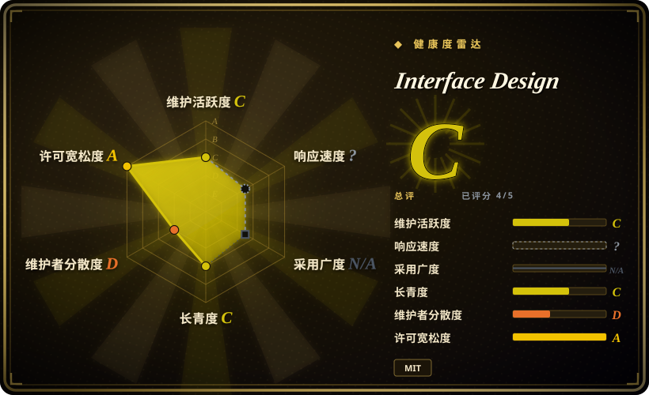
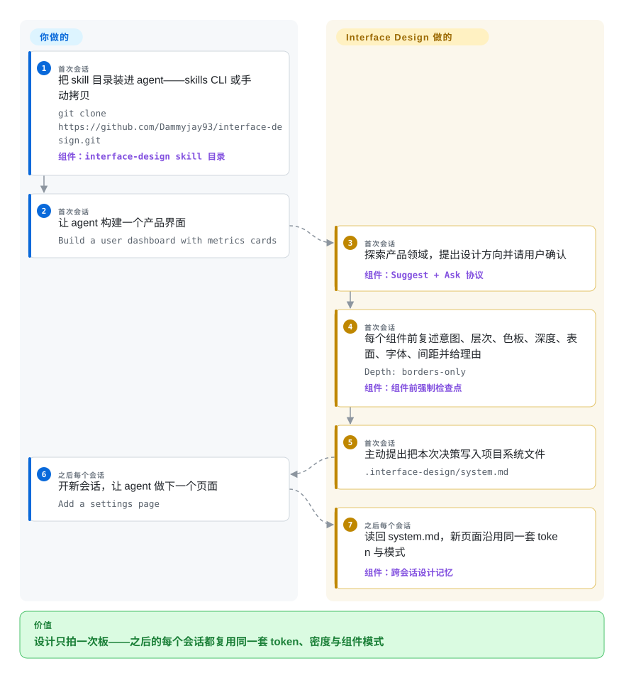

# Interface Design

你让 coding agent 再加一个设置页，它却把每个设计问题重新拍了一遍板——这次按钮 38px、间距 17px、字体还是那个 Inter 默认——应用看起来像四份原型拼起来的。Interface Design 是一个面向 Claude Code / Codex 的 skill：让 agent 先探索产品领域、一次性定下方向与 token，写每个组件前复述这个决定，并把决策落盘到 `.interface-design/system.md`，之后的会话直接复用。

## 何时使用

你是在用 Claude Code 或 Codex 交付产品界面——仪表盘、后台、SaaS 工具、设置页——的开发者或设计工程师。痛点有两层：*漂移*（第一次会话选了 4px 间距、纯边框深度，第三次会话悄悄换成柔和阴影和 17px 间距，这个切换没人做过决定），以及*生成味*（所有元素一个字号一个字重、没有视觉焦点、一排排一模一样的卡片，一眼「AI 做的」）。当你的活儿是产品界面而不是营销页——skill 自己的适用范围就排除了落地页——而你付出的代价恰恰是决策活不过一次会话时，就该想到它。

与同类的品味包相比，决定性的取舍在**记忆与约束的高度**：这个包的招牌是跨会话设计文件（首次构建后写入 `.interface-design/system.md`，skill 每次触发都会读回）加两条评审命令（`/interface-design:design-review`——严格的验收线，可以拦下一个构建；`/interface-design:design-deslop`——限定 diff 范围的快速去 slop 清理）。要做可调旋钮的落地页就选 [taste-skill](taste-skill.zh.md)，想让 agent 从策划好的风格／配色／字体库里检索现成候选而不是自己推理，就选 [ui-ux-pro-max](ui-ux-pro-max.zh.md)。

## 怎么用起来

整个仓库就是没有任何运行时的指令 markdown：约 320 行的 `SKILL.md`、两个 command 文件加参考模板，由支持 skill 的 agent 在请求命中产品界面工作时加载（Claude Code 自动触发或直接 `/interface-design`；Codex 扫描 `~/.agents/skills`，`agents/openai.yaml` 允许隐式调用）。它替你做的事：强加一套决策流程——意图简报（这个「人」是谁、要完成什么、该有什么感觉）、四个必答的领域探索产出（领域词汇、色彩世界、只属于这个产品的 signature、以及你拒绝的三个默认项）、写每个组件前逐条复述意图／层次／色板／深度／表面／字体／间距并各自给出「为什么」的检查点，外加具体工艺规则（字号按比率成阶、深度策略只选一种并贯彻、低透明度 rgba 边框、约 60/30/10 的点缀色预算、300ms 以内的自定义缓动）。留给你的：确认它提出的方向、批准把决策写入系统文件，以及一个事实——约束是劝导式的，检查点是 prompt 文本里的「必须」，不是 lint 门禁，什么都拦不住一次构建。两条能力是显式条件式的：harness 有内联渲染工具才渲染真实样例，有图像生成工具才提供方向板／paintover——skill 要求先检查再使用，从不假设工具存在。

<!-- flow-steps:begin (generated from flows/interface-design.json by tools/flow_card.py — do not edit) -->

流程文字版

1. **你**（首次会话）：把 skill 目录装进 agent——skills CLI 或手动拷贝 — `git clone https://github.com/Dammyjay93/interface-design.git` — 组件：`interface-design skill 目录`
2. **你**（首次会话）：让 agent 构建一个产品界面 — `Build a user dashboard with metrics cards`
3. **Interface Design**（首次会话）：探索产品领域，提出设计方向并请用户确认 — 组件：`Suggest + Ask 协议`
4. **Interface Design**（首次会话）：每个组件前复述意图、层次、色板、深度、表面、字体、间距并给理由 — `Depth: borders-only` — 组件：`组件前强制检查点`
5. **Interface Design**（首次会话）：主动提出把本次决策写入项目系统文件 — `.interface-design/system.md`
6. **你**（之后每个会话）：开新会话，让 agent 做下一个页面 — `Add a settings page`
7. **Interface Design**（之后每个会话）：读回 system.md，新页面沿用同一套 token 与模式 — 组件：`跨会话设计记忆`

**价值**：设计只拍一次板——之后的每个会话都复用同一套 token、密度与组件模式

<!-- flow-steps:end -->

## 何时不用

- **营销页、落地页、campaign、纯品牌工作。** skill 自己的描述就排除了它们，工艺是为高密度产品界面调的。改用 [taste-skill](taste-skill.zh.md)（它的主场是落地页反 slop）或 [Hallmark](hallmark.zh.md) 做一次性网页 brief。
- **只是微调一个小组件、根本不存在方向问题。** 流程要求四个探索产出，加上*每次*改 UI 前的七行检查点——为一个 padding 修复付这套仪式感不划算。改用 [make-interfaces-feel-better](make-interfaces-feel-better.zh.md) 的约 16 条具名细节规则，逐组件零成本。
- **需要确定性强制。** 全部是 agent 可以跳过或稀释的 prompt 文本，「必须」只是文字上的必须。要真实的产物门禁，用 [Impeccable](../../../ai-design-generation/impeccable.zh.md) 的检测器或 CI 里的 CSS linter。
- **想要现成的风格候选而不是推理。** [ui-ux-pro-max](ui-ux-pro-max.zh.md) 查 CSV 支撑的风格／配色／字体库并输出具体选项加交付前可访问性清单；这个包让 agent 一切从你的产品领域推导。
- **你已有受治理的设计系统或品牌 token。** 由推断出的方向、外加 agent 自己写的 `system.md`，会和受强制的 token 打架；把真实系统直接写进约束，跳过品味层。
- **已经在跑另一套有主张的品味 skill。** 两个反 slop 包同时加载，会在字体、色彩、动效上给出重叠且互相冲突的指令——品味来源只认一个。
- **你的安装路径是 Claude Code 插件 marketplace。** 未关闭的 issue #13（2026-09-28 核实）：仓库把 skill／command 嵌在 `.claude/` 下而非顶层约定目录，插件装上后 slash 菜单里不出现。推荐路径是 skills.sh 安装或手动拷贝 skill 目录。

## 横向对比

| 替代品 | 是否收录 | 我们的评价 | 取舍 |
|---|---|---|---|
| [Taste-Skill](taste-skill.zh.md) | ✅ | 界面是产品 UI、痛点是决策在会话之间蒸发时选 Interface Design；交付物是落地页、或想要可调审美旋钮时选 Taste-Skill。 | Interface Design 换来持久化的系统文件和评审命令，但不带 GSAP 动效骨架和 image-to-code 流水线；Taste-Skill 审美变体更多，跨会话却什么都不保留。 |
| [UI UX Pro Max Skill](ui-ux-pro-max.zh.md) | ✅ | 想从策划好的风格／配色／字体库里检索、外加交付前可访问性清单时选 ui-ux-pro-max；想要一套推理加记忆的协议时选本页项目。 | 检索引擎出的候选具体且快，但受限于库内数据；本包的上限取决于 agent 对协议的执行度。 |
| [make-interfaces-feel-better](make-interfaces-feel-better.zh.md) | ✅ | 只要低仪式感的细节打磨——约 16 条具名机械修正、别无其他——就选它；缺的是层次、方向和跨会话一致性时才选 Interface Design。 | 清单从不参与设计方向的争论；本包定方向并记住它，代价是每个组件前的强制检查点。 |
| [Hallmark](hallmark.zh.md) | ✅ | 对单个网页要显式的一次性动词（build、audit、redesign、study）时选 Hallmark；同一个应用要在多次 agent 会话间保持连贯时选 Interface Design。 | Hallmark 是流程化的 brief；Interface Design 补上记忆文件和可否决的 design-review，但适用范围锁在产品界面。 |
| [Impeccable](../../../ai-design-generation/impeccable.zh.md) | ✅ | AI-slop 检测必须确定性——对既有产物跑 CLI、可进 CI——时选 Impeccable；想在 slop 写出来之前引导生成时选本页项目。 | 检测器给已存在的东西把关，skill 影响即将生成的东西——两者解决同一问题的两端，互为补充而非替代。 |

## 健康度与可持续性

- **响应度**：本类型无法评分（机器轴为 `?`——type_na）；下面的 issue 处置是编辑证据，不构成评级。
- **维护（2026-09）：** 2026 年 1 至 6 月活跃，带日期式 tag（`v2026.1.20`、`v2026.2.8`、`v2026.6.12`、`v2026.6.12.1248`），随后安静——最后一次提交是 2026-06-20，核查时已停 100 天。维护者 2026-08-27 还关闭过 issue #11，项目在被人照看，只是没有出货。
- **治理／巴士因子：** 单一贡献者（owner Dammyjay93，`main` 上 50/50 提交），`User` 名下仓库。路线图就是一个人的设计品味，没有团队、没有组织。
- **背书与寿命：** 无基金会或厂商背书——只有 GitHub Sponsors 和自建 Vercel 站点（interface-design.dev，核查时 2026-09-28 在线）。创建于 2026-01-05，核查时 266 天：**按 Lindy 还太年轻**，持久性未证实。[推断：依据是仓库年龄与活动记录，无法验证留存]
- **采用与生态：** 约 5.7k stars、370 forks、40 watchers（GitHub API，2026-09-28）；经 skills.sh 与 Claude Code marketplace 安装；支持 Claude Code 和 Codex。5.7k stars 之下只有 40 watchers，是热度信号而不是活跃用户群——按本索引自己的启发式，年轻仓库的高 star 是风险旗标，不是长稳证据。
- **风险旗标：** 插件 marketplace 加载 bug（issue #13）仍未关闭；表层变动频繁——旧的 `critique` 命令在 2026-06-20 的「refocus」提交里被 `design-review` 加 `design-deslop` 取代，仓库也从 `claude-design-skill` 改名而来。许可是读过的标准 MIT `LICENSE` 文件——无双许可陷阱、无 open-core。

## 存疑（未验证）

- [未验证] 「skill 真能提升 UI 质量」是作者自述，证据只有自家 interface-design.dev/examples.html 的前后对比图集；仓库里没有独立或量化评测。
- [未验证] 各 harness 的安装与激活保真度未在此复现——skills.sh 路径、Claude Code 插件路径（截至 2026-09-28，按未关闭的 issue #13 已知有问题）、Codex 的 `~/.agents/skills` 路径均为 README 声明。
- [未验证] star／fork／watcher 数是 2026-09-28 从 GitHub API 读到的一次性快照，随时会变。
- [推断：依据 star/watcher 比例与仓库年龄] 约 8 个月涨到 ~5.7k stars 更可能来自社交传播而非可度量的安装基数，持续使用规模未知。
- [未验证] `language: Markdown` 是编辑判断——GitHub linguist 只报 Shell（那个 542 字节的 `.githooks/pre-commit`）；skill 本体是 linguist 不计权的 markdown。
- [推断：依据文件布局，未实测] system.md 的记忆回路完全依赖 agent 服从文字（「读它并应用」「主动提出保存」），没有任何代码强制这个往返；中途丢弃 skill 上下文的 harness 会无声地跳过它。
