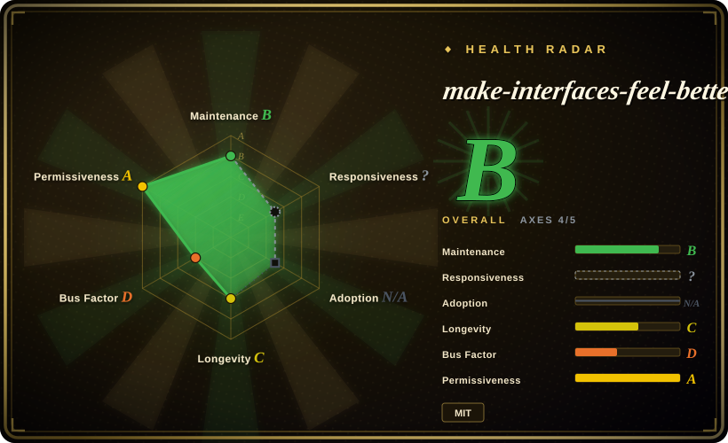
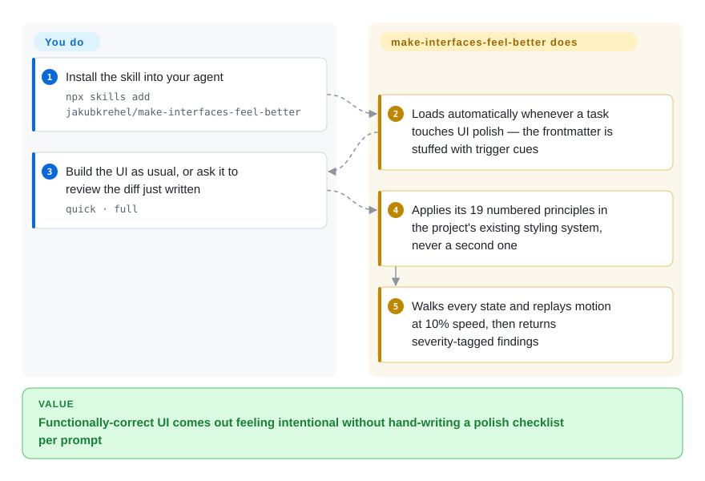

# make-interfaces-feel-better

The UI your agent built works, yet something about it reads cheap — nested corners that don't nest, numbers jittering as they tick, hover transitions you can't interrupt. Instead of hand-writing a polish checklist per prompt, this one agent skill carries 19 named, code-backed detail rules (concentric border radius, tabular numbers, enter/exit animation, optical alignment…) plus a review mode your agent runs against the diff it just wrote.

## When to use

You're a frontend developer (or a vibe-coder) using Claude Code to build a component or a page, and the markup is functionally right but the result feels cheap: the modal's inner corners don't nest into the outer radius, numbers jitter as they tick because the font isn't tabular, hover animations can't be interrupted so they feel laggy, an icon pops in with no enter transition, a shadow is used where a subtle border would read crisper. You know *something* is off but you don't want to hand-write the same 15-item "make it feel polished" checklist into every prompt. You install `make-interfaces-feel-better` and the agent loads a `SKILL.md` that carries those details as named, code-backed rules (with specific values like `scale(0.96)` on press and ~100ms stagger), plus a review checklist it can run against the diff it just wrote.

You reach for it specifically when the gap is *craft-level detail*, not direction. It doesn't pick your color system or invent a layout — it codifies the small mechanical fixes (typography, surfaces, animations, icons, performance) that separate a "looks like an LLM made it" screen from one that feels intentional. The skill derives from the author's interfaces.dev article "Details that make interfaces feel better"; the entry-point `SKILL.md` now carries 19 numbered principles and links out to five deeper sub-files (`typography.md`, `surfaces.md`, `animations.md`, `icons.md`, `performance.md`) the agent reads on demand, and review runs come in two scopes — a `quick` mode (primary paths only, HIGH/MEDIUM findings) and a `full` mode.

## How it works

The skill is one `SKILL.md` with trigger words in its frontmatter description ("feels off", "UI polish", "stagger animations"…), so the agent's skill loader pulls it in whenever your task touches visual detail work — no command to remember. From there it constrains the fix rather than suggesting vibes: every principle is a named rule with exact values (press feedback is `scale(0.96)`, never below `0.95`; counting text gets `font-variant-numeric: tabular-nums`), and the skill's first instruction is to express each fix in the project's *existing* styling system — Tailwind in a Tailwind project — so it never smuggles in a second CSS approach. Ask for a review and it walks every state (hover, focus, active, loading, empty), replays motion at 10% speed, and returns findings in a fixed severity-tagged output format. What stays yours: whether to accept each fix, and the design direction itself — this skill only polishes what you've already decided.

<!-- flow-steps:begin (generated from flows/make-interfaces-feel-better.json by tools/flow_card.py — do not edit) -->

Text version of the flow

1. **You**: Install the skill into your agent — `npx skills add jakubkrehel/make-interfaces-feel-better`
2. **make-interfaces-feel-better**: Loads automatically whenever a task touches UI polish — the frontmatter is stuffed with trigger cues
3. **You**: Build the UI as usual, or ask it to review the diff just written — `quick · full`
4. **make-interfaces-feel-better**: Applies its 19 numbered principles in the project's existing styling system, never a second one
5. **make-interfaces-feel-better**: Walks every state and replays motion at 10% speed, then returns severity-tagged findings

**Value**: Functionally-correct UI comes out feeling intentional without hand-writing a polish checklist per prompt

<!-- flow-steps:end -->

## When NOT to use

- **You already run a broader design skill pack.** If [taste-skill](taste-skill.md) or [designer-skills](designer-skills.md) is already loaded, you'll get overlapping (and possibly conflicting) instructions on motion, typography, and anti-slop — this one is narrower (detail-polish only), so layering it on top risks double-routing. Pick the one that matches the altitude you need.
- **You need design *direction*, not detail.** It won't choose a palette, build a design system, run UX research, or critique IA. If your screen is bland because it lacks a concept, a polish checklist won't save it — reach for a broader pack instead.
- **You're not on a skill-loading harness.** It activates through an agent's skill mechanism (the README ships `npx skills add jakubkrehel/make-interfaces-feel-better`). On a harness with no loader, the markdown is just an article — it won't auto-fire against your diff.
- **Enforcement is advisory.** The rules live in prompt/markdown; the agent can still skip or misapply them. "Use tabular numbers" is an instruction, not a lint gate — pair with a real CSS/UI linter if you need a hard guarantee. [推断]
- **Single-author, no releases.** One maintainer, no tagged versions at all (GitHub reports none as of 2026-09), so pin a commit if you need reproducibility. Cadence has actually picked up — the skill grew from ~16 to 19 principles and gained an `icons.md` file between the 2026-06 and 2026-09 checks — but it remains one person's opinion crystallized from one article; if that article's opinions don't match your design language, the skill won't bend.

## Comparison

| Alternative | In index | Our verdict | Tradeoff |
|---|---|---|---|
| [taste-skill](taste-skill.md) | ✅ | Choose taste-skill when the screen is still bland and needs design direction. | Broader "anti-slop visual taste" pack: infers design direction, maps a full color/type/spacing system, lays in GSAP motion. This skill is narrower — mechanical detail-polish, no direction-setting. Use taste-skill when the screen is bland; use this when it's directionally fine but unrefined. |
| [designer-skills](designer-skills.md) | ✅ | Choose designer-skills when you need a full design lifecycle bundle rather than a checklist. | Full design *lifecycle* bundle (111 skills: research, IA, design systems, critique). Heavyweight and process-oriented; this one is a single craft-detail checklist with near-zero ceremony. |
| [ui-ux-pro-max](ui-ux-pro-max.md) | ✅ | Choose ui-ux-pro-max when a larger end-to-end UI/UX bundle is warranted. | Larger UI/UX skill bundle aimed at end-to-end interface quality. Compare on surface area: this skill is one tight article-derived rule set, not a multi-skill system. |
| [stitch-skills](../design-to-code/stitch-skills.md) | ✅ | Choose stitch-skills when its sibling design stages or motion/typography rules fit better. | Sibling design skill pack; compare on which stages each enforces vs. suggests and whether the motion/typography guidance overlaps. |
| Hand-written design checklist in your own `CLAUDE.md` / prompt | 未收录 | Choose a hand-written checklist when you want zero third-party skill dependency. | The DIY alternative; same advisory nature, but you maintain it. This skill packages a known-good detail list so you don't re-derive it per project. |

## Health & viability

- **Responsiveness**: Cannot be scored — type_na.
- **Maintenance (2026-09):** active and growing — last pushed 2026-08-29, not archived; between the 2026-06 and 2026-09 checks the skill expanded (16→19 principles, `icons.md` added) and stars roughly doubled (~1.9k→3.5k). Still **no tagged release**, so the only reproducibility anchor is a commit SHA.
- **Governance / bus factor:** single-author, `User`-owned repo (`jakubkrehel`) at ~3.5k stars. It's one person's opinion crystallized from their interfaces.dev article "Details that make interfaces feel better" — no team, no org.
- **Age & Lindy verdict:** young (created 2026-03, ~6.5 months) — **unproven** on the Lindy axis, but the stakes are low: it's a static checklist of mechanical CSS/UX details, so "staleness" mostly means the design opinions age, not that it breaks. A narrow, frozen artifact is less Lindy-sensitive than a runtime dependency.
- **Risk flags:** advisory-only (markdown the agent may skip; pair with a real CSS/UI linter for hard guarantees). The license concern from the 2026-06 check is **resolved**: a `LICENSE` file (MIT, © 2026 Jakub Krehel) is now at the repo root and GitHub's license API detects MIT (verified 2026-09-28).

## Caveats (unverified)

- [未验证] Install command `npx skills add jakubkrehel/make-interfaces-feel-better` is quoted from the README; actual activation fidelity per harness (Claude Code vs. others) is not independently confirmed here.
- [推断] Because behavior lives in markdown loaded by the agent, "rules" and "checklist" are advisory prompt instructions, not enforced gates — the agent can deviate.
