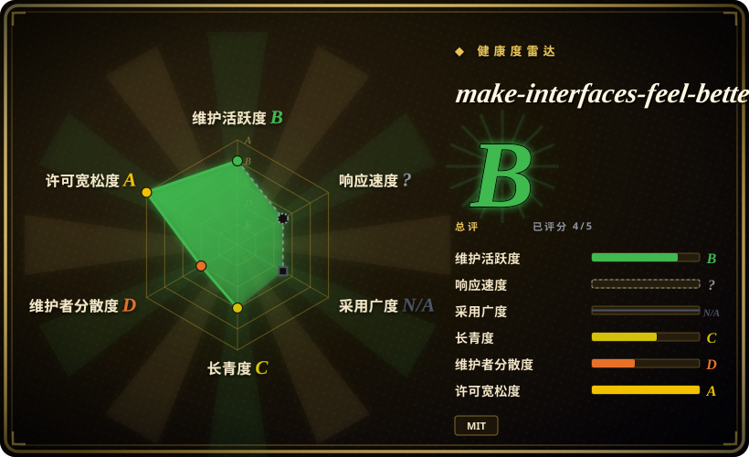
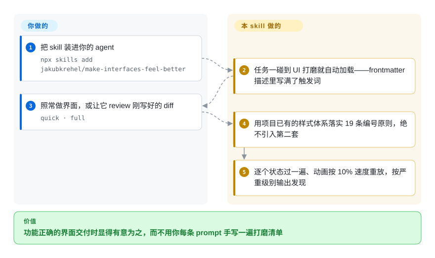

# make-interfaces-feel-better

你的 agent 建出来的界面功能没问题，可就是显得廉价：嵌套的圆角没有同心、数字跳动时布局在抖、hover 过渡打断不了。与其每条 prompt 都手写一遍打磨清单，不如装上这一个 agent skill：它带着 19 条有命名、有代码依据的细节规则（同心圆角、等宽数字、入场/出场动画、视觉对齐……），外加一个能让 agent 对着刚写好的 diff 跑一遍的 review 模式。

## 何时使用

你是一名前端开发（或 vibe-coder），用 Claude Code 写一个组件或页面，代码功能上没问题，但成品显得廉价：弹窗的内圆角没有嵌进外圆角里；数字跳动时因为字体不是等宽而抖动；hover 动画无法被打断、于是显得卡顿；图标直接弹出、没有入场过渡；明明用一道克制的描边会更利落，却用了阴影。你知道「哪里不对」，但不想在每条 prompt 里手写同一份 15 项的「让它更精致」清单。于是你装上 `make-interfaces-feel-better`，agent 加载一份 `SKILL.md`，把这些细节作为有命名、带代码的规则带进来（含具体数值，如按下时 `scale(0.96)`、约 100ms 错峰延迟），外加一份它能对着刚写好的 diff 自查的 review checklist。

你专门在「差距是工艺级细节、而非方向」时用它。它不替你选配色、不帮你发明布局——它把那些小而机械的修正（排版、表面、动画、图标、性能）编码下来，这正是「看着像 LLM 生成」的界面和「显得是有意为之」的界面之间的分水岭。该 skill 源自作者在 interfaces.dev 上的文章「Details that make interfaces feel better」：入口 `SKILL.md` 现在有 19 条编号原则，并链向五个更深指引的子文件（`typography.md`、`surfaces.md`、`animations.md`、`icons.md`、`performance.md`），agent 按需读取；review 分两档——`quick` 模式只看主路径、只报 HIGH/MEDIUM，`full` 模式全量。

## 怎么用起来

这个 skill 就是一份 `SKILL.md`，frontmatter 描述里写满了触发词（「feels off」「UI polish」「stagger animations」……），所以只要你的任务碰到视觉细节活，agent 的 skill 加载器就会把它拉进来——没有要记的命令。之后它约束的是改法而不是空谈：每条原则都是有精确数值的具名规则（按下反馈就是 `scale(0.96)`，低于 `0.95` 不许用；动态数字一律 `font-variant-numeric: tabular-nums`），而且它的第一条指令是「用项目*已有*的样式体系表达修正」——Tailwind 项目就写 Tailwind——绝不为打磨引入第二套 CSS 方案。你要 review，它就逐个状态过一遍（hover、focus、active、loading、empty），把动画按 10% 速度重放，最后按固定的、带严重级别标注的格式输出发现。留在你这边的：逐条采纳与否，以及设计方向本身——它只打磨你已经定下来的东西。

<!-- flow-steps:begin (generated from flows/make-interfaces-feel-better.json by tools/flow_card.py — do not edit) -->

流程文字版

1. **你**：把 skill 装进你的 agent — `npx skills add jakubkrehel/make-interfaces-feel-better`
2. **make-interfaces-feel-better**：任务一碰到 UI 打磨就自动加载——frontmatter 描述里写满了触发词
3. **你**：照常做界面，或让它 review 刚写好的 diff — `quick · full`
4. **make-interfaces-feel-better**：用项目已有的样式体系落实 19 条编号原则，绝不引入第二套
5. **make-interfaces-feel-better**：逐个状态过一遍、动画按 10% 速度重放，按严重级别输出发现

**价值**：功能正确的界面交付时显得有意为之，而不用你每条 prompt 手写一遍打磨清单

<!-- flow-steps:end -->

## 何时不用

- **你已经在跑更宽的设计 skill 包。** 如果已加载 [taste-skill](taste-skill.zh.md) 或 [designer-skills](designer-skills.zh.md)，你会在动效、排版、anti-slop 上拿到重叠（甚至冲突）的指令——本 skill 更窄（只做细节打磨），叠在上面有双重路由的风险。按你需要的层级选其一。
- **你要的是设计*方向*，不是细节。** 它不会选配色、不会搭设计系统、不做 UX 调研、不评 IA。如果你的页面平淡是因为缺概念，一份打磨清单救不了它——去找更宽的包。
- **你的 harness 没有 skill 加载机制。** 它通过 agent 的 skill 机制激活（README 给出 `npx skills add jakubkrehel/make-interfaces-feel-better`）。在没有 loader 的 harness 上，这份 markdown 只是一篇文章，不会自动对你的 diff 生效。
- **强制力是建议性的。** 规则活在 prompt/markdown 里，agent 仍可能跳过或错用。「用等宽数字」是一条指令，不是 lint 门禁——若要硬保证，请配一个真正的 CSS/UI linter。[推断]
- **单作者、无 release。** 一人维护，完全没有打 tag 的版本（2026-09 GitHub 上仍为空），要可复现就得 pin 一个 commit。更新节奏其实是在变快——两次核验之间（2026-06 到 2026-09）skill 从约 16 条涨到 19 条原则，还新增了 `icons.md`——但它终究是单个人从一篇文章里结晶出的主张：若那篇文章的主张不合你的设计语言，这个 skill 不会迁就。

## 横向对比

| 替代品 | 是否收录 | 我们的评价 | 取舍 |
|---|---|---|---|
| [taste-skill](taste-skill.zh.md) | ✅ | 页面方向仍平淡、需要更宽的 anti-slop 视觉品味包时，选 taste-skill。 | 更宽的「anti-slop 视觉品味」包：推断设计方向、映射完整的色/字/间距系统、铺 GSAP 动效骨架。本 skill 更窄——机械的细节打磨，不定方向。页面平淡时用 taste-skill；方向已 OK 但不够精细时用本 skill。 |
| [designer-skills](designer-skills.zh.md) | ✅ | 需要完整设计生命周期套装，而不是单一工艺细节清单时，选 designer-skills。 | 完整设计*生命周期*套装（111 个 skill：调研、IA、设计系统、批评）。偏重、偏流程；本 skill 是单一工艺细节清单，几乎零仪式。 |
| [ui-ux-pro-max](ui-ux-pro-max.zh.md) | ✅ | 需要更大的端到端 UI/UX skill 套装时，选 ui-ux-pro-max。 | 更大的 UI/UX skill 套装，面向端到端界面质量。比表面积：本 skill 是一份紧凑的、源自文章的规则集，不是多 skill 系统。 |
| [stitch-skills](../design-to-code/stitch-skills.zh.md) | ✅ | 想比较同一 design 分类树下更偏设计生成/转换链路的包时，选 stitch-skills。 | 同一 design 分类树下的设计 skill 包；比较各自「强制 vs 建议」的阶段，以及动效/排版指引是否重叠。 |
| 写在自己 `CLAUDE.md` / prompt 里的手写设计清单 | 未收录 | 想完全自维护规则、避免引入第三方 skill 包时，选手写设计清单。 | DIY 方案；同样是建议性的，但由你维护。本 skill 把一份已知好用的细节清单打包，省得你每个项目重新推导。 |

## 健康度与可持续性

- **响应速度**：无法计算——type_na。
- **维护（2026-09）：** 活跃且在增长——最后 push 于 2026-08-29，未归档；两次核验之间（2026-06 到 2026-09）skill 扩容（原则从 16 条到 19 条、新增 `icons.md`），stars 大约翻倍（1.9k→3.5k）。仍然**没有打 tag 的 release**，唯一的可复现锚点是 commit SHA。
- **治理 / bus factor：** 单作者、`User` 所有的仓库（`jakubkrehel`），约 3.5k stars。它是一个人从自己 interfaces.dev 上的文章「Details that make interfaces feel better」里结晶出的主张——无团队、无组织。
- **年龄与 Lindy 判断：** 年轻（创建于 2026-03，约 6 个半月）——在 Lindy 维度上**未经验证**，但赌注很低：它是一份静态的、机械的 CSS/UX 细节清单，所谓「过时」多半是设计主张变旧，而非会失效。窄而冻结的产物对 Lindy 的敏感度低于运行时依赖。
- **风险旗标：** 仅建议性（agent 可跳过的 markdown；要硬保证请配真正的 CSS/UI linter）。2026-06 那次核验的 license 疑点**已解除**：仓库根目录现在有了 `LICENSE` 文件（MIT，© 2026 Jakub Krehel），GitHub 的 license API 也能检测到 MIT（2026-09-28 核实）。

## 存疑（未验证）

- [未验证] 安装命令 `npx skills add jakubkrehel/make-interfaces-feel-better` 引自 README；各 harness（Claude Code vs 其他）的实际激活保真度此处未独立确认。
- [推断] 由于行为活在 agent 加载的 markdown 里，「规则」和「checklist」是建议性的 prompt 指令，而非强制门禁——agent 可以偏离。
