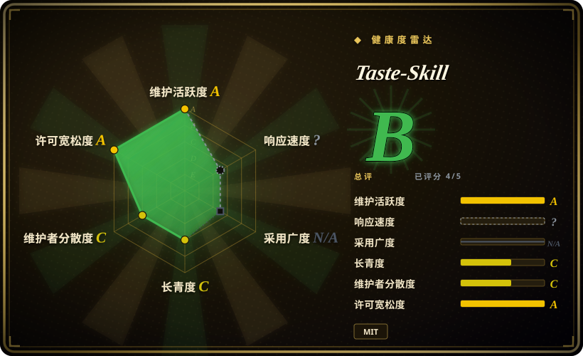
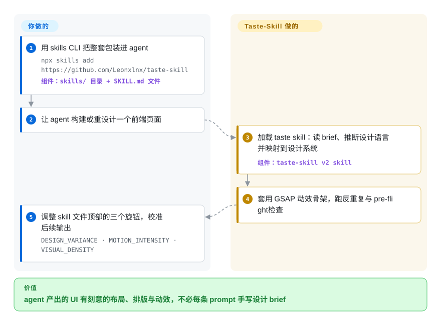

# Taste-Skill

让 coding agent 做一个落地页，你总会拿到同一副 AI 模板脸——居中 hero、紫色渐变、零动效。Taste-Skill 是一套可移植的 skill 文件，在 agent 写代码之前先把设计品味装进去，让产出有刻意的布局、排版与动效，而不是 slop。

## 何时使用

你是一名开发者，或一名「vibe-coding」的玩家，正在用 Claude Code、Codex、Cursor 或 ChatGPT 快速搭一个落地页或 web 应用。可每次 agent 生成的 UI 都长一个样：居中 hero、三张功能卡片、紫到蓝的渐变、默认 Tailwind 间距、零动效。结果在技术上没错，但视觉上毫无生气——一眼就能看出「这是 LLM 写的」。你既不想每条 prompt 都手写 2000 字的设计 brief，手上也没有可供 agent 参照的设计系统。于是你用上 Taste-Skill：安装后，agent 会加载一份 `SKILL.md`，注入一套有主见的 taste 协议——从你的 brief 推断设计方向，映射到一致的设计系统（配色 / 字阶 / 间距尺度），铺入 GSAP 动效骨架，并执行 anti-repetition 检查，让下一屏不再克隆上一屏。

它还带可调旋钮——`DESIGN_VARIANCE`、`MOTION_INTENSITY`、`VISUAL_DENSITY`，1–10 档——让你不必重写 prompt 就能指定「张扬且多动效」还是「克制且高密度」。除默认前端 skill 外，这套包还含面向 GPT/Codex 的更严格变体（`gpt-taste`）、命名的美学变体（`high-end-visual-design`「soft」、`minimalist-ui`、`industrial-brutalist-ui`）、image-first 的 `image-to-code` 管线 skill、`redesign-existing-projects` skill、防半成品输出的 `full-output-enforcement` skill，以及用于先出参考图再写代码的图像生成 skill（`imagegen-frontend-web/mobile`、`brandkit`）。用 skills CLI 装一次，agent 即可按需激活对应 skill。

## 怎么用起来

Taste-Skill 是纯指令文本：每个 skill 就是一份 `SKILL.md`，能被加载 skill 的 agent（Claude Code、Codex、Cursor、ChatGPT……）在描述与你的请求匹配时拉进上下文——没有 runtime、没有服务端、没有可 `import` 的东西。v2 默认 skill 摆在 agent 面前的是一套清单式的协议：读 brief 并推断设计方向，把方向映射到具体的设计系统值（配色、字体、间距），套用现成的 GSAP 动效骨架（它希望被复用的动画代码模式）而不是临场发明过渡，最后通过严格的 pre-flight 检查与 anti-repetition 规则，让第二屏不再克隆第一屏。粗方向由你设定：skill 文件顶部的三个数值旋钮（布局变化度、动效强度、信息密度），以及按工种选择安装哪个专门 skill（出参考图再写码、改造旧项目各是一个）。仍然归你承担的是：agent 依旧可以无视这些约束——执行是建议性的，质量取决于你的 harness 是否如实加载并遵循这份 markdown。

<!-- flow-steps:begin (generated from flows/taste-skill.json by tools/flow_card.py — do not edit) -->

流程文字版

1. **你**：用 skills CLI 把整套包装进 agent — `npx skills add https://github.com/Leonxlnx/taste-skill` — 组件：`skills/ 目录 + SKILL.md 文件`
2. **你**：让 agent 构建或重设计一个前端页面
3. **Taste-Skill**：加载 taste skill：读 brief、推断设计语言并映射到设计系统 — 组件：`taste-skill v2 skill`
4. **Taste-Skill**：套用 GSAP 动效骨架，跑反重复与 pre-flight 检查
5. **你**：调整 skill 文件顶部的三个旋钮，校准后续输出 — `DESIGN_VARIANCE · MOTION_INTENSITY · VISUAL_DENSITY`

**价值**：agent 产出的 UI 有刻意的布局、排版与动效，不必每条 prompt 手写设计 brief

<!-- flow-steps:end -->

## 何时不用

- **你已有一套信任的 design-taste / UI-critique skill。** 它与同 leaf 的姊妹包（designer-skills、stitch-skills、ui-ux-pro-max）高度重叠。叠两套有主见的「让它好看」skill 会产生指令冲突与双重路由——只保留一个 taste 事实源。
- **你已有真实的设计系统或品牌规范。** 当配色、字阶、组件、token 已被强约束时，一套靠推断驱动的 taste skill 会与你的约束打架而非服务于它；直接把系统落成约束（如 `DESIGN.md`），跳过这层猜测。
- **后端、CLI、数据或非视觉工作。** 这套包只塑造前端 / 视觉输出，对 API、迁移脚本或 TUI 毫无作用。
- **没有 skill loader 的 harness。** 它靠 agent 消费 `SKILL.md` 激活（Claude Code、Codex、Cursor、ChatGPT）；在没有 skill 加载机制的自研 agent 上，markdown 不会自动触发，你只能手动粘贴 prompt。
- **是建议，不是强制。** taste 写在 agent 可能忽略或稀释的 prompt 文本里；「anti-slop 协议」是指令，不是 lint 闸门。若要确定性强制，请配一个 artifact 静态检查器，而非只依赖该 skill。
- **维护风险。** 单作者仓库、无 tagged release；v2 默认项被标注为实验性，skill 在不同 push 之间会被改名 / 重组。需要稳定就钉一个 commit。[推断]

## 横向对比

| 替代品 | 是否收录 | 我们的评价 | 取舍 |
|---|---|---|---|
| [designer-skills](designer-skills.zh.md) | ✅ | 要的是整套设计实践（研究、UX 策略、设计 ops，9 个插件 97 个技能）时，选 designer-skills；任务更窄——让生成式前端别再一副 AI slop 脸——选 Taste-Skill。 | 广度 vs 锐度：designer-skills 覆盖设计师工作流，Taste-Skill 把 token 全花在 anti-slop 美学与可调的 variance/motion/density 旋钮上。 |
| [stitch-skills](../design-to-code/stitch-skills.zh.md) | ✅ | 你走 Google Stitch 工具链（文字/图 → 界面、代码↔设计互转、`DESIGN.md` 导出）时，选 stitch-skills；你的回路里没有 Stitch 服务，就选 Taste-Skill。 | stitch-skills 驱动一条 MCP 支撑的生成管线；Taste-Skill 是无服务端的 prompt 层品味，只塑造你自己 agent 写出的东西。 |
| [ui-ux-pro-max](ui-ux-pro-max.zh.md) | ✅ | 需要「产品类型→设计系统」的大规模推理（本地检索引擎、数百条规则、WCAG 清单）时，选 ui-ux-pro-max；缺口只是纯视觉——布局、字体、动效——就选 Taste-Skill。 | ui-ux-pro-max 带检索引擎与 CSV 规则库、需要 Python；Taste-Skill 只有 markdown、零前置依赖，且更擅长审美方向。 |
| [make-interfaces-feel-better](make-interfaces-feel-better.zh.md) | ✅ | 界面已存在、需要约 16 条具体打磨规则（圆角、过渡、对齐）时，选 make-interfaces-feel-better；agent 正在从零生成界面时选 Taste-Skill。 | Day-2 交互打磨 vs 生成期美学；两者可叠加而不互斥。 |
| Anthropic / 内置 agent skills | 未收录 | 不想多维护一个第三方 bundle、就用宿主自带 skill 时，选内置生态；Taste-Skill 的存在理由恰恰是开箱即用的 agent UI 输出太雷同。 | 原生生态 vs 专门的第三方品味层——后者可能与原生设计 skill 重复或冲突。 |

## 健康度与可持续性

- **响应速度**：无法计算——type_na。
- **维护（2026-09）：** 活跃——最近一次 push 距本次核验仅数日，未归档，但依旧零 tagged release（GitHub 显示无 release、无 tag），所谓「版本」只是一个移动的 commit。当作尽力而为，而非有版本承诺的产品。
- **治理与 bus factor：** 单作者 `User` 仓库（`Leonxlnx`）背着约 90k stars——典型的 bus-factor 警讯：超额采用压在一个维护者身上。赞助是真实的，但形态像广告：README 顶部就是 Kimi 等赞助板块，还专门挂了「无官方代币」免责声明——是营收注意力，不是 foundation 治理。[推断]
- **年龄与 Lindy：** 创建于 2026-02，截至 2026-09 不足 8 个月——年轻且被 star 炒热，v2 默认项仍被标为实验性、skill 在不同 push 间被改名重组。Lindy 维度上未经检验；star 数说明不了寿命。
- **风险标记：** 仅建议性约束（prompt/markdown，而非 lint 闸门）＋无 semver＋单维护者＋赞助位明显的 README ⇒ 需要稳定行为就钉一个 commit。

## 存疑（未验证）

- [未验证] 截至 2026-09-27，GitHub 元数据显示 license 为 MIT、主语言为 JavaScript；仓库最后 push 于 2026-09-26，无 tagged release 也无 tag（`releases/latest` 404、`tags` 为空）——依赖某具体版本行为前请复核。
- [未验证] star 数（2026-09-27 GitHub 显示约 90.6k）不可靠且对日期敏感，仅作参考，绝不可当质量信号。
- [未验证] skill 清单与安装名（taste-skill → `design-taste-frontend` v2 实验性、`design-taste-frontend-v1`、`gpt-taste`、`image-to-code`、`redesign-existing-projects`、`high-end-visual-design`、`full-output-enforcement`、`minimalist-ui`、`industrial-brutalist-ui`、`stitch-design-taste`，及只出图的 `imagegen-frontend-web/mobile`、`brandkit`）读自 2026-09-27 的 README；安装名与「v2 实验性」状态在不同 push 间可能变化——请核对当前 `skills/` 目录。
- [未验证] 可调旋钮（`DESIGN_VARIANCE`、`MOTION_INTENSITY`、`VISUAL_DENSITY`，1–10）及 GSAP 动效 / 设计系统映射等行为出自 README；其对输出质量的真实影响未在此独立验证。
- [未验证] 支持的 agent（ChatGPT、Codex、Cursor、Claude Code）与 `npx skills add` 安装路径均来自项目 README；各 harness 的激活保真度未经验证。
- [推断] 因为 taste 协议存在于 agent 加载的 prompt/markdown skill 中，其执行是建议性的——agent 仍可能产出 slop；「anti-slop」步骤是 prompt 层指令，而非硬保证。
