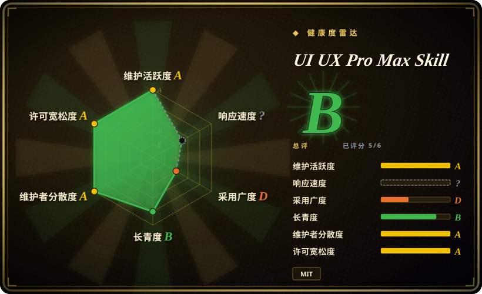
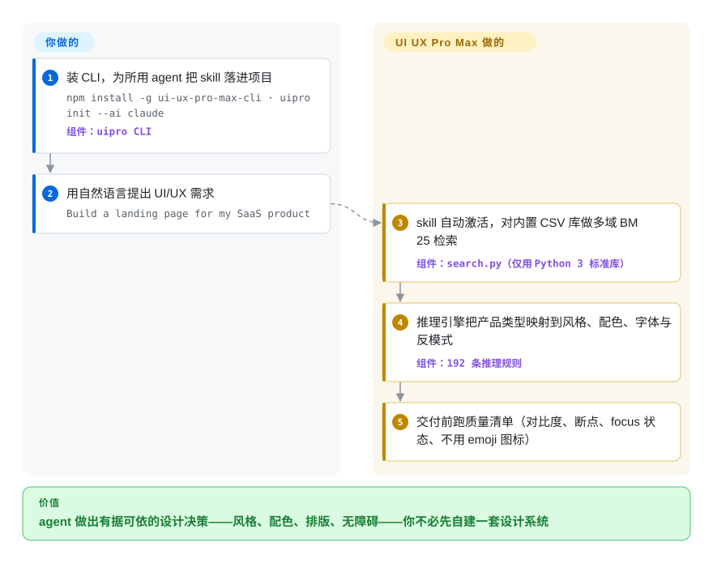

# UI UX Pro Max Skill

你让 coding agent 做一个落地页，拿回来的总是那副 AI 模板脸：emoji 当图标、默认 Tailwind 间距、人手的同款渐变 hero。UI UX Pro Max 给 agent 装上一个本地检索引擎，覆盖数百条行业设计规则——风格、配色、字体搭配、反模式——让它带着理由选 UI，而不是凭惯性。

## 何时使用

你是一名偏后端（或全栈）的开发者，正在做一个 SaaS 产品。你让 coding agent “做一个落地页”或“做一个设置页面”，拿回来的东西技术上没错，但视觉很平庸——默认的 Tailwind 间距、emoji 当图标、没有真正的层级、和每个 AI 都会产出的同款渐变 hero。你看得出这是 AI 味儿，却没有设计词汇去说清*为什么*、也没法精确指挥怎么改。你希望 agent 自己就能做出有依据的设计决策：给金融科技和美容 spa 选出各自匹配的风格、有意图地挑配色和字体搭配、遵守 WCAG 对比度和 reduced-motion、避开已知的反模式。

UI UX Pro Max 就是把这种判断力装进 agent。你跑 `npm install -g ui-ux-pro-max-cli` 再 `uipro init --ai claude`（或 cursor、windsurf、codex、opencode、gemini 等约 20 个平台），它会落下一个 skill 目录：markdown manifest 加上一个内置的 Python `search.py`，背后是 CSV 数据库（据当前 README：192 条推理规则与 192 套配色、79 种可检索风格其中 50 种启用、74 组字体搭配、119 条 UX 指南、22 套技术栈指南）。之后当你发出自然的 UI/UX 请求时，skill 自动激活：做一次多域 BM25 检索（产品类型 → 模式、色彩情绪、排版、反模式），生成一份可持久化到 `design-system/<项目>/MASTER.md` 的设计系统，并在声称完成前跑一遍交付前清单（WCAG 对比度、375–1440px 断点、focus 状态、不用 emoji 图标）。高级用户也可以直接调用 `search.py`。它完全本地运行——只用 Python 3 标准库，脚本不联网。

## 怎么用起来

这个包是一个穿了 skill 外衣的检索引擎。安装会把一份 `SKILL.md` manifest 放进你 agent 的 skill 目录，外加一个 `scripts/search.py`，背后是产品类型、风格、配色、排版与 UX 规则的 CSV 库——BM25 排序（一种经典的文本相关性打分方法）在 Python 标准库上本地跑，没有服务端、没有 API key。你发出 UI 请求时，skill 指示 agent 跨多个领域并行查询引擎，套用匹配的行业推理规则（JSON 决策条件），组装出一份设计系统推荐：页面模式、风格、具体配色、字体搭配、动效、要避开的反模式，以及一份声称完成前必须通过的交付前清单。若你选择持久化，它会写出 `MASTER.md` 加可选的逐页覆盖文件，供 agent 跨会话重读——规则库随版本更新，你项目的系统设计保持稳定。仍然归你管的：自己装好 Python 3（skill 被明确告知不得替你安装软件）、把设计系统文件维护在仓库里，以及那份清单终究是指令而非闸门——agent 仍可能跳过它。

<!-- flow-steps:begin (generated from flows/ui-ux-pro-max.json by tools/flow_card.py — do not edit) -->

流程文字版

1. **你**：装 CLI，为所用 agent 把 skill 落进项目 — `npm install -g ui-ux-pro-max-cli · uipro init --ai claude` — 组件：`uipro CLI`
2. **你**：用自然语言提出 UI/UX 需求 — `Build a landing page for my SaaS product`
3. **UI UX Pro Max Skill**：skill 自动激活，对内置 CSV 库做多域 BM25 检索 — 组件：`search.py（仅用 Python 3 标准库）`
4. **UI UX Pro Max Skill**：推理引擎把产品类型映射到风格、配色、字体与反模式 — 组件：`192 条推理规则`
5. **UI UX Pro Max Skill**：交付前跑质量清单（对比度、断点、focus 状态、不用 emoji 图标）

**价值**：agent 做出有据可依的设计决策——风格、配色、排版、无障碍——你不必先自建一套设计系统

<!-- flow-steps:end -->

## 何时不用

- **你已经在用一个信任的 UI/设计 skill 或设计系统契约。** 这个 pack 对风格、配色和“规则”有强主张；把它叠在已有的品味 skill 或项目 `DESIGN.md` 之上，会制造两个事实源和互相冲突的指令。设计权威只留一个。
- **你想要一个组件库或可直接 import 的成品 UI。** 它交付的是*设计智能和生成指导*，不是 React/Vue 组件——没有东西可 `import`。产出是 agent 写出的代码加一份 markdown 设计系统，而不是打包好的 UI kit。
- **你的 harness 加载不了 skill 或跑不了 Python。** 激活依赖各平台的 skill 加载机制，检索后端需要机器上有 Python 3。在没有 skill loader 的 harness、或没有 Python 的沙箱里，光有 markdown 不会自动触发，搜索引擎也跑不起来。
- **你需要的是强制约束，而非建议。** 那份清单（对比度、断点、不用 emoji）和风格规则是 prompt 层的建议性指导，agent *应该*遵守——但它们不是硬性 gate、linter 或 CI 检查。agent 仍可能交付违反它们的东西。[推断]
- **快速迭代的单厂商上游。** 频繁发版（v2.8.x）加上行为固化在 prompt/CSV 数据里，意味着一次版本升级就可能改变哪些风格、规则或清单项生效。如需可复现的设计产出，请锁版本。

- **你要的是定制品牌识别，而不是一套起手系统。** README 把 Basic（本仓库：UI/UX 规则、风格、配色）与付费 Premium 层（品牌识别、Logo 设计、Banner、企业级 token 架构）明确分档——开源部分覆盖不了的需求，答案在付费墙后面，要么按预算走，要么自己把约束写进 `DESIGN.md`。

## 横向对比

| 替代品 | 是否收录 | 我们的评价 | 取舍 |
|---|---|---|---|
| [designer-skills](designer-skills.zh.md) | ✅ | 你要的是把设计师整套实践（研究、UX 策略、设计 ops）装进 agent 时，选 designer-skills；你要的是由可检索规则/配色库支撑的生成式 UI 代码时，选 UI UX Pro Max。 | designer-skills 覆盖设计工作流的广度；本 pack 深耕一条管线——产品类型 → 设计系统 → 落码界面——且检索步骤需要 Python。 |
| [stitch-skills](../design-to-code/stitch-skills.zh.md) | ✅ | 你的流程走 Google Stitch 的 MCP 生成（文字/图 → 界面、DESIGN.md 导出）时，选 stitch-skills；回路里没有 Stitch 服务、想要本地规则驱动的设计决策时，选 UI UX Pro Max。 | stitch-skills 驱动一条托管生成管线；本 pack 完全本地，产出的是推理结果加 markdown 设计系统，而非 Stitch 界面。 |
| [taste-skill](taste-skill.zh.md) | ✅ | 缺口纯粹在审美——anti-slop 布局、排版、GSAP 动效，外加可调的变化/密度旋钮——时选 taste-skill；你还想要 UX 架构（模式、无障碍规则、分栈指导）从规则库里被检索出来时选 UI UX Pro Max。 | taste-skill 只有 markdown、长于视觉风格；本 pack 覆盖面更广，但多了 CLI 安装与一个 Python 检索步骤。 |
| [make-interfaces-feel-better](make-interfaces-feel-better.zh.md) | ✅ | Day-2 打磨一个已存在的界面（约 16 条具体交互规则）时选 make-interfaces-feel-better；Day-0 的产品类型→设计系统流水线选 UI UX Pro Max。 | 窄而精的打磨清单 vs 生成期的系统设计；互补而非互斥。 |
| Anthropic / 内置 agent skills 和 slash command | 未收录 | 做一次性原型、起手设计系统不值当用时选内置生态；本 pack 的存在理由恰恰是默认 agent 的 UI 输出太雷同。 | 原生生态零维护 vs 你要安装并更新一套第三方规则库。 |
| 手写的项目 `DESIGN.md` 设计系统 | 未收录 | 品牌规则已经定死、必须可强制时选手写 `DESIGN.md`；需要按产品品类推理出一套起点系统时选本 pack。 | 更贴合、可强制，但要你自己撰写和维护 vs 一套 192 规则的起点库，观点不归你、且随版本漂移。 |

## 健康度与可持续性

- **响应速度**：无法计算——type_na。
- **维护（2026-09）：** 高度活跃——核验当天仍有 push；发版频繁（v2.15.0 发布于 2026-08-13，此前 v2.14.x/v2.13.0 节奏稳定）。规整的 semver 是加分项，但快节奏意味着一次升级就可能改变哪些风格、规则或清单项生效。
- **治理与背书：** 仓库归 `Organization`（`nextlevelbuilder`）所有，但本质是单厂商项目——一个组织掌控路线图、风格体系与 CSV 规则数据，没有 foundation。README 里互相导流的姊妹项目和付费 Premium 层，也透露了商业重心所在。[推断]
- **年龄与 Lindy：** 创建于 2025-11，截至 2026-09 还不满一年——年轻且被 star 重度炒热（约 131k）。Lindy 维度未经检验；star 数不是耐久信号。
- **风险标记：** 建议性约束（prompt/markdown 加一个本地 CSV 检索步骤，而非硬闸门）；open-core 分档（品牌/Logo/企业 token 特性在 Premium，不在仓库）；行为固化在 prompt/CSV 里 ⇒ 要可复现的设计产出就锁版本。

## 存疑（未验证）

- [未验证] 最新 release 为 v2.15.0（2026-08-13 发布），仓库最后 push 于 2026-09-27（均据 2026-09-27 的 GitHub）；license 为 MIT、主语言为 Python，依据 GitHub 元数据——依赖某个具体版本行为前请重新核实。
- [未验证] Star 数（2026-09-27 GitHub 显示约 131k）不可靠且对日期敏感；仅作参考，不作为质量信号。
- [未验证] 数据集规模（192 条推理规则、79 种可检索风格其中 50 种启用、192 套配色、74 组字体搭配、119 条 UX 指南、25 种图表类型、22 套技术栈），以及 README 的支持 harness 列表（Claude Code、Cursor、Windsurf、Antigravity、Copilot、Kiro、Codex、Qoder、Roo Code、Gemini、Trae、OpenCode、Continue 等）均取自 2026-09-27 的 README，此处未独立清点。
- [未验证] 安装路径是 npm 包 `ui-ux-pro-max-cli`、提供 `uipro` 命令；“生成的 skill 在内部调用 `search.py`”（而非用户总是手动调用）是依据 README 描述的架构，未单独验证。
- [推断] 由于设计规则和交付前清单都活在 prompt/markdown skill 及一个本地 CSV 驱动的检索步骤里，约束是建议性的——agent 仍可能偏离或交付不合规的 UI；“清单”项是指导而非硬性保证。
- [推断] “完全本地运行、仅用 Python 3 标准库、脚本不联网”是 README 的自述（Prerequisites 一节）；在具体沙箱上的实际行为（Python 是否可用、生成 skill 目录的写权限）此处未确认。
