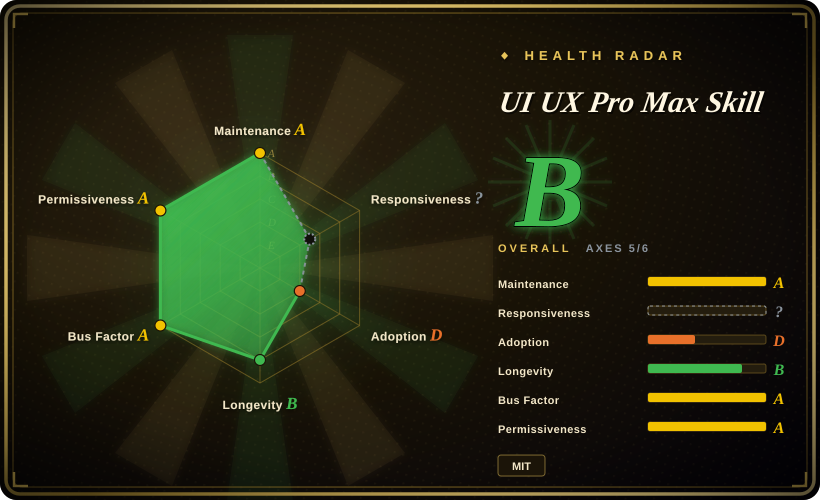
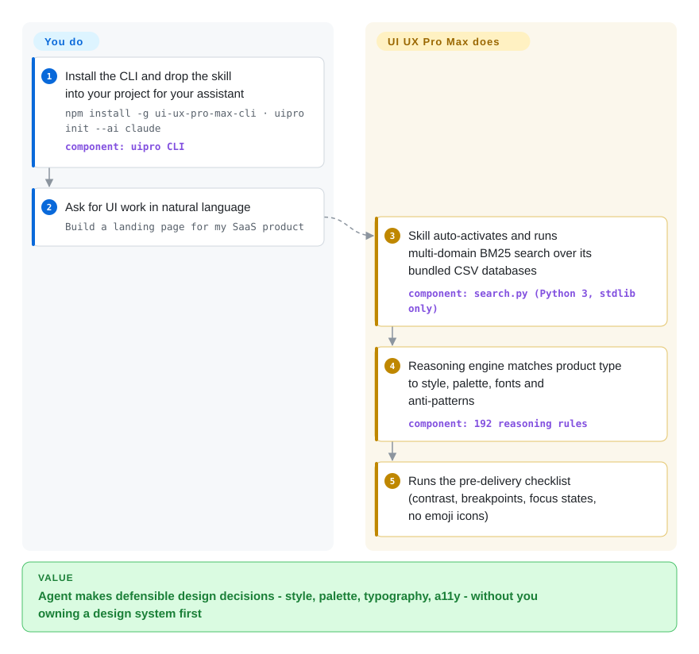

# UI UX Pro Max Skill

You ask your coding agent for a landing page and get emoji icons, default Tailwind spacing and the same gradient hero it gives everyone. UI UX Pro Max gives the agent a local search engine over hundreds of industry design rules — styles, palettes, font pairings, anti-patterns — so it picks UI with reasons instead of reflexes.

## When to use

You're a backend-leaning developer (or a generalist) shipping a SaaS product, and you ask your coding agent to "build a landing page" or "make a settings screen." What comes back is technically correct but visually generic — default Tailwind spacing, emoji icons, no real hierarchy, the same gradient hero every AI produces. You can tell it looks like AI slop, but you don't have the design vocabulary to say *why* or to direct a fix. You want the agent to make defensible design decisions on its own: pick a style that fits a fintech vs. a beauty-spa product, choose a palette and type pairing with intent, respect WCAG contrast and reduced-motion, and avoid known anti-patterns.

UI UX Pro Max installs that judgment into the agent. You run `npm install -g ui-ux-pro-max-cli` then `uipro init --ai claude` (or cursor, windsurf, codex, opencode, gemini, and ~20 more), which drops a skill directory with markdown manifests plus a bundled Python `search.py` over CSV databases (per the current README: 192 reasoning rules and palettes, 79 searchable UI styles with 50 active, 74 font pairings, 119 UX guidelines, 22 stack-specific guides). After that, a natural UI/UX request auto-activates the skill: it runs a multi-domain BM25 lookup (product type → patterns, color mood, typography, anti-patterns), generates a design system you can persist to `design-system/<project>/MASTER.md`, and runs a pre-delivery checklist (WCAG contrast, 375–1440px breakpoints, focus states, no-emoji-icons) before declaring done. Power users can also call `search.py` directly. It runs fully local — Python 3 stdlib only, the scripts make no network calls.

## How it works

The pack is a retrieval engine wearing a skill costume. Install puts a `SKILL.md` manifest into your agent's skill directory plus a `scripts/search.py` backed by CSV databases of product types, styles, palettes, typography and UX rules — the BM25 ranking (a classic text-relevance scoring method) runs locally on Python's standard library, no server, no API key. When you make a UI request, the skill instructs the agent to query the engine across several domains in parallel, apply the matching industry reasoning rules (JSON decision conditions), and assemble a design-system recommendation: page pattern, style, exact colors, font pairing, effects to use, anti-patterns to avoid, and a pre-delivery checklist the agent must pass before claiming the UI is done. If you persist the result, it writes a `MASTER.md` plus optional per-page override files that the agent re-reads across sessions, so your product's design system stays stable while the rules library updates. What stays yours: installing Python 3 yourself (the skill is told never to install software on your machine), keeping the design-system files in the repo, and the fact that the checklist is instruction, not a gate — the agent can still skip it.

<!-- flow-steps:begin (generated from flows/ui-ux-pro-max.json by tools/flow_card.py — do not edit) -->

Text version of the flow

1. **You**: Install the CLI and drop the skill into your project for your assistant — `npm install -g ui-ux-pro-max-cli · uipro init --ai claude` — component: `uipro CLI`
2. **You**: Ask for UI work in natural language — `Build a landing page for my SaaS product`
3. **UI UX Pro Max Skill**: Skill auto-activates and runs multi-domain BM25 search over its bundled CSV databases — component: `search.py (Python 3, stdlib only)`
4. **UI UX Pro Max Skill**: Reasoning engine matches product type to style, palette, fonts and anti-patterns — component: `192 reasoning rules`
5. **UI UX Pro Max Skill**: Runs the pre-delivery checklist (contrast, breakpoints, focus states, no emoji icons)

**Value**: Agent makes defensible design decisions - style, palette, typography, a11y - without you owning a design system first

<!-- flow-steps:end -->

## When NOT to use

- **You already run a UI/design skill or design-system contract you trust.** This pack is opinionated about styles, palettes, and "rules"; layering it over an existing taste skill or a project `DESIGN.md` invites two sources of truth and conflicting directives. Pick one design authority.
- **You want a component library or a finished UI you can import.** It ships *design intelligence and generation guidance*, not React/Vue components — there's nothing to `import`. The output is code the agent writes plus a markdown design system, not a packaged UI kit.
- **Your harness can't load the skill or run Python.** Activation depends on each platform's skill-loading mechanism, and the retrieval backend needs Python 3 on the machine. On a harness with no skill loader, or a sandbox without Python, the markdown alone won't auto-fire and the search engine won't run.
- **You need enforcement, not suggestion.** The checklist (contrast, breakpoints, no emoji) and style rules are advisory prompt-level guidance the agent *should* follow — they are not a hard gate, linter, or CI check. The agent can still ship something that violates them. [推断]
- **Fast-moving single-vendor upstream.** Frequent releases (v2.8.x) and behavior baked into prompts/CSV data mean a version bump can change which styles, rules, or checklist items apply. Pin a version if you need reproducible design output.

- **You need a bespoke brand identity, not a starter system.** The README splits Basic (this repo: UI/UX rules, styles, palettes) from a paid Premium tier (brand identity, logo design, banners, enterprise token architecture) — if the open part doesn't cover your need, the fix lives behind a paywall, so budget accordingly or write the constraints yourself in a `DESIGN.md`.

## Comparison

| Alternative | In index | Our verdict | Tradeoff |
|---|---|---|---|
| [designer-skills](designer-skills.md) | ✅ | When you want the designer's whole practice (research, UX strategy, design ops) as agent skills, pick designer-skills; pick UI UX Pro Max when the deliverable is generated UI code backed by a searchable rule/palette database. | designer-skills is breadth across the design workflow; this pack is depth on one pipeline — product type → design system → coded screen — and needs Python for its retrieval step. |
| [stitch-skills](stitch-skills.md) | ✅ | Pick stitch-skills when your flow runs through Google Stitch's MCP generation (text/image → screens, DESIGN.md export); pick UI UX Pro Max when you have no Stitch server and want local rule-driven design decisions. | stitch-skills drives a hosted generation pipeline; this pack is fully local and outputs reasoning + a markdown design system instead of Stitch screens. |
| [taste-skill](taste-skill.md) | ✅ | Pick taste-skill when the gap is purely aesthetic — anti-slop layout, typography, GSAP motion — with tunable variance/density dials; pick UI UX Pro Max when you also want UX architecture (patterns, a11y rules, per-stack guidance) retrieved from a rule database. | taste-skill is markdown-only and stronger on visual style; this one covers broader UI/UX but adds a CLI install and a Python search step. |
| [make-interfaces-feel-better](make-interfaces-feel-better.md) | ✅ | Pick make-interfaces-feel-better for day-2 polish of an existing screen (~16 concrete interaction rules); pick UI UX Pro Max for the day-0 product-type-to-design-system pipeline. | Narrow polish checklist vs. generation-time system; complementary rather than competing. |
| Anthropic / built-in agent skills and slash commands | 未收录 | Pick built-in skills when shipping throwaway prototypes where a starter design system adds no value; this pack exists because default agent UI output is generic. | Native ecosystem, zero upkeep vs. a third-party rule database you install and update. |
| Hand-written project `DESIGN.md` design system | 未收录 | Pick a hand-written `DESIGN.md` when the brand rules are already decided and must be binding; pick this pack when you need a reasoned starting system generated per product category. | Bespoke and enforceable but authored/maintained by you vs. a 192-rule starter that ships opinions you don't control and that change between releases. |

## Health & viability

- **Responsiveness**: Cannot be scored — type_na.
- **Maintenance (2026-09):** very active — pushed the day of this check; releases are frequent (v2.15.0 published 2026-08-13, then v2.14.x/v2.13.0 in a steady cadence). Disciplined semver is a plus, but the pace means a bump can shift which styles, rules or checklist items apply.
- **Governance & backing:** `Organization`-owned (`nextlevelbuilder`), but functionally a single-vendor project — one org owns the roadmap, the style taxonomy and the CSV rule data; no foundation. The README cross-promotes sibling projects and a paid Premium tier, which tells you where the commercial gravity sits. [推断]
- **Age & Lindy:** created 2025-11, so just under a year old as of 2026-09 — young and heavily star-hyped (~131k). Unproven on Lindy; the star count is not a durability signal.
- **Risk flags:** advisory enforcement (prompt/markdown + a local CSV search step, not a hard gate); open-core tiering (brand/logo/enterprise-token features are Premium, not repo); behavior baked into prompts/CSV ⇒ pin a version for reproducible design output.

## Caveats (unverified)

- [未验证] Latest release v2.15.0 (published 2026-08-13) and repo last pushed 2026-09-27 per GitHub on 2026-09-27; license MIT and primary language Python per GitHub metadata — re-verify before relying on a specific version's behavior.
- [未验证] Star count (~131k per GitHub on 2026-09-27) is unreliable and date-sensitive; treat as indicative only, not as a quality signal.
- [未验证] The dataset sizes (192 reasoning rules, 79 searchable styles of which 50 active, 192 palettes, 74 font pairings, 119 UX guidelines, 25 chart types, 22 stacks) and the supported-harness list in the README (Claude Code, Cursor, Windsurf, Antigravity, Copilot, Kiro, Codex, Qoder, Roo Code, Gemini, Trae, OpenCode, Continue and others) are from the README as of 2026-09-27 and not independently counted here.
- [未验证] Install path is the npm package `ui-ux-pro-max-cli` providing the `uipro` command; that the generated skill calls `search.py` internally (rather than the user always calling it) is per the README's described architecture, not separately validated.
- [推断] Because the design rules and pre-delivery checklist live in prompt/markdown skills and a local CSV-backed search step, enforcement is advisory — the agent can still deviate or ship non-conforming UI; "checklist" items are guidance, not hard guarantees.
- [推断] "Runs fully local, Python 3 stdlib only, no network calls" is the README's own claim (Prerequisites section); actual behavior on a given sandbox (Python availability, write permissions for the generated skill dir) is not confirmed here.
