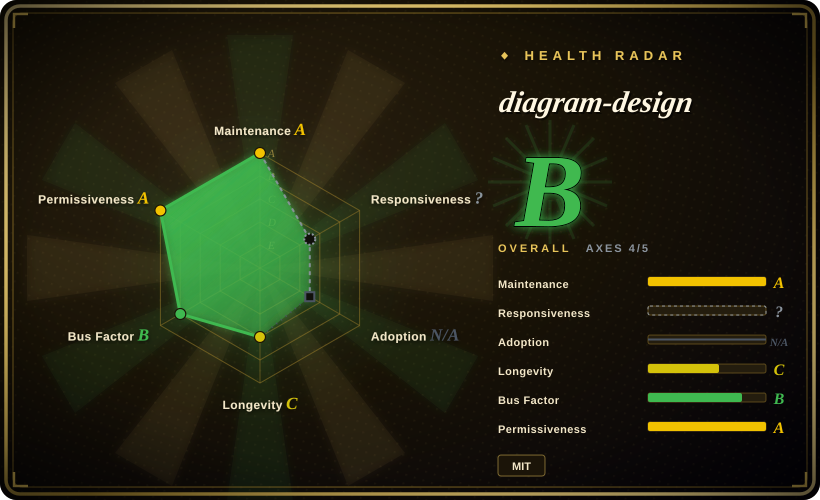
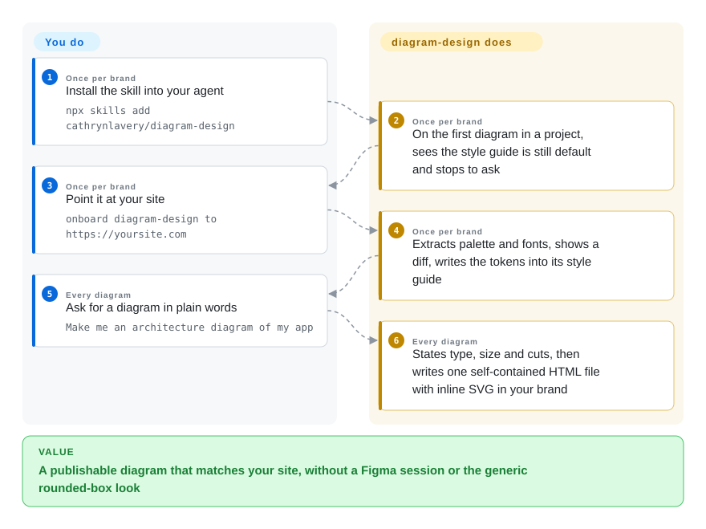

# diagram-design

Your agent's diagrams come out as generic rounded boxes that look nothing like the blog post or deck they land in; this skill writes a design system and your brand's tokens into the agent's context, so it draws one self-contained HTML+SVG file in an editorial style.

## When to use

You write posts, docs or slides, and you already ask an agent for diagrams — it understands the content, but what comes back is the generic first-pass look: pastel fills, shadows, five colors, labels jammed against borders. You either fight Figma for half an hour or ship nothing. Reach for diagram-design when the diagram is something you will *publish* and it should look like the rest of your site: it onboards your palette and fonts once (from your homepage URL), then every later request — "an architecture diagram of my app", "a quadrant of Q2 projects", "a sequence with token refresh on 401" — comes back as one `.html` file in that style, exportable to SVG or PNG.

The deciding tradeoff is **look over source**: you get an opinionated, branded, publication-grade picture across 44 diagram and chart types, and you give up an editable source format — no text to diff in a pull request and no canvas to drag a box on. It also redraws existing `.drawio`, Mermaid and `.excalidraw` files into its style. If the diagram should stay plain text in git, reach for Mermaid; if a human must keep editing it in draw.io, or it must be regenerated from Terraform, reach for drawio-skill; if any decent HTML diagram will do and brand fidelity is not the point, archify is the lighter option.

## How it works

diagram-design is an Agent Skill, not a renderer: a 393-line `SKILL.md` that routes your request to one of 62 reference files (one per diagram type, plus semantic patterns, primitives, onboarding, import and export specs) and 211 HTML templates and examples. The agent reads only the one type reference it needs, then hand-writes the SVG itself under fixed rules — one accent color for the one or two focal elements, 1px hairlines, no shadows, three font families, every coordinate on a 4px grid — and states its chosen type, size and planned cuts before it draws. Brand onboarding is the agent fetching your homepage, mapping colors and fonts to semantic roles (`paper`, `ink`, `muted`, `accent`), checking WCAG contrast, and writing the result into the skill's own `references/style-guide.md` (or a named profile under `~/.diagram-design/profiles/` when you serve several clients). The bundled Python scripts are stdlib-only and do the parts a model is bad at: `self_check.py` lints a generated file, and `drawio_extract.py` / `mermaid_extract.py` / `excalidraw_extract.py` parse an existing diagram into a node-and-edge summary (no rendering, no network) that the agent then redraws — dropping the source's coordinates, palette and fonts, and listing what it merged or dropped. The only network touch in the output is Google Fonts, removable with a system-fonts option; PNG export is the one step that needs Playwright and Chromium.

<!-- flow-steps:begin (generated from flows/diagram-design.json by tools/flow_card.py — do not edit) -->

Text version of the flow

1. **You** (Once per brand): Install the skill into your agent — `npx skills add cathrynlavery/diagram-design`
2. **diagram-design** (Once per brand): On the first diagram in a project, sees the style guide is still default and stops to ask
3. **You** (Once per brand): Point it at your site — `onboard diagram-design to https://yoursite.com`
4. **diagram-design** (Once per brand): Extracts palette and fonts, shows a diff, writes the tokens into its style guide
5. **You** (Every diagram): Ask for a diagram in plain words — `Make me an architecture diagram of my app`
6. **diagram-design** (Every diagram): States type, size and cuts, then writes one self-contained HTML file with inline SVG in your brand

**Value**: A publishable diagram that matches your site, without a Figma session or the generic rounded-box look

<!-- flow-steps:end -->

## When NOT to use

- **The diagram lives in git and changes every sprint.** The output is hand-placed SVG, not a source format — there is nothing meaningful to diff in review. Use [Mermaid](../../../diagramming/mermaid.md) (GitHub renders it) or [D2](../../../diagramming/d2.md) (renders in CI with a layout engine you choose). The project's own README says the same.
- **Someone must keep editing it on a canvas, or it must track a real source.** If the deliverable is a file a colleague opens and nudges, or the picture must be re-extracted when the Terraform or OpenAPI spec changes, use [drawio-skill](drawio-skill.md) — it writes an editable `.drawio` and re-syncs from the source without losing your layout. diagram-design can *import* `.drawio`, but it exports only HTML/SVG/PNG.
- **You need the same input to give the same picture.** Layout is placed by the model, so the same prompt can lay out differently twice and quality tracks the model you run; the 4px grid and CI overlap checks bound the damage but do not make it deterministic. Use [D2](../../../diagramming/d2.md) or [PlantUML](../../../diagramming/plantuml.md) when output must be reproducible from text.
- **The chart is driven by real data that refreshes.** Its bar, line, scatter, heatmap and waterfall types are hand-authored SVG with the numbers written in by the agent — fine for a published figure, wrong for a dashboard or report that re-queries data. Use [Evidence](../../../data-visualization/evidence.md) to keep charts bound to SQL.
- **You don't care about brand or editorial polish.** The value is the design system and onboarding; for a quick, competent technical diagram with theme toggle and export built in, [archify](archify.md) is the simpler pick, and a hand-drawn whiteboard is [Excalidraw](../../../diagramming/excalidraw.md)'s job.
- **You need a dependency with a long track record or shared ownership.** The repo dates from 2026-04-16 and one author leads it; versions auto-bump on every merge with no tagged releases. If you install it through a marketplace with auto-update on, you are trusting each merge to `main` — pin a commit or use an editable clone if that matters.

## Comparison

| Alternative | In index | Our verdict | Tradeoff |
|---|---|---|---|
| [archify](archify.md) | ✅ | Choose archify when you want an agent-made technical diagram with theme toggle and export, and brand matching is not required; choose diagram-design when the diagram will be published next to your own site and must carry its palette and fonts. | archify ships its own renderer and themes for architecture/workflow views; diagram-design ships a design system, brand onboarding and 44 types, but leaves layout to the model. |
| [drawio-skill](drawio-skill.md) | ✅ | Choose drawio-skill when the output must be an editable `.drawio` that re-syncs from Terraform, Kubernetes or an API spec; choose diagram-design when the output is a finished picture for a post or deck. | drawio-skill keeps meaning, provenance and geometry separate so edits survive regeneration; diagram-design gives up editability for look, and only imports `.drawio`. |
| [Mermaid](../../../diagramming/mermaid.md) | ✅ | Choose Mermaid for diagrams that live in Markdown, diff in review and change often; choose diagram-design for the one diagram you will publish — it can even take your Mermaid block and redraw it. | Mermaid is portable text with automatic layout and the renderer's theme; diagram-design is a one-off artifact in your brand with no source to maintain. |
| [huashu-design](huashu-design.md) | ✅ | Choose huashu-design when the artifact is a prototype, slide deck, animation or infographic; choose diagram-design when it is specifically a diagram or chart that must follow a strict editorial rule set. | huashu-design covers a wider HTML visual surface; diagram-design is narrower and stricter, with per-type references, a self-check script and importers. |
| [draw.io](../../../diagramming/drawio.md) | ✅ | Choose draw.io when a person needs exact placement and official cloud/UML shape libraries in a file others will edit; choose diagram-design when you would rather describe the diagram than drag it. | draw.io gives full manual control and an editable XML file; diagram-design gives speed and a consistent style at the cost of hand control. |

## Health & viability

- **Maintenance (checked 2026-10-10):** very active. Last push 2026-10-10; the plugin manifest is at 2.6.73, bumped automatically on every merge to `main` (the 2.6 line alone covers 2.6.0 → 2.6.70 between 2026-08-20 and 2026-10-09). There are no GitHub releases or tags — the version lives only in the manifests. 81 open issues and PRs.
- **Governance & bus factor:** one lead author with a real contributor tail. `cathrynlavery` (a personal account created 2019) wrote 119 commits — about 48% of the total, with 61 more from the version-bump bot — and the next most active human has 16; 58 accounts committed in the last 12 months, which is why the scorer grades governance B rather than D. LittleMight, the author's company, publishes the plugin-directory listings. There is a maintainer-policy file, a contributing guide with validation gates, and an ADR folder, so the process is written down — but the roadmap is one person's.
- **Not scored — responsiveness and adoption.** Responsiveness is `?` (`type_na`) and adoption is `N/A` (`no_install_channel`): both rely on a package-registry feed, and a skill installed by copying a directory has none. Read the grade as four of five applicable axes.
- **Age & Lindy:** about six months old (created 2026-04-16). ~48.2k stars and ~3.0k forks in that time is extreme attention for a young repo; the Lindy prior is unproven, so judge it on what it does today.
- **Adoption:** installable through `npx skills`, and through the Claude Code, Codex, Copilot, Factory Droid and Pi plugin marketplaces; a Claude Cowork path requires mirroring into an organization repo.
- **Engineering signal:** CI runs 80+ verifier scripts (skin lint, Chromium render lint, geometry, contrast, per-type data checks) on Linux, Windows and macOS. I ran `self_check.py` on a bundled example (`OK`) and the Mermaid importer on a 3-node flowchart (correct node, edge and shape summary).
- **Risk flags:** MIT, holder Cathryn Lavery, no relicense history. Bundled icons are MIT/CC0 and fonts are OFL, listed in `THIRD_PARTY_LICENSES.md`; brand logos (AWS, Azure, Kubernetes…) are still trademarks of their owners. The skill's scripts import only the Python standard library — no subprocess, network or `eval` calls (grepped 2026-10-10). The privacy policy states no telemetry; the one outbound request is Google Fonts when a diagram is opened.

## Caveats (unverified)

- [未验证] Star and fork counts (~48.2k / ~3.0k on 2026-10-10) are GitHub metadata; the growth curve could not be checked because the stargazers-with-timestamps API returned 404 from this environment.
- [未验证] The host list (Cursor, Cline, Gemini CLI, Windsurf, Amp, Kiro, OpenCode, Pi…) is the project's own claim; only the Agent Skills format is shared, and per-host behavior was not tested.
- [未验证] Brand onboarding (fetching a site, extracting palette and fonts, the fidelity receipt) depends on the host agent's browsing tools and was not exercised here.
- [未验证] PNG export through Playwright/Chromium and the `/export-diagram` command were not run; only the stdlib scripts were.
- [推断] Output quality on weaker or smaller models is likely noticeably worse, since the model does the layout; the README says quality depends on the model but gives no measured comparison.
- [推断] Writing onboarding tokens into the installed skill's `style-guide.md` means a managed-package update can overwrite them; the README recommends saved profiles or an editable clone for that reason.
- [推断] Lead-author ownership means that if the author steps away, expect the project to stall rather than pass to a community.
