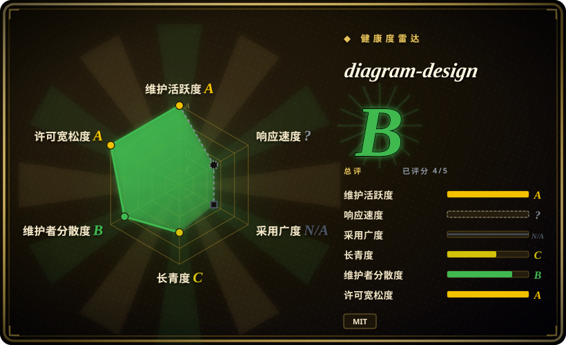
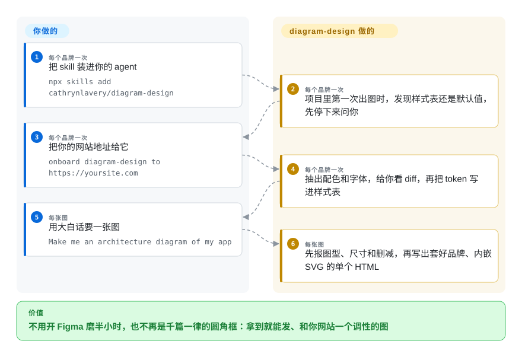

# diagram-design

让 agent 画的图总是千篇一律的圆角框，和要放进去的博客、幻灯片完全不搭；这个 skill 把一套设计规范和你品牌的配色字体写进 agent 的上下文，让它画出一个编辑风格的独立 HTML+SVG 文件。

## 何时使用

你写文章、文档或幻灯片，也早就习惯让 agent 出图——内容它懂，但交回来的总是“第一稿”的样子：粉彩填色、阴影、五种颜色、文字顶着边框。要么去 Figma 磨半小时，要么干脆不放图。当这张图是要**发出去**的、而且得和你网站其他部分一个调性时，选 diagram-design：它先用你的主页地址把配色和字体抓一次，之后每次请求——“画一下我这个应用的架构”“把 Q2 项目按影响和投入放进四象限”“画个 401 时刷新 token 的时序图”——都会交回一个这种风格的 `.html` 文件，可以再导出成 SVG 或 PNG。

决定性的取舍是**要观感、不要源文件**：你得到一张有主见、套好品牌、能直接发表的图，覆盖 44 种图表类型；代价是没有可编辑的源格式——PR 里没有文本可 diff，也没有画布可以拖框。它还能把现有的 `.drawio`、Mermaid 和 `.excalidraw` 文件按它的风格重画。如果图应该以纯文本留在 git 里，选 Mermaid；如果之后还要有人在 draw.io 里继续改，或者图要从 Terraform 重新生成，选 drawio-skill；如果只要一张像样的 HTML 技术图、品牌一致不是重点，archify 更轻。

## 怎么用起来

diagram-design 是一个 Agent Skill，不是渲染器：一份 393 行的 `SKILL.md` 负责把请求路由到 62 份参考文件之一（每种图一份，外加语义模式、图元、品牌接入、导入和导出规范），再配上 211 个 HTML 模板和示例。agent 只读当前需要的那一份类型参考，然后按固定规则亲手写 SVG——一个强调色只给一两个焦点元素、1px 细线、不用阴影、三种字体、所有坐标落在 4px 网格上——并且动笔前先说清选了哪种图、多大尺寸、准备删掉什么。品牌接入就是 agent 去抓你的主页，把颜色和字体映射到语义角色（`paper`、`ink`、`muted`、`accent`），检查 WCAG 对比度，再把结果写进 skill 自己的 `references/style-guide.md`（同时服务多个客户时写成 `~/.diagram-design/profiles/` 下的具名档案）。随附的 Python 脚本只用标准库，专做模型不擅长的部分：`self_check.py` 检查生成的文件，`drawio_extract.py`、`mermaid_extract.py`、`excalidraw_extract.py` 把已有的图解析成节点和边的摘要（不渲染、不联网），agent 再据此重画——丢掉原图的坐标、配色和字体，并列出合并或删掉了什么。产物里唯一的联网动作是加载 Google Fonts，可以切成系统字体去掉；只有导出 PNG 这一步需要 Playwright 和 Chromium。

<!-- flow-steps:begin (generated from flows/diagram-design.json by tools/flow_card.py — do not edit) -->

流程文字版

1. **你**（每个品牌一次）：把 skill 装进你的 agent — `npx skills add cathrynlavery/diagram-design`
2. **diagram-design**（每个品牌一次）：项目里第一次出图时，发现样式表还是默认值，先停下来问你
3. **你**（每个品牌一次）：把你的网站地址给它 — `onboard diagram-design to https://yoursite.com`
4. **diagram-design**（每个品牌一次）：抽出配色和字体，给你看 diff，再把 token 写进样式表
5. **你**（每张图）：用大白话要一张图 — `Make me an architecture diagram of my app`
6. **diagram-design**（每张图）：先报图型、尺寸和删减，再写出套好品牌、内嵌 SVG 的单个 HTML

**价值**：不用开 Figma 磨半小时，也不再是千篇一律的圆角框：拿到就能发、和你网站一个调性的图

<!-- flow-steps:end -->

## 何时不用

- **图放在 git 里、每个迭代都要改。** 产物是手工摆放的 SVG，不是源格式，评审时没有能看的 diff。选 [Mermaid](../../../diagramming/mermaid.zh.md)（GitHub 直接渲染）或 [D2](../../../diagramming/d2.zh.md)（在 CI 里渲染，布局引擎可选）。项目自己的 README 也这么说。
- **之后还得有人在画布上改，或者图要跟着真实源走。** 如果交付物是同事要打开再挪一挪的文件，或者 Terraform、OpenAPI 一变图就得重新抽取，选 [drawio-skill](drawio-skill.zh.md)——它写出可编辑的 `.drawio`，并能从源重新同步而不丢版式。diagram-design 能**导入** `.drawio`，但只导出 HTML、SVG、PNG。
- **同样的输入必须得到同样的图。** 布局由模型决定，同一个提示词两次可能排得不一样，质量也随所用模型浮动；4px 网格和 CI 里的重叠检查能限制损失，但做不到确定性。输出必须能从文本复现时，选 [D2](../../../diagramming/d2.zh.md) 或 [PlantUML](../../../diagramming/plantuml.zh.md)。
- **图表由会刷新的真实数据驱动。** 它的柱状图、折线图、散点图、热力图、瀑布图都是 agent 手写数字的 SVG——当发表用的插图没问题，当要重新查数的看板或报表就不对。想让图表绑定 SQL，选 [Evidence](../../../data-visualization/evidence.zh.md)。
- **你并不在乎品牌和编辑风格。** 它的价值在设计规范和品牌接入；只要一张够用的技术图、自带主题切换和导出，[archify](archify.zh.md) 更省事；手绘白板是 [Excalidraw](../../../diagramming/excalidraw.zh.md) 的活。
- **你需要历史长、多人共管的依赖。** 仓库创建于 2026-04-16，由一位作者主导；每次合并自动升版本号，没有打 tag 的发布。如果通过插件市场安装并开了自动更新，你等于信任每一次合入 `main` 的改动——在意的话请钉住某个 commit，或用可编辑的本地克隆。

## 横向对比

| 替代品 | 是否收录 | 我们的评价 | 取舍 |
|---|---|---|---|
| [archify](archify.zh.md) | ✅ | 想要 agent 出一张带主题切换和导出的技术图、不需要匹配品牌时选 archify；图要发在你自己网站旁边、必须带上它的配色字体时选 diagram-design。 | archify 自带渲染器和主题，专做架构和流程图；diagram-design 带的是设计规范、品牌接入和 44 种类型，但布局交给模型。 |
| [drawio-skill](drawio-skill.zh.md) | ✅ | 产物必须是可编辑、能从 Terraform、Kubernetes 或接口规格重新同步的 `.drawio` 时选 drawio-skill；产物是给文章或幻灯片用的成品图时选 diagram-design。 | drawio-skill 把含义、来源和几何分层保存，重新生成也不丢手改；diagram-design 用可编辑性换观感，对 `.drawio` 只读不写。 |
| [Mermaid](../../../diagramming/mermaid.zh.md) | ✅ | 图住在 Markdown 里、要在评审里 diff、经常改时选 Mermaid；要发表的那一张选 diagram-design——它甚至能拿你的 Mermaid 代码块重画。 | Mermaid 是可移植的文本，自动布局、用渲染器的主题；diagram-design 是一次性的品牌化成品，没有源要维护。 |
| [huashu-design](huashu-design.zh.md) | ✅ | 产物是原型、幻灯片、动画或信息图时选 huashu-design；产物明确是一张必须守严格编辑规范的图或图表时选 diagram-design。 | huashu-design 覆盖更宽的 HTML 视觉面；diagram-design 更窄更严，有逐类型参考、自检脚本和导入器。 |
| [draw.io](../../../diagramming/drawio.zh.md) | ✅ | 需要人精确摆放、用官方云和 UML 图形库、交出别人能改的文件时选 draw.io；宁可描述也不想拖框时选 diagram-design。 | draw.io 给完全的手动控制和可编辑的 XML；diagram-design 给速度和一致风格，代价是放弃手动控制。 |

## 健康度与可持续性

- **维护（2026-10-10 核对）：** 非常活跃。最近一次推送是 2026-10-10；插件清单版本到了 2.6.73，每次合入 `main` 自动加一（光 2.6 这条线就从 2.6.0 走到 2.6.70，时间是 2026-08-20 至 2026-10-09）。没有 GitHub Release 也没有 tag——版本号只存在清单文件里。未关闭的 issue 和 PR 共 81 个。
- **治理与巴士因子：** 一位主作者，带一条真实的贡献者长尾。`cathrynlavery`（2019 年注册的个人账号）写了 119 个提交，约占总数的 48%，另有 61 个来自升版本号的机器人；排第二的人类贡献者只有 16 个。过去 12 个月有 58 个账号提交过，所以评分器给治理打 B 而不是 D。插件目录上的条目由作者的公司 LittleMight 发布。仓库有维护策略文件、带验证门禁的贡献指南和 ADR 目录，流程是成文的——但路线图仍是一个人的。
- **未评分——响应度和采用度。** 响应度是 `?`（`type_na`），采用度是 `N/A`（`no_install_channel`）：两者都依赖包仓库的数据，而复制目录安装的 skill 没有这种数据。请把总分读作五个适用维度里评了四个。
- **年龄与 Lindy：** 大约半岁（创建于 2026-04-16）。这么短时间拿到约 4.82 万星、约 3000 个 fork，对年轻仓库来说关注度极高；Lindy 先验还没得到验证，按它眼下能做什么来判断。
- **采用：** 可以用 `npx skills` 安装，也可以走 Claude Code、Codex、Copilot、Factory Droid 和 Pi 的插件市场；Claude Cowork 需要先镜像到组织自己的仓库。
- **工程信号：** CI 在 Linux、Windows、macOS 上跑 80 多个校验脚本（皮肤检查、Chromium 渲染检查、几何、对比度、各类型的数据校验）。我在随附示例上跑了 `self_check.py`（输出 `OK`），又用 Mermaid 导入器解析了一个 3 节点流程图（节点、边、形状摘要都对）。
- **风险信号：** MIT，版权人 Cathryn Lavery，没有改协议的历史。随附图标是 MIT 或 CC0，字体是 OFL，都列在 `THIRD_PARTY_LICENSES.md`；但 AWS、Azure、Kubernetes 等品牌 logo 仍是各自所有者的商标。skill 里的脚本只导入 Python 标准库——没有 subprocess、网络或 `eval` 调用（2026-10-10 用 grep 核过）。隐私声明写明没有遥测；唯一的外发请求是打开图时加载 Google Fonts。

## 存疑（未验证）

- [未验证] 星数和 fork 数（2026-10-10 约 4.82 万、约 3000）来自 GitHub 元数据；增长曲线没法核，因为带时间戳的 stargazers 接口在本环境返回 404。
- [未验证] 支持的宿主列表（Cursor、Cline、Gemini CLI、Windsurf、Amp、Kiro、OpenCode、Pi 等）是项目自述；共通的只有 Agent Skills 格式，各宿主的实际表现没有测。
- [未验证] 品牌接入（抓网站、抽配色字体、出保真回执）依赖宿主 agent 的浏览工具，这次没有实跑。
- [未验证] 经 Playwright、Chromium 导出 PNG 和 `/export-diagram` 命令没有跑；只跑了标准库脚本。
- [推断] 由于布局由模型完成，在较弱或较小的模型上效果大概率明显变差；README 说质量取决于模型，但没给实测对比。
- [推断] 品牌 token 写进已安装 skill 的 `style-guide.md`，意味着托管包更新可能把它覆盖；README 正因此推荐用具名档案或可编辑克隆。
- [推断] 由一位作者主导，作者一旦离开，更可能是项目停滞，而不是交接给社区。
