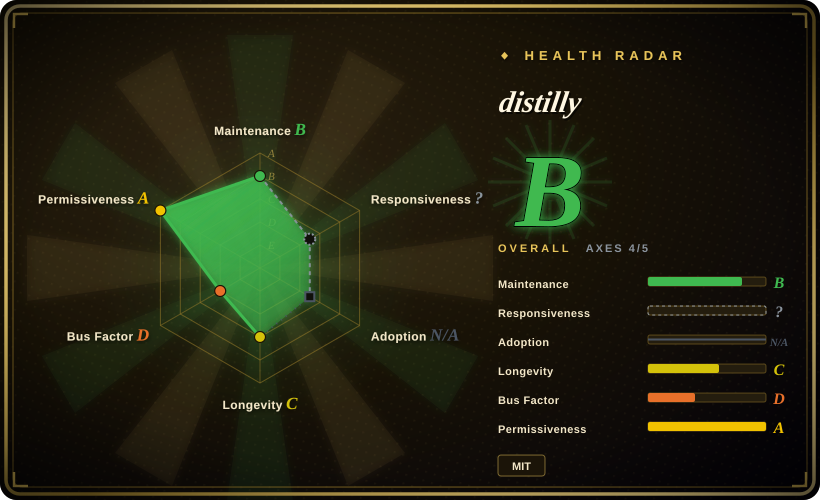

# distilly

A meta-skill that distills one person's traces — exported chat history, documents, email, interview transcripts, public sources — into a reusable **Person Profile** packaged as an installable agent skill (a *Work* layer plus a *Persona* layer), for eight agent harnesses. Formerly `colleague-skill`.

## When to use

You're an engineer whose teammate transferred, or whose mentor graduated, and the engineering judgment you relied on left with them. You have their traces: an exported Lark/DingTalk/Slack history, design docs, review comments, email `.mbox` files, a few interview transcripts. You want your coding agent to answer a design question *the way that person would* — asking for context first, refusing without a stated reason, citing impact before elegance — instead of in generic-assistant voice. Distilly runs an intake → analysis → build pipeline over that material, emits a skill directory containing a combined `SKILL.md` plus work-only and persona-only variants, and installs the self-contained `SKILL.md` into the skills directory your harness already discovers. You pick it over a ready-made subagent collection such as [awesome-claude-code-subagents](subagent-collections/awesome-claude-code-subagents.md) because those ship fixed roles authored by strangers, while Distilly grounds its output in *your* material about *one specific* person; you pick it over [book-to-skill](book-to-skill.md) because that distills documents into referenceable knowledge, whereas Distilly distills a person into behavior and voice rules; you pick it over a hosted persona product because the output is a portable local file that runs inside your own agent and can read your own repo.

## When NOT to use

- **You just need a competent role, not a specific person.** If you want "a senior security reviewer" rather than "how *this* reviewer behaves", install [awesome-claude-code-subagents](subagent-collections/awesome-claude-code-subagents.md) or [wshobson/agents](subagent-collections/wshobson-agents.md) instead of running Distilly, because Distilly's only real input is one person's material — with none, it degenerates into a generic prompt written in six layers.
- **You need knowledge an agent can consult, not judgment it can imitate.** If the goal is "the agent should know this book/spec/codebase", use [book-to-skill](book-to-skill.md) or a RAG pipeline instead, because Distilly has no retrieval or embedding layer; its output is instructions, not an index, so facts absent from the material cannot be recalled.
- **You need verifiable fidelity.** If a wrong answer is expensive, do not treat Distilly as the source of truth: its only automated gate is a keyword/regex checker over files the model wrote itself (`tools/research/quality_check.py`), so a `PASS` means the shape is right, not that the profile is faithful. Use a hand-written rubric with human scoring instead.
- **The material is someone else's private messages.** Distilly's collectors can pull full private chats (both sides) and write them to disk. If you operate under works-council, privacy, or employee-monitoring rules, get an explicit policy and the person's consent, or stick to material they published — manual persona authoring in your own `CLAUDE.md` is the low-risk substitute.
- **You can't run Python, browser login sessions, or platform credentials.** The auto-collectors need `pip install`, a Feishu/DingTalk app with the right scopes, and for DingTalk `playwright install chromium`. If that isn't available, paste text manually instead — or hand-write the skill, since the pipeline adds most of its value at bulk-collection scale.
- **You want a character to chat with as a consumer.** If the appeal is talking to a persona for fun, a hosted character product does it with zero setup; pick Distilly only when the deliverable must be a local `SKILL.md` inside a coding agent.

## Comparison

| Alternative | In index | Our verdict | Tradeoff |
|---|---|---|---|
| [book-to-skill](book-to-skill.md) | ✅ | Choose Distilly when the source material is one person's traces and you want behavior plus voice rules; choose book-to-skill when the material is a technical book and you want reference content the agent loads on demand. | Distilly adds a collection pipeline, family-specific analysis prompts, and multi-harness installers; book-to-skill covers more document formats and is a stateless CLI, but produces no behavioral layer. |
| [awesome-claude-code-subagents](subagent-collections/awesome-claude-code-subagents.md) | ✅ | Choose Distilly when you must model a real, specific person from private material; choose the subagent bundle when you need broad role coverage today with zero setup. | The bundle is Claude Code-native and installs in seconds; Distilly costs a multi-step pipeline plus platform credentials and covers exactly one person per run. |
| [wshobson/agents](subagent-collections/wshobson-agents.md) | ✅ | Choose Distilly when the target is a named person rather than a role; choose wshobson/agents when you want a maintained catalogue of roles generated for six harnesses. | wshobson/agents wins on breadth and maintenance; Distilly wins on specificity and on grounding each rule in cited source material. |
| [Agency-Agents](subagent-collections/agency-agents.md) | ✅ | Choose Distilly to model one individual; choose Agency-Agents when the task is staffing a project with many roles rather than reproducing one person. | Agency-Agents supplies volume and deploy scripts across roughly a dozen harnesses; Distilly supplies per-rule provenance, at the cost of a slower, evidence-dependent build. |
| Character.AI and other hosted persona bots | 未收录 | Choose Distilly when the profile has to live inside your coding agent and read your working directory; choose a hosted bot when you want free-form character chat with no installation. | Hosted bots need no setup and are tuned for roleplay; they are SaaS, cannot see your repo, and their persona is not a file you can version or review. |

## Health & viability

- **Maintenance:** Grade B — last push 2026-09-16, three days before this page; repo created 2026-03-30, so about 5.7 months old (as of 2026-09-19). Cadence is bursty: most recent commits are docs and packaging work in August, then one cleanup commit in September.
- **Governance / bus factor:** Grade D — the top contributor holds 0.956 of the commit window, so bus factor is effectively 1. The owner is an individual user account (`titanwings`, `owner.type: User`); the next three contributors have 3, 1, and 1 contributions. No foundation, vendor, or steering structure owns the roadmap.
- **Backing & longevity:** Grade C — 173 days old with no institutional backing. Distribution targets GitHub Packages (`npm.pkg.github.com`), not public npm; the public npm name `distilly` belongs to an unrelated package from a different publisher, so registry-based adoption signals do not exist here. [推断] No org backing plus a six-month age makes this a young-project bet, not a Lindy one.
- **Adoption & ecosystem:** Unscored (`?`) — no registry, dependent-repo, or download signal exists, so the radar leaves this axis blank and only 4 of 6 axes are scored. What is visible: about 24.9k stars and 2.2k forks in under six months, 61 watchers, and 56 open issues with no stable release behind them. [推断] Growth of this shape, in this timeframe, for a project that has rebranded and expanded scope, reads as narrative-driven rather than production-validated.
- **Responsiveness:** Unscored (`?`) — the scoring rubric marks this axis not-applicable for `skill-pack` entries, whose canonical contribution channel is not issues or PRs, so support responsiveness is deliberately not assessed rather than found lacking.
- **Risk flags:** Grade A on license — MIT, no relicense history found. Everything else is the risk: one prerelease tag (`v0.01`, named "demo") and about 30 tags that are mostly `snapshot/*` bookmarks, so release discipline is thin; the repository was renamed (`colleague-skill` → `distilly`), breaking old clone paths and is documented as a manual migration; the project's own README calls the current version a demo; and the privacy surface is unusually large — collectors read private chats and colleague documents, and an optional path sends metered queries to a third-party X-post service. [未验证] The README's claim of eight supported agent hosts is not independently checked here.

## Caveats (unverified)

- [未验证] The README claims native local skill discovery on eight harnesses (Claude Code, Hermes, OpenClaw, Codex, DeepSeek Harness, Pi, Grok Build, OpenCode); I did not verify that each host loads the generated `SKILL.md` format. The README itself lists Grok Bot as a manual migration, not a direct install.
- [未验证] The cited technical report (arXiv 2605.31264, COLLEAGUE.SKILL) could not be opened — the fetch failed twice — so its contents and any evaluations in it are unverified.
- [未验证] I did not run the distillation pipeline end to end. Statements about how the pipeline behaves (collect → analyze → build → install) come from reading `SKILL.md`, `prompts/persona_builder.md`, `tools/skill_writer.py`, and `tools/research/quality_check.py`, not from an executed run.
- [未验证] Output fidelity is untested. The only automated check is `tools/research/quality_check.py`, a keyword/regex checker whose inputs are research notes the model wrote itself, and whose "review passed" test searches for a `Status: PASS` string inside a model-authored file; a PASS there is not evidence of faithfulness.
- [未验证] The bundled research tooling downloads video subtitles via `yt-dlp` and can query a metered third-party X-post service; their reliability, legal posture, and cost behavior are untested here.
- [推断] The reported star velocity on a six-month-old, single-maintainer repository with no stable release most likely reflects the "distill a person into a skill" narrative rather than sustained production use; star count alone is not adoption evidence.
- [推断] With a bus factor of 1 and no org backing, roadmap continuity depends on one person's continued interest, and the documented rename and migration burden suggests the project is still finding its shape.
