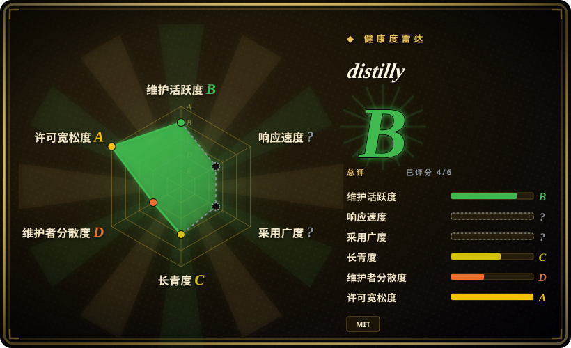

# distilly

一个 meta-skill：把某个人的痕迹——导出的聊天记录、文档、邮件、访谈转录、公开材料——蒸馏成可复用的 **Person Profile**，打包成可安装的 agent 技能（Work 层 + Persona 层），支持八个 agent harness。原名 `colleague-skill`。

## 何时使用

你是某位工程师的同事，他转岗了；或者你有一位已经毕业的导师——你依赖的那套工程判断跟着人一起走了。你手上有他的痕迹：导出的飞书／钉钉／Slack 记录、设计文档、评审意见、邮件 `.mbox`、几份访谈转录。你希望自己的 coding agent 回答一个设计问题时，用的是**那个人的方式**——先问背景、拒绝时给原因、先谈影响再谈优雅——而不是通用助手的腔调。Distilly 在这些材料上跑一条 intake → 分析 → 生成的流水线，产出一个技能目录（合并版 `SKILL.md` 加 work-only 与 persona-only 两个变体），再把自包含的 `SKILL.md` 装进你的 harness 本来就会扫描的 skills 目录。你不选现成的 subagent 合集（例如 [awesome-claude-code-subagents](subagent-collections/awesome-claude-code-subagents.zh.md)），因为那些给的是陌生人写好的固定角色，而 Distilly 的产出以**你自己的材料**锚定**某一个具体的人**；你不选 [book-to-skill](book-to-skill.zh.md)，因为它把文档蒸馏成可查阅的知识，而 Distilly 把一个人蒸馏成行为与语气规则；你也不选托管式人设产品，因为它的产出是一个可携带的本地文件，跑在你自己的 agent 里，还能读你自己的仓库。

## 何时不用

- **你只想要一个称职的角色，而不是某个具体的人。** 如果你要的是「一个资深安全评审者」而不是「**这位**评审者的行为方式」，就装 [awesome-claude-code-subagents](subagent-collections/awesome-claude-code-subagents.zh.md) 或 [wshobson/agents](subagent-collections/wshobson-agents.zh.md)，不要跑 Distilly，因为它唯一真实的输入就是某一个人的材料——没有材料时，它退化成一份分六层写出来的通用提示词。
- **你需要 agent 能查阅的知识，而不是能模仿的判断。** 如果目标是「agent 应该懂这本书／这份规范／这个代码库」，就用 [book-to-skill](book-to-skill.zh.md) 或 RAG 流水线，因为 Distilly 没有检索层也没有嵌入层；它产出的是指令而不是索引，材料里没有的事实它取不回来。
- **你需要可验证的保真度。** 如果答错代价很高，不要把 Distilly 当作事实来源：它唯一的自动门是对**模型自己写的文件**做关键词／正则检查（`tools/research/quality_check.py`），所以 `PASS` 只说明形状对，不说明画像忠实。这种情况应改用人工评分表逐条打分。
- **材料是别人的私聊记录。** Distilly 的采集器能拉取完整私聊（双方消息）并落盘。如果你处在工会、隐私或员工监控规则之下，先拿到明确政策与当事人同意，或者只用对方公开发布过的材料——在自己 `CLAUDE.md` 里手写人设是低风险替代方案。
- **你跑不了 Python、浏览器登录态或平台凭据。** 自动采集需要 `pip install`、一个开通了相应权限的飞书／钉钉应用，钉钉还要 `playwright install chromium`。这些不具备时，改成手工粘贴文本，或者干脆手写技能——流水线的价值主要体现批量采集规模上。
- **你只是想要一个角色陪你聊天。** 如果诉求是消费级地跟人设对话，托管式角色产品零配置就能做到；只有当交付物必须是 coding agent 里的本地 `SKILL.md` 时才选 Distilly。

## 横向对比

| 替代品 | 是否收录 | 我们的评价 | 取舍 |
|---|---|---|---|
| [book-to-skill](book-to-skill.zh.md) | ✅ | 材料是某个人的痕迹、你要的是行为与语气规则时选 Distilly；材料是一本技术书、你要的是 agent 按需加载的参考内容时选 book-to-skill。 | Distilly 多出采集流水线、分家族的分析提示词和多 harness 安装器；book-to-skill 覆盖更多文档格式、是无状态 CLI，但不产行为层。 |
| [awesome-claude-code-subagents](subagent-collections/awesome-claude-code-subagents.zh.md) | ✅ | 必须从私有材料建模一个真实具体的人时选 Distilly；今天就要宽覆盖的角色、且零配置时选这个 subagent 合集。 | 合集是 Claude Code 原生、几秒装好；Distilly 要跑多步流水线加平台凭据，每轮只覆盖一个人。 |
| [wshobson/agents](subagent-collections/wshobson-agents.zh.md) | ✅ | 目标是某个具名的人而不是某个角色时选 Distilly；想要一份持续维护、为六个 harness 生成的岗位目录时选 wshobson/agents。 | wshobson/agents 赢在覆盖面与维护度；Distilly 赢在专指性和「每条规则都能指回来源材料」。 |
| [Agency-Agents](subagent-collections/agency-agents.zh.md) | ✅ | 建模一个个体时选 Distilly；任务是给项目配齐一堆角色而不是复现某个人时选 Agency-Agents。 | Agency-Agents 提供体量和约十二个 harness 的部署脚本；Distilly 提供逐条来源可溯，代价是更慢、更依赖材料质量。 |
| Character.AI 等托管式人设产品 | 未收录 | 画像必须活在 coding agent 里、要读你的工作目录时选 Distilly；想要零安装的自由角色对话时选托管机器人。 | 托管机器人零配置、为角色扮演调优；但它是 SaaS，看不到你的仓库，人设也不是你能版本化或评审的文件。 |

## 健康度与可持续性

- **维护状态：** 评级 B——最后推送 2026-09-16，距本页三天；仓库创建于 2026-03-30，约 5.7 个月（截至 2026-09-19）。节奏是脉冲式的：近期提交集中在八月的文档与打包改动，九月只有一次清理性提交。
- **治理 / bus factor：** 评级 D——提交窗口内头部贡献者占 0.956，bus factor 实际为 1。所有者为个人账号（`titanwings`，`owner.type: User`），其后三位贡献者分别是 3、1、1 次提交。没有基金会、厂商或治理结构掌握路线图。
- **背书与长期性：** 评级 C——项目 173 天，无机构背书。分发目标是 GitHub Packages（`npm.pkg.github.com`）而非公共 npm；公共 npm 上的 `distilly` 属于另一个发布者的无关包，因此这里没有可用的注册表采用度信号。[推断] 没有组织背书加上六个月的项目年龄，使它是一次年轻项目的下注，不是 Lindy 型的。
- **采用度与生态：** 未评分（`?`）——没有注册表、依赖仓库或下载量信号，所以雷达这一轴留空，6 轴中只有 4 轴有分。可见的是：不到六个月约 24.9k stars、2.2k forks、61 位 watcher，以及 56 个未关闭 issue 而背后没有任何稳定发布。[推断] 这种量级的增速出现在这个时间窗内、且期间经历更名与范围扩张，读起来更像叙事驱动而不是生产验证。
- **响应度：** 未评分（`?`）——评分口径把这一轴对 `skill-pack` 类型标为不适用，因为 skill-pack 的主要贡献通道不是 issue 或 PR，所以支持响应性是刻意不评估，而不是评估为差。
- **风险信号：** 许可一轴评级 A——MIT，未发现重新许可历史。其余都是风险：只有一个预发布 tag（`v0.01`，名为 "demo"），另外约 30 个 tag 基本是 `snapshot/*` 存档，发布纪律偏薄；仓库经历过更名（`colleague-skill` → `distilly`），旧克隆路径失效且项目把它记为需手工迁移；项目自己的 README 称当前版本为 demo；隐私面异常大——采集器读取私聊与同事文档，另有一条可选路径向第三方 X 帖子服务发起按量计费查询。[未验证] README 声称支持八个 agent 宿主，本页未逐一核实。

## 存疑（未验证）

- [未验证] README 声称在八个 harness（Claude Code、Hermes、OpenClaw、Codex、DeepSeek Harness、Pi、Grok Build、OpenCode）上支持原生本地技能发现；我没有验证每个宿主都能加载它生成的 `SKILL.md` 格式。README 自己把 Grok Bot 列为需手工迁移，而不是直接安装。
- [未验证] 它引用的技术报告（arXiv 2605.31264，COLLEAGUE.SKILL）打不开——抓取两次失败——所以其正文与其中任何评测都未经核实。
- [未验证] 我没有端到端跑过蒸馏流水线。关于流水线行为（采集 → 分析 → 生成 → 安装）的描述来自阅读 `SKILL.md`、`prompts/persona_builder.md`、`tools/skill_writer.py` 与 `tools/research/quality_check.py`，不是来自实跑。
- [未验证] 产出保真度未经测试。唯一的自动检查是 `tools/research/quality_check.py`，一个关键词／正则检查器；它的输入是模型自己写的研究笔记，而它判断「审查通过」的方式是在模型自己写的文件里搜 `Status: PASS` 字符串；在那里拿到 PASS 不构成忠实性的证据。
- [未验证] 内置研究工具链通过 `yt-dlp` 下载视频字幕，并可调用按量计费的第三方 X 帖子服务；它们的可靠性、合规姿态与费用行为本页未测试。
- [推断] 一个六个月大、单一维护者、无稳定发布的仓库出现这样的 star 增速，更可能反映「把一个人蒸馏成技能」这个叙事，而不是持续的生产使用；star 数本身不是采用证据。
- [推断] bus factor 为 1 且无组织背书时，路线图连续性取决于一个人的持续兴趣；已记录的更名与迁移负担也说明项目仍在寻找自己的形态。
