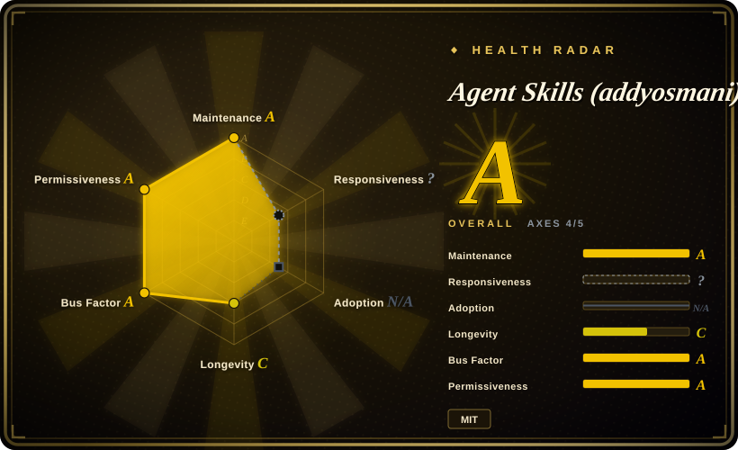
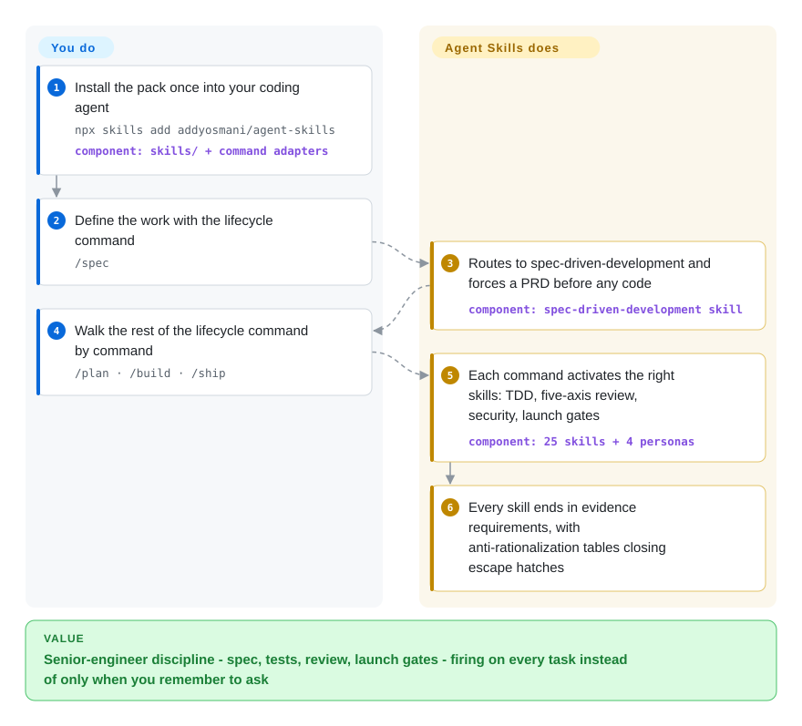

# Agent Skills (addyosmani)

Your coding agent ships 500-line untested diffs, rubber-stamps its own review, and "optimizes" performance without opening DevTools. This pack installs the senior-engineer playbook — spec, TDD, five-axis review, launch gates — into the agent as 25 skills, reached through 9 lifecycle slash commands from `/spec` to `/ship`.

## When to use

You're an engineer running an AI coding agent (Claude Code, Cursor, Antigravity, Gemini CLI, Windsurf, Copilot, OpenCode, Codex, Kiro…) on a real codebase, and the agent's *engineering hygiene* is the weak link: it ships 500-line diffs with no tests, "optimizes" performance without ever opening DevTools, rubber-stamps its own code review, and skips the security and migration steps a human reviewer would insist on. You don't want a generic "be a good engineer" prompt — you want the actual senior-engineer playbook: test pyramid and red-green-refactor, OWASP-style hardening, Core Web Vitals and bundle profiling, contract-first API design, ADRs, observability, safe deprecation/migration, and small-change discipline drawn from *Software Engineering at Google* (≈100-line changes, trunk-based, anti-rationalization tables).

You reach for this pack when you want that engineering discipline to fire on demand rather than only when you remember to ask. Install it once — via the open skills CLI (`npx skills add addyosmani/agent-skills`) or your agent's native plugin mechanism — and the 25 skills surface through 9 slash commands mapped to the SDLC: Define (`/spec`, plus `interview-me` and `constraint-driven-development`), Plan/Build (`/plan`, `/build`, `test-driven-development`, `frontend-ui-engineering`, `api-and-interface-design`), Verify (`/test`, `browser-testing-with-devtools`, `debugging-and-error-recovery`), Review (`/review`, `/code-simplify`, `security-and-hardening`, `performance-optimization`), and Ship (`/ship`, `git-workflow-and-versioning`, `ci-cd-and-automation`, `observability-and-instrumentation`), with `/webperf` and `/constraints` as dedicated entry points. It also ships 4 pre-built personas (code-reviewer, test-engineer, security-auditor, web-performance-auditor) and 7 reference checklists so the agent has concrete criteria to check against, not vibes.

## How it works

Each skill is a `SKILL.md` workflow with a fixed anatomy — overview, triggering conditions, step-by-step process, a rationalizations table (the excuses agents use to skip steps, each with a rebuttal), red flags, and verification requirements that demand actual evidence ("tests passing, build output, runtime data"; "seems right" is rejected). You install the pack once; a slash command like `/build` is a thin wrapper that activates the right skills for that lifecycle phase, and skills also auto-route from context (designing an API pulls in `api-and-interface-design`). `/build auto` takes it further — it plans from the spec and implements every task in one approved pass, still test-driven and committed per task, pausing on failures. Personas are separate reviewer roles you can invoke for a targeted pass. What stays yours: the pack cannot block anything — the gates only bind an agent that loads and follows them, so CI-enforced checks remain your job, and a single-skill `npx` install copies only that skill's directory, leaving the shared `references/` checklists behind (a known portability gap tracked upstream).

<!-- flow-steps:begin (generated from flows/addyosmani-agent-skills.json by tools/flow_card.py — do not edit) -->

Text version of the flow

1. **You**: Install the pack once into your coding agent — `npx skills add addyosmani/agent-skills` — component: `skills/ + command adapters`
2. **You**: Define the work with the lifecycle command — `/spec`
3. **Agent Skills (addyosmani)**: Routes to spec-driven-development and forces a PRD before any code — component: `spec-driven-development skill`
4. **You**: Walk the rest of the lifecycle command by command — `/plan · /build · /ship`
5. **Agent Skills (addyosmani)**: Each command activates the right skills: TDD, five-axis review, security, launch gates — component: `25 skills + 4 personas`
6. **Agent Skills (addyosmani)**: Every skill ends in evidence requirements, with anti-rationalization tables closing escape hatches

**Value**: Senior-engineer discipline - spec, tests, review, launch gates - firing on every task instead of only when you remember to ask

<!-- flow-steps:end -->

## When NOT to use

- **You already run a methodology skill pack.** This overlaps heavily with broader SDLC packs (brainstorm → plan → TDD → verify). Stacking it on top of an existing methodology layer invites conflicting "mandatory" instructions and double-routing on the same lifecycle stages — pick one source of truth.
- **You want a runtime/CLI/library.** There is nothing to `import` or run standalone — it's markdown skills + slash commands + per-platform config. Outside a supporting agent harness it does nothing.
- **Your agent has no skill/plugin loader.** It activates through each platform's native skill-loading (marketplace, `agy plugin install`, `gemini skills install`, rules files). On a bespoke or unsupported agent there's no loader to fire the skills, and the markdown won't auto-apply.
- **Enforcement must be hard-gated.** The quality gates live in prompt/markdown; they *advise* the agent, they don't block a merge. The agent can still skip a step or rationalize around it — if you need CI-enforced gates, wire real tooling (linters, test gates, CI) instead. [推断]
- **Throwaway scripts / non-code tasks.** The full spec→build→review→ship ceremony is overhead for a one-line script or a config tweak.
- **Small-team, fast-moving upstream.** Pre-1.0 (v0.6.x) with weekly-ish releases; skill names, routing, and slash-command mapping can shift between versions, and single-skill installs miss the shared `references/` checklists. Pin a tag if you need stability.

## Comparison

| Alternative | In index | Our verdict | Tradeoff |
|---|---|---|---|
| [web-quality-skills (addyosmani)](addyosmani-web-quality.md) | ✅ | Pick the focused sibling when the only job is web performance, accessibility, and quality auditing; this pack subsumes that theme (`/webperf`, web-performance-auditor) inside a full SDLC. | Narrow auditing depth vs. lifecycle breadth — pay for 25 skills' routing only if you actually walk the phases. |
| [scientific-agent-skills](scientific-agent-skills.md) | ✅ | Pick Scientific Agent Skills when the work is research/scientific computing engineering (experiments, data pipelines, reproducibility); pick this one for general product software. | Domain fit decides: lab-grade research workflows vs. Google-lineage production hygiene. |
| [Waza](waza.md) | ✅ | Pick Waza when you want a small set of sharp engineering habits without ceremony; pick this pack when you want the explicit define→plan→build→verify→review→ship spine. | Lightweight heuristics vs. a heavyweight, gated SDLC; more structure also means more to override. |
| [vercel-labs/agent-skills](vercel-agent-skills.md) | ✅ | Pick Vercel Agent Skills when your stack is React/Vercel and vendor-curated rules beat generic process; pick this one for stack-agnostic lifecycle discipline. | Vendor-scoped curation (fresh for their platform, narrow elsewhere) vs. vendor-neutral breadth. |
| [Superpowers](../../agent-dev-methodology/coding-agent-harnesses/superpowers.md) | ✅ | Pick Superpowers when brainstorm→plan→TDD→verify methodology with subagent orchestration is the center of gravity; pick this pack when you want concrete per-phase practice skills (review axes, OWASP, Core Web Vitals, launch checklists). | The upstream itself publishes a side-by-side (docs/comparison.md): methodology spine vs. practice-area breadth — overlapping goal, different shape. |
| Each agent's built-in skills / slash commands | 未收录 | Pick native skills when prototype speed matters and a gated lifecycle would be friction; this pack exists because native agents skip specs, tests, and review discipline by default. | The platform's own skill ecosystem, zero extra moving parts, vs. a third-party bundle that can duplicate or conflict with it. |

## Health & viability

- **Responsiveness**: Cannot be scored — type_na.
- **Maintenance (2026-09):** very active — pushed 2026-09-26, same day as release 0.6.11; releases land roughly weekly through the v0.6.x line. Versioned, but still pre-1.0, so routing and slash-command mapping can shift between bumps.
- **Governance & bus factor:** `User` repo fronted by Addy Osmani with two named collaborators (Federico Bartoli, Joan León) in the README Team section — better than a lone maintainer, but the roadmap and reputation still concentrate on one person; no org/foundation backing. ~99k stars.
- **Age & Lindy:** created 2026-02, so about 7 months old as of 2026-09 — young and star-hyped; unproven on Lindy. The author's standing is the main signal, not this repo's track record.
- **Risk flags:** advisory-only "quality gates" (prompt/markdown, not a merge/CI block) + pre-1.0 churn + a known single-skill-install portability gap (shared `references/` not copied, upstream issue #361) ⇒ pin a tag for stable routing. [推断]

## Caveats (unverified)

- [未验证] Latest release 0.6.11 (published 2026-09-26) with the repo last pushed 2026-09-26; license MIT and primary language JavaScript per GitHub metadata as of 2026-09-27 — re-verify before relying on a specific version's behavior.
- [未验证] Star count (~99.4k per GitHub on 2026-09-27) is unreliable and date-sensitive; treat as indicative only, not as a quality signal.
- [未验证] Skill inventory (25 skills = 24 lifecycle + the `using-agent-skills` meta-skill), the lifecycle grouping (Define/Plan/Build/Verify/Review/Ship/Meta) and the 9 slash commands are read from the README on 2026-09-27; the actual `skills/` directory and command set change release-to-release — inspect the current repo rather than trusting this list.
- [未验证] The supported-harness list (Claude Code, Antigravity, Gemini CLI, Cursor, Windsurf, GitHub Copilot, OpenCode, Codex, Command Code, Kiro, plus "70+ agents" via the vercel-labs skills CLI) and the per-platform install commands are from the README; activation fidelity varies per harness and is not independently confirmed here.
- [推断] Because behavior lives in prompt/markdown skills loaded by the agent, "quality gates" are advisory — the agent can deviate; they are prompt-level instructions, not hard guarantees.
- [推断] Provenance claims (practices drawn from *Software Engineering at Google*, Google's engineering-practices guide, OWASP, Core Web Vitals) are README framing for the skill content, not verified citations of those sources here.
