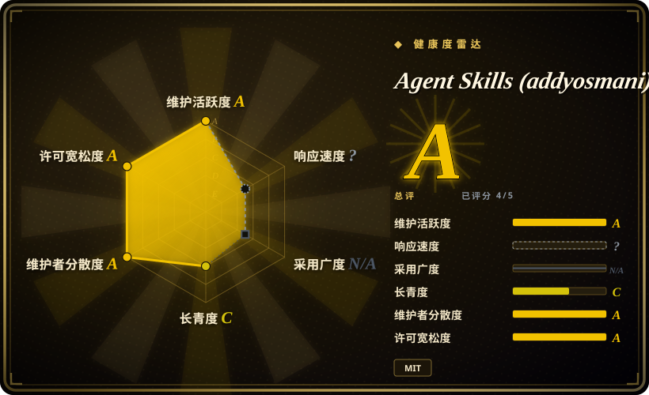
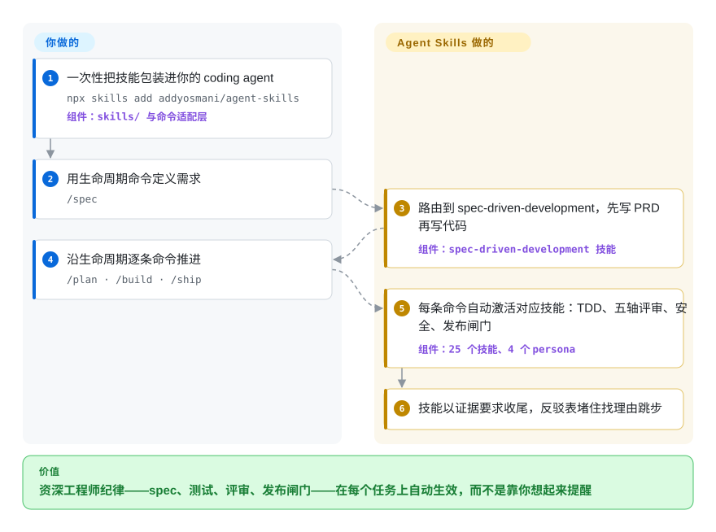

# Agent Skills (addyosmani)

你的 coding agent 一口气提交 500 行无测试的 diff，给自己的 review 盖章，不打开 DevTools 就“优化”性能。这个包把资深工程师手册——spec、TDD、五轴评审、发布闸门——以 25 个技能装进 agent，经由 9 个从 `/spec` 到 `/ship` 的生命周期斜杠命令触达。

## 何时使用

你是一名工程师，在真实代码库上跑 AI coding agent（Claude Code、Cursor、Antigravity、Gemini CLI、Windsurf、Copilot、OpenCode、Codex、Kiro……)，而 agent 的*工程素养*正是短板：它一口气提交 500 行无测试的 diff，不打开 DevTools 就“优化”性能，给自己的代码做橡皮图章式 review，跳过人类 reviewer 会坚持的安全和迁移步骤。你要的不是一句泛泛的“做个好工程师”提示词，而是真正的资深工程师手册：测试金字塔与红-绿-重构、OWASP 式加固、Core Web Vitals 与打包体积剖析、契约优先的 API 设计、ADR、可观测性、安全的弃用/迁移，以及取自《Software Engineering at Google》的小改动纪律（约 100 行的变更、trunk-based、anti-rationalization 表）。

当你希望这套工程纪律按需触发——而不是只在你想起来时才提醒 agent——就用它。装一次即可：通过开放 skills CLI（`npx skills add addyosmani/agent-skills`）或你 agent 的原生插件机制。25 个技能经由 9 个映射到 SDLC 的斜杠命令暴露出来：Define（`/spec`，另有 `interview-me`、`constraint-driven-development`）、Plan/Build（`/plan`、`/build`、`test-driven-development`、`frontend-ui-engineering`、`api-and-interface-design`）、Verify（`/test`、`browser-testing-with-devtools`、`debugging-and-error-recovery`）、Review（`/review`、`/code-simplify`、`security-and-hardening`、`performance-optimization`）、Ship（`/ship`、`git-workflow-and-versioning`、`ci-cd-and-automation`、`observability-and-instrumentation`），另有 `/webperf` 与 `/constraints` 两个专用入口。它还附带 4 个预置 persona（code-reviewer、test-engineer、security-auditor、web-performance-auditor）和 7 份参考清单，让 agent 对照具体标准检查，而不是凭感觉。

## 怎么用起来

每个技能都是结构固定的 `SKILL.md` 工作流：概述、触发条件、分步过程、rationalizations 表（agent 用来跳步的借口逐条配反驳）、red flags，以及要求真实证据的验证环节——“测试通过、构建输出、运行时数据”，“看起来没问题”不被接受。你一次性装好整个包；像 `/build` 这样的斜杠命令是薄封装，激活该生命周期阶段对应的技能，技能也会按上下文自动路由（设计 API 就拉起 `api-and-interface-design`）。`/build auto` 走得更远——从 spec 生成计划并在一次批准内实现全部任务，仍然逐任务 TDD、逐任务提交，遇失败或高风险步骤会暂停。persona 是可单独召唤的专职评审角色。仍然归你管的：这个包拦不住任何东西——闸门只约束愿意加载并遵循它的 agent，CI 级强制仍要靠你自己；而且用 `npx` 单装某个技能时只复制该技能目录，仓库级共享 `references/` 清单不会跟着走（上游 issue #361 记录的移植缺口）。

<!-- flow-steps:begin (generated from flows/addyosmani-agent-skills.json by tools/flow_card.py — do not edit) -->

流程文字版

1. **你**：一次性把技能包装进你的 coding agent — `npx skills add addyosmani/agent-skills` — 组件：`skills/ 与命令适配层`
2. **你**：用生命周期命令定义需求 — `/spec`
3. **Agent Skills (addyosmani)**：路由到 spec-driven-development，先写 PRD 再写代码 — 组件：`spec-driven-development 技能`
4. **你**：沿生命周期逐条命令推进 — `/plan · /build · /ship`
5. **Agent Skills (addyosmani)**：每条命令自动激活对应技能：TDD、五轴评审、安全、发布闸门 — 组件：`25 个技能、4 个 persona`
6. **Agent Skills (addyosmani)**：技能以证据要求收尾，反驳表堵住找理由跳步

**价值**：资深工程师纪律——spec、测试、评审、发布闸门——在每个任务上自动生效，而不是靠你想起来提醒

<!-- flow-steps:end -->

## 何时不用

- **你已经在用一套方法论技能包。** 它与更宽泛的 SDLC 包（brainstorm → plan → TDD → verify）高度重叠。叠在已有的方法论层之上，会在同样的生命周期阶段产生互相冲突的“强制”指令和双重路由——只保留一个事实源。
- **你想要的是可运行的 runtime/CLI/库。** 这里没有任何东西可以 `import` 或独立运行——它是 markdown 技能 + 斜杠命令 + 各平台配置。脱离支持它的 agent harness，它什么都不做。
- **你的 agent 没有技能/插件加载器。** 它依赖各平台的原生技能加载机制（marketplace、`agy plugin install`、`gemini skills install`、rules 文件）激活。在自研或不受支持的 agent 上没有加载器去触发技能，markdown 也不会自动生效。
- **你需要硬性闸门强制执行。** 质量闸门住在 prompt/markdown 里，只能*建议* agent，并不会拦截合并。agent 仍可能跳步或为自己找理由——需要 CI 级强制时，请接入真实工具链（linter、测试闸门、CI）。[推断]
- **一次性脚本 / 非代码任务。** 对于一行脚本或改个配置，完整的 spec→build→review→ship 流程是额外负担。
- **小团队维护、上游迭代快。** 仍处 1.0 之前（v0.6.x），发版近乎每周；技能名称、路由和斜杠命令映射可能在版本间变动，且单技能安装会缺失共享 `references/` 清单。需要稳定就锁定某个 tag。

## 横向对比

| 替代品 | 是否收录 | 我们的评价 | 取舍 |
|---|---|---|---|
| [web-quality-skills (addyosmani)](addyosmani-web-quality.zh.md) | ✅ | 只做 web 性能、无障碍与质量审计时，选这个更聚焦的姊妹包；本包已把该主题（`/webperf`、web-performance-auditor）收进完整 SDLC。 | 聚焦的审计深度 vs 全生命周期广度——只有你真的逐阶段走，才值回 25 个技能的路由成本。 |
| [scientific-agent-skills](scientific-agent-skills.zh.md) | ✅ | 工作是科研/科学计算工程（实验、数据管线、可复现性）时选 Scientific Agent Skills；通用产品软件选本包。 | 领域匹配决定一切：实验室级科研工作流 vs 谷歌系生产工程纪律。 |
| [Waza](waza.zh.md) | ✅ | 想要一组短小锐利的工程习惯、不要仪式感时选 Waza；要明确的 define→plan→build→verify→review→ship 主脊时选本包。 | 轻量启发式 vs 重型带闸门 SDLC；结构更多也意味着更多要绕的东西。 |
| [vercel-labs/agent-skills](vercel-agent-skills.zh.md) | ✅ | 你的栈就是 React/Vercel、厂商精选规则胜过通用流程时选 Vercel Agent Skills；要技术栈中立的生命周期纪律选本包。 | 厂商范围精选（自家平台常新、其余窄）vs 厂商中立广度。 |
| [Superpowers](../../agent-dev-methodology/coding-agent-harnesses/superpowers.zh.md) | ✅ | 重心是 brainstorm→plan→TDD→verify 方法论加 subagent 编排时选 Superpowers；要各阶段的具体实践技能（评审五轴、OWASP、Core Web Vitals、发布清单）时选本包。 | 上游自己发布了并列对比（docs/comparison.md）：方法论主脊 vs 实践域广度——目标重叠、形状不同。 |
| 各 agent 内置技能 / 斜杠命令 | 未收录 | 做一次性原型、带闸门的生命周期纯属摩擦时选内置技能；本包的存在理由正是原生 agent 默认会跳过 spec、测试与评审纪律。 | 平台自带、零额外部件的技能生态 vs 可能与原生重复冲突的第三方 bundle。 |

## 健康度与可持续性

- **响应速度**：无法计算——type_na。
- **维护（2026-09）：** 高度活跃——2026-09-26 push 与 release 0.6.11 同天；v0.6.x 线近乎每周发版。有版本号，但仍是 1.0 之前，路由与斜杠命令映射可能随升级变动。
- **治理与 bus factor：** `User` 仓库由 Addy Osmani 出面，README Team 一节列有两位具名协作者（Federico Bartoli、Joan León）——比孤身维护者好，但路线图与声誉仍集中于一个人；没有组织或 foundation 背书。约 99k stars。
- **年龄与 Lindy：** 创建于 2026-02，截至 2026-09 约 7 个月——年轻且被 star 炒热；Lindy 维度未经检验。主要信号是作者声望，而非这个仓库的过往记录。
- **风险标记：** 「质量闸门」仅建议性（prompt/markdown，不会拦截 merge 或 CI）＋1.0 前频繁变动＋已知的单技能安装移植缺口（共享 `references/` 不会被复制，上游 issue #361）⇒ 想要稳定路由就锁定一个 tag。[推断]

## 存疑（未验证）

- [未验证] 最新 release 为 0.6.11（2026-09-26 发布），仓库最后 push 于 2026-09-26；license 为 MIT、主语言为 JavaScript，依据 2026-09-27 的 GitHub 元数据——依赖某个具体版本行为前请重新核实。
- [未验证] star 数（GitHub 2026-09-27 约 99.4k）不可靠且对日期敏感；仅作参考，不作质量信号。
- [未验证] 技能清单（25 个技能 = 24 个生命周期技能 + `using-agent-skills` 元技能）、生命周期分组（Define/Plan/Build/Verify/Review/Ship/Meta）与 9 个斜杠命令，均于 2026-09-27 从 README 读取；实际 `skills/` 目录与命令集随版本变动——请查看当前仓库而非依赖本清单。
- [未验证] 受支持 harness 列表（Claude Code、Antigravity、Gemini CLI、Cursor、Windsurf、GitHub Copilot、OpenCode、Codex、Command Code、Kiro，以及经 vercel-labs skills CLI 的「70+ agents」）及各平台安装命令均来自 README；各 harness 的激活保真度不一，此处未独立确认。
- [推断] 由于行为住在 agent 加载的 prompt/markdown 技能里，所谓「质量闸门」是建议性的——agent 可偏离；它们是 prompt 级指令，不是硬保证。
- [推断] 出处声明（实践取自《Software Engineering at Google》、谷歌工程实践指南、OWASP、Core Web Vitals）是 README 对技能内容的措辞框定，此处未核实为对这些来源的真实引用。
