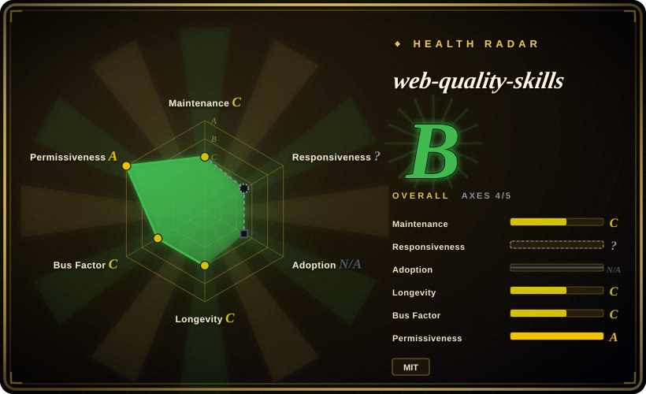
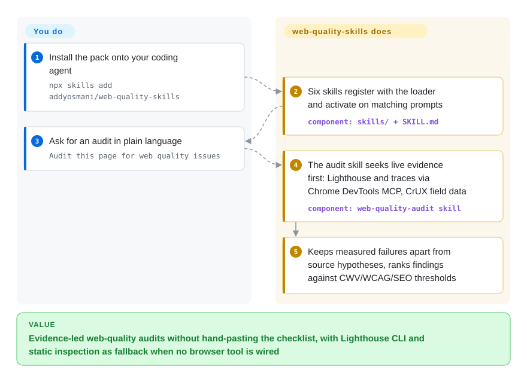

# web-quality-skills

You ask a coding agent to "fix our Lighthouse score" and it recites generic advice, because nobody pasted it the checklist. This pack ships the web-quality rules — Core Web Vitals, WCAG 2.2, SEO, best practices — as six agent skills the agent loads on demand, and since the 2026-08 redesign it sends the agent after live evidence (Lighthouse / Chrome DevTools MCP, CrUX field data) before touching your code.

## When to use

You're a frontend or full-stack developer working in Claude Code (or Codex / Gemini CLI) on a web app, and someone asks you to "make the site faster" or "fix our Lighthouse score." You know roughly what matters — LCP under 2.5s, INP under 200ms, CLS under 0.1, alt text, `font-display: swap`, structured data — but spelling all of that out to the agent every time is tedious, and the agent tends to give generic advice untethered from current tooling guidance (Lighthouse itself reorganized performance into Insight Audits in late 2025, so even your mental model drifts). You want the agent to already *know* the checklist, apply it to your actual code, and back its findings with real measurements where it can.

You install this pack (`npx skills add addyosmani/web-quality-skills` or `npx add-skill addyosmani/web-quality-skills`, via the Claude Code / Codex plugin marketplace, as a Gemini CLI extension, or by copying `skills/*` into `~/.claude/skills/`) and it adds six skills — `web-quality-audit`, `performance`, `core-web-vitals`, `accessibility`, `seo`, `best-practices` — that activate when your request matches their description. Ask "Audit this page for web quality issues" and the audit skill seeks live evidence first — Lighthouse audits and performance traces via Chrome DevTools MCP, CrUX field data for real-user context — keeps measured failures separate from source-code hypotheses, and proposes fixes ranked against the thresholds; without a browser hookup it falls back to Lighthouse CLI, PageSpeed Insights, and static inspection (the `web-quality-audit` skill still ships a read-only `analyze.sh` that greps HTML for missing doctype/viewport/lang/alt). It's the curated knowledge you'd otherwise paste in by hand, packaged so the agent pulls it in just-in-time.

## How it works

The pack is documentation plus one thin script: each skill is a `SKILL.md` instruction file your agent's skill loader discovers, and a trigger description decides when the agent pulls it in. Since v2.0.0 (2026-08) the performance skills are *measurement-first*: they keep four evidence types explicit — CrUX field data (how real Chrome users experienced the URL), first-party RUM, one controlled DevTools trace or Lighthouse lab run, and static source inspection — and the orchestrating `web-quality-audit` skill prefers live evidence when the page can run, driving Chrome DevTools MCP tools like `lighthouse_audit` and `performance_start_trace` when your agent exposes them. What the pack does *not* do: it ships no runner of its own — the meter is Chrome DevTools MCP / Lighthouse CLI that the skill tells your agent to use — and it never edits or merges anything. Provisioning the browser hookup, CI wiring, and judging which proposed fixes to accept all stay yours.

<!-- flow-steps:begin (generated from flows/addyosmani-web-quality.json by tools/flow_card.py — do not edit) -->

Text version of the flow

1. **You**: Install the pack onto your coding agent — `npx skills add addyosmani/web-quality-skills`
2. **web-quality-skills**: Six skills register with the loader and activate on matching prompts — component: `skills/ + SKILL.md`
3. **You**: Ask for an audit in plain language — `Audit this page for web quality issues`
4. **web-quality-skills**: The audit skill seeks live evidence first: Lighthouse and traces via Chrome DevTools MCP, CrUX field data — component: `web-quality-audit skill`
5. **web-quality-skills**: Keeps measured failures apart from source hypotheses, ranks findings against CWV/WCAG/SEO thresholds

**Value**: Evidence-led web-quality audits without hand-pasting the checklist, with Lighthouse CLI and static inspection as fallback when no browser tool is wired

<!-- flow-steps:end -->

## When NOT to use

- **You already run a frontend-quality skill/command system you trust.** This pack is opinionated and will route on prompts like "audit my site"; layering it over your own UI/perf skills (e.g. an internal `fe-audit`) risks double-routing and conflicting recommendations. Pick one source of truth.
- **You're not on a supported harness.** Activation depends on a skill loader — Claude Code, Codex, Gemini CLI, or other Agent Skills hosts per the README. On a bespoke or unsupported agent there's nothing to fire the `SKILL.md` files, and the markdown alone won't auto-apply.
- **You expect the pack itself to measure or gate.** It has no runner: live audits happen only because the skill instructs your agent to call Chrome DevTools MCP / Lighthouse CLI, and nothing here blocks a build. For numeric budgets in CI you still need Lighthouse CI or WebPageTest.
- **Guidance can still drift from upstream Lighthouse.** v2.0.0 realigned the skills with Performance Insights and the DevTools-for-agents flow, but they remain a dated snapshot of audit names and thresholds, not a live feed. Re-verify against current Lighthouse output. [推断]
- **Maintenance is single-author and lightly versioned.** It's a personal repo (Addy Osmani) whose `plugin.json` says v2.0.0 but has no tagged GitHub releases; treat it as best-effort, not a supported product. [推断]

## Comparison

| Alternative | In index | Our verdict | Tradeoff |
|---|---|---|---|
| [Agent Skills (addyosmani)](addyosmani-agent-skills.md) | ✅ | Pick the broader Addy Osmani pack when you need general engineering coverage in addition to web quality. | Same author's broader, general-purpose agent-skills pack; this one is the narrow web-quality vertical. Use both if you want general + web-quality coverage, but watch for routing overlap. |
| [Scientific Agent Skills](scientific-agent-skills.md) | ✅ | Pick Scientific Agent Skills when the problem is scientific or research engineering, not web quality. | Sibling skill-pack for scientific/eng workflows, not web quality — complementary, different domain. |
| [Waza](waza.md) | ✅ | Pick Waza when you need general engineering-habits coverage (planning, debugging, code review discipline) rather than a web-quality checker. | Another engineering skill collection in this leaf; Waza spans the whole dev lifecycle but encodes no Lighthouse/CWV rule set — pick by whether your pain is process or page quality. |
| [Vercel Agent Skills](vercel-agent-skills.md) | ✅ | Pick Vercel Agent Skills when deploy and Next.js/Vercel platform rules matter. | Vercel's agent-skills set, deploy/Next.js-leaning; overlaps on web perf but framed around their platform. |
| Lighthouse CI / WebPageTest | 未收录 | Pick measurement tools when you need real metrics, CI budgets, and build-blocking gates. | Real measurement + CI gating tools (not skill packs). Use these when you need numbers and build-blocking budgets; this pack is the advisory layer that interprets and fixes, not the meter. |
| Pasting the rules into context yourself | n/a | Pick manual prompting only when zero install and full control outweigh stale checklist risk. | Zero install, full control, but tedious and goes stale; the pack's whole value is packaging the checklist for just-in-time loading. |

## Health & viability

- **Responsiveness**: Cannot be scored — type_na.
- **Maintenance (2026-09):** active — last commit to `main` 2026-08-24, not archived; a substantial measurement-first redesign landed mid-2026 (`plugin.json` v2.0.0), but there are still no tagged GitHub releases, so versioning is light and best-effort, not a supported product.
- **Governance & bus factor:** single-author `User` repo (Addy Osmani); ~2.8k stars as of 2026-09, so adoption is modest and the whole thing rests on one maintainer's time — no foundation/vendor backing.
- **Age & Lindy:** created 2026-01, so ~8 months old as of 2026-09 — young; unproven on Lindy. Unlike the author's larger pack, it doesn't carry star-hype to lean on either.
- **Risk flags:** advisory-only at heart (it drives real tools but encodes a point-in-time snapshot of audit names/thresholds); Lighthouse's move to Performance Insight Audits shows how fast the ground moves under it — re-verify against current Lighthouse. [推断]

## Caveats (unverified)

- [未验证] GitHub metadata as of 2026-09-27: license MIT (LICENSE file present at repo root), primary language Shell, last push 2026-08-24, not archived, `releases/latest` 404 and `tags` empty (no tagged GitHub release) though `.claude-plugin/plugin.json` declares version 2.0.0 — re-verify before relying on a specific version's behavior.
- [未验证] Star count (~2.8k per GitHub on 2026-09-27) is unreliable and date-sensitive; treat as indicative only, not a quality signal.
- [未验证] Skill inventory is six skills (`web-quality-audit`, `performance`, `core-web-vitals`, `accessibility`, `seo`, `best-practices`) with `analyze.sh` only under `web-quality-audit/scripts` (confirmed against the repo tree on 2026-09-27); counts and contents change upstream — inspect the current `skills/` directory rather than trusting this list.
- [未验证] Supported harnesses (`npx skills add` / `npx add-skill`, Claude Code plugin marketplace, Codex marketplace, Gemini CLI extension, claude.ai manual paste) are from the project README; activation fidelity per harness is not independently confirmed here.
- [推断] Because behavior lives in prompt/markdown skills loaded by the agent, enforcement is advisory — the agent can deviate and recommendations are not a substitute for a real Lighthouse/RUM measurement.
- [推断] The encoded Lighthouse audit names and Core Web Vitals thresholds (v2.0.0, 2026-08 snapshot) still reflect a point-in-time state; further upstream Lighthouse changes will drift them again.
