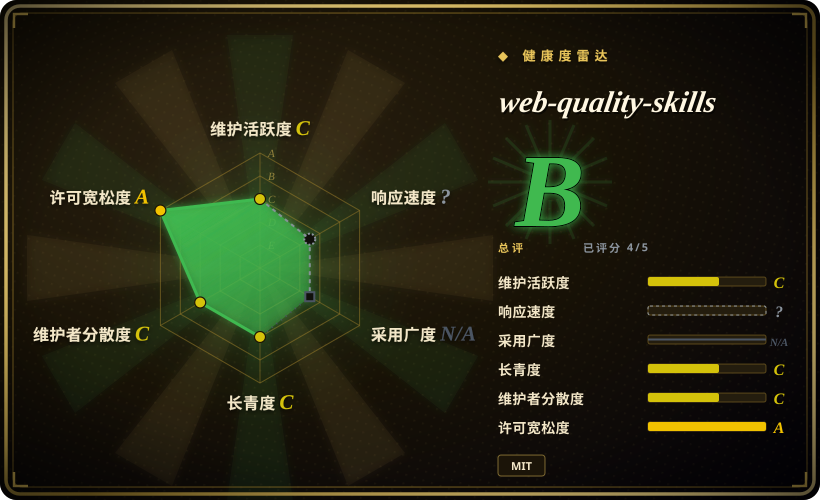
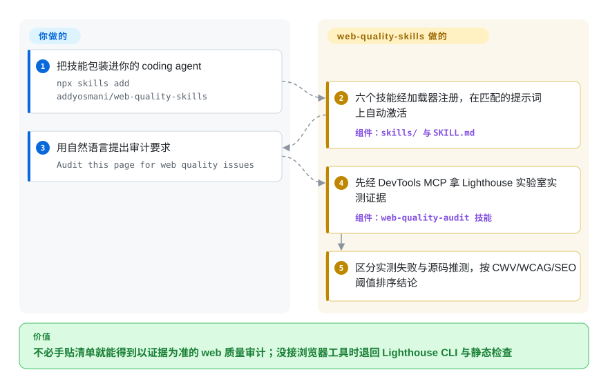

# web-quality-skills

你让 coding agent「把 Lighthouse 分数修一修」，它只会背泛泛的通用建议，因为你没把检查清单喂给它。这个包把 web 质量规则——Core Web Vitals、WCAG 2.2、SEO、最佳实践——做成六个按需加载的 agent 技能；2026-08 改版后，它会先驱动 agent 去拿实时证据（Lighthouse / Chrome DevTools MCP、CrUX 真实用户数据），再动你的代码。

## 何时使用

你是一名前端或全栈开发者，在 Claude Code（或 Codex / Gemini CLI）里做一个 web 应用，有人让你「把站点提速」或「修一下 Lighthouse 分数」。你大概知道哪些指标要紧——LCP 低于 2.5s、INP 低于 200ms、CLS 低于 0.1、alt 文本、`font-display: swap`、结构化数据——但每次都把这些讲给 agent 听很烦，而且 agent 往往只给泛泛建议，也接不上当前工具链的口径（Lighthouse 自己在 2025 年末就把性能审计重组为 Performance Insight Audits，连你脑子里的那份清单都在过期）。你希望 agent 本身就「知道」这份清单，把它应用到真实代码上，并且能在有实测数据时以实测为准。

你装上这个包（`npx skills add addyosmani/web-quality-skills` 或 `npx add-skill addyosmani/web-quality-skills`，或经 Claude Code / Codex 插件市场、Gemini CLI extension，或直接 `cp -r skills/* ~/.claude/skills/`），它会加入六个技能——`web-quality-audit`、`performance`、`core-web-vitals`、`accessibility`、`seo`、`best-practices`——当你的请求匹配技能描述时自动触发。说「Audit this page for web quality issues」，审计技能会先找实时证据——经 Chrome DevTools MCP 跑 Lighthouse 审计与性能 trace，有 CrUX 真实用户数据时一并参照——把实测失败和源码推测分开，再按阈值给出排序后的修复；接不上浏览器时退回 Lighthouse CLI、PageSpeed Insights 与静态检查（`web-quality-audit` 技能仍带一个只读的 `analyze.sh`，grep HTML 是否缺 doctype/viewport/lang/alt）。它就是你本来要手动粘贴进上下文的那份知识，打包成 agent 能即时调用的形式。

## 怎么用起来

这个包的实体是文档加一支轻脚本：每个技能是一份 `SKILL.md` 指令文件，由 agent 的技能加载器发现，触发描述决定 agent 何时把它拉进上下文。v2.0.0（2026-08）起性能技能转向「测量优先」：明确区分四类证据——CrUX 现场数据（真实 Chrome 用户过去一段时间访问该 URL 的体验）、第一方 RUM、一次受控的 DevTools trace 或 Lighthouse 实验室运行、静态源码检查——总控的 `web-quality-audit` 技能在页面能运行时优先拿实时证据，agent 暴露了 `lighthouse_audit`、`performance_start_trace` 这类 Chrome DevTools MCP 工具就去调它们。这个包不做的：它自己不带任何测量器——所谓实测，是技能指挥你的 agent 去用 Chrome DevTools MCP / Lighthouse CLI——也从不替你改代码或合并。接好浏览器工具（或接受 Lighthouse CLI 兜底）、CI 接线、以及对 agent 提出的修复做取舍，全都还是你的事。

<!-- flow-steps:begin (generated from flows/addyosmani-web-quality.json by tools/flow_card.py — do not edit) -->

流程文字版

1. **你**：把技能包装进你的 coding agent — `npx skills add addyosmani/web-quality-skills`
2. **web-quality-skills**：六个技能经加载器注册，在匹配的提示词上自动激活 — 组件：`skills/ 与 SKILL.md`
3. **你**：用自然语言提出审计要求 — `Audit this page for web quality issues`
4. **web-quality-skills**：先经 DevTools MCP 拿 Lighthouse 实验室实测证据 — 组件：`web-quality-audit 技能`
5. **web-quality-skills**：区分实测失败与源码推测，按 CWV/WCAG/SEO 阈值排序结论

**价值**：不必手贴清单就能得到以证据为准的 web 质量审计；没接浏览器工具时退回 Lighthouse CLI 与静态检查

<!-- flow-steps:end -->

## 何时不用

- **你已有一套信任的前端质量技能 / 命令体系。** 这个包很有主见，会在「audit my site」这类提示上抢路由；把它叠在你自己的 UI/性能技能（比如内部 `fe-audit`）之上，会造成双重路由和相互冲突的建议。选一个单一事实源。
- **你不在受支持的 harness 上。** 触发依赖技能加载器——据 README 为 Claude Code、Codex、Gemini CLI 及其他 Agent Skills 宿主。在自研或不受支持的 agent 上没有东西去点燃这些 `SKILL.md`，光有 markdown 不会自动生效。
- **你指望这个包自己测量或卡门。** 它没有自带运行器：所谓实时审计，只是技能指挥你的 agent 去调 Chrome DevTools MCP / Lighthouse CLI，且没有任何东西会拦下构建。要在 CI 里跑数值预算，仍需 Lighthouse CI 或 WebPageTest。
- **指引仍可能与上游 Lighthouse 漂移。** v2.0.0 已把技能对齐到 Performance Insights 与 DevTools-for-agents 流程，但它们本质仍是某一时刻审计名与阈值的快照，不是实时馈送。请对照当前 Lighthouse 输出复核。[推断]
- **维护是单作者、版本标注很轻。** 这是个人仓库（Addy Osmani），`plugin.json` 标到 v2.0.0 但始终没有 GitHub tagged release；当成尽力而为的项目，而非有支持承诺的产品。[推断]

## 横向对比

| 替代品 | 是否收录 | 我们的评价 | 取舍 |
|---|---|---|---|
| [Agent Skills (addyosmani)](addyosmani-agent-skills.zh.md) | ✅ | 需要通用工程覆盖、而不只是 web 质量时，选 Addy Osmani 的大包。 | 同作者更宽的通用 agent-skills 包；本包是窄的 web 质量垂类。想要通用 + web 质量都覆盖可两个都装，但留意路由重叠。 |
| [Scientific Agent Skills](scientific-agent-skills.zh.md) | ✅ | 问题是科研或研究工程、不是 web 质量时，选 Scientific Agent Skills。 | 面向科研 / 工程工作流的姊妹技能包，与 web 质量无关——互补，不同领域。 |
| [Waza](waza.zh.md) | ✅ | 需要通用工程习惯覆盖（规划、调试、发版前 review 纪律）、而不是 web 质量检查器时，选 Waza。 | 本 leaf 下另一个工程技能集；Waza 覆盖整个开发周期但不含 Lighthouse/CWV 规则——按你的痛点是流程还是页面质量来选。 |
| [Vercel Agent Skills](vercel-agent-skills.zh.md) | ✅ | 部署与 Next.js/Vercel 平台规则重要时，选 Vercel Agent Skills。 | Vercel 的 agent-skills 集，偏部署 / Next.js；在 web 性能上有重叠，但围绕其平台组织。 |
| Lighthouse CI / WebPageTest | 未收录 | 需要真实指标、CI 预算和构建卡门时，选测量工具。 | 真正的测量 + CI 卡门工具（不是技能包）。需要数字和卡构建的预算时用它们；本包是解释并修复的建议层，不是仪表。 |
| 自己把规则粘进上下文 | n/a | 只有当零安装和完全可控比清单过期风险更重要时，才选手动提示。 | 零安装、完全可控，但很烦且会过期；这个包的全部价值就是把清单打包成可即时加载。 |

## 健康度与可持续性

- **响应速度**：无法计算——type_na。
- **维护（2026-09）：** 活跃——最后提交 2026-08-24 于 `main`，未归档；2026 年中做过一次「测量优先」的大改版（`plugin.json` v2.0.0），但仍没有 GitHub tagged release，版本标注很轻，属尽力而为而非有支持承诺的产品。
- **治理与 bus factor：** 单作者 `User` 仓库（Addy Osmani）；2026-09 约 2.8k stars，采用量中等，整体压在一个维护者的时间上，无 foundation 或厂商背书。
- **年龄与 Lindy：** 创建于 2026-01，截至 2026-09 约 8 个月——年轻；Lindy 维度未经检验。与作者那个更大的包不同，它也没有可倚仗的 star 热度。
- **风险标记：** 本质仍是建议性（能驱动真实工具，但编码的是某一时点的审计名与阈值快照）；Lighthouse 迁到 Performance Insight Audits 正说明地基移动有多快——请对照当前 Lighthouse 复核。[推断]

## 存疑（未验证）

- [未验证] 2026-09-27 GitHub 元数据：license MIT（仓库根有 LICENSE 文件），主语言 Shell，最后 push 于 2026-08-24，未归档，`releases/latest` 返回 404 且 `tags` 为空（无 GitHub tagged release），但 `.claude-plugin/plugin.json` 声明版本 2.0.0——依赖某个具体版本行为前请复核。
- [未验证] 星标数（2026-09-27 GitHub 约 2.8k）不可靠且对日期敏感；仅作参考，不作为质量信号。
- [未验证] 技能清单为六个（`web-quality-audit`、`performance`、`core-web-vitals`、`accessibility`、`seo`、`best-practices`），`analyze.sh` 仅在 `web-quality-audit/scripts` 下（2026-09-27 对照仓库树确认）；数量与内容上游会变——请查当前 `skills/` 目录而非依赖此列表。
- [未验证] 受支持的 harness（`npx skills add` / `npx add-skill`、Claude Code 插件市场、Codex 市场、Gemini CLI extension、claude.ai 手动粘贴）取自项目 README；各 harness 的触发保真度未在此独立确认。
- [推断] 由于行为活在被 agent 加载的 prompt/markdown 技能里，强制力是建议性的——agent 可能偏离，且这些建议不能替代真实的 Lighthouse/RUM 测量。
- [推断] 所编码的 Lighthouse 审计名与 Core Web Vitals 阈值（v2.0.0，2026-08 快照）仍是某一时点状态；上游 Lighthouse 再变动就会再次漂移。
