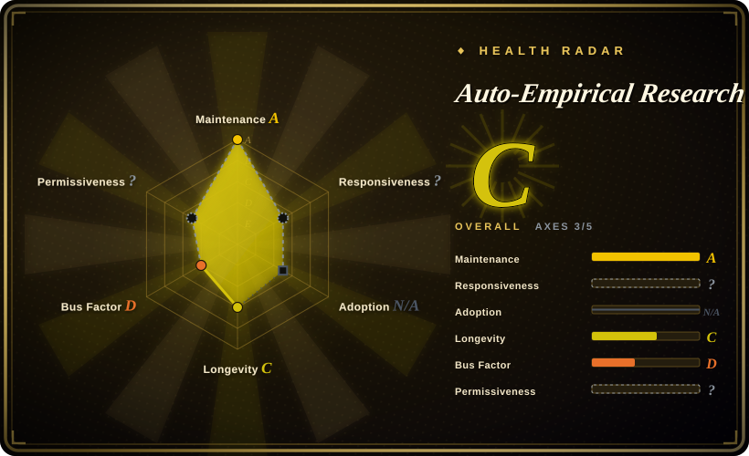
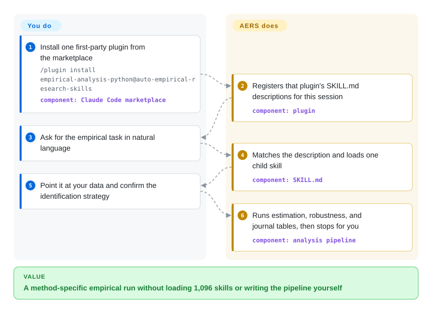

# Auto-Empirical Research Skills

You ask an agent to run a staggered difference-in-differences and it improvises a two-way fixed-effects regression a referee will reject on sight. This repo is a catalog plus a router: it points the agent at one empirical-research skill — identification, robustness, journal tables — instead of a general coding prompt.

## When to use

You are an applied economist, political scientist, or public-health empiricist driving Claude Code through a real paper. The agent can call pandas, `fixest`, or `reghdfe`, but it does not know when two-way fixed effects is the wrong estimator under staggered timing, what HonestDiD is for, or how an AER Table 1 / event-study figure is supposed to look — so it writes a textbook OLS, skips the robustness gauntlet, and you spend the next week undoing it. You want the agent to follow the conventions a methods referee would, with a skill that already names the estimator, the identifying assumption, and the tables.

Reach for this pack when the job is empirical social science, not life-science libraries and not office docs. Install one first-party plugin (`empirical-analysis-python`, `empirical-analysis-stata`, `empirical-analysis-r`, or `aer-skills`) or copy a single collection — not the whole catalog — and ask in natural language. Pick it over [Scientific Agent Skills](scientific-agent-skills.md) because that pack wraps Scanpy and RDKit, not Callaway–Sant'Anna; over [Anthropic Skills](../vendor-collections/anthropic-skills.md) because those are document/design reference skills, not identification strategies; over [ljg-skills](../personal-collections/knowledge-content/ljg-skills.md) because that pack reads and rewrites Chinese papers, it does not run a DiD. The deciding tradeoff is specialist coverage plus a router that loads one child skill, paid for with CC-BY-SA ShareAlike, mixed upstream licenses, and a CoPaper.AI commercial on-ramp.

## How it works

AERS is not one skill. The checkout vendors 76 collections and catalogs 1,096 `SKILL.md` files; a root `SKILL.md` is a router, not a request to load them all. You add the repo as a Claude Code marketplace once (`/plugin marketplace add brycewang-stanford/Auto-Empirical-Research-Skills`), then install one first-party plugin — or copy one folder that itself contains a `SKILL.md`, or import the repo root so only the router registers. The agent matches your ask against that skill's `description`, reads only that file, then follows its pipeline — clean, construct, estimate, robustness, tables. The Paper-WorkFlow collection (a git submodule) is the end-to-end orchestrator and stops at two human gates; the `empirical-analysis-*` plugins stop at publication-ready tables and figures. Do not symlink every child into `~/.claude/skills`: the install docs say that would cost about 64k tokens of descriptions at session start and make matching worse. The README's "23,000+ skills" figure is a map of the wider ecosystem, not what this repo vendors.

<!-- flow-steps:begin (generated from flows/auto-empirical-research-skills.json by tools/flow_card.py — do not edit) -->

Text version of the flow

1. **You**: Install one first-party plugin from the marketplace — `/plugin install empirical-analysis-python@auto-empirical-research-skills` — component: `Claude Code marketplace`
2. **Auto-Empirical Research Skills**: Registers that plugin's SKILL.md descriptions for this session — component: `plugin`
3. **You**: Ask for the empirical task in natural language
4. **Auto-Empirical Research Skills**: Matches the description and loads one child skill — component: `SKILL.md`
5. **You**: Point it at your data and confirm the identification strategy
6. **Auto-Empirical Research Skills**: Runs estimation, robustness, and journal tables, then stops for you — component: `analysis pipeline`

**Value**: A method-specific empirical run without loading 1,096 skills or writing the pipeline yourself

<!-- flow-steps:end -->

## When NOT to use

- **The science is biology, chemistry, or drug discovery.** Use [Scientific Agent Skills](scientific-agent-skills.md). That pack wraps scientific Python libraries and databases; this catalog's core routing is empirical social science, and its own `curation.json` ranks natural-science guides last.
- **You need official vendor knowledge-work skills (docs, decks, inbox), not identification strategy.** Use [Anthropic Knowledge Work Plugins](../vendor-collections/knowledge-work-plugins.md) or [Anthropic Skills](../vendor-collections/anthropic-skills.md). Those are first-party, Apache-2.0, and not a third-party catalog of 75 other people's repos.
- **You want Chinese paper reading, deconstruction, and rewriting, not a regression pipeline.** Use [ljg-skills](../personal-collections/knowledge-content/ljg-skills.md). AERS can polish or de-AIGC a manuscript, but its flagship path is estimation and journal tables.
- **You need a library you `import`, not prompt skills.** Use StatsPAI (`brycewang-stanford/StatsPAI`, not indexed in this batch: it is a Python library, not a skill-pack, so it is a different page type). INSTALL.md says the StatsPAI collection is mirrored and is *not* shipped as a plugin here.
- **You cannot accept ShareAlike plus unknown upstream licenses.** The repo LICENSE is CC-BY-SA-4.0. The generated license audit (2026-07-22) reports 25 collections as `UNKNOWN - check upstream` and flags AGPL, GPL, and MIT Non-Commercial among the rest. Prefer [Anthropic Skills](../vendor-collections/anthropic-skills.md) (Apache-2.0 examples) or [Scientific Agent Skills](scientific-agent-skills.md) (MIT) when redistribution terms have to be simple.
- **You only need one method.** Copy that one folder (INSTALL.md method 3) or install the upstream original. Do not install the catalog.
- **You want the hosted "skip assembly" product.** That is CoPaper.AI, a paid service (`not a repo`), not this git repository. INSTALL.md method 4 is the on-ramp.

## Comparison

| Alternative | In index | Our verdict | Tradeoff |
|---|---|---|---|
| [Scientific Agent Skills](scientific-agent-skills.md) | ✅ | When the agent must follow empirical social-science identification and journal tables, pick AERS; when it must drive Scanpy, RDKit, or scientific databases, pick Scientific Agent Skills. | Same "install a research skill pack" shape; AERS is a routed catalog of mostly vendored collections with mixed licenses, while K-Dense's pack is first-party MIT skills wrapping scientific Python libraries. |
| [Anthropic Skills](../vendor-collections/anthropic-skills.md) | ✅ | Pick Anthropic Skills for first-party document/design/MCP reference skills; pick AERS only when the task is causal identification or an empirical manuscript pipeline. | Vendor-canonical Agent Skills format and Apache-2.0 examples, but no DiD/IV/RDD playbooks; AERS has the methods and the license tangle. |
| [Anthropic Knowledge Work Plugins](../vendor-collections/knowledge-work-plugins.md) | ✅ | Pick the Anthropic knowledge-work plugins for office/comms/research summaries on Claude; pick AERS when the output must be an estimating equation plus robustness, not a one-pager. | First-party Apache-2.0 knowledge-work baseline; AERS is third-party, ShareAlike, and econometrics-shaped. |
| [ljg-skills](../personal-collections/knowledge-content/ljg-skills.md) | ✅ | Pick ljg-skills to distill or rewrite a Chinese paper for a general audience; pick AERS to run the empirical pipeline that paper would report. | ljg-skills is a small personal reading/rewriting pack; AERS is a 1,096-skill catalog whose value is estimation, not explanation. |
| StatsPAI (brycewang-stanford/StatsPAI) | 未收录 | When you want a Python API for DiD/IV/RDD/SCM/DML rather than a skill the agent reads, pick StatsPAI; pick AERS when the agent should be routed through `SKILL.md` playbooks. Deliberately skipped here: different artifact type (library vs skill-pack). | Library you import and validate in code; AERS is prompt-level guidance plus a catalog, and its StatsPAI collection is a weekly mirror, not the plugin path. |

## Health & viability

- **Responsiveness:** cannot be scored — type_na.
- **Maintenance (2026-09-27):** the scorer grades `A` — last commit 1 day old, activity in 13 of 13 weeks, `archived=false`, latest tag `v2026.07` (2026-07-02). The catalog, eval harness, and `make check` gates are real engineering, not a README-only list.
- **Governance & bus factor:** scorer `D` — 10 active maintainers in 12 months, top-1 share 90.8%, top-3 96.8%. GitHub `owner.type` is `User` (`brycewang-stanford`). README branding is "Stanford REAP × CoPaper.AI"; the repo is not under a Stanford or CoPaper GitHub org. Treat institutional backing as a README claim, not an org-owned roadmap. [推断]
- **Age & Lindy:** scorer `C` — 177 days old and still active. Too young for a Lindy prior. High stars on a young personal repo is attention, not proof it will last.
- **Adoption:** `N/A` (no install channel). 4,362 stars and 527 forks vs 11 watchers and 0 open issues (GitHub, 2026-09-24) is a hype-shaped attention signal, not measured installs. [推断]
- **Risk flags:** radar `risk_license` is `?` (`license_unparsed`) — the scorer did not grade CC-BY-SA-4.0. The file is ShareAlike. License audit 2026-07-22: 25/77 collections `UNKNOWN`, plus AGPL-3.0, GPL-3.0, CC-BY-NC-4.0, and MIT Non-Commercial. Security badge "52/52 CLEAN" is the original baseline; later collections need `make audit`, and a clean pattern scan is not a review. Routing in `catalog/curation.json` prefers first-party StatsPAI / AER-skills / Paper-WorkFlow. GitHub's primary language is Stata because of vendored do-files; the catalog tooling is Python. Overall radar `C` over 3 of 5 applicable axes.

## Caveats (unverified)

- [未验证] Skill counts drift across files: `catalog/skills.json` summary (fetched 2026-09-24) says 1,096 skills / 76 collections; INSTALL.md (same week) says 1,107 and "1,150" in one sentence. Use `catalog/skills.json` as the machine SSOT and re-count before depending on a number.
- [未验证] The README "23,000+ skills / 119 repos" figure is an ecosystem map, not vendored content. The map itself was not re-counted here.
- [未验证] Numeric benchmark (19 tasks) and eval-harness (42 scenarios / 217 rubric items, 9 with pass/fail fixtures) exist as directories and are described in README trust tables; they were not re-run here.
- [未验证] Per-harness activation (Claude Code marketplace, Codex whole-repo import, copy-into-`.claude/skills`) was read from INSTALL.md, not executed.
- [推断] "Stanford REAP × CoPaper.AI" and "built by Stanford's empirical-methodology team" are README/homepage claims on a User-owned repo; they are not the same as an institution-owned project.
- [推断] 4.3k stars / 11 watchers / 0 open issues is an attention anomaly, not measured adoption.
- [推断] Flagship skills remain advisory prompts: a clean eval on the author's fixtures does not mean the agent will recover the right causal estimate on your data.
- [未验证] The health scorer left `risk_license` unparsed for CC-BY-SA-4.0 (`license_unparsed`); ShareAlike and mixed collection licenses are from LICENSE plus `docs/LICENSE_AUDIT.md`, not from that axis.
