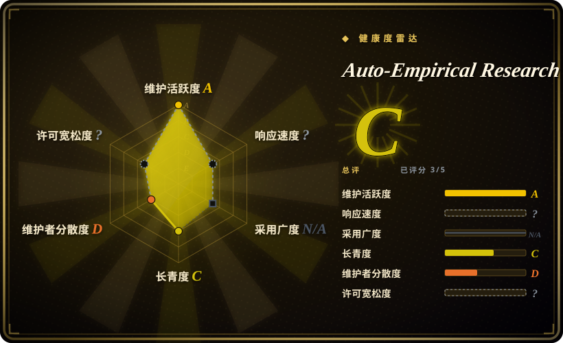
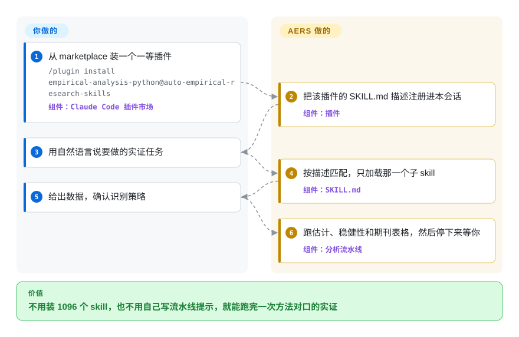

# Auto-Empirical Research Skills

你让 agent 跑交错双重差分，它随手写一个双向固定效应回归，审稿人一眼否掉。这套仓库是目录加路由器：按任务只加载一份实证研究 skill（识别策略、稳健性、期刊表格），而不是让它用写代码的通用提示硬扛。

## 何时使用

你是应用经济学家、政治学者或公共卫生实证研究者，正用 Claude Code 赶一篇真要投稿的论文。agent 会调 pandas、`fixest` 或 `reghdfe`，但不知道交错处理时双向固定效应为什么错、HonestDiD 用来干什么、AER 的 Table 1 和事件研究图该长什么样——于是它写教科书 OLS，跳过稳健性关卡，你接下来一周都在返工。你要它按方法审稿人的习惯走：估计式写清楚、识别假设点名、表格一次出齐。

只有任务是社会科学实证、不是生命科学库、也不是办公文档时，才轮到这套包。装一个一等插件（`empirical-analysis-python`、`empirical-analysis-stata`、`empirical-analysis-r` 或 `aer-skills`），或只拷一个合集——不要整库平铺——然后用自然语言下任务。选它而不是 [Scientific Agent Skills](scientific-agent-skills.zh.md)，因为那套封装的是 Scanpy 和 RDKit，不是 Callaway–Sant'Anna；选它而不是 [Anthropic Skills](../vendor-collections/agent-vendors/anthropic-skills.zh.md)，因为那是文档／设计参考 skill，不是识别策略；选它而不是 [ljg-skills](../personal-collections/knowledge-content/ljg-skills.zh.md)，因为那套是读中文论文、改写，不是跑双重差分。决定性取舍是：专科覆盖加上“只加载一个子 skill”的路由，代价是 CC-BY-SA 的传染条款、上游许可证混杂，以及 CoPaper.AI 这条商业入口。

## 怎么用起来

AERS 不是一个 skill。检出里 vendored 了 76 个合集、目录登记 1096 份 `SKILL.md`；根目录那份 `SKILL.md` 是路由器，不是让你一次读完全库。先把仓库加进 Claude Code marketplace 一次（`/plugin marketplace add brycewang-stanford/Auto-Empirical-Research-Skills`），再装一个一等插件——或拷一个自带 `SKILL.md` 的文件夹，或把仓库根目录导入、只注册路由器。agent 用你的那句话去对 skill 的 `description`，只读中的那一份，再按它的流水线走：清洗、构造、估计、稳健性、出表。Paper-WorkFlow 合集（git submodule）是端到端编排器，会在两个人工闸门停下；`empirical-analysis-*` 插件停在可投稿的表和图。不要把每个子目录都软链进 `~/.claude/skills`：安装说明写明，那样会在会话开头吃掉约 64k token 的描述，匹配反而变差。README 里的“23000+ skills”是更广生态的一张地图，不是本仓库 vendored 的数量。

<!-- flow-steps:begin (generated from flows/auto-empirical-research-skills.json by tools/flow_card.py — do not edit) -->

流程文字版

1. **你**：从 marketplace 装一个一等插件 — `/plugin install empirical-analysis-python@auto-empirical-research-skills` — 组件：`Claude Code 插件市场`
2. **Auto-Empirical Research Skills**：把该插件的 SKILL.md 描述注册进本会话 — 组件：`插件`
3. **你**：用自然语言说要做的实证任务
4. **Auto-Empirical Research Skills**：按描述匹配，只加载那一个子 skill — 组件：`SKILL.md`
5. **你**：给出数据，确认识别策略
6. **Auto-Empirical Research Skills**：跑估计、稳健性和期刊表格，然后停下来等你 — 组件：`分析流水线`

**价值**：不用装 1096 个 skill，也不用自己写流水线提示，就能跑完一次方法对口的实证

<!-- flow-steps:end -->

## 何时不用

- **科学是生物学、化学或药物发现。** 用 [Scientific Agent Skills](scientific-agent-skills.zh.md)。那套封装的是科学 Python 库和数据库；本目录的核心路由是社会科学实证，它自己的 `curation.json` 把自然科学指南排在最后。
- **你要的是官方厂商的知识工作 skill（文档、幻灯片、收件箱），不是识别策略。** 用 [Anthropic Knowledge Work Plugins](../vendor-collections/agent-vendors/knowledge-work-plugins.zh.md) 或 [Anthropic Skills](../vendor-collections/agent-vendors/anthropic-skills.zh.md)。那是一等、Apache-2.0，不是把 75 个别人的仓库再目录一遍。
- **你要的是中文论文阅读、拆解和改写，不是回归流水线。** 用 [ljg-skills](../personal-collections/knowledge-content/ljg-skills.zh.md)。AERS 也能润色或去 AIGC，但旗舰路径是估计和期刊表格。
- **你要的是能 `import` 的库，不是提示 skill。** 用 StatsPAI（`brycewang-stanford/StatsPAI`，本批未收录：它是 Python 库不是 skill-pack，页面类型不同）。INSTALL.md 写明 StatsPAI 合集是镜像，这里不打成插件。
- **你不能接受 ShareAlike 再加一堆上游许可证不明。** 仓库 LICENSE 是 CC-BY-SA-4.0。生成的许可证审计（2026-07-22）把 25 个合集标成 `UNKNOWN - check upstream`，其余里还有 AGPL、GPL 和 MIT Non-Commercial。再分发条款必须简单时，优先 [Anthropic Skills](../vendor-collections/agent-vendors/anthropic-skills.zh.md)（Apache-2.0 示例）或 [Scientific Agent Skills](scientific-agent-skills.zh.md)（MIT）。
- **你只要一种方法。** 拷那一个文件夹（INSTALL.md 方法 3），或直接装上游原仓库。不要装整份目录。
- **你要的是托管的“跳过组装”产品。** 那是 CoPaper.AI，付费服务（非仓库），不是这个 git 仓库。INSTALL.md 方法 4 就是这条入口。

## 横向对比

| 替代品 | 是否收录 | 我们的评价 | 取舍 |
|---|---|---|---|
| [Scientific Agent Skills](scientific-agent-skills.zh.md) | 已收录 | 当 agent 必须按社会科学识别策略和期刊表格走时选 AERS；当它必须驱动 Scanpy、RDKit 或科学数据库时选 Scientific Agent Skills。 | 同属“给科研装 skill 包”；AERS 是以路由为主的目录，内容大多是别人的拷贝、许可证混杂，K-Dense 那套是一等 MIT skill、封装科学 Python 库。 |
| [Anthropic Skills](../vendor-collections/agent-vendors/anthropic-skills.zh.md) | 已收录 | 要一等的文档／设计／MCP 参考 skill 时选 Anthropic Skills；只有任务是因果识别或实证文稿流水线时才选 AERS。 | 厂商规范的 Agent Skills 格式和 Apache-2.0 示例，但没有双重差分／工具变量／断点回归剧本；AERS 有方法，也有许可证纠缠。 |
| [Anthropic Knowledge Work Plugins](../vendor-collections/agent-vendors/knowledge-work-plugins.zh.md) | 已收录 | 要在 Claude 上做办公／沟通／研究摘要时选 Anthropic 知识工作插件；产出必须是估计式加稳健性、而不是一页纸时选 AERS。 | 一等 Apache-2.0 知识工作基线；AERS 是第三方、ShareAlike、计量形状。 |
| [ljg-skills](../personal-collections/knowledge-content/ljg-skills.zh.md) | 已收录 | 要把中文论文蒸馏或改写成给外行看的版本时选 ljg-skills；要跑那篇论文会报告的实证流水线时选 AERS。 | ljg-skills 是小型个人阅读／改写包；AERS 是 1096 个 skill 的目录，价值在估计不在讲解。 |
| StatsPAI（brycewang-stanford/StatsPAI） | 未收录 | 要的是 DiD／IV／RDD／SCM／DML 的 Python API、而不是给 agent 读的 skill 时选 StatsPAI；要 agent 被 `SKILL.md` 剧本路由时选 AERS。本批故意跳过：制品类型不同（库 vs skill-pack）。 | 库可以 import 并在代码里验证；AERS 是提示层加目录，里面的 StatsPAI 合集是每周镜像，不是插件路径。 |

## 健康度与可持续性

- **响应：** 无法评分——type_na。
- **维护（2026-09-27）：** 评分器给 `A`——上次提交 1 天前，近 13 周全有活动，`archived=false`，最新标签 `v2026.07`（2026-07-02）。目录、评测夹具和 `make check` 门禁是真工程，不是只有 README 的清单。
- **治理与总线因子：** 评分器 `D`——12 个月活跃维护者 10 人，第一名占比 90.8%，前三名 96.8%。GitHub `owner.type` 是 `User`（`brycewang-stanford`）。README 品牌是“Stanford REAP × CoPaper.AI”；仓库不在斯坦福或 CoPaper 的 GitHub 组织下。把机构背书当成 README 说法，不要当成组织持有的路线图。[推断]
- **年龄与林迪：** 评分器 `C`——仓龄 177 天，仍在更新。太年轻，撑不起林迪先验。年轻个人仓上的高 star 是注意力，不是寿命证明。
- **采用：** `N/A`（没有安装渠道）。4362 star、527 fork，对照 11 个 watcher、0 个未关 issue（GitHub，2026-09-24）是炒作形态的注意力信号，不是测到的安装量。[推断]
- **风险旗标：** 雷达的 `risk_license` 是 `?`（`license_unparsed`）——评分器没给 CC-BY-SA-4.0 打分。文件本身是 ShareAlike。许可证审计 2026-07-22：77 个合集里 25 个 `UNKNOWN`，另有 AGPL-3.0、GPL-3.0、CC-BY-NC-4.0 和 MIT Non-Commercial。安全徽章“52/52 CLEAN”是最初那批基线；后来的合集要 `make audit`，模式扫描干净不等于审过。`catalog/curation.json` 的路由优先自家 StatsPAI／AER-skills／Paper-WorkFlow。GitHub 主语言是 Stata，因为 vendored 了 do 文件；目录工具链是 Python。雷达总分 `C`，5 条适用轴里打了 3 条。

## 存疑（未验证）

- [未验证] skill 数量在文件之间会漂：`catalog/skills.json` 摘要（2026-09-24 抓取）是 1096 个 skill／76 个合集；同周的 INSTALL.md 写成 1107，有一处还写“1150”。以 `catalog/skills.json` 为机器 SSOT，依赖某个数字前再数一遍。
- [未验证] README 的“23000+ skills／119 个仓库”是生态地图，不是 vendored 内容。这张地图本身没有在这里重数。
- [未验证] 数值基准（19 题）和 eval-harness（42 个场景／217 条量表，其中 9 个带对错夹具）作为目录存在，README 信任表有描述；这里没有重跑。
- [未验证] 各 harness 的激活路径（Claude Code marketplace、Codex 整库导入、拷进 `.claude/skills`）只读了 INSTALL.md，没有实装。
- [推断] “Stanford REAP × CoPaper.AI”和“斯坦福实证方法团队打造”是 README／主页说法，落在 User 名下的仓库上；这和机构持有的项目不是一回事。
- [推断] 4.3k star／11 watcher／0 未关 issue 是注意力异常，不是测到的采用。
- [推断] 旗舰 skill 仍是建议性提示：作者夹具上跑干净，不代表 agent 在你的数据上能恢复正确的因果估计。
- [未验证] 健康度评分器对 CC-BY-SA-4.0 给出 `license_unparsed`，没打 `risk_license` 分；ShareAlike 和合集许可证混杂来自 LICENSE 和 `docs/LICENSE_AUDIT.md`，不是那条轴。
