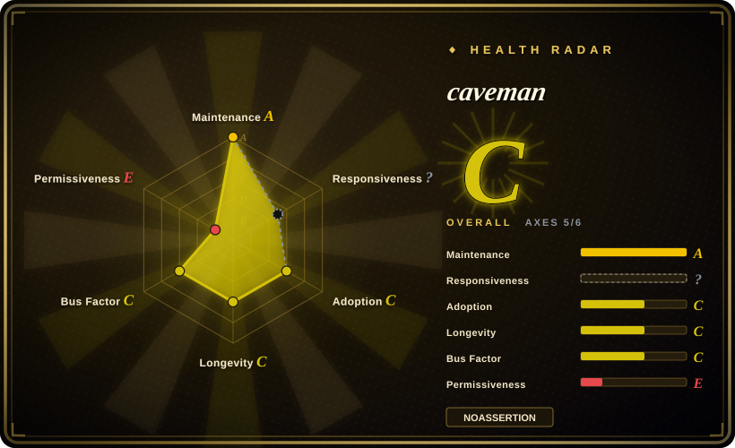
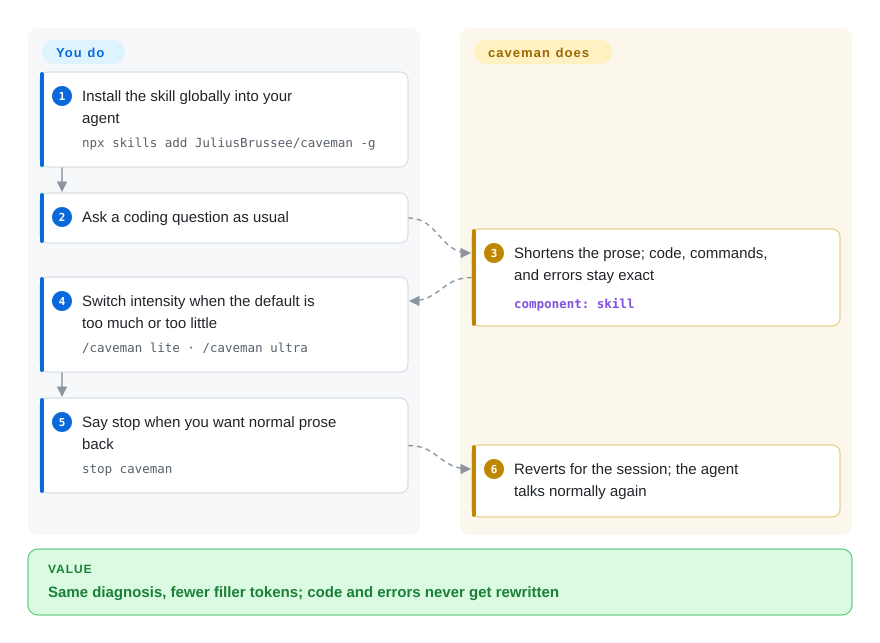

# caveman

Your coding agent writes cover-letter prose and rereads the same noisy logs all day, and you pay for both. caveman is a brevity skill plus a local proxy: it shrinks what the agent says and, if you wrap it, what the agent reads, while leaving code, commands, and errors intact.

## When to use

You're driving Claude Code, Codex, Gemini, or another CLI agent through a long session. Visible replies open with "The reason this is likely because…", and the hidden bill is worse: every test run, `git diff`, and JSON blob gets reread into the next prompt. You still need exact code blocks, shell commands, and error text. Pick caveman when the pain is token spend on both ends of the call.

The MIT skill is the small start: one rule file across 30+ agents, with `/caveman lite|full|ultra` intensity and an explicit promise that code, commands, paths, and errors are never rewritten. The local proxy is the graduate path: `caveman claude` (or `codex`, `gemini`, `kilo`, `opencode`, …) sits on your machine, compresses logs, JSON, diffs, and test output before the provider sees them, and keeps byte-exact originals in SQLite so the agent can pull any of them back.

Pick it over [i-have-adhd](i-have-adhd.md) when the constraint is the bill, not working memory — that skill restates progress and will not cap analysis. Pick it over [RTK](../../agent-frameworks/coding-agents/orchestration-and-review/rtk.md) when the waste is not only shell output (`Read` and `Grep` bypass RTK). Pick it over [Context Mode](../../agent-tooling/work-state/context-mode.md) when you want compression in place with a retrieve handle, not a sandbox that makes the agent write scripts. Pick it over [no-ai-slop](../ai-writing/de-ai-writing/no-ai-slop.md) when the artifact is the live reply, not a draft you will publish.

## How it works

Two sizes, same idea: make the mouth smaller, and optionally make the reading smaller. The skill is a rule file the agent loads; it never shortens your code, paraphrases an error, or grunts through a security warning — those drop back to full sentences, then the dialect resumes. The proxy is a local process between your agent and the provider: it types each payload (`json`, `log`, `code`, `diff`, `search-result`, `text`/`HTML`), keeps the bits answers depend on, and returns a recovery handle. Nothing in that path is a Caveman server; your provider login passes through. A TypeScript/Python middleware does the same swap for an agent you are building, against a runtime on `127.0.0.1:8787`; that client surface is still alpha in v2.7.0.

You install and switch intensity; the project keeps the originals and the retrieve path. The wrap does not edit your agent config. CLI telemetry is on by default and off with `caveman telemetry off` or `DO_NOT_TRACK=1`.

<!-- flow-steps:begin (generated from flows/caveman.json by tools/flow_card.py — do not edit) -->

Text version of the flow

1. **You**: Install the skill globally into your agent — `npx skills add JuliusBrussee/caveman -g`
2. **You**: Ask a coding question as usual
3. **caveman**: Shortens the prose; code, commands, and errors stay exact — component: `skill`
4. **You**: Switch intensity when the default is too much or too little — `/caveman lite · /caveman ultra`
5. **You**: Say stop when you want normal prose back — `stop caveman`
6. **caveman**: Reverts for the session; the agent talks normally again

**Value**: Same diagnosis, fewer filler tokens; code and errors never get rewritten

<!-- flow-steps:end -->

## When NOT to use

- **The complaint is reply shape for a short working memory, not the token bill.** Use [i-have-adhd](i-have-adhd.md): it restates progress, makes completed work visible, and keeps a real hedge — none of which a brevity overlay attempts, and its list cap is presentation-only.
- **You need stronger engineering process, not shorter speech.** Use [mattpocock/skills](mattpocock-skills.md) for TDD, bug diagnosis, spec, review, and architecture discipline.
- **You are de-AI-ing a document you will publish.** Use [no-ai-slop](../ai-writing/de-ai-writing/no-ai-slop.md) or [stop-slop](../ai-writing/de-ai-writing/stop-slop.md). Those operate on prose artifacts; caveman operates on the agent's live mouth and, if wrapped, on tool output.
- **You are billed per request, not per token.** GitHub Copilot premium requests are the README's own example: a shorter answer is the same request. Skip it.
- **The workload is already terse one-liner Q&A, or almost pure code generation.** The skill rides along as input tokens on every call (README: about 1,000 estimated for the full skill) and can be net-negative; measure on your harness before treating savings as a requirement.
- **You need an OSI-pure license for the compression engine.** The skill, CLI, and client SDKs are MIT; engine, proxy, MCP, shrink, browse, and rewriter are BSL-1.1 (first-party self-host including production is granted; third-party hosted/managed/embedded use needs a commercial license, converting to Apache-2.0 on the earlier of 2030-06-21 or four years after that version ships). For shell-output compression under Apache-2.0, use [RTK](../../agent-frameworks/coding-agents/orchestration-and-review/rtk.md).
- **You will not accept default CLI telemetry.** The skill and hooks send nothing; the `caveman` CLI sends anonymous command and token counts unless you run `caveman telemetry off`. If that default is a policy stop, skip the CLI or turn it off before first run.
- **You need a full replacement coding agent.** Evaluate Caveman Code (not indexed, upstream lists it as frozen) or another coding-agent harness; this repository is a skill plus an optional wrap, not a new agent.

## Comparison

| Alternative | In index | Our verdict | Tradeoff |
|---|---|---|---|
| [i-have-adhd](i-have-adhd.md) | ✅ | When the failure is reply *shape* for a reader with a short working memory, pick i-have-adhd; when the failure is token spend — including the logs and tool output the agent rereads — pick caveman. | i-have-adhd restates progress and keeps a hedge, at the cost of a longer ruleset that adds input tokens when always-on; caveman's skill is a shorter overlay, and its proxy additionally shrinks what the agent reads. |
| [RTK](../../agent-frameworks/coding-agents/orchestration-and-review/rtk.md) | ✅ | When the waste is shell command output only and you need Apache-2.0, pick RTK; when Read/Grep/JSON/diffs also dump into context, pick caveman's wrap. | RTK is a deterministic shell proxy with opt-in telemetry; caveman's wrap covers more payload types and keeps originals, but the engine is BSL-1.1 and CLI telemetry is opt-out. |
| [Context Mode](../../agent-tooling/work-state/context-mode.md) | ✅ | When you need a sandbox so raw tool output never enters context, plus session memory that survives compaction, pick Context Mode; when you want the same agent, compressed in place, with a retrieve handle, pick caveman. | Context Mode makes the agent write scripts and is Elastic-2.0; caveman compresses the existing stream and claims byte-exact recovery, without that execute surface. |
| [no-ai-slop](../ai-writing/de-ai-writing/no-ai-slop.md) | ✅ | When the artifact is a draft you will publish and must still sound like you, pick no-ai-slop; when the artifact is the agent's live reply or the tool output it rereads, pick caveman. | no-ai-slop inventories voice and edits prose in place; caveman never claims to preserve author voice — it makes the agent talk less, and optionally read less. |
| Headroom | 未收录 | When you want another local wrap that shrinks tool output and history, evaluate Headroom; pick caveman when you also want the MIT skill overlay and the project's own side-by-side wrap numbers. | Headroom's README lists caveman as something it can sit behind; caveman's pinned wrap table (not independently reproduced here) reports more input-token cut and fewer wrong answers on that suite, with one red HTML row. |

## Tech stack

- **Skill / install surface:** Markdown rules plus installer scripts and agent profiles; Node.js 22.13+ for the full installer.
- **CLI:** TypeScript, published as `@caveman-ai/cli` (v2.7.0 release notes name `@caveman-ai/cli@1.3.4`).
- **Engine / proxy / MCP / shrink / browse / rewriter:** Go. GitHub's primary-language breakdown is Go-led (about 5.1 MB Go vs 3.2 MB JavaScript and 2.1 MB TypeScript on 2026-09-22).
- **Recovery store:** local SQLite with a recovery handle for compressed payloads.
- **Middleware (alpha):** `@caveman-ai/middleware` / `caveman-middleware` wrapping Vercel AI SDK, LangChain, OpenAI, Anthropic, and other adapters against a local runtime.

## Dependencies

- **Skill-only:** a supported coding agent and `npx skills add` (or the per-agent plugin/extension path in `INSTALL.md`). No Caveman account or API key.
- **Proxy / wrap:** Node.js 22.13+, the `caveman` CLI, disk for the SQLite original store, and a launched local process. Provider credentials stay yours; the wrap points the agent at the local gateway.
- **Middleware:** the same local runtime bound at `127.0.0.1:8787` (`CAVEMAN_MODE=compress caveman start`), plus the TypeScript or Python client for your framework.
- **Optional:** Chrome for `caveman browse`; a container image at `ghcr.io/juliusbrussee/caveman-proxy` for team/VPC deploy.

## Ops difficulty

**Low for the skill, low-to-medium for the wrap.** The skill is one `npx` line and a `/caveman` switch; uninstall is documented. The wrap adds a local process, per-agent profiles, and a telemetry default you should decide on before first CLI run. Difficulty jumps if you deploy the proxy for a team (inbound token, AWS credential chain, BSL commercial boundary for third-party hosting) or if you adopt the alpha middleware and leave the runtime in record mode, which measures and changes nothing. The wrap claims not to edit your `kilo.json` / `opencode.json` / agent homes; verify that on your agent before rolling it out.

## Health & viability

- **Maintenance snapshot (2026-09-22):** GitHub reports `archived=false`, `pushed_at=2026-09-22T07:33:54Z`, default-branch SHA `2fd153c67988e980fb0b2455c90832159a6a5a25`; latest release **v2.7.0** (2026-09-15). The scorer grades maintenance `A` (last commit 1 day old, activity in 10 of the last 13 weeks) and responsiveness `A` (median first response 13.7 hours across 21 qualifying issues, relaxed solo band). Not abandoned.
- **Adoption snapshot:** GitHub API reports **107,333** stars and 6,216 forks as of 2026-09-22, up from ~90k in the 2026-07 page. Treat the curve as attention. npm `@caveman-ai/cli` is the scorer's canonical package; adoption grades `C`.
- **License snapshot:** GitHub metadata is `Other` / `NOASSERTION`. Root `LICENSE` is MIT with a scope note; `LICENSING.md` puts `skills/`, `packages/cli/`, and client SDKs on MIT, and `engine/`, `proxy/`, `mcp/`, `shrink/`, `browse/`, `rewriter/`, and Go `mem/` core on BSL-1.1. The radar grades `risk_license: E` and **caps overall at `D`** for that source-available split — not a missing file, and not a maintenance drop.
- **Lindy / governance:** created 2026-04-04 (~171 days / 5.5 months). As a `tool` the scorer grades longevity `D`. GitHub owner is a User (`JuliusBrussee`); top-1 contributor share 0.717, governance `C`. Roadmap and BSL relicensing sit with one person.
- **Risk flags:** split license (skill MIT, engine BSL) is the load-bearing one; CLI telemetry on by default; middleware still alpha; managed wrap can send GitHub `owner/name` and branch as `x-cave-tags` so Cloud can join spend to a change — branch names can carry a person's name. Headline savings are third-party or project-owned; whole-session savings depend on your mix of prose vs code vs tool output.

## Caveats (unverified)

- [未验证] Adobe CAVEWOMAN (arXiv 2606.24083: 1.4–2.4×, up to 3× output-side cost cut) and JetBrains' 86-task skill-only A/B (8.5% fewer output tokens, sign test p = 0.82, "no detectable quality change") were not re-run here; both are named third-party results quoted from the README.
- [未验证] The pinned wrap table (−33.2% provider input tokens, 18/18 answers right, HTML case **+9.9%**) is the project's own 54-run Claude Code suite; README says raw harness artifacts are not in the checkout, so it is a pinned report, not a public reproduction.
- [未验证] The 30+ agent installer matrix, wrap profiles, and `caveman trial` A/B were not executed locally in this pass.
- [未验证] Middleware "alpha" behaviour (record mode changes nothing; unreachable runtime passes the original request through unless strict mode) is README/release-note text, not exercised here.
- [推断] ~107k stars on a ~5.5-month-old User-owned repo is attention velocity, not proof of long-term maintenance or fit for regulated transcripts.
- [推断] Whether a given wrap actually leaves your agent config untouched depends on the profile; this pass read the README's claim, not each agent's files after `caveman <agent>`.
