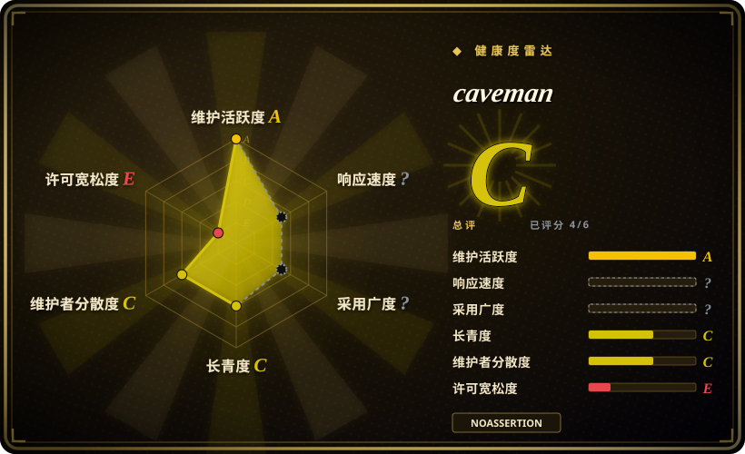
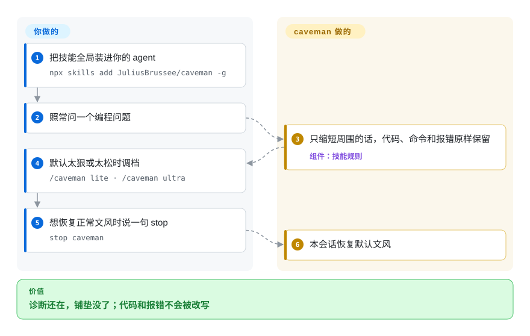

# caveman

你的 coding agent 说话像求职信，又整天把同一堆嘈杂日志再读一遍，两边都要你付钱。caveman 是一套简短表达技能，外加可选的本地代理：它压缩 agent 说出来的话，如果你把它包在外面，也压缩 agent 读进去的东西，同时代码、命令和报错原样保留。

## 何时使用

你开着 Claude Code、Codex、Gemini 或别的 CLI agent 跑一场长会话。可见回复以「之所以会这样，很可能是因为……」开头；看不见的账单更糟：每次测试、`git diff`、JSON 都会被下一轮 prompt 再读一遍。你仍然要求代码块、shell 命令和报错原文不能被改写。痛点是一次调用两端都在烧 token 时，选 caveman。

MIT 技能是小入口：一份规则文件覆盖 30 多种 agent，有 `/caveman lite|full|ultra` 档位，并且明确承诺代码、命令、路径和报错从不改写。本地代理是升级路径：`caveman claude`（或 `codex`、`gemini`、`kilo`、`opencode`……）跑在你自己的机器上，在日志、JSON、diff、测试输出到达供应商之前把它们压小，并把字节级原件放进 SQLite，agent 随时可以取回。

约束是账单而不是工作记忆时，选它而不是 [i-have-adhd](i-have-adhd.zh.md)——后者会复述进度，也不会限制分析。浪费不只是 shell 输出时（`Read` 和 `Grep` 会绕过 RTK），选它而不是 [RTK](../../agent-frameworks/coding-agents/orchestration-and-review/rtk.zh.md)。想就地压缩并带取回句柄、而不是让 agent 去沙箱里写脚本时，选它而不是 [Context Mode](../../agent-tooling/work-state/context-mode.zh.md)。产物是当场回复而不是要发表的文稿时，选它而不是 [no-ai-slop](../ai-writing/de-ai-writing/no-ai-slop.zh.md)。

## 怎么用起来

两种体量，同一个想法：嘴变小，读进去的东西也可以变小。技能是 agent 加载的一份规则文件；它从不缩短你的代码、改写报错，或对安全警告含糊其辞——那些会先回到完整句子，然后方言再继续。代理是夹在你的 agent 和供应商之间的本地进程：它给每种载荷分型（`json`、`log`、`code`、`diff`、`search-result`、`text`/`HTML`），留下答案依赖的部分，并返回一个取回句柄。这条路径上没有 Caveman 服务器；你的供应商登录原样穿过。TypeScript / Python 中间件对你自己写的 agent 做同样的替换，对着 `127.0.0.1:8787` 上的运行时；v2.7.0 里这块客户端仍是 alpha。

你负责安装和调档；项目负责原件和取回路径。wrap 声称不改你的 agent 配置。CLI 遥测默认打开，用 `caveman telemetry off` 或 `DO_NOT_TRACK=1` 关掉。

<!-- flow-steps:begin (generated from flows/caveman.json by tools/flow_card.py — do not edit) -->

流程文字版

1. **你**：把技能全局装进你的 agent — `npx skills add JuliusBrussee/caveman -g`
2. **你**：照常问一个编程问题
3. **caveman**：只缩短周围的话，代码、命令和报错原样保留 — 组件：`技能规则`
4. **你**：默认太狠或太松时调档 — `/caveman lite · /caveman ultra`
5. **你**：想恢复正常文风时说一句 stop — `stop caveman`
6. **caveman**：本会话恢复默认文风

**价值**：诊断还在，铺垫没了；代码和报错不会被改写

<!-- flow-steps:end -->

## 何时不用

- **痛点是回复形状、读者工作记忆短，不是 token 账单。** 用 [i-have-adhd](i-have-adhd.zh.md)：它会复述进度、把完成的部分亮出来，并保留真实的不确定措辞——简短覆盖层不做这些，而且它的列表上限只约束呈现。
- **你需要更强工程流程，而不是更短表达。** 用 [mattpocock/skills](mattpocock-skills.zh.md) 处理 TDD、bug 诊断、spec、review 和架构纪律。
- **你要去 AI 味的是将要发布的文档。** 用 [no-ai-slop](../ai-writing/de-ai-writing/no-ai-slop.zh.md) 或 [stop-slop](../ai-writing/de-ai-writing/stop-slop.zh.md)。那些作用于文稿；caveman 作用于 agent 当场的嘴，以及（如果 wrap 了）工具输出。
- **你按请求计费，不按 token 计费。** README 自己举的例子是 GitHub Copilot premium requests：更短的回答仍是同一次请求。跳过。
- **工作负载已经是很短的一问一答，或几乎全是代码生成。** 技能会作为输入 token 跟着每一轮走（README：完整技能大约 1,000 估计 token），可能净负；把它当成本承诺前，先在自己的 harness 上测。
- **压缩引擎必须是纯 OSI 许可证。** 技能、CLI 和客户端 SDK 是 MIT；engine、proxy、MCP、shrink、browse、rewriter 是 BSL-1.1（允许包括生产在内的第一方自托管；向第三方提供托管/托管式/嵌入式服务需要商业许可，该版本在 2030-06-21 或发布满四年二者较早时转为 Apache-2.0）。只要 Apache-2.0 的 shell 输出压缩，用 [RTK](../../agent-frameworks/coding-agents/orchestration-and-review/rtk.zh.md)。
- **你不能接受 CLI 默认遥测。** 技能和 hook 不外发；`caveman` CLI 会发送匿名命令与 token 计数，除非你运行 `caveman telemetry off`。这条默认是政策红线时，跳过 CLI，或第一次运行前关掉。
- **你要完整替换 coding agent。** 评估 Caveman Code（未收录，上游标为 frozen）或其他 coding-agent harness；本仓库是技能加可选 wrap，不是新的 agent。

## 横向对比

| 替代品 | 是否收录 | 我们的评价 | 取舍 |
|---|---|---|---|
| [i-have-adhd](i-have-adhd.zh.md) | ✅ | 痛点是回复形状、读者工作记忆短，选 i-have-adhd；痛点是 token 花销——包括 agent 反复读进去的日志和工具输出——选 caveman。 | i-have-adhd 会复述进度并保留不确定措辞，代价是规则更长、常驻时增加输入 token；caveman 的技能更短，它的代理还会压缩 agent 读进去的东西。 |
| [RTK](../../agent-frameworks/coding-agents/orchestration-and-review/rtk.zh.md) | ✅ | 浪费只在 shell 命令输出、且必须 Apache-2.0 时，选 RTK；Read/Grep/JSON/diff 也会灌进上下文时，选 caveman 的 wrap。 | RTK 是确定性的 shell 代理，遥测默认关闭；caveman 的 wrap 覆盖更多载荷类型并保留原件，但引擎是 BSL-1.1，CLI 遥测默认打开。 |
| [Context Mode](../../agent-tooling/work-state/context-mode.zh.md) | ✅ | 需要沙箱让原始工具输出永不进入上下文、外加熬过压缩的会话记忆时，选 Context Mode；想让同一个 agent 就地压缩并带取回句柄时，选 caveman。 | Context Mode 让 agent 写脚本，许可证是 Elastic-2.0；caveman 压缩现有数据流并声称字节级可恢复，没有那层执行面。 |
| [no-ai-slop](../ai-writing/de-ai-writing/no-ai-slop.zh.md) | ✅ | 产物是将要发布、改完仍须像作者本人的文稿，选 no-ai-slop；产物是 agent 当场的回复或它反复读的工具输出，选 caveman。 | no-ai-slop 先盘点并保护你的声音，再就地改文；caveman 从不声称保留作者声音——它让 agent 少说话，可选地少读。 |
| Headroom | 未收录 | 想要另一个压缩工具输出和历史的本地 wrap 时，评估 Headroom；还想要 MIT 技能覆盖层以及项目自己的并排 wrap 数字时，选 caveman。 | Headroom 的 README 把 caveman 列成可以坐在它后面的东西；caveman 钉住的 wrap 表（此处未独立复现）在该套件上报告了更多输入 token 削减和更少答错，并留着一行红色的 HTML 结果。 |

## 技术栈

- **技能 / 安装面：** Markdown 规则、安装脚本和 agent 配置档；完整安装器需要 Node.js 22.13+。
- **CLI：** TypeScript，以 `@caveman-ai/cli` 发布（v2.7.0 发行说明写 `@caveman-ai/cli@1.3.4`）。
- **引擎 / 代理 / MCP / shrink / browse / rewriter：** Go。GitHub 主语言统计以 Go 领先（2026-09-22：约 5.1 MB Go，对 3.2 MB JavaScript 和 2.1 MB TypeScript）。
- **取回存储：** 本地 SQLite，给压缩载荷一个取回句柄。
- **中间件（alpha）：** `@caveman-ai/middleware` / `caveman-middleware`，给 Vercel AI SDK、LangChain、OpenAI、Anthropic 等适配器包一层，对着本地运行时。

## 依赖

- **只用技能：** 一个受支持的 coding agent，加上 `npx skills add`（或 `INSTALL.md` 里按 agent 的插件 / 扩展路径）。不需要 Caveman 账号或 API key。
- **代理 / wrap：** Node.js 22.13+、`caveman` CLI、给 SQLite 原件库的磁盘，以及一个跑起来的本地进程。供应商凭据仍是你的；wrap 把 agent 指到本地网关。
- **中间件：** 同一个绑在 `127.0.0.1:8787` 的本地运行时（`CAVEMAN_MODE=compress caveman start`），加上你框架对应的 TypeScript 或 Python 客户端。
- **可选：** `caveman browse` 需要 Chrome；团队 / VPC 部署可用 `ghcr.io/juliusbrussee/caveman-proxy` 容器镜像。

## 运维难度

**技能低，wrap 低到中。** 技能是一条 `npx` 加 `/caveman` 开关；卸载有文档。wrap 多一个本地进程、按 agent 的配置档，以及你第一次跑 CLI 前就该决定的遥测默认值。把代理部署给团队时难度上升（入站 token、AWS 凭据链、向第三方托管时的 BSL 商业边界）；采用仍是 alpha 的中间件、却把运行时留在 record 模式时，它只测量、什么都不改。wrap 声称不改你的 `kilo.json` / `opencode.json` / agent 家目录；上线前在自己的 agent 上核一下。

## 健康度与可持续性

- **维护快照（2026-09-22）：** GitHub 返回 `archived=false`，`pushed_at=2026-09-22T07:33:54Z`，默认分支 SHA `2fd153c67988e980fb0b2455c90832159a6a5a25`；最新发行 **v2.7.0**（2026-09-15）。评分器给维护 `A`（最近一次提交 1 天前，过去 13 周里 10 周有活动），响应 `A`（21 个合格 issue 的中位首次响应 13.7 小时，宽松单人档）。不是弃坑。
- **采用快照：** GitHub API 在 2026-09-22 返回 **107,333** 个 star、6,216 个 fork，高于 2026-07 页的约 9 万。把这条曲线当关注度。评分器的规范包是 npm 上的 `@caveman-ai/cli`；采用评 `C`。
- **许可证快照：** GitHub 元数据是 `Other` / `NOASSERTION`。根目录 `LICENSE` 是带范围说明的 MIT；`LICENSING.md` 把 `skills/`、`packages/cli/` 和客户端 SDK 放在 MIT，把 `engine/`、`proxy/`、`mcp/`、`shrink/`、`browse/`、`rewriter/` 和 Go 的 `mem/` 核心放在 BSL-1.1。雷达给 `risk_license: E`，并因此把总分**封顶在 `D`**——对应的是这种 source-available 拆分，不是缺文件，也不是维护下滑。
- **Lindy / 治理：** 创建于 2026-04-04（约 171 天 / 5.5 个月）。作为 `tool`，评分器给寿命 `D`。GitHub 所有者是 User（`JuliusBrussee`）；第一贡献者占比 0.717，治理 `C`。路线图和 BSL 再授权落在一个人身上。
- **风险信号：** 拆分许可证（技能 MIT，引擎 BSL）是承重的那条；CLI 遥测默认打开；中间件仍是 alpha；托管 wrap 会把 GitHub 的 `owner/name` 和分支作为 `x-cave-tags` 发出，好让 Cloud 把花销接到一次改动上——分支名可能带人名。头条节省数字来自第三方或项目自测；整场会话是否省 token，取决于你的散文、代码和工具输出比例。

## 存疑（未验证）

- [未验证] Adobe CAVEWOMAN（arXiv 2606.24083：输出侧成本 1.4–2.4 倍、最好到 3 倍）和 JetBrains 的 86 题仅技能 A/B（输出 token 少 8.5%，符号检验 p = 0.82，「测不到质量变化」）此处未复跑；两者都是 README 点名的第三方结果。
- [未验证] 钉住的 wrap 表（供应商输入 token −33.2%，18/18 答对，HTML 那组 **+9.9%**）是项目自己的 54 次 Claude Code 套件；README 写明原始 harness 产物不在检出里，所以这是钉住的报告，不是可公开复现。
- [未验证] 30 多种 agent 的安装矩阵、wrap 配置档和 `caveman trial` A/B 本轮未在本地执行。
- [未验证] 中间件「alpha」行为（record 模式只测量、不改请求；运行时不可达则原样放行，除非开 strict）来自 README / 发行说明，此处未实操。
- [推断] 约 5.5 个月、User 所有的仓库有约 10.7 万 star，代表关注速度，不能证明长期维护或适合合规 transcript。
- [推断] 某个 wrap 是否真的不改你的 agent 配置，取决于配置档；本轮读的是 README 的声明，不是 `caveman <agent>` 之后各 agent 的文件。
