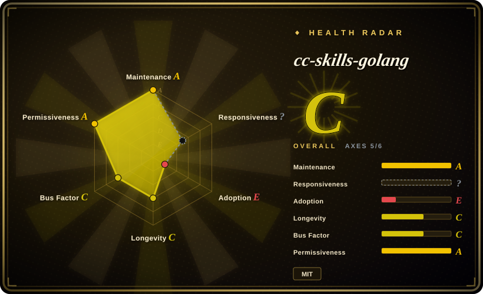
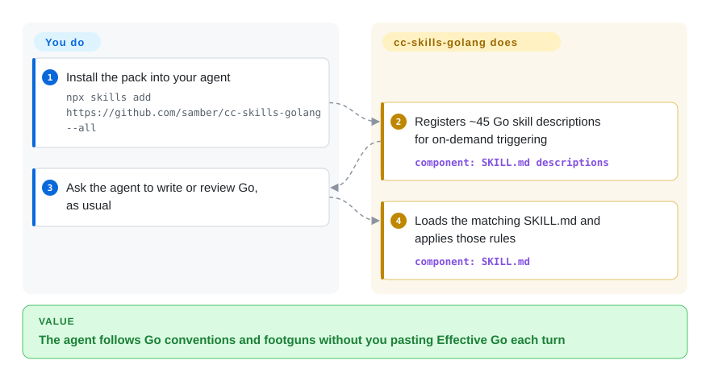

# cc-skills-golang

Your coding agent writes Go that compiles but looks like Java: receivers named `this`, five-level if-else, errors both logged and returned, `append` silently sharing a backing array. This pack is on-demand instruction files for those Go-specific jobs — loaded when the task matches.

## When to use

You're shipping production Go through a coding agent (Claude Code, Codex, Cursor, OpenCode). The code `go test`s green, then review finds `if err != nil { log.Print(err); return err }` on every layer, a typed-nil `http.Handler` that never compares equal to `nil`, and `NewHTTPClient` instead of `New`. You do not want to paste Effective Go into every session. You install this pack so the agent loads `golang-error-handling`, `golang-safety`, or `golang-naming` when those jobs come up.

Pick it over [Vercel Agent Skills](vercel-agent-skills.md) when the language is Go, not React/Next. Pick it over [Superpowers](../../agent-dev-methodology/coding-agent-harnesses/superpowers.md) or [mattpocock/skills](mattpocock-skills.md) when the failure is Go idiom — wrapping, nil traps, slice aliasing — not planning or TDD process. Pick it over [Android Skills](../vendor-collections/android-skills.md) when the platform is the Go toolchain, not Android.

## Q&A

**Our Go repos don't have these skills and still look fine. Is this actually valuable?**

For humans who already know Go, no. The payload is the *agent*, not the team. The repo's own `EVALUATIONS.md` is a style quiz (constructor named `New()`, lowercase error strings) plus resistance to adversarial prompts; Cobra and Viper already score 98–100% without the skill. The useful subset is the real footguns — typed-nil interfaces, `append` aliasing, `defer` in loops — not the 45-skill install.

**Should I install everything?**

No. The README itself estimates that naming and code-style overlap about 50% with golangci-lint, and the `golang-samber-*` skills will bias the agent toward the author's libraries (`lo`, `do`, `oops`). Install the general-purpose footgun skills, or none.

## How it works

There is no runtime. Each skill is a `SKILL.md` plus optional `references/` markdown the agent reads on demand. You install once — `npx skills add https://github.com/samber/cc-skills-golang --all`, or the Claude Code plugin `cc-skills-golang@samber`. The harness keeps only the short `description` field in context (the README says the 14 recommended skills load about 1,100 description tokens at startup). When a task matches — error wrapping, a data race, a benchmark — the agent loads that skill's body. Your job is the install and the usual coding request; the pack's job is putting the matching Go rules in front of the model. Analogy: not a linter that fails the build — a handbook the intern is told to open before touching that file.

<!-- flow-steps:begin (generated from flows/cc-skills-golang.json by tools/flow_card.py — do not edit) -->

Text version of the flow

1. **You**: Install the pack into your agent — `npx skills add https://github.com/samber/cc-skills-golang --all`
2. **cc-skills-golang**: Registers ~45 Go skill descriptions for on-demand triggering — component: `SKILL.md descriptions`
3. **You**: Ask the agent to write or review Go, as usual
4. **cc-skills-golang**: Loads the matching SKILL.md and applies those rules — component: `SKILL.md`

**Value**: The agent follows Go conventions and footguns without you pasting Effective Go each turn

<!-- flow-steps:end -->

## When NOT to use

- **You're not writing Go.** Use [Vercel Agent Skills](vercel-agent-skills.md) for React/Next, or [Android Skills](../vendor-collections/android-skills.md) for Android. This pack's value is Go idiom; off Go most skills are dead weight.
- **The failure is process, not idiom.** Use [Superpowers](../../agent-dev-methodology/coding-agent-harnesses/superpowers.md) or [mattpocock/skills](mattpocock-skills.md) when the agent skips planning, TDD, or review. This pack does not own the SDLC loop.
- **Humans and linters already cover style.** If review plus golangci-lint already catch naming, formatting, and unchecked errors, skip the pack. If the agent still writes Java-in-Go, install only `golang-safety`, `golang-error-handling`, and `golang-concurrency` — not all 45.
- **You don't want the agent recommending the author's libraries.** The error-handling skill's own summary says to use `samber/oops` for production errors; seven `golang-samber-*` skills exist. Use [Agent Skills (addyosmani)](addyosmani-agent-skills.md) for language-agnostic production checklists, or install this pack without the `samber-*` skills.
- **You need a merge gate.** Rules live in markdown the agent *should* follow; nothing fails CI. Keep golangci-lint / `go test` / `go vet` as the gate, and treat this as advisory review guidance.
- **Your house conventions conflict.** The pack documents an override: a company skill that says it supersedes `samber/cc-skills-golang@golang-naming` (and the other ⚙️ skills). Write that override instead of absorbing Samuel Berthe's naming and error rules as team policy.

## Comparison

| Alternative | In index | Our verdict | Tradeoff |
|---|---|---|---|
| [Vercel Agent Skills](vercel-agent-skills.md) | ✅ | When the agent is writing Go, pick this pack; when it is writing React/Next on Vercel, pick Vercel's. | Same shape (on-demand domain skills via skills.sh), different language. Vercel is vendor-backed; this pack is one maintainer's Go handbook plus his own libraries. |
| [Android Skills](../vendor-collections/android-skills.md) | ✅ | When the jobs the model fails are Go idioms, pick this; when they are Compose, R8, or Play policy, pick Android Skills. | Both are language/platform playbooks. Android Skills is Google-owned and installed with the Android CLI; this pack is MIT, skills.sh / plugin install, and opinionated toward samber/* . |
| [Superpowers](../../agent-dev-methodology/coding-agent-harnesses/superpowers.md) | ✅ | When the agent drifts on plan → TDD → verify, pick Superpowers; when it writes compiling-but-unidiomatic Go, pick this. | Superpowers shapes *how* the agent works; this pack shapes *what Go it emits*. Often complementary, not either/or. |
| [mattpocock/skills](mattpocock-skills.md) | ✅ | When you need requirement grilling, tickets, and a TDD/review loop, pick mattpocock; when you need Go error wrapping and nil safety, pick this. | mattpocock is process-and-design across stacks; this pack is Go-only and will not give you that loop. |
| [Agent Skills (addyosmani)](addyosmani-agent-skills.md) | ✅ | When you want language-agnostic quality/security/ship checklists, pick Addy's pack; when the checklist must be Go-specific, pick this. | Addy is broader production engineering without a Go standard library; this pack is deeper on Go and carries the author's library bias. |

## Health & viability

- **Maintenance (2026-09-27):** active — last default-branch push 2026-09-07, not archived. Latest Git tag is `v2.0.0` (published 2026-08-20); `.claude-plugin/plugin.json` on `main` already says `2.0.1` with no matching tag, so installs from `main` and from the tag can drift.
- **Governance & bus factor:** User-owned (`samber`). Contributors API (2026-09-27) lists 13 accounts and 133 contributions, of which 105 are `samber` (~79%). The roadmap is one person's. Samuel Berthe is a long-standing Go library author (`lo`, `mo`, `do`); that is backing for *attention*, not a foundation or vendor that outlives him.
- **Age & Lindy:** created 2026-03-21, about six months old as of 2026-09-27 — **unproven by age**. ~3.3k stars in that window is attention, not a Lindy signal. Age × still-active reads "young and still moving."
- **Adoption:** no real install channel. The radar grades this axis **E** because GitHub reports the repo language as Go (~14 KB of eval/fixture code) and ecosyste.ms then picks the synthesized `proxy.golang.org` module `github.com/samber/cc-skills-golang` with 0 importers — that is not a library people import. 46 `SKILL.md` files on `main`; README marks `golang-temporal` as to-do. What you install is Markdown.
- **Risk flags:** MIT, no relicense history found. Enforcement is prompt-level. Installing `--all` loads skills that recommend the author's own libraries. The README's Codex install snippet clones `samber/cc-skills` (the non-Go sibling), not this repo.

## Caveats (unverified)

- [未验证] The 97% / 57% numbers in `EVALUATIONS.md` were not rerun here. The file itself shows many assertions are style trivia and adversarial-prompt resistance, graded by regex or "human-as-judge" on Claude Opus/Sonnet.
- [未验证] No harness install was executed (skills.sh, Claude Code plugin, Cursor clone path). Activation fidelity depends on each loader.
- [未验证] Whether `headless-samber` (6 contributions, third on the contributors list) is an automated account. Not checked beyond the login name.
- [推断] ~3.3k stars in six months measure attention, not production installs; a skill pack has no registry telemetry.
- [推断] The author's library skills (`golang-samber-lo` and siblings) will tilt library choice if installed; the general-purpose error-handling skill already names `samber/oops` in its summary.
