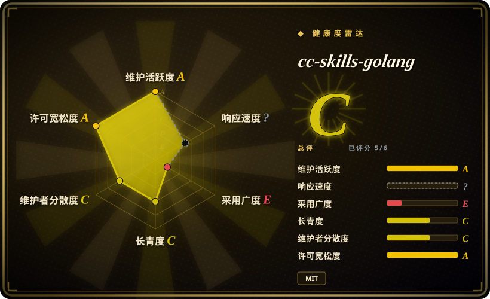
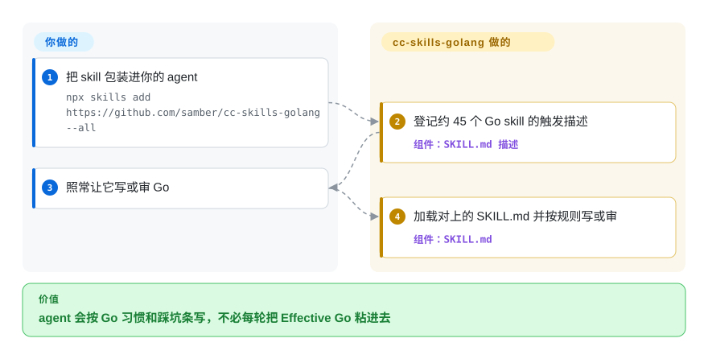

# cc-skills-golang

你的 coding agent 写出的 Go 能编译，但长得像 Java：receiver 叫 `this`、if-else 套五层、error 既打日志又往上抛、`append` 偷偷共用底层数组。这是一套按需加载的 Go 专项说明书，任务对上了才读进来。

## 何时使用

你在用 coding agent（Claude Code、Codex、Cursor、OpenCode）交生产 Go。代码 `go test` 是绿的，review 却看到每一层都是 `if err != nil { log.Print(err); return err }`、一个 typed-nil 的 `http.Handler` 永远不等于 `nil`、构造函数叫 `NewHTTPClient` 而不是 `New`。你不想每开一轮会话都把 Effective Go 粘进去。装上这包，agent 碰到这些活会自己加载 `golang-error-handling`、`golang-safety` 或 `golang-naming`。

语言是 Go 而不是 React/Next 时，选它而不是 [Vercel Agent Skills](vercel-agent-skills.zh.md)。失败点是 Go 习惯用法——包装 error、nil 陷阱、slice 别名——而不是规划或 TDD 流程时，选它而不是 [Superpowers](../../agent-dev-methodology/coding-agent-harnesses/superpowers.zh.md) 或 [mattpocock/skills](mattpocock-skills.zh.md)。平台是 Go 工具链而不是 Android 时，选它而不是 [Android Skills](../vendor-collections/android-skills.zh.md)。

## 快问快答

**我们自己的 Go 仓库没装这些 skill，写得也不错。这东西真有价值吗？**

对人已经会 Go 的团队，没有。它服务的是 *agent*，不是人。仓库自己的 `EVALUATIONS.md` 测的是风格测验（构造函数叫 `New()`、error 字符串全小写）外加对抗提示的抵抗力；Cobra 和 Viper 不带 skill 已经 98%–100%。真正有用的是那些踩坑条——typed-nil interface、`append` 别名、`defer` 进循环——不是 45 个 skill 全装。

**要不要全装？**

不要。README 自己估计命名和代码风格大约一半和 golangci-lint 重叠，而 `golang-samber-*` 会让 agent 偏向作者自己的库（`lo`、`do`、`oops`）。只装通用踩坑 skill，或者不装。

## 怎么用起来

没有运行时。每个 skill 就是一份 `SKILL.md`，外加 agent 按需再读的 `references/` markdown。你装一次——`npx skills add https://github.com/samber/cc-skills-golang --all`，或者 Claude Code 插件 `cc-skills-golang@samber`。harness 平时只把短的 `description` 放进上下文（README 说 14 个推荐 skill 启动大约占 1100 个 description token）。任务对上了——包装 error、data race、跑 benchmark——agent 再加载那份正文。你负责安装和照常提需求；这包负责把对上的 Go 规则塞到模型眼前。类比：不是会让构建失败的 linter，是实习生动那个文件之前被要求打开的手册。

<!-- flow-steps:begin (generated from flows/cc-skills-golang.json by tools/flow_card.py — do not edit) -->

流程文字版

1. **你**：把 skill 包装进你的 agent — `npx skills add https://github.com/samber/cc-skills-golang --all`
2. **cc-skills-golang**：登记约 45 个 Go skill 的触发描述 — 组件：`SKILL.md 描述`
3. **你**：照常让它写或审 Go
4. **cc-skills-golang**：加载对上的 SKILL.md 并按规则写或审 — 组件：`SKILL.md`

**价值**：agent 会按 Go 习惯和踩坑条写，不必每轮把 Effective Go 粘进去

<!-- flow-steps:end -->

## 何时不用

- **你不写 Go。** React/Next 用 [Vercel Agent Skills](vercel-agent-skills.zh.md)，Android 用 [Android Skills](../vendor-collections/android-skills.zh.md)。这包的价值是 Go 习惯用法，离开 Go 多半是死重量。
- **失败点是流程，不是习惯用法。** agent 跳过规划、TDD 或 review 时，用 [Superpowers](../../agent-dev-methodology/coding-agent-harnesses/superpowers.zh.md) 或 [mattpocock/skills](mattpocock-skills.zh.md)。这包不管 SDLC 循环。
- **人和 linter 已经覆盖风格。** review 加上 golangci-lint 已经能抓住命名、格式和没检查的 error，就别装。若 agent 仍在写 Java-in-Go，只装 `golang-safety`、`golang-error-handling` 和 `golang-concurrency`——不要 45 个全上。
- **你不想让 agent 推荐作者自己的库。** error-handling skill 的摘要就写生产错误用 `samber/oops`；另外还有七个 `golang-samber-*`。要语言无关的生产检查单，用 [Agent Skills (addyosmani)](addyosmani-agent-skills.zh.md)，或者装这包但不要 `samber-*` skill。
- **你需要合并门禁。** 规则写在 markdown 里，agent *应该* 遵守；没有任何东西会让 CI 红。门禁仍是 golangci-lint / `go test` / `go vet`，这包只当建议层的 review 指导。
- **你们的内部约定和它对不上。** 这包写明了覆盖机制：公司 skill 声明自己取代 `samber/cc-skills-golang@golang-naming`（以及其他标了 ⚙️ 的 skill）。写那份覆盖，而不是把 Samuel Berthe 的命名和 error 规则收成团队政策。

## 横向对比

| 替代品 | 是否收录 | 我们的评价 | 取舍 |
|---|---|---|---|
| [Vercel Agent Skills](vercel-agent-skills.zh.md) | 已收录 | agent 在写 Go 时选这包；在 Vercel 上写 React/Next 时选 Vercel 的。 | 形态相同（skills.sh 按需加载领域 skill），语言不同。Vercel 有厂商背书；这包是单维护者的 Go 手册，外加他自己的库。 |
| [Android Skills](../vendor-collections/android-skills.zh.md) | 已收录 | 模型栽在 Go 习惯用法上时选这包；栽在 Compose、R8 或 Play 政策上时选 Android Skills。 | 都是语言／平台说明书。Android Skills 归 Google，用 Android CLI 装；这包是 MIT，走 skills.sh／插件，并且偏向 samber/*。 |
| [Superpowers](../../agent-dev-methodology/coding-agent-harnesses/superpowers.zh.md) | 已收录 | agent 在「计划 → TDD → 验证」上跑偏时选 Superpowers；写出能编译但不地道的 Go 时选这包。 | Superpowers 管 agent *怎么干活*；这包管它 *吐出什么样的 Go*。常常互补，不是二选一。 |
| [mattpocock/skills](mattpocock-skills.zh.md) | 已收录 | 需要需求追问、工单和 TDD／review 循环时选 mattpocock；需要 Go 的 error 包装和 nil 安全时选这包。 | mattpocock 是跨栈的流程和设计；这包只覆盖 Go，不会给你那条循环。 |
| [Agent Skills (addyosmani)](addyosmani-agent-skills.zh.md) | 已收录 | 要语言无关的质量／安全／发布检查单时选 Addy 这包；检查单必须是 Go 专项时选这包。 | Addy 更宽的生产工程，没有 Go 标准库深度；这包在 Go 上更深，也带着作者的库偏好。 |

## 健康度与可持续性

- **维护（2026-09-27）：** 活跃——默认分支最近一次 push 是 2026-09-07，未归档。最新 Git tag 是 `v2.0.0`（2026-08-20 发布）；`main` 上的 `.claude-plugin/plugin.json` 已经写 `2.0.1` 却没有对应 tag，所以跟 `main` 装和跟 tag 装可能不一致。
- **治理与总线因子：** 个人仓库（`samber`）。Contributors API（2026-09-27）列出 13 个账号、133 次贡献，其中 105 次是 `samber`（约 79%）。路线图是一个人的。Samuel Berthe 是资深 Go 库作者（`lo`、`mo`、`do`）；这是注意力上的背书，不是能活过他本人的基金会或厂商。
- **年龄与林迪：** 2026-03-21 创建，到 2026-09-27 大约六个月——**年龄上未证明**。这窗口里约 3300 star 是注意力，不是林迪信号。年龄 × 仍在活跃读作「年轻且还在动」。
- **采用：** 没有真实安装渠道。雷达把这条打成 **E**，是因为 GitHub 把仓库语言报成 Go（大约 14 KB 评测／夹具代码），ecosyste.ms 于是选中合成的 `proxy.golang.org` 模块 `github.com/samber/cc-skills-golang`，importer 为 0——这不是有人在 import 的库。`main` 上有 46 个 `SKILL.md`；README 把 `golang-temporal` 标成待做。你装进去的是 Markdown。
- **风险旗标：** MIT，没发现换过许可证。执行只在提示词层。`--all` 会装上推荐作者自己库的 skill。README 里 Codex 安装片段 clone 的是姊妹仓 `samber/cc-skills`（非 Go），不是本仓。

## 存疑（未验证）

- [未验证] `EVALUATIONS.md` 里的 97%／57% 数字这里没有复跑。文件本身显示大量断言是风格 trivia 和对抗提示抵抗力，由正则或 Claude Opus／Sonnet 上的「human-as-judge」打分。
- [未验证] 没有在任何 harness 里实际安装（skills.sh、Claude Code 插件、Cursor clone 路径）。触发是否生效取决于各家加载器。
- [未验证] 贡献者列表第三名 `headless-samber`（6 次贡献）是不是自动化账号。除了登录名以外没有查。
- [推断] 六个月约 3300 star 测的是注意力，不是生产安装量；skill 包没有注册表遥测。
- [推断] 作者自己的库 skill（`golang-samber-lo` 及其兄弟）装上后会倾斜库选型；通用的 error-handling skill 摘要里已经点名 `samber/oops`。
