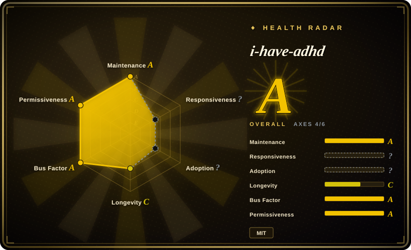
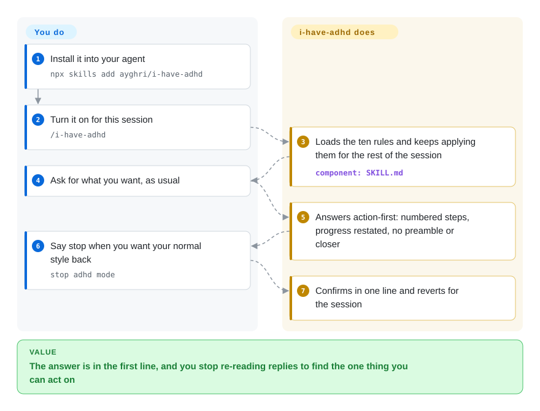

# i-have-adhd

You ask your coding agent one question and get four paragraphs of throat-clearing back, with the one command you can actually run buried in the third. This is a response-style skill pack — one 10-rule prompt that makes the agent lead with the action, number the steps, restate where you are each turn, and drop the "Hope this helps" closer.

## When to use

You keep a coding agent open in a terminal all day and read its replies in fragments — between two other things, on a phone, after an interruption. The replies are technically fine, shaped for the wrong reader: an opener announcing what the agent is about to do, three paragraphs of context, the actual command in the middle, and a closing "let me know if you want to dig deeper." You scroll to find the line you can run, and by the next turn you have lost which step of five you were on. i-have-adhd re-shapes that reply with a single 142-line ruleset: first line is the action, multi-step work is numbered, progress is restated every turn ("step 3 of 5 done"), errors are stated as location + cause + fix, and lists are capped at five items. It holds for the rest of the session rather than one reply, and the repo ships adapters for roughly 15 harnesses (Claude Code, Codex, Grok, Gemini CLI, Copilot, Cursor, Zed, OpenCode, Pi and more), so the same shape follows you across tools.

Pick it over the nearest substitutes for one reason each: over [caveman](caveman.md), because the constraint here is your working memory, not the token bill — the rules restate progress and make completed work visible, which a terse-style overlay does not attempt; over a rule you paste into your own `AGENTS.md`, because you get the per-harness plumbing (a session-start hook or a plugin) plus opt-in always-on and a ruleset you can pin and diff; and over prose de-slop skills such as [stop-slop](../ai-writing/de-ai-writing/stop-slop.md), because those clean a document you will publish, while this shapes a conversation you are reading right now.

## How it works

There is no runtime — the artifact is a Markdown file. `skills/i-have-adhd/SKILL.md` holds ten numbered rules with bad/good examples, a "what ADHD changes about reading" preamble that states the reasoning behind them, six escape hatches for when a rule fights the task, and a pre-send check the model is told to run before answering. Everything else in the repo exists to get that text in front of your model: plugin manifests for each harness, a `SessionStart` hook (a command the agent runs when a session opens) that injects the ruleset at session start and again after a compaction, and an OpenCode plugin. You install it through your harness or `npx skills add`, type `/i-have-adhd`, and every reply for that session is shaped by the ruleset. Always-on is opt-in by a flag file — `touch ~/.claude/.i-have-adhd-always` — and the hook reads that file at session start, so installing the plugin alone changes nothing; "stop adhd mode" reverts for the session. One cost worth knowing before you enable always-on: on Claude Code the hook injects the ruleset once per session, while the OpenCode plugin appends it to the system prompt on every turn. Your job is the install and the two switches; the project's job is keeping the rules in front of the model.

<!-- flow-steps:begin (generated from flows/i-have-adhd.json by tools/flow_card.py — do not edit) -->

Text version of the flow

1. **You**: Install it into your agent — `npx skills add ayghri/i-have-adhd`
2. **You**: Turn it on for this session — `/i-have-adhd`
3. **i-have-adhd**: Loads the ten rules and keeps applying them for the rest of the session — component: `SKILL.md`
4. **You**: Ask for what you want, as usual
5. **i-have-adhd**: Answers action-first: numbered steps, progress restated, no preamble or closer
6. **You**: Say stop when you want your normal style back — `stop adhd mode`
7. **i-have-adhd**: Confirms in one line and reverts for the session

**Value**: The answer is in the first line, and you stop re-reading replies to find the one thing you can act on

<!-- flow-steps:end -->

## When NOT to use

- **You run only Claude Code and preamble is the whole complaint.** Its built-in **Concise** output style already leads with the result, skips preamble and narration, keeps replies short by default, still answers in full when you ask for an explanation, and preserves error text and destructive-action confirmations — the effect rules 1 and 10 argue for, at zero dependencies. Rules 5–7 (restate progress each turn, concrete time estimates, make completed work visible) and harness portability are what you would be adding. Sources: Claude Code output-styles docs, checked 2026-09-22.
- **The complaint is token spend, not readability.** Use [caveman](caveman.md) when the goal is fewer billed tokens — its MIT skill shortens replies, and its optional local proxy shrinks logs and tool output the agent rereads. i-have-adhd's list rule is explicitly presentation-only (it may not limit analysis, search, tool results, or candidate generation), so it is not a cost contract — and its always-on path *adds* input tokens by re-injecting the ruleset.
- **You are de-AI-ing a document you will publish.** Use [stop-slop](../ai-writing/de-ai-writing/stop-slop.md) or [humanizer](../ai-writing/de-ai-writing/humanizer.md). Those operate on prose artifacts; this one operates on chat replies, and neither substitutes for the other.
- **You need the agent to act rather than hand the edit back to you.** Use a methodology harness with real autonomy, e.g. [Superpowers](../../agent-dev-methodology/coding-agent-harnesses/superpowers.md). The repo's own evaluation cannot support this claim: its `agent-owned-edit` case is unpassable because the runner strips tools, and `RESULTS.md` says so.
- **Your errors must be honest about uncertainty rather than crisp.** Rule 8 asks for cause-then-fix and has no "cause not yet known" branch; the project's own eval recorded a regression (`partial-success`, −0.63 mean across 3 trials) with the grader noting the model asserting a definitive cause with no evidence. If calibrated uncertainty outranks a tidy error line, add that branch yourself or pick another skill.
- **Your harness may ignore `disable-model-invocation`.** The skill is written to stay opt-in, but the install doc admits some harnesses load every skill's description at startup and activate it themselves — in that case every reply changes shape without you asking. Put the rules in your own `AGENTS.md` instead if you cannot confirm your harness honours the flag.
- **You need a hard guarantee.** All enforcement is prompt-level: nothing verifies that a reply followed the rules, and the project has no licence to claim otherwise. Treat adherence as advisory.

## Comparison

| Alternative | In index | Our verdict | Tradeoff |
|---|---|---|---|
| [caveman](caveman.md) | ✅ | When the failure is reply *shape* for a reader with a short working memory, pick i-have-adhd; when the failure is token spend — including logs and tool output the agent rereads — pick caveman. | i-have-adhd adds cross-turn behaviour no brevity overlay has (restate progress, make wins visible, keep a real hedge) at the cost of a longer ruleset that adds input tokens when always-on; caveman's skill is the shorter overlay, and its optional proxy additionally shrinks what the agent reads. |
| [stop-slop](../ai-writing/de-ai-writing/stop-slop.md) | ✅ | When the artifact is a document you will publish, pick stop-slop; when the artifact is the agent's own reply, pick i-have-adhd. | De-AI rubrics edit prose in place and can over-edit formal writing; i-have-adhd never touches your files and instead changes how the agent talks to you. |
| [humanizer](../ai-writing/de-ai-writing/humanizer.md) | ✅ | Same axis as stop-slop, English-first: choose either for written output, not for chat replies. | Humanizer targets AI tells in published prose with plugin/install docs; i-have-adhd targets live conversation, where the AI tell is preamble and a closing pleasantry. |
| Claude Code built-in output styles (`/output-style`, incl. **Concise**) | 非仓库 | If Claude Code is your only harness and preamble is the whole problem, pick the built-in Concise style and skip the install; pick i-have-adhd when you also need cross-turn behaviour or the same shape on other harnesses. | Built into a closed-source CLI, not a repository: no multi-harness portability and no ruleset to fork or pin — but Concise already covers leading with the result, dropping preamble, and answering in full when asked, at zero dependency cost. |
| A rule you paste into your own `AGENTS.md` | 非仓库 | When you want one harness, exact wording, and zero dependencies, write the rule yourself; pick i-have-adhd when you want it to follow you across harnesses and come with an eval. | Not a repository — a practice. You own drift and must restate it per tool; in exchange you keep full control of the wording and take on no dependency. |

## Health & viability

- **Maintenance snapshot (2026-09-22):** active — the health scorer sees a last commit 3 days old, activity in 10 of the last 13 weeks, `archived=false`, `pushed_at=2026-09-19T16:44:46Z`, and 61 commits in the trailing 30 days of a 245-commit history; it grades maintenance `A`. The gap is release hygiene: **no releases and no tags**; the version (`0.3.0`) lives only in `package.json`, so there is no pinned artifact to depend on and no changelog to diff between installs.
- **Governance & bus factor:** GitHub reports a **User-owned** repo (`ayghri`) — no org, no foundation, one owner of the roadmap and of the ruleset. Contribution concentration is moderate rather than severe: on the default branch the scorer counts 49 active contributors, top-1 at 36.3% and top-3 at 51%, and grades governance `A`; the repo-wide commits API (which also counts merged branch commits) puts the same author at 134/245, so read the owner's share as somewhere between a third and 55%. Counterweight: `CONTRIBUTING.md` runs an unusually explicit authorship policy — every PR must declare Human / Autonomous-agent / Hybrid, disclose the agent and model, and it forbids calling work "independently verified" when the reviewer is the agent that produced it; the repo also runs an `AI Agora` issue thread (#127, open since 2026-08-21) as a labelled forum where agents may comment. Published review-discipline rules of that kind are rare in a repo this young.
- **Adoption (2026-09):** ~50.1k stars, 2,882 forks, 154 watchers in about four months. Treat it as attention, not adoption: a skill pack has no package registry, so installs are unmeasurable, and the curve's shape is hype-like for its age. [推断]
- **Age & Lindy (2026-09-22):** created 2026-05-13, roughly four months old (132 days in the scorer's block) — **unproven by age**, and the scorer grades longevity `C`; this is a 142-line prompt, so forking it costs you an afternoon and nothing holds you to the upstream. Age × still-active reads "young but very active". Overall the radar lands at `A` over 4 of 6 axes, with responsiveness and adoption unmeasurable (`?`) because a skill pack has no package or issue-response surface to score.
- **Risk flags:** MIT, no relicense history. Enforcement is prompt-level and therefore advisory. Open backlog is 25 issues plus 45 open PRs, oldest open PR from 2026-08-19 (over a month) — a review-throughput bottleneck at the size where it starts to cost contributors. The documented surface (README + `INSTALL.md` across 9 languages, each repeating a hand-written always-on snippet) is recurring maintenance weight; those repeated snippets have no CI sync check, unlike the `.cursor` mirror.
- **Language note:** GitHub reports `primaryLanguage: Python` because the evaluation and test scripts are Python (`scripts/*.py`, `tests/*.py`; 120 KB Python vs 10 KB TypeScript, 7 KB JavaScript, 3 KB Shell+PowerShell, 2026-09). What you install is Markdown.

## Caveats (unverified)

- [未验证] Whether the ten rules hold across a long session in *your* harness. The project's own numbers come from 3 trials over 14 cases with a blind judge from the same model family, and 3 of 84 responses leaked tool-call syntax; none of it was reproduced here, and `RESULTS.md` records the release gate as FAILED.
- [未验证] The per-harness activation behaviour of the ~15 documented integrations. The Claude Code hook, the `.opencode` plugin, the manifests, and the `INSTALL.md` text were read; the individual runtimes were not executed.
- [推断] Rule 8's missing "cause unknown" branch is the mechanism behind the project's own `partial-success` regression; `RESULTS.md` states this as a hypothesis needing more trials, not a confirmed cause.
- [推断] The ~50k stars indicate attention rather than adoption; with no registry or telemetry for a skill pack, install counts cannot be measured from outside.
- [未验证] No security review was performed. The `SessionStart` hook runs a Node one-liner that imports `hooks/always-on.mjs`; it exits 0 on any failure and does nothing unless the opt-in flag file exists — read, but not executed here.
