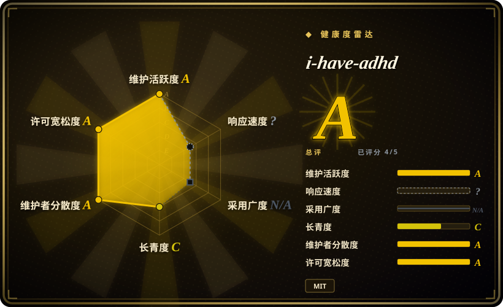
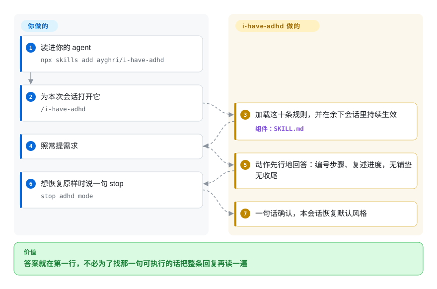

# i-have-adhd

你问 coding agent 一件事，它先回四段“好问题，让我想想”，真正能执行的那条命令埋在第三段。这是一个回复风格技能包：一份 10 条规则的 prompt，让 agent 每轮先说动作、把多步工作编号、复述进行到哪一步，并删掉“希望这对你有帮助”这类收尾。

## 何时使用

你整天开着一个 coding agent，回复是碎片化读的：夹在两件事之间、在手机上、被打断之后。回复技术上没毛病，只是写给错的读者——开头先声明「我准备做什么」，中间三段背景，真正能跑的命令夹在当中，结尾再问一句「还需要我继续深入吗」。你得滚动屏幕去找那一行可执行的命令，而下一轮回来时已经忘了自己走到五步里的第几步。i-have-adhd 用一份 142 行的规则文件重塑这条回复：第一行就是动作，多步工作编号列出，每轮复述进度（“第 3 步 / 共 5 步”），报错直接给位置＋原因＋修法，列表封顶五项。它覆盖的是整个会话而不只是单条回复，仓库还为大约 15 种 harness（Claude Code、Codex、Grok、Gemini CLI、Copilot、Cursor、Zed、OpenCode、Pi 等）各配了适配层，所以同一套形状能跟着你换工具。

选它而不是近邻替代品，各有一条理由：相比 [caveman](caveman.zh.md)，这里的约束是你的工作记忆而不是 token 账单——它要复述进度、把完成的部分显式亮出来，而简短风格覆盖层不做这件事；相比你自己往 `AGENTS.md` 里抄一条规则，它给了每种 harness 的接线（会话启动 hook 或插件）、可选的常驻开关，以及一份你能固定版本、能 diff 的规则文件；相比 [stop-slop](../ai-writing/de-ai-writing/stop-slop.zh.md) 这类去 AI 味的写作技能，那些是清理你要发布的文稿，这个改的是你当下要读的对话。

## 怎么用起来

这里面没有运行时，产物就是一个 Markdown 文件。`skills/i-have-adhd/SKILL.md` 装着十条编号规则并配了 bad/good 示例，前面有一段「ADHD 如何改变阅读」把规则背后的道理讲清楚，后面有六条例外处理「规则和任务冲突」的情况，以及一份要求模型在发出前自检的清单。仓库里其他东西都是为了把这段文字送到你的模型面前：各 harness 的插件清单、一个 `SessionStart` hook（会话打开时 agent 自动执行的一段命令，在会话启动时注入规则，压缩上下文之后再注入一次）、一个 OpenCode 插件。你通过 harness 安装或用 `npx skills add`，敲 `/i-have-adhd`，此后这个会话的每条回复都被这套规则塑形。常驻模式靠一个 flag 文件显式打开——`touch ~/.claude/.i-have-adhd-always`——hook 在每次会话启动时读它，所以只装插件不会改变任何行为；说一句 `stop adhd mode` 即可在本会话恢复。开常驻前值得知道的一个代价：在 Claude Code 上 hook 每个会话只注入一次，而 OpenCode 插件是每一轮都往 system prompt 追加一遍。你负责安装和两个开关，项目负责把规则一直放在模型眼前。

<!-- flow-steps:begin (generated from flows/i-have-adhd.json by tools/flow_card.py — do not edit) -->

流程文字版

1. **你**：装进你的 agent — `npx skills add ayghri/i-have-adhd`
2. **你**：为本次会话打开它 — `/i-have-adhd`
3. **i-have-adhd**：加载这十条规则，并在余下会话里持续生效 — 组件：`SKILL.md`
4. **你**：照常提需求
5. **i-have-adhd**：动作先行地回答：编号步骤、复述进度，无铺垫无收尾
6. **你**：想恢复原样时说一句 stop — `stop adhd mode`
7. **i-have-adhd**：一句话确认，本会话恢复默认风格

**价值**：答案就在第一行，不必为了找那一句可执行的话把整条回复再读一遍

<!-- flow-steps:end -->

## 何时不用

- **你只跑 Claude Code，且唯一的不满就是铺垫。** 它内置的 **Concise** output style 已经做到：先给结果、跳过铺垫与叙述、默认把回复压短，同时在你要求解释时仍完整回答，并保留报错全文与破坏性操作的确认——也就是规则 1 与规则 10 追求的效果，而且零依赖。规则 5–7（每轮复述进度、给具体时间估计、把完成的部分亮出来）和跨 harness 可移植性才是你额外获得的东西。来源：Claude Code output-styles 官方文档，2026-09-22 核对。
- **你的痛点是 token 花销，不是可读性。** 目标是少付 billed token 就用 [caveman](caveman.zh.md)——它的 MIT 技能缩短回复，可选的本地代理还会压缩 agent 反复读的日志和工具输出。i-have-adhd 的列表上限规则明确只约束呈现（不得限制分析、检索、工具结果、候选生成），所以它不是成本合同——而常驻模式还会反复注入规则，反而增加输入 token。
- **你要去 AI 味的是要发布的文档。** 用 [stop-slop](../ai-writing/de-ai-writing/stop-slop.zh.md) 或 [humanizer](../ai-writing/de-ai-writing/humanizer.zh.md)。那些作用于文稿，这个作用于对话回复，两者不能互相替代。
- **你需要 agent 自己动手，而不是把改动推回给你。** 用带真实自主性的方法学 harness，例如 [Superpowers](../../agent-dev-methodology/coding-agent-harnesses/superpowers.zh.md)。这个仓库自己的评测支撑不了这条主张：`agent-owned-edit` 这条 case 因为 runner 剥掉了工具而谁都过不了，`RESULTS.md` 自己写明了。
- **你的报错必须诚实表达不确定，而不是干脆利落。** 规则 8 要求「原因＋修法」，却没有「原因尚未确定」这一支；项目自己的评测记录了一次回归（`partial-success`，3 次试验均值 −0.63），评分者的评语是模型在毫无证据时把某个原因断言成了定论。如果校准过的不确定性比一条漂亮报错更重要，自己补上这一支，或换别的技能。
- **你的 harness 可能无视 `disable-model-invocation`。** 这个技能默认保持按需启用，但它的安装文档承认部分 harness 会在启动时加载所有技能描述并自行激活——那种情况下每条回复都会在你没要求时改变形状。如果确认不了自己的 harness 是否尊重该标记，就把规则写进你自己的 `AGENTS.md`。
- **你需要硬保证。** 所有约束都在 prompt 层：没有任何机制校验回复是否真的遵守，项目也没有声称相反。把它当建议层看待。

## 横向对比

| 替代品 | 是否收录 | 我们的评价 | 取舍 |
|---|---|---|---|
| [caveman](caveman.zh.md) | ✅ | 痛点是回复形状、读者工作记忆短，选 i-have-adhd；痛点是 token 花销——包括 agent 反复读进去的日志和工具输出——选 caveman。 | i-have-adhd 多出跨轮行为（复述进度、显式亮出成果、保留真实的不确定性措辞），代价是规则更长，常驻时增加输入 token；caveman 的技能是更短的覆盖层，可选代理还会压缩 agent 读进去的东西。 |
| [stop-slop](../ai-writing/de-ai-writing/stop-slop.zh.md) | ✅ | 产物是你将要发布的文档，选 stop-slop；产物是 agent 自己的回复，选 i-have-adhd。 | 去 AI 味规则就地把文稿改一遍，对正式文体可能改过头；i-have-adhd 不碰你的文件，改的是 agent 跟你说话的方式。 |
| [humanizer](../ai-writing/de-ai-writing/humanizer.zh.md) | ✅ | 与 stop-slop 同轴、偏英文：两者都用于书面产出，不用于聊天回复。 | humanizer 针对已发布文稿里的 AI 痕迹，带插件与安装文档；i-have-adhd 针对实时对话，那里的 AI 痕迹是铺垫和收尾客套。 |
| Claude Code 内置的 output style（`/output-style`，含 **Concise**） | 非仓库 | 只跑 Claude Code 且问题就是铺垫，直接用内置的 Concise，不必安装；还需要跨轮行为或想让同一形状覆盖其它 harness，选 i-have-adhd。 | 内建在闭源 CLI 里，不是仓库：没有多 harness 可移植性，也没有可 fork、可固定版本的规则文件——但 Concise 已经覆盖「先给结果、去掉铺垫、被要求解释时完整回答」，且零依赖。 |
| 你自己往 `AGENTS.md` 里写的一条规则 | 非仓库 | 只要一种 harness、要求措辞精确、不想引入依赖，就自己写；想要跨 harness 跟着走并附带评测，选 i-have-adhd。 | 这不是仓库而是一种做法。漂移由你自己负责，每种工具都要重抄一遍；换来的是措辞完全可控、零依赖。 |

## 健康度与可持续性

- **维护快照（2026-09-22）：** 活跃——健康度评分器看到最近一次提交在 3 天前，最近 13 周里有 10 周有活动，`archived=false`，`pushed_at=2026-09-19T16:44:46Z`，245 次提交里最近 30 天有 61 次，维护一项评为 `A`。缺口在发布习惯：**没有 release、没有 tag**，版本号（`0.3.0`）只存在于 `package.json`，没有可固定的产物，也没有 changelog 可用来看两次安装之间的差异。
- **治理与 bus factor：** GitHub 显示仓库归 **User**（`ayghri`）所有——没有组织、没有基金会，路线图与规则文件的归属在一个人手上。贡献集中度是中等而非极端：在默认分支上评分器数到 49 位活跃贡献者，第一位占 36.3%、前三位占 51%，治理一项评为 `A`；而仓库级 commits API（把已合并的分支提交也算进去）给出同一位作者 134/245，所以这位 owner 的占比大致在三分之一到 55% 之间。反向证据：`CONTRIBUTING.md` 有一套异常明确的署名政策——每个 PR 必须声明是 Human／Autonomous-agent／Hybrid，披露 agent 与模型，并禁止把「由产出它的同一个 agent 复核过」的工作称为独立验证；仓库还开了一个 `AI Agora` 讨论线程（#127，2026-08-21 起开放）作为允许 agent 发言的标签化论坛。在一个成立仅四个月的仓库里，这种成文的评审纪律很少见。
- **采用度（2026-09）：** 约 50.1k stars、2,882 forks、154 watchers，用时约四个月。应当看作关注度而不是采用度：技能包没有包管理器，安装量无从测量，而这条曲线对它的年龄而言是炒作形状。[推断]
- **年龄与 Lindy（2026-09-22）：** 创建于 2026-05-13，约四个月（评分器块里 132 天）——**年龄上未被证明**，耐久性一项评为 `C`；而且它就是一份 142 行的 prompt，fork 成本是一个下午，没有任何东西把你绑在上游。年龄 × 仍活跃读作「年轻但非常活跃」。整体雷达在 6 个轴中的 4 个上落在 `A`，响应性与采用度不可测（`?`），因为技能包没有可评分的包管理面或 issue 响应面。
- **风险信号：** MIT，无改协议历史。约束在 prompt 层，因此是建议性的。积压为 25 个 issue 加 45 个 open PR，最老的 open PR 停在 2026-08-19（超过一个月）——评审吞吐在开始消耗贡献者的量级上成了瓶颈。文档面（README ＋ 9 种语言的 `INSTALL.md`，每种都手抄一份常驻规则片段）是持续性的维护重量；那些重复片段没有任何 CI 同步校验，而 `.cursor` 镜像有。
- **语言说明：** GitHub 报 `primaryLanguage: Python`，是因为评测与测试脚本是 Python（`scripts/*.py`、`tests/*.py`；2026-09 统计约 120 KB Python 对 10 KB TypeScript、7 KB JavaScript、3 KB Shell+PowerShell）。你真正装的东西是 Markdown。

## 存疑（未验证）

- [未验证] 这十条规则在*你的* harness 上长会话里是否守得住。项目自己的数据是 14 条 case、3 次试验，盲评者与产出方同属一个模型家族，84 条回复里有 3 条泄漏了工具调用语法；这些都未在此复现，且 `RESULTS.md` 记录的 release gate 是 FAILED。
- [未验证] 文档里约 15 种 harness 集成各自的实际激活行为。我读了 Claude Code 的 hook、`.opencode` 插件、各清单和 `INSTALL.md` 文字，但没有逐个运行对应 runtime。
- [推断] 规则 8 缺少「原因未知」分支，是项目自己那次 `partial-success` 回归的机制性原因；`RESULTS.md` 把它写成需要更多试验验证的假设，并非已确认的成因。
- [推断] 约 50k stars 说明的是关注度而非采用度：技能包没有 registry 或遥测，外部无法测量安装量。
- [未验证] 未做安全审查。`SessionStart` hook 会在会话启动时执行一行 Node 命令去 import `hooks/always-on.mjs`；任何失败都 `exit 0`，且只在 opt-in 的 flag 文件存在时才做事——只读了代码，没有实际执行。
