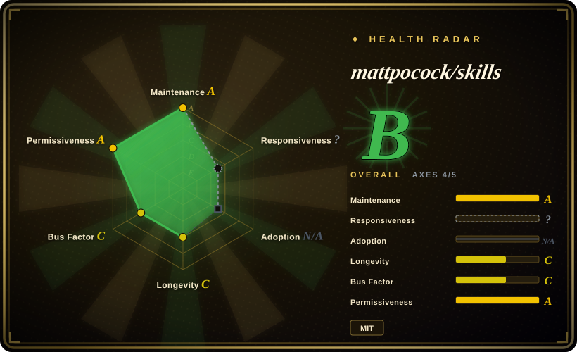
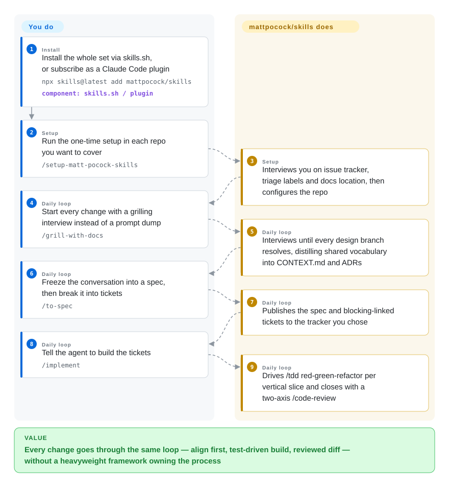

# mattpocock/skills

Matt Pocock's engineering skill pack for Claude Code and skills.sh: grilling, domain docs, TDD, bug diagnosis, architecture, review, tickets, and implementation flow.

## When to use

You're using Claude Code, Codex, or another Agent-Skills-compatible coding agent on a real application, and the failure mode is not model capability but weak process: unclear requirements, vague domain language, missing TDD loops, sloppy bug diagnosis, unreviewed diffs, or architecture drift. Pick mattpocock/skills when you want a compact engineering playbook, installed one of two ways with opposite philosophies — a Claude Code plugin from the official marketplace (subscribe: updates ship when the author releases) or a skills.sh copy (fork: plain files you edit) — then configured per repo with `/setup-matt-pocock-skills`.

Choose it over a broad personal collection when you specifically want software-engineering rituals rather than content creation or persona prompts. It is opinionated around issue trackers, docs, tickets, and review flow, so it is strongest when your repo can absorb that process.

## How it works

There is no runtime: every skill is a markdown `SKILL.md` your agent loads on demand, so the pack adds discipline, not infrastructure. The skills split on one axis — *who can invoke them*: user-invoked skills (`/grill-with-docs`, `/triage`, `/implement`) are routers you type, and model-invoked skills (`/tdd`, `/code-review`, `/domain-modeling`) hold the reusable habits the agent may reach for itself. The core loop is *grilling* — the agent interrogates you about a change until every branch of the design tree is resolved — and `grill-with-docs` folds the answers into a shared-language glossary (`CONTEXT.md`) and decision records (ADRs), which cuts verbosity and token burn on every later session. You do the alignment and the reviewing; the skills only enforce the sequence — spec, tracer-bullet tickets (small tasks that declare which tasks block them), red-green-refactor implementation, a two-axis review (does the diff follow the repo's standards? does it match the spec?). Pocock's stated tradeoff against GSD/BMAD/Spec-Kit: those own the whole process for you, this hands you small composable pieces you can edit or override.

<!-- flow-steps:begin (generated from flows/mattpocock-skills.json by tools/flow_card.py — do not edit) -->

Text version of the flow

1. **You** (Install): Install the whole set via skills.sh, or subscribe as a Claude Code plugin — `npx skills@latest add mattpocock/skills` — component: `skills.sh / plugin`
2. **You** (Setup): Run the one-time setup in each repo you want to cover — `/setup-matt-pocock-skills`
3. **mattpocock/skills** (Setup): Interviews you on issue tracker, triage labels and docs location, then configures the repo
4. **You** (Daily loop): Start every change with a grilling interview instead of a prompt dump — `/grill-with-docs`
5. **mattpocock/skills** (Daily loop): Interviews until every design branch resolves, distilling shared vocabulary into CONTEXT.md and ADRs
6. **You** (Daily loop): Freeze the conversation into a spec, then break it into tickets — `/to-spec`
7. **mattpocock/skills** (Daily loop): Publishes the spec and blocking-linked tickets to the tracker you chose
8. **You** (Daily loop): Tell the agent to build the tickets — `/implement`
9. **mattpocock/skills** (Daily loop): Drives /tdd red-green-refactor per vertical slice and closes with a two-axis /code-review

**Value**: Every change goes through the same loop — align first, test-driven build, reviewed diff — without a heavyweight framework owning the process

<!-- flow-steps:end -->

## When NOT to use

- **You only want web-quality audits.** Use [web-quality-skills](addyosmani-web-quality.md) for Lighthouse, Core Web Vitals, accessibility, SEO, and performance checklists; mattpocock/skills is broader engineering process.
- **You need a vendor's deployment playbook.** Use [Vercel Agent Skills](vercel-agent-skills.md) for React/Next.js/Vercel-specific deployment and docs audit work; mattpocock/skills is model- and platform-agnostic.
- **You cannot add process artifacts.** If your environment rejects tickets, domain docs, ADRs, or setup questions, use a smaller single skill such as [Waza](waza.md) or a local rule instead.
- **You want a full autonomous SDLC framework.** Evaluate BMAD, Spec Kit, or GSD-style systems (not indexed) if you deliberately want the process to own orchestration; this pack is explicitly positioned as smaller and composable.
- **You need neutral organization-owned policy.** Use an internal skill set when external personal conventions, newsletter links, or Matt Pocock's opinions are not acceptable in enterprise agent prompts.

## Comparison

| Alternative | In index | Our verdict | Tradeoff |
|---|---|---|---|
| [Waza](waza.md) | ✅ | When you want a small set of eight engineering habits, pick Waza; when you want a larger repo setup, issue/ticket flow, and TDD/review loop, pick mattpocock/skills. | Waza is lighter; mattpocock/skills gives more orchestration and setup surface. |
| [Agent Skills (addyosmani)](addyosmani-agent-skills.md) | ✅ | For production quality/security/performance/API/ship commands, pick addyosmani's pack; for requirement grilling, domain modeling, TDD, and code review workflow, pick mattpocock/skills. | addyosmani is broader production checklisting; mattpocock is more process-and-design oriented. |
| [Vercel Agent Skills](vercel-agent-skills.md) | ✅ | For Vercel/Next.js deployment guidance, pick Vercel's official pack; for model-agnostic engineering rituals across stacks, pick mattpocock/skills. | Vercel has first-party product fit; mattpocock travels better across stacks. |
| [Spec Kit](../../agent-dev-methodology/spec-driven-development/spec-kit.md) | ✅ | If you want a full spec-driven development workflow, evaluate Spec Kit; pick mattpocock/skills when you want smaller composable skills you can adapt. | Spec Kit provides stronger rails; mattpocock/skills is easier to override skill by skill. |
| BMAD / GSD | 未收录 | If you want a full SDLC framework to own the process, evaluate these; pick mattpocock/skills when you want lighter engineering rituals. | Frameworks can provide more orchestration but can be harder to debug or override. |

## Health & viability

- **Maintenance snapshot (2026-09-27):** GitHub reports `archived=false` and `pushed_at=2026-09-24T14:07:55Z`; ≥100 commits to `main` in the last three months, and the repo now ships tagged releases (v1.0.1 2026-06 → v1.2.3 2026-08) plus an official Claude Code marketplace entry. The health scorer grades maintenance `A`.
- **Adoption snapshot:** GitHub API reports ~270,516 stars / ~22,778 forks as of 2026-09 — roughly +100k stars in the ~2.5 months since the last check. The README cites a ~60k-subscriber newsletter; treat this as strong social proof, not automatic fit.
- **License snapshot:** root `LICENSE` is MIT and GitHub metadata reports MIT; no relicense history.
- **Lindy / governance:** created 2026-02-03, so ~8 months old — longevity stays `C`; governance is `C` because the scorer sees an extremely concentrated contributor distribution (Pocock accounts for nearly all commits).
- **Risk flags:** the pack is highly opinionated and personal; run `/setup-matt-pocock-skills` in a test repo before making it the default team workflow. The plugin install path updates your skills behind your back — pin behavior by switching to the skills.sh copy if you need to audit changes.

## Caveats (unverified)

- [未验证] GitHub-Michelin did not execute the setup command or install the Claude Code plugin; verify behavior in your own harness.
- [未验证] The README's claims about effectiveness of these engineering practices are not independently measured here.
- [推断] The high star count and author reputation reduce discovery risk, but the repo is still young and contributor concentration remains a governance concern.
- [未验证] Release cadence beyond v1.2.3 (2026-08) and whether the newsletter-sourced growth will sustain — star velocity this hot is itself a hype-cycle signal.
