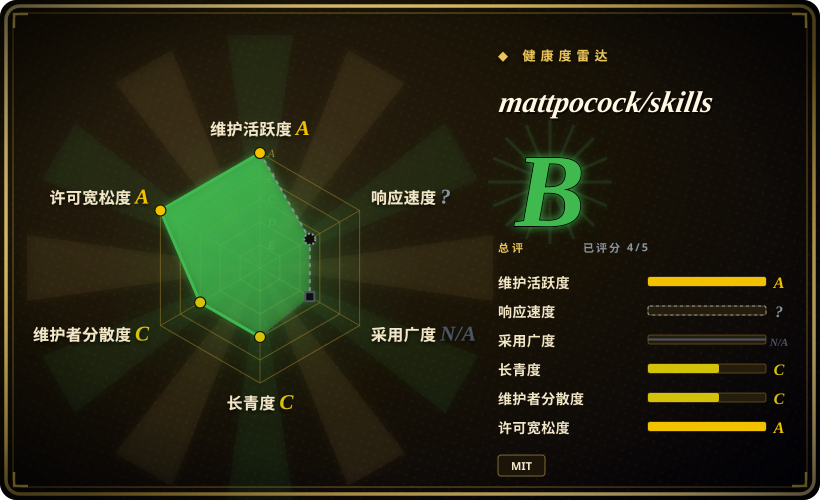
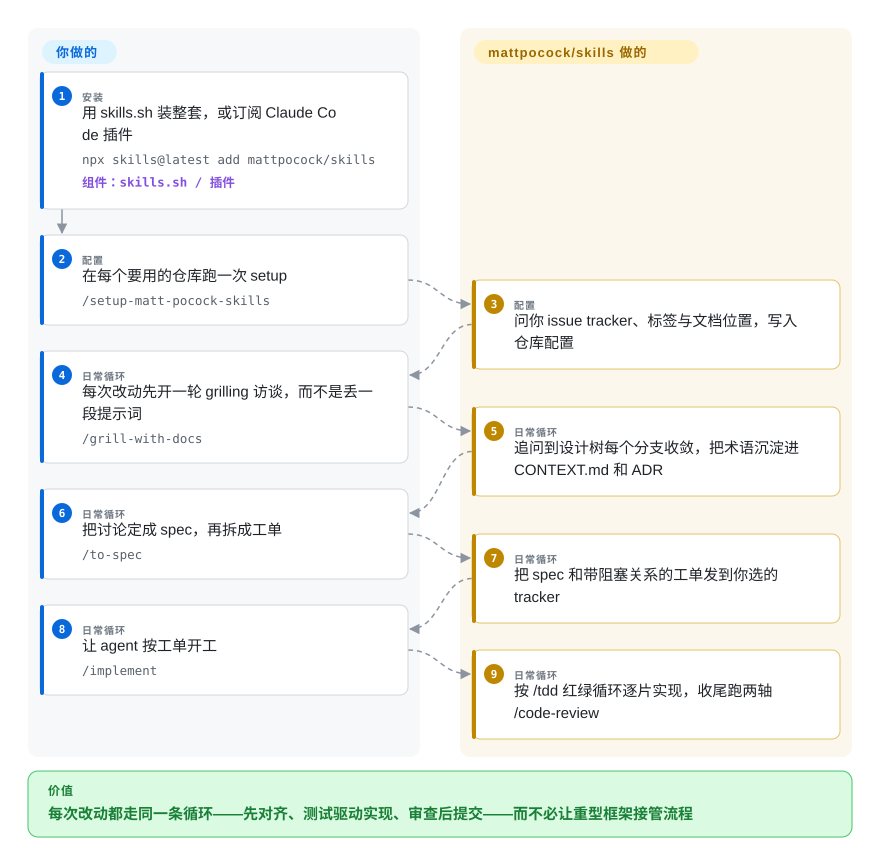

# mattpocock/skills

Matt Pocock 的工程 skill 包，面向 Claude Code 和 skills.sh，覆盖 grilling、domain docs、TDD、bug 诊断、架构、review、tickets 和实现流程。

## 何时使用

你在 Claude Code、Codex 或其他兼容 Agent Skills 的 coding agent 上开发真实应用，失败模式不是模型能力，而是流程薄弱：需求没问清、领域语言含糊、缺 TDD 循环、bug 诊断随意、diff 没审、架构持续劣化。此时可选 mattpocock/skills：它是一套紧凑工程 playbook，安装方式有二、哲学相反——从 Claude Code 官方 marketplace 订阅 plugin（跟随作者发版自动更新），或用 skills.sh 复制成自己可改的普通文件——再通过 `/setup-matt-pocock-skills` 为每个 repo 配置。

如果你明确要的是软件工程仪式，而不是内容生产或人设 prompt，它比宽泛个人合集更合适。它对 issue tracker、文档、tickets 和 review flow 有明显主张，因此最适合能吸收这些流程的仓库。

## 怎么用起来

它没有运行时：每个 skill 都是 agent 按需加载的 markdown `SKILL.md`，所以这套包加的是纪律，不是基础设施。skill 按一条轴划分——谁能调用：用户触发的 skill（`/grill-with-docs`、`/triage`、`/implement`）是你亲手输入的编排器，模型触发的 skill（`/tdd`、`/code-review`、`/domain-modeling`）承载可复用的纪律，agent 判断任务匹配时自己就会去用。核心循环是 grilling——agent 反过来盘问你，直到需求设计树的每个分支都有答案；`grill-with-docs` 还会把答案沉淀成共享术语表（`CONTEXT.md`）和决策记录（ADR），让之后每个会话都更省 token、更少废话。你做对齐和裁决，skill 只强制顺序：spec、tracer-bullet 工单（每张都是能独立跑通的小任务，并声明阻塞关系）、红绿重构式实现、两轴审查（diff 是否符合仓库规范？是否忠实实现了 spec？）。作者对 GSD/BMAD/Spec-Kit 的表态即其取舍：那些框架把流程整个接管，这里给你的是可改、可覆盖的小件。

<!-- flow-steps:begin (generated from flows/mattpocock-skills.json by tools/flow_card.py — do not edit) -->

流程文字版

1. **你**（安装）：用 skills.sh 装整套，或订阅 Claude Code 插件 — `npx skills@latest add mattpocock/skills` — 组件：`skills.sh / 插件`
2. **你**（配置）：在每个要用的仓库跑一次 setup — `/setup-matt-pocock-skills`
3. **mattpocock/skills**（配置）：问你 issue tracker、标签与文档位置，写入仓库配置
4. **你**（日常循环）：每次改动先开一轮 grilling 访谈，而不是丢一段提示词 — `/grill-with-docs`
5. **mattpocock/skills**（日常循环）：追问到设计树每个分支收敛，把术语沉淀进 CONTEXT.md 和 ADR
6. **你**（日常循环）：把讨论定成 spec，再拆成工单 — `/to-spec`
7. **mattpocock/skills**（日常循环）：把 spec 和带阻塞关系的工单发到你选的 tracker
8. **你**（日常循环）：让 agent 按工单开工 — `/implement`
9. **mattpocock/skills**（日常循环）：按 /tdd 红绿循环逐片实现，收尾跑两轴 /code-review

**价值**：每次改动都走同一条循环——先对齐、测试驱动实现、审查后提交——而不必让重型框架接管流程

<!-- flow-steps:end -->

## 何时不用

- **你只想做 Web 质量审计。** 用 [web-quality-skills](addyosmani-web-quality.zh.md) 处理 Lighthouse、Core Web Vitals、无障碍、SEO 和性能清单；mattpocock/skills 是更宽的工程流程。
- **你需要厂商部署 playbook。** React/Next.js/Vercel 特定部署和文档审计选 [Vercel Agent Skills](vercel-agent-skills.zh.md)；mattpocock/skills 是跨模型、跨平台的工程仪式。
- **你不能增加流程产物。** 如果环境拒绝 tickets、domain docs、ADR 或 setup 问题，用 [Waza](waza.zh.md) 这类更小的单组 skill 或本地规则。
- **你想要完整自治 SDLC 框架。** 如果刻意让流程接管编排，评估 BMAD、Spec Kit 或 GSD 类系统（未收录）；本包明确定位为更小、更可组合。
- **你需要中性的组织级政策。** 如果企业 prompt 里不能接受外部个人约定、newsletter 链接或 Matt Pocock 的个人观点，请使用内部 skill set。

## 横向对比

| 替代品 | 是否收录 | 我们的评价 | 取舍 |
|---|---|---|---|
| [Waza](waza.zh.md) | ✅ | 如果只要八个轻量工程习惯，选 Waza；如果要更大的 repo setup、issue/ticket flow 和 TDD/review 循环，选 mattpocock/skills。 | Waza 更轻；mattpocock/skills 给出更多编排和设置表面。 |
| [Agent Skills（addyosmani）](addyosmani-agent-skills.zh.md) | ✅ | 如果要生产质量、安全、性能、API、发布命令，选 addyosmani 包；如果要需求 grilling、domain modeling、TDD 和 code review 工作流，选 mattpocock/skills。 | addyosmani 更像生产 checklist；mattpocock 更偏流程与设计。 |
| [Vercel Agent Skills](vercel-agent-skills.zh.md) | ✅ | Vercel/Next.js 部署指导选 Vercel 官方包；跨技术栈工程仪式选 mattpocock/skills。 | Vercel 有一方产品适配；mattpocock 跨栈迁移性更好。 |
| [Spec Kit](../../agent-dev-methodology/spec-driven-development/spec-kit.zh.md) | ✅ | 如果你要完整的 spec-driven 开发工作流，评估 Spec Kit；如果要较小、可组合、可改的 skill，选 mattpocock/skills。 | Spec Kit 轨道更强；mattpocock/skills 更容易逐个 skill 覆盖。 |
| BMAD / GSD | 未收录 | 如果你要完整 SDLC 框架接管流程，评估这些；如果只要较轻的工程仪式，选 mattpocock/skills。 | 框架可提供更多编排，但更难调试或覆盖。 |

## 健康度与可持续性

- **维护快照（2026-09-27）：** GitHub 返回 `archived=false`，`pushed_at=2026-09-24T14:07:55Z`；近三个月 `main` 分支提交超过 100 次，且已开始发带标签版本（v1.0.1 2026-06 → v1.2.3 2026-08），并进入 Claude Code 官方 marketplace。健康度评分器给 maintenance `A`。
- **采用快照：** GitHub API 在 2026-09 返回约 270,516 个 star、约 22,778 个 fork——距上次核查约 2.5 个月增长约 10 万 star；README 提到约 6 万订阅者的 newsletter。这代表强社会证明，不等于自动适配。
- **许可证快照：** 根目录 `LICENSE` 为 MIT，GitHub 元数据也返回 MIT，无重新授权历史。
- **Lindy / 治理：** 仓库创建于 2026-02-03，约 8 个月大，longevity 保持 `C`；评分器看到贡献者分布极度集中（Pocock 本人几乎提交一切），governance 为 `C`。
- **风险信号：** 该包强主张且个人化；把它设为团队默认工作流前，先在测试 repo 运行 `/setup-matt-pocock-skills`。plugin 安装路径会在你背后自动更新 skill——需要审计每次变更时，改用 skills.sh 复制方式自行拉取。

## 存疑（未验证）

- [未验证] GitHub-Michelin 没有执行 setup 命令或安装 Claude Code plugin；请在自己的 harness 中验证行为。
- [未验证] README 对这些工程实践效果的描述未在本页独立测量。
- [推断] 高 star 和作者声誉降低发现风险，但仓库仍年轻，贡献者集中度仍是治理风险。
- [未验证] v1.2.3（2026-08）之后的发版节奏、以及靠 newsletter 驱动的增长能否持续——这种量级的 star 增速本身就是炒作周期信号。
