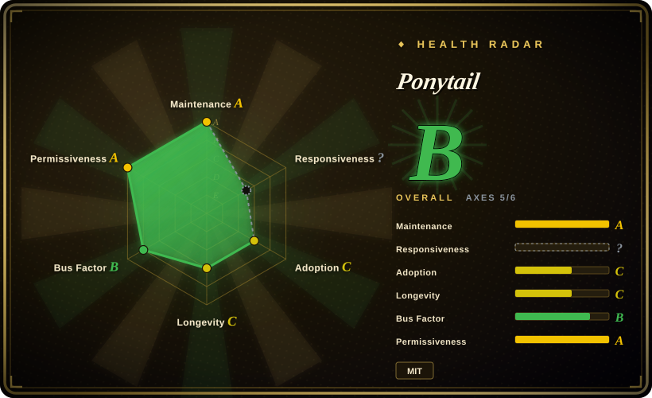
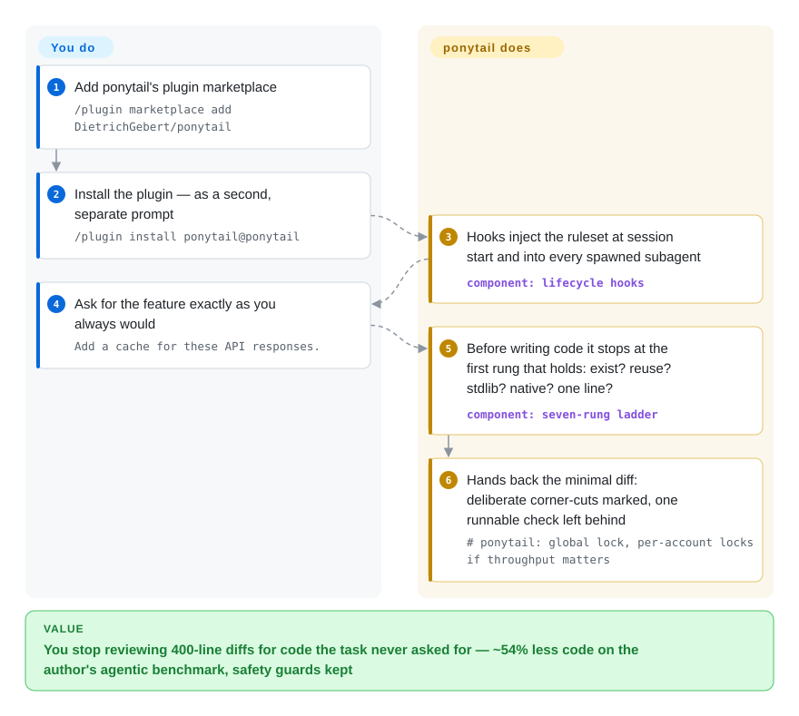

# Ponytail

You ask your coding agent for a date picker and it installs a library or hand-builds a 335-line calendar, when the repo already had an `Input` component and every browser ships `type="date"`. Ponytail installs the reflex of the laziest senior dev you've ever met as an always-on ruleset. Before writing, the agent lists everything the change must reach. It then takes the first rung of a short ladder that works (skip it, reuse it, stdlib, installed dependency, one line), and ends each reply with what it skipped or did not check. Validation, security and error handling are never on the chopping block.

## When to use

You drive Claude Code, Codex, Copilot CLI, or one of the ~20 other hosts Ponytail ships adapters for. The failure you keep hitting is bloat, not process: the agent adds a dependency where the standard library had it, writes a cache class where `@lru_cache` would do, and leaves a 400-line diff for a 20-line task. Reach for Ponytail when you want a behavior overlay that writes the smallest *complete* change. It installs with two slash commands and has intensity levels (`lite/full/ultra/off`). Since 5.0 (2026-10-08) it adds `/ponytail-review` (a full review of the current change: bugs, security, load, missing tests, speed, what to cut) and `/ponytail-audit` (the same checks over the whole repo, ranked).

Why install a pack instead of writing your own "YAGNI, write one-liners" line? In the author's June benchmark the bare prompt was erratic and was the only arm that dropped a safety guard [未验证：作者自建基准，未独立复现，见 benchmarks/results/2026-06-18-agentic.md]. The pack also keeps one ruleset aligned across ~20 host adapters with a CI check, where hand-rolled rules drift per editor.

## How it works

You install it once. Hosts with plugins (Claude Code, Codex, Copilot CLI, OpenCode, Gemini, Grok, Devin, Hermes…) get the plugin. Instruction-only hosts (Cursor rules, Windsurf, Cline, Copilot Chat, Kiro…) get a copy of `AGENTS.md` or the matching rules file. Lifecycle hooks then do the work: small Node scripts the host runs at session start, on each prompt, and when a subagent spawns. They inject the ruleset, track `/ponytail lite|full|ultra|off` switches, and scope subagent injection when you set the `PONYTAIL_SUBAGENT_MATCHER` regex.

New in 5.0, the session-start hook also appends a **codebase map**: the top-level functions, classes and exports of the repo's source files, one line per folder, within a 2,000-character budget. It is built from `git ls-files` plus a per-language regex, with no model involved. The point is that "reuse first" costs no search. `PONYTAIL_MAP=0` turns it off.

The ruleset itself is prose, not enforcement. The agent first reads the code and lists every caller, test, fixture and config the change must reach. Then it takes the first option that fully works: skip it, reuse what the codebase has, stdlib or platform feature, an installed dependency, one readable line, else the minimum. It keeps explicit carve-outs: trust-boundary validation, data-loss error handling, security, accessibility, and anything the user asked for. New non-trivial logic leaves one small test or assert. A known shortcut gets a `shortcut: <limit>, <when to upgrade>` comment; this neutral marker replaced the branded `ponytail:` in 5.1. Every reply ends with what was skipped and any risk.

`/ponytail-debt` harvests those comments into a ledger. It changes what the agent writes; it does not gate what the agent may ship.

<!-- flow-steps:begin (generated from flows/ponytail.json by tools/flow_card.py — do not edit) -->

Text version of the flow

1. **You**: Add ponytail's plugin marketplace — `/plugin marketplace add DietrichGebert/ponytail`
2. **You**: Install the plugin — as a second, separate prompt — `/plugin install ponytail@ponytail`
3. **Ponytail**: At session start, hooks inject the ruleset and a map of the repo's existing code; subagents get it too — component: `lifecycle hooks + codebase map`
4. **You**: Ask for the feature exactly as you always would — `Add a date picker to the frontend.`
5. **Ponytail**: Lists the callers, tests and config the change must reach, then takes the first rung that works — component: `smallest complete change`
6. **Ponytail**: Hands back the minimal diff, a test for real logic, and a closing line on what it skipped — `shortcut: <the limit>, <when to upgrade>`

**Value**: You stop reviewing 300-line diffs nobody asked for: ~53% less code on the author's Opus 5.5 benchmark, tests on 98% of logic that needs one

<!-- flow-steps:end -->

<!-- flow-steps:begin -->
<!-- flow-steps:end -->

## When NOT to use

- **You want the agent to follow a whole development process** (brainstorm → plan → TDD → verify), not just write less: use [Superpowers](../../agent-dev-methodology/coding-agent-harnesses/superpowers.md) or [ECC](../../agent-dev-methodology/coding-agent-harnesses/ecc.md) instead. Ponytail installs no workflow, no phases and no subagent pipeline; it only bends what counts as "done code".
- **Your pain is the agent's verbosity, not its volume of code**: pair it with, or use, [caveman](caveman.md) or [i-have-adhd](i-have-adhd.md). Ponytail governs what gets built. In the author's June benchmark the terse-prose arm (caveman) cut only −20% LOC and *raised* tokens and cost on feature tasks.
- **You open repos you don't trust, or work from slow or huge filesystems, with the hook plugin**: set `PONYTAIL_MAP=0`. The 5.0 codebase map copies names straight out of the opened repo into hidden session context. A crafted export list or folder name reaches the model as if it were plugin instructions, and a tracked symlink to `/dev/zero` hangs the hook until timeout (issue #1071). On a slow mount the map can blow the 5-second SessionStart timeout before any rules are emitted (#1079). Both were open on 2026-10-10.
- **Your project shell pins Node below 15** (an old `.nvmrc` in a monorepo): the 5.1 hook launchers call `replaceAll` and fail on every run, so the rules silently stop reaching the model (#1072, open 2026-10-10). Use the `AGENTS.md` copy instead of the plugin until that is fixed.
- **You need a deterministic guarantee that bloated or unsafe code won't ship**: this is context-injected persuasion, and compliance is model-dependent. `/ponytail-review` is a model-run review you call by hand, not a merge gate. For enforcement with evidence, put a line-level CI reviewer such as [Open Code Review](../../ai-code-review/open-code-review.md) in front of the merge.
- **Your host or model is not Claude Code + Opus**: the v5 numbers come from that one combination. An earlier README warned that a deliberative reasoning model can spend *more* thinking tokens weighing each rung (it named GPT-5.5) [未验证：作者自述，未复现]. If cost matters, measure on your own stack first, and start with `lite`.
- **Your tasks are already minimal** (CRUD over an existing template): in the author's per-task table the arms converge on irreducible code (e.g. 9 / 9 / 9 lines on `reuse-money`). The overlay buys little there while occupying context every turn.

## Comparison

| Alternative | In index | Our verdict | Tradeoff |
|---|---|---|---|
| [caveman](caveman.md) | ✅ | Pair rather than pick: caveman shrinks what the agent says, Ponytail shrinks what it writes. If you can fix only one first, fix the code: their shared June benchmark shows terse prose alone cut little code and raised token spend (+7%) and cost (+3%) on feature tasks. | Stacking two always-on overlays costs context each turn. Caveman's optional proxy layer is BSL-1.1 source-available; Ponytail is MIT end to end. |
| [Superpowers](../../agent-dev-methodology/coding-agent-harnesses/superpowers.md) | ✅ | When the agent's failure is process (skipped plans, unverified "done"), pick Superpowers. When the failure is bloat and your process already works, pick Ponytail, which trims code without taking over how you work. | Superpowers installs a full methodology (commands, subagents, worktrees) that you adopt wholesale. Ponytail installs one behavioral rule with an off-switch and a measured scoreboard. |
| [ECC](../../agent-dev-methodology/coding-agent-harnesses/ecc.md) | ✅ | Pick ECC when you want a batteries-included Claude Code kit (agents, hooks, memory, security scan) as the platform. Pick Ponytail when you want to change exactly one failure mode of a working setup, over-engineering, with intensity you can dial. | ECC grows your installed surface and you own the integration. Ponytail stays small, but its benefit ceiling is code size and cost; per-task gains vanish where there is nothing to cut. |
| A bare "write one-liners / YAGNI" line in your AGENTS.md | not a repo | Copying one sentence is free, and the v5 `AGENTS.md` is only ~30 lines you could paste yourself. The plugin earns its install with the codebase map, level switching, subagent injection and the review/audit commands. In the June benchmark the bare prompt was erratic and the only arm to drop a guard; the v5 run had no bare-prompt arm. | Zero install, zero hooks and no repo text in hidden context, vs plugin conveniences that need `node` ≥15 on PATH and a ruleset you get versioned instead of hand-maintained. |

## Health & viability

- **Maintenance** (verified 2026-10-10 via GitHub API): latest release v5.1.0 on 2026-10-08. There were eight releases between 2026-10-02 and 10-08, including the 5.0 rewrite of the rules, review and audit (PR #1061). Open counts are 17 issues and 27 PRs, down from 310 open on 2026-09-28: 129 issues were closed after 09-28, 58 of them as not planned. That is a bulk triage, so "17 open" says more about the cleanup than about responsiveness.
- **Governance / bus factor**: a single personal account (owner type `User`). Per the contributors API, the author has 145 commits and the next contributor has 12. `.github/CONTRIBUTING.md` sets a real gate: a change to the ruleset merges only with a three-arm benchmark (no skill / `main` / the branch) on the same task and model, and new skills come only from the maintainer. CI (test.yml, publish.yml) includes a script that keeps the ~20 rule copies aligned.
- **Backing & longevity**: created 2026-06-12, too young for Lindy credit. Funding is GitHub Sponsors plus one visible sponsor (GreenPT). The README still carries a ponytail.dev "Something's coming" waitlist banner and now an "Already built with Ponytail" showcase. Open-core or relicense risk is watch-listed, not observed. The `LICENSE` file is still MIT.
- **Adoption & ecosystem** (dated 2026-10-10): ~159.7k stars against 365 watchers, a virality shape. Stars rose ~12k between 09-28 and 10-10, alongside the 10-05 Spanish/Korean/Simplified-Chinese/Japanese READMEs, the Kimi Code adapter and the 10-08 Ponytail 5 launch [推断：时间相关，非因果核实]. Verifiable usage: npm `@dietrichgebert/ponytail` ~94k downloads in the 30 days to 10-08 (vs ~57k a month earlier). The benchmark harness is open (`benchmarks/agentic/`), above the norm for prompt packs, though the test-sorting and mutation tools behind the v5 test numbers are "not in this repo yet".
- **Risk flags**: the original 80–94% headline was conceded inflated and re-measured (issue #126). The v5 headline (−53% code, −26% cost) comes with confidence intervals and a limits section, but it is still the author measuring the author's tool. 5.0 added a hook that copies repo text into hidden context (#1071) and can stall startup (#1079), and 5.1 hooks break on Node <15 (#1072); all three were open on 2026-10-10. Fixed since the last check: the OpenCode 2 no-op (#863, closed 10-02, now `opencode plugin add`) and a v4.10.2 regression that loaded Codex/VS Code/Qwen hook-less (fixed in v4.11.0).

## Caveats (unverified)

- [未验证：未独立复现] All v5 benchmark figures come from the author's harness: −53% LOC, −41% time, −26% cost, −45% output tokens, a test on 98% of logic that needs one (vs 68%), and 87/90 vs 86/90 hidden checks. The setup is one host (Claude Code), one model (Opus 5.5), n=5, with Bash disabled so agents never ran their code. The writeup lists these limits itself.
- [未验证：作者自建基准] The blind reply judge (Sonnet 5.5) preferred Ponytail 5 over v4.13 (110:67) but leaned slightly to the *no-skill* replies (82:106, p=0.09). The "ends with what it skipped" habit beats the old Ponytail, not a plain agent.
- [未验证：作者自述] Deliberative reasoning models (an earlier README named GPT-5.5) may spend *more* thinking tokens on the ladder. The v5 README no longer says this, and no third-party reproduction was found.
- [未验证：仅读 issue 复现步骤，未在本地跑] Codebase-map injection, the symlink hang (#1071), the slow-filesystem timeout (#1079) and the Node <15 crash (#1072) rest on the reporters' reproductions.
- [推断：由 star/watcher 比与发版时间线推断] Star growth is launch- and translation-driven rather than sustained-use growth; npm downloads are the steadier signal.
- [推断：仅由 waitlist 横幅与 ponytail.dev 域名推断] A commercial product is planned; there is no evidence of open-core gating or relicensing today.
- [未验证：仅按 README 徽章与 INSTALL.md 清点，未逐一装测] The "works with 20 agents" support surface is documented, not verified per host.
