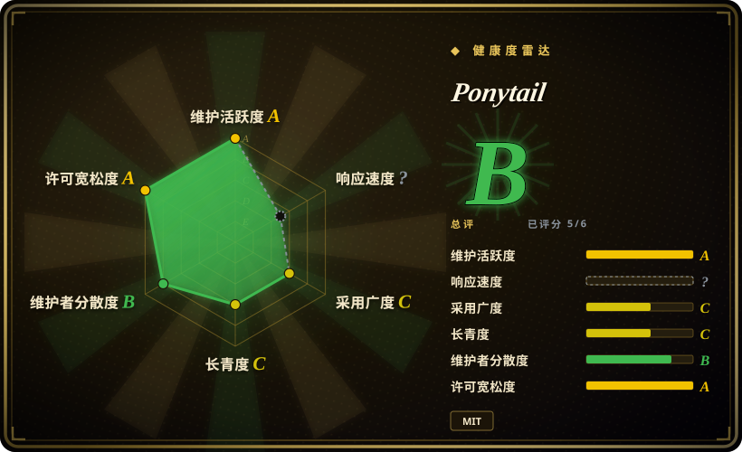
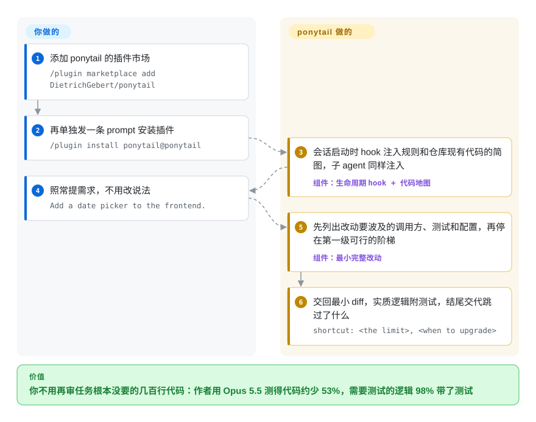

# Ponytail

你要一个日期选择器，agent 交回 flatpickr、一个包装组件、外加一整个样式表。Ponytail 把「最懒资深工程师」的条件反射装成常驻规则：写代码之前必须先走一遍七级阶梯（这玩意该不该存在？库里有没有？标准库行不行？平台原生特性覆盖了吗？），交回能跑的最短 diff，而校验、安全、错误处理被明文划出砍除范围。

## 何时使用

你用 Claude Code、Codex、Copilot CLI 或 ponytail 适配的另外约 20 种宿主干活，反复撞上的毛病不是流程而是过度建设：该用标准库的地方它加依赖，`@lru_cache` 一行能盖住的事它写一个缓存类，20 行的任务留下 400 行 diff。你想要一个只做「减法」的行为覆盖层——两条 slash 命令装好，强度分档（`lite/full/ultra/off`），子 agent 注入可用正则圈范围，还能用 `/ponytail-review` 拿到当前 diff 的过度工程删除清单——这时选它。

为什么要装一个包而不是自己在 AGENTS.md 里写一句「YAGNI，写一行」：在作者的 agentic 基准里，裸提示词发挥不稳定（多个任务接近甚至超过基线），还是唯一丢掉安全护栏的那一路，而打包规则集声称每次落地、安全率 100% [未验证：作者自建基准，未独立复现，见 benchmarks/results/2026-06-18-agentic.md]。这个包还让同一套规则经共享构建器在约 20 个宿主适配间保持一致，手写规则会随编辑器各自漂移。

## 怎么用起来

你只安装一次——插件形态（Claude Code、Codex、Copilot CLI、Grok、Devin、Hermes…），或在只吃指令文件的宿主（Cursor rules、Windsurf、Cline、Copilot Chat、Aider、Kiro、Zed、Qoder、Amp、Jules）上直接拷 `AGENTS.md` 或对应的规则文件。之后项目替你做的事：它的生命周期 hook——宿主在会话启动、每次提交 prompt、子 agent 派生时运行的几个小 Node 脚本——把规则文本注入上下文，跟踪 `/ponytail lite|full|ultra|off` 的切档（切档时重新注入），并可经 `PONYTAIL_SUBAGENT_MATCHER` 正则圈定子 agent 注入范围。规则本体是散文而非强制闸门：七级阶梯（YAGNI → 复用现成代码 → 标准库 → 平台原生特性 → 已装依赖 → 一行 → 最小可用），且必须在读完要改动的代码「之后」再走；外加明文豁免（信任边界校验、防数据丢失的错误处理、安全、无障碍、用户点名要的东西），一条「非平凡逻辑必须留一个能跑的自检」的规则，以及用 `ponytail:` 注释给刻意简化标注上限与升级路径的约定。五个配套 skill（`/ponytail-review`、`-audit`、`-debt`、`-gain`、`-help`）复用同一文本；可选的 MCP server（`ponytail-mcp`）给只有 prompt 菜单这一个注入点的宿主提供逐字相同的规则。它改变 agent 写什么，不拦截 agent 能提交什么。

<!-- flow-steps:begin (generated from flows/ponytail.json by tools/flow_card.py — do not edit) -->

流程文字版

1. **你**：添加 ponytail 的插件市场 — `/plugin marketplace add DietrichGebert/ponytail`
2. **你**：再单独发一条 prompt 安装插件 — `/plugin install ponytail@ponytail`
3. **Ponytail**：hook 在会话启动时注入规则，子 agent 也同样注入 — 组件：`生命周期 hook`
4. **你**：照常提需求，不用改说法 — `Add a cache for these API responses.`
5. **Ponytail**：动手前先停在该停的那级：该不该存在、有没有现成、标准库、原生特性、一行 — 组件：`七级阶梯`
6. **Ponytail**：只交回最小 diff：刻意简写留了上限标记，另附一个能跑的自检 — `# ponytail: global lock, per-account locks if throughput matters`

**价值**：你不用再审那些任务根本没要的包装代码——作者基准里约少 54%，护栏不砍

<!-- flow-steps:end -->

## 何时不用

- **你要的是让 agent 走完整开发流程**（brainstorm → plan → TDD → verify），而不是少写代码：用 [Superpowers](../../agent-dev-methodology/coding-agent-harnesses/superpowers.zh.md) 或 [ECC](../../agent-dev-methodology/coding-agent-harnesses/ecc.zh.md)——Ponytail 不带流程、不带阶段、不带子 agent 流水线，只弯「什么算写完」这条线。
- **痛点是 agent 说话啰嗦，不是代码量大**：搭配或改用 [caveman](caveman.zh.md)、[i-have-adhd](i-have-adhd.zh.md)——Ponytail 明文「管你造什么，不管你嘴上怎么说」，而两人共享的那份基准显示纯压话术的一路（caveman）只砍了 −20% LOC，功能任务上 token（+7%）和成本（+3%）反而是涨的。
- **你在 OpenCode 2 上**：截至 2026-09-28 该插件只实现了 V1 plugin API，在 V2 上静默无事发生（issue #863 仍 open）——想要指令级效果就拷 `AGENTS.md` 进项目，否则等 V2 入口点。
- **你需要确定性保证过度工程代码出不去**：这是注入上下文的说服，遵从度取决于模型，没有 lint 式硬闸门——要带证据的强制把关，在合并前面放一个行级 CI 审查器（如 [Open Code Review](../../ai-code-review/open-code-review.zh.md)），叠加在 Ponytail 之上或取代它。
- **在爱权衡的推理模型上算成本账**：README 自己承认，会花 thinking token 逐级掂量阶梯的精简推理模型成本可能反向（点名 GPT-5.5）[未验证：作者自述，未复现]——成本敏感就先自己 A/B 一遍再常驻，并优先用 `lite`（只提示不强制）而不是 `full`/`ultra`。
- **任务本来就很小**（在现成模板上做 CRUD）：作者的基准在不可再减的代码上各路收敛，覆盖层在这里几乎零收益却每轮占上下文——直接拷一份 `AGENTS.md` 甚至什么都不装更诚实。

## 横向对比

| 替代品 | 是否收录 | 我们的评价 | 取舍 |
|---|---|---|---|
| [caveman](caveman.zh.md) | ✅ | 别二选一而是配对用：caveman 压 agent 说出来的话，Ponytail 压 agent 写出来的代码；只能先修一边就先修代码，因为它俩共享的那份基准显示单压话术砍不动代码，功能任务的 token（+7%）与成本（+3%）还涨了。 | 两个常驻覆盖层叠加每轮都占上下文；caveman 的可选代理层是 BSL-1.1 source-available，Ponytail 通体 MIT。 |
| [Superpowers](../../agent-dev-methodology/coding-agent-harnesses/superpowers.zh.md) | ✅ | agent 的毛病出在流程——跳过计划、不验证就宣布完成——选 Superpowers；流程本来就对、毛病只在虚胖，选 Ponytail，它减代码不接管你干活的方式。 | Superpowers 装的是一整套方法论（commands、子 agent、worktree），得整体接受；Ponytail 装的是一条带开关和记分板的行为规则。 |
| [ECC](../../agent-dev-methodology/coding-agent-harnesses/ecc.zh.md) | ✅ | 要一个自带 agents、hooks、memory、安全扫描的 Claude Code 全家桶平台，选 ECC；只想改动现有工作流里的一个失败模式——过度工程——且强度可旋钮，选 Ponytail。 | ECC 扩大你的安装面、集成由你负责；Ponytail 很小，但收益上限就是它自己基准写的「有水分才砍得动，没水分等于零」。 |
| 在 AGENTS.md 里手写一句「写一行就行 / YAGNI」 | 非仓库 | 抄一句话零成本，Ponytail 的 README 也承认诚实数字比宣传数字小；这个包换来的是打包阶梯每轮稳定落地、明文保住安全豁免——而基准里的裸提示词一路发挥飘忽，还是唯一丢护栏的那条。 | 免安装免 hook 换你手维护规则文本和常驻注入；插件路线的 hook 还要求 `node` 在 PATH 里。 |

## 健康度与可持续性

- **维护**（2026-09-28 经 GitHub API 验证）：最新 release v4.10.0 发布于 2026-09-14，与最后一次 push 同日；自 2026-06-12 建仓以来约 10 个 release，节奏较 6 月的冲刺期放缓。310 个 open issue；早期热门 issue（#126、#65、#97）有人回应且多数已关，响应存在但对一个 3.5 个月的仓库来说积压偏大。
- **治理 / bus factor**：个人账号（owner type 为 `User`）；contributors 前 15 名里作者占约 114/171 次提交 [推断：按 contributors API 前 15 名计算，未遍历全部提交]，其余为一次性 PR。无组织背书，树里没有 GOVERNANCE/CODEOWNERS/CONTRIBUTING；CI 真实存在（test.yml、publish.yml），且带一个脚本保证约 20 份规则拷贝对齐——对这么宽的规则面来说是实在的防漂移措施。
- **背书与寿命**：2026-06-12 创建，谈 Lindy 太早。资金来源为 GitHub Sponsors 加 README 里一个可见赞助商（GreenPT logo），页面还挂着跳往 ponytail.dev 的「Something's coming」waitlist 横幅 [推断：由横幅与域名推断，将出商业产品]，open-core/改许可证的风险在观察名单上、尚未发生。MIT 已读 `LICENSE` 文件确认（2026-09-28）。
- **采用与生态**（2026-09-28 取数）：~147k star 但仅 ~352 watcher——是出圈形状，不是使用形状；可验证的采用信号是 npm `@dietrichgebert/ponytail` v4.10.0 约 57k 月下载（npm API，窗口 2026-08-28→09-26）和约 20 个在册宿主适配（含 OpenClaw/ClawHub 发布）。基准 harness 开源可复现（`benchmarks/`、promptfoo 配置），在 prompt 包里属高于平均。
- **风险旗**：最初的招牌数字「少 80–94% 代码」被承认受话痨基线污染、已重测（issue #126）——姿态是好的，但意味着它的宣传语要回到基准页而不是 README 头图来读。截至 2026-09-27 仍 open：OpenCode 2 静默失效（#863）；用户报告 Codex 误触「Invalid prompt」策略标记（#764）[未验证：仅见 issue 报告，未复现]。模型遵从度依赖和 PATH 敏感的 Node hook 是结构性限制，不是 bug。

## 存疑（未验证）

- [未验证：未独立复现] 全部基准数字（−54% LOC、−20% 成本、−27% 时间、安全率 100%、caveman token +7%）出自作者自建 harness、单一仓库（full-stack-fastapi-template）、单一模型（Haiku 4.5）、n=4；基准文档自己列出了这些限制。
- [未验证：作者自述] 「爱权衡的推理模型（README 点名 GPT-5.5）会因逐级掂量反花更多 thinking token」——未见第三方复现。
- [未验证：未在 OpenCode 2 环境复现] OpenCode 2 插件失效的说法依据 open 状态的 issue #863（2026-09-13 创建，2026-09-27 仍活跃）。
- [推断：由 star/watcher 比与 Trendshift 徽章推断] ~147k star 的增长是病毒性出圈而非稳定使用。
- [推断：仅由 waitlist 横幅与 ponytail.dev 域名推断] 存在未成形的商业产品计划；改许可证/open-core 风险暂无实据。
- [推断：按 contributors API 前 15 名计算] 单人维护者比例约 2/3。
- [未验证：仅按 README/docs 清单清点，未逐一装测] 「works with 20 agents」徽章对应的宿主数来自 docs/agent-portability.md 的列表。
