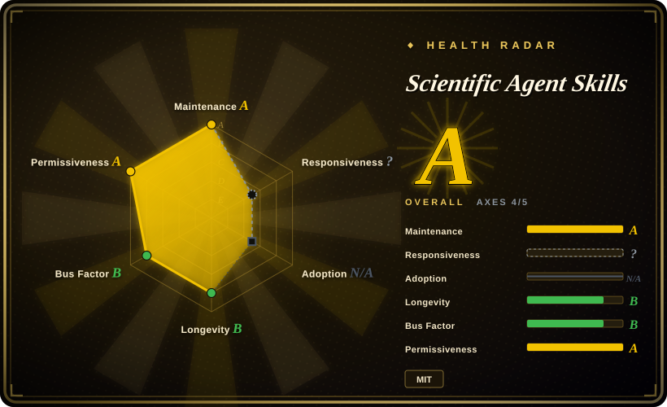
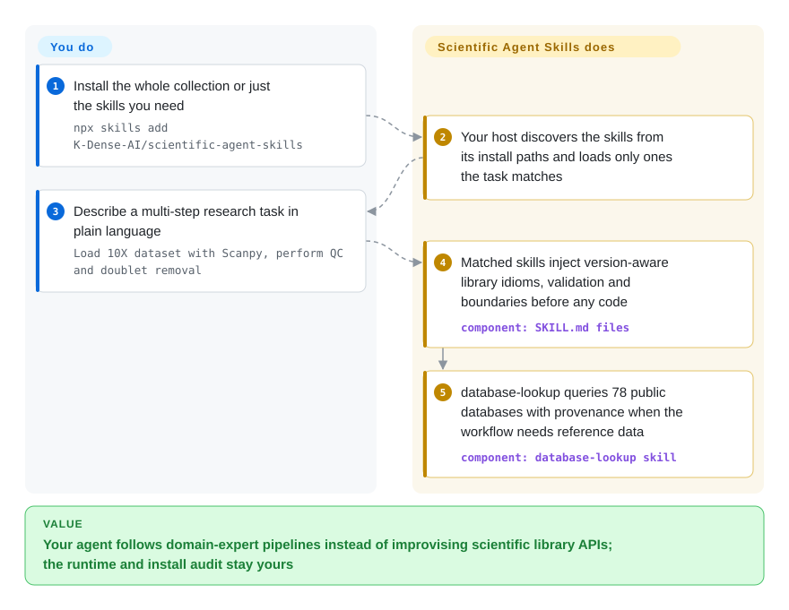

# Scientific Agent Skills

Your agent can import Scanpy or RDKit but doesn't know the idiomatic pipeline, misremembers API surfaces, and stitches steps together wrong. This pack hands it 166 curated skills (as of 2026-09) — each a `SKILL.md` of domain conventions, worked examples, and database access the agent loads only when your task matches.

## When to use

You're a computational biologist or research engineer driving Claude Code (or Cursor, Codex, Gemini CLI, Antigravity…) through a real scientific workflow — say a single-cell RNA-seq analysis, a virtual-screening campaign, or a clinical-variant evidence review. The agent technically *can* call Scanpy, RDKit, or query PubChem, but it doesn't know the idiomatic pipeline, the right preprocessing defaults, or which of its many databases answers your question — so it improvises, hallucinates an API surface, or wires the steps together wrong. You want it to follow the conventions a domain expert would, with curated docs and worked examples in front of it.

You drop in a domain library by installing once — `npx skills add K-Dense-AI/scientific-agent-skills`, `gh skill install` (with `--pin v2.66.0`-style version pinning and provenance metadata), as an [Agent Plugins](https://agent-plugins.org/) package for plugin-capable clients, or by cloning into `~/.agents/skills/` — and the agent gains on-demand skills, 166 of them as of 2026-09, across bioinformatics (Scanpy, BioPython, pysam, scVelo), cheminformatics/drug discovery (RDKit, Datamol, DeepChem, DiffDock, OpenMM), ML (PyTorch Lightning, scikit-learn, PyMC), data viz and geospatial work (Matplotlib, GeoPandas, NetworkX), materials/physics (Pymatgen, Qiskit), lab automation (Opentrons, Benchling), and a unified database-lookup skill fronting 78 public databases (PubChem, ChEMBL, UniProt, COSMIC, ClinicalTrials.gov, FRED…) plus dedicated access skills. Each skill ships a `SKILL.md` with examples; the agent pulls in only the ones a task needs. The project even has an arXiv paper (2609.00065) describing it as "a library of procedural knowledge for research agents".

## How it works

Each skill is a directory whose `SKILL.md` (YAML frontmatter + curated docs) tells the agent the library's idiomatic usage, version-aware defaults, validation steps, and safety boundaries, with optional `scripts/` and `references/` beside it; CI blocks any PR that adds bundled tooling without a test suite. The host — any Agent Skills-compatible client — discovers skills from its configured install paths and loads one into context only when the task matches, so the collection can be huge without every prompt paying for all of it. What stays yours: the runtime. The pack brings no Python environment — the README wants Python 3.13+ for repo tooling and `uv` for skill dependencies, and heavy packages (RDKit, PyTorch, reference datasets) are provisioned by you. And the maintainer's own security disclaimer is part of the deal: skills can steer your agent to run code and make network requests, so review what you install, prefer a topical subset, and pin versions with `gh skill install --pin <tag>` when you need reproducibility.

<!-- flow-steps:begin (generated from flows/scientific-agent-skills.json by tools/flow_card.py — do not edit) -->

Text version of the flow

1. **You**: Install the whole collection or just the skills you need — `npx skills add K-Dense-AI/scientific-agent-skills`
2. **Scientific Agent Skills**: Your host discovers the skills from its install paths and loads only ones the task matches
3. **You**: Describe a multi-step research task in plain language — `Load 10X dataset with Scanpy, perform QC and doublet removal`
4. **Scientific Agent Skills**: Matched skills inject version-aware library idioms, validation and boundaries before any code — component: `SKILL.md files`
5. **Scientific Agent Skills**: database-lookup queries 78 public databases with provenance when the workflow needs reference data — component: `database-lookup skill`

**Value**: Your agent follows domain-expert pipelines instead of improvising scientific library APIs; the runtime and install audit stay yours

<!-- flow-steps:end -->

## When NOT to use

- **You already curate a scientific skill/prompt stack you trust.** This pack is broad and opinionated about conventions; layering 166 skills on top of your own can produce conflicting guidance and double-routing. Pick one source of truth per domain.
- **Your work isn't in its covered domains.** It targets life sciences, chemistry, medicine, materials, and adjacent ML/data work. General software engineering, web, or non-science tasks get no benefit — the skills won't fire usefully.
- **You're on a harness with no skill loader.** It activates through the open Agent Skills standard (Claude Code, Cursor, Codex, Gemini CLI, Antigravity, etc.). On a bespoke agent with no loader, the `SKILL.md` files are inert markdown and won't auto-activate.
- **You need the heavy scientific runtimes preinstalled.** The skills document *how* to use Scanpy/RDKit/OpenMM/PyTorch — they don't bring the Python environment, CUDA, or large reference datasets. You still provision and manage those yourself (`uv` is the documented package manager).
- **You don't want to audit what you install.** The README's own security disclaimer warns that skills can instruct your agent to run arbitrary code and make network requests, and that community-contributed skills get lighter review than K-Dense's; it recommends installing only what you need, reading each `SKILL.md`, and scanning third-party skills with the Cisco AI Defense Skill Scanner.
- **You want guaranteed-correct science.** Skill docs are advisory prompt context, not validated pipelines; the agent can still deviate, and individual skills may carry their own licenses. [推断]

## Comparison

| Alternative | In index | Our verdict | Tradeoff |
|---|---|---|---|
| [addyosmani/agent-skills](addyosmani-agent-skills.md) | ✅ | Pick Addy Osmani's pack for broad software engineering utility instead of domain science. | General-purpose / web-leaning engineering skill collection; broad coding utility, not domain-science. This pack is narrowly scientific (omics, cheminformatics, lab) and far larger. |
| [web-quality-skills](addyosmani-web-quality.md) | ✅ | Pick web-quality-skills when the task is frontend quality, not wet-lab or computational science. | Web-performance / quality-focused skills; orthogonal domain. Choose by whether your task is frontend quality vs. wet-lab/computational science. |
| [Waza](waza.md) | ✅ | Pick Waza for non-science engineering workflow habits and a smaller skill surface. | Engineering-workflow skill pack; overlapping "install skills into your agent" shape, different (non-science) subject matter. |
| [vercel-labs/agent-skills](vercel-agent-skills.md) | ✅ | Pick Vercel Agent Skills for app/deploy workflows on the web platform. | Vendor/web-platform engineering skills; useful for app/deploy workflows, not for bioinformatics or drug discovery. |
| Bespoke per-library prompting (write your own SKILL.md) | 未收录 | Pick bespoke prompts when maximum control and zero unused surface justify maintaining every library prompt yourself. | Maximum control and zero unused surface, but you rebuild and maintain curated docs for every library yourself instead of installing a vetted bundle. |

## Health & viability

- **Responsiveness**: Cannot be scored — type_na.
- **Maintenance (2026-09):** very active — last push 2026-09-21, releases v2.65.0–v2.69.0 landed between late August and 2026-09-11 (roughly a minor release every few days at peak). The version churn implies the skill set shifts constantly (skill count already went 140→147→166 across checks).
- **Governance & backing:** `Organization`-owned (`K-Dense-AI`), maintained by the K-Dense team with growing community contributions — and the README is candid that community skills get lighter review than in-house ones. A single company owns the roadmap; no foundation. The arXiv paper (2609.00065) and CI-tested skill suite are real investment signals.
- **Age & Lindy:** created 2025-10, so ~11 months old as of 2026-09 — approaching a year, still unproven on Lindy, but at ~46.8k stars (up from ~29.4k in June) adoption is strong.
- **Adoption/ecosystem:** broad surface (166 skills across omics/cheminformatics/ML/labs/regulatory) plus a companion desktop app (K-Dense BYOK) built on it; breadth ≠ depth — each skill is advisory markdown, not a validated pipeline.
- **Risk flags:** per-skill licensing is explicit — each `SKILL.md` carries its own `license` metadata that "may differ from the repository's MIT License", and users are responsible for adhering to them; the maintainers themselves warn skills can steer an agent into running code and recommend scanning third-party skills. Supply-chain hygiene (pinning, subset installs) is on you. [推断]

## Caveats (unverified)

- [未验证] Metadata as of 2026-09-27 (GitHub): latest release v2.69.0 (published 2026-09-11), repo last pushed 2026-09-21, license MIT, primary language Python, not archived — re-verify before relying on a specific version's behavior or skill list.
- [未验证] Star count (~46.8k per GitHub on 2026-09-27) and the README's usage claims are marketing/usage signals, unreliable and date-sensitive; treat as indicative only, not as a quality guarantee.
- [未验证] Skill count (README badge and body say 166 as of 2026-09) and the per-domain breakdown come from the project README and shift release-to-release; inspect the current `skills/` directory rather than trusting this list.
- [未验证] The unified database-lookup skill's "78 public databases" (plus dedicated access skills) and the supported-host list (Claude Code, Claude Cowork, Codex, Gemini CLI, Google Antigravity, Cursor, OpenClaw, Pi, Hermes, …) are from the README; actual coverage and per-harness activation fidelity are not independently confirmed here.
- [未验证] The `plugin.json` "License: MIT" header links to `LICENSE.md`; per-skill license metadata in individual `SKILL.md` files was not exhaustively sampled — verify the license of any specific skill you depend on, and don't treat the Cisco AI Defense scan as a security guarantee.
- [推断] Because skills are markdown docs loaded into the agent, their guidance is advisory — the agent can still write incorrect or non-idiomatic scientific code; these are not validated, reproducible pipelines.
