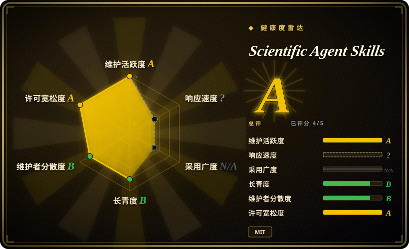
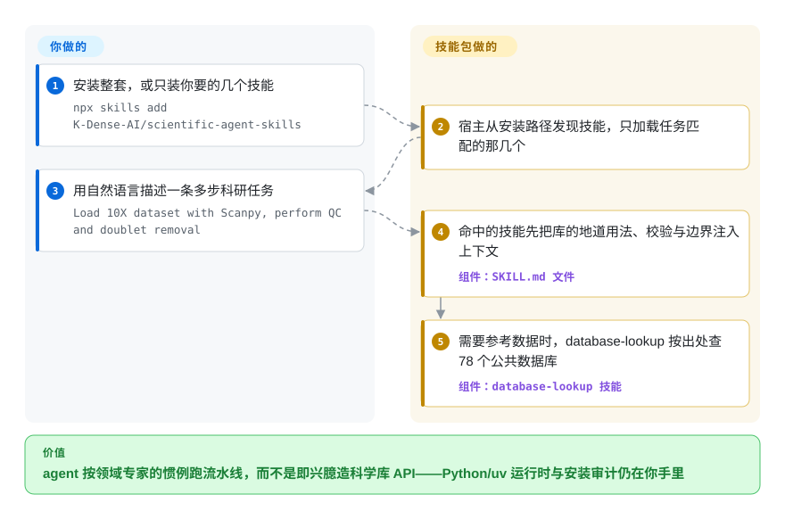

# Scientific Agent Skills

你的 agent 能 `import` Scanpy 或 RDKit，却不懂地道流水线、记错 API、把步骤接错。这个包给它 166 个经整理的技能（2026-09 口径）——每个技能是一份 `SKILL.md`，装着领域惯例、可运行示例与数据库访问，任务匹配时 agent 才加载。

## 何时使用

你是一名计算生物学家或科研工程师，正在用 Claude Code（或 Cursor、Codex、Gemini CLI、Antigravity……）跑一条真实的科研流程——比如单细胞 RNA-seq 分析、虚拟筛选，或临床变异证据复核。agent 技术上*能*调用 Scanpy、RDKit 或查询 PubChem，但它不懂地道的流水线、不知道正确的预处理默认值，也分不清众多数据库里哪个能回答你的问题——于是它随意发挥、臆造 API、或把步骤接错。你希望它按领域专家的惯例来做，眼前摆着经过整理的文档和可运行示例。

装一次就能给 agent 放上领域库：`npx skills add K-Dense-AI/scientific-agent-skills`、`gh skill install`（支持 `--pin v2.66.0` 式版本钉与来源元数据）、作为 [Agent Plugins](https://agent-plugins.org/) 包供支持插件的客户端加载，或克隆进 `~/.agents/skills/`。2026-09 口径共 166 个按需技能——生物信息（Scanpy、BioPython、pysam、scVelo）、化学信息/药物发现（RDKit、Datamol、DeepChem、DiffDock、OpenMM）、机器学习（PyTorch Lightning、scikit-learn、PyMC）、数据可视化与地理空间（Matplotlib、GeoPandas、NetworkX）、材料/物理（Pymatgen、Qiskit）、实验室自动化（Opentrons、Benchling），以及一个统一的 database-lookup 技能，前接 78 个公共数据库（PubChem、ChEMBL、UniProt、COSMIC、ClinicalTrials.gov、FRED 等），另有若干专用数据访问技能。每个技能都带一份含示例的 `SKILL.md`；agent 只拉取任务需要的那些。项目还有一篇 arXiv 论文（2609.00065），把它描述为「面向科研 agent 的程序性知识库」。

## 怎么用起来

每个技能是一个目录，核心是一份 `SKILL.md`（YAML frontmatter 加整理过的文档），告诉 agent 这个库的地道用法、随版本而定的默认值、校验步骤与安全边界，旁边可选地放着 `scripts/` 和 `references/`；CI 会拦住「带了工具脚本却没有测试」的 PR。宿主（任何兼容 Agent Skills 标准的客户端）从配置的安装路径发现技能，只在任务匹配时把某一份拉进上下文——所以整套可以很大，而每次提示不必为全部买单。仍然是你的事：运行时。这个包不带 Python 环境——README 要求仓库工具用 Python 3.13+、技能依赖用 `uv` 安装，重型包（RDKit、PyTorch、参考数据集）得你自己准备。维护者自己的安全声明也是合同的一部分：技能可能引导 agent 执行代码、发网络请求，所以装前要审、建议只装主题子集、需要可复现时用 `gh skill install --pin <tag>` 钉版本。

<!-- flow-steps:begin (generated from flows/scientific-agent-skills.json by tools/flow_card.py — do not edit) -->

流程文字版

1. **你**：安装整套，或只装你要的几个技能 — `npx skills add K-Dense-AI/scientific-agent-skills`
2. **Scientific Agent Skills**：宿主从安装路径发现技能，只加载任务匹配的那几个
3. **你**：用自然语言描述一条多步科研任务 — `Load 10X dataset with Scanpy, perform QC and doublet removal`
4. **Scientific Agent Skills**：命中的技能先把库的地道用法、校验与边界注入上下文 — 组件：`SKILL.md 文件`
5. **Scientific Agent Skills**：需要参考数据时，database-lookup 按出处查 78 个公共数据库 — 组件：`database-lookup 技能`

**价值**：agent 按领域专家的惯例跑流水线，而不是即兴臆造科学库 API——Python/uv 运行时与安装审计仍在你手里

<!-- flow-steps:end -->

## 何时不用

- **你已有一套自己信任的科研 skill/prompt 体系。** 这个包覆盖面广、对惯例有强观点；在你自己的体系上再叠 166 个技能会产生冲突指引和双重路由。每个领域只留一个事实源。
- **你的工作不在它覆盖的领域内。** 它面向生命科学、化学、医学、材料及相邻的 ML/数据工作。通用软件工程、Web 或非科学任务得不到收益——这些技能不会有效触发。
- **你的 harness 没有 skill loader。** 它通过开放的 Agent Skills 标准激活（Claude Code、Cursor、Codex、Gemini CLI、Antigravity 等）。在没有 loader 的自研 agent 上，`SKILL.md` 只是惰性 markdown，不会自动激活。
- **你需要预装好的重型科学运行时。** 这些技能只讲*怎么*用 Scanpy/RDKit/OpenMM/PyTorch——它们不带来 Python 环境、CUDA 或大型参考数据集。这些仍需你自己准备和维护（文档指定的包管理器是 `uv`）。
- **你不想审计自己装的东西。** README 的安全声明本身就警告：技能可以让 agent 执行任意代码、发起网络请求，且社区贡献的技能审查比 K-Dense 自家的轻；官方建议只装所需子集、逐个读 `SKILL.md`，并用 Cisco AI Defense Skill Scanner 扫描第三方技能。
- **你想要保证正确的科研结果。** 技能文档是建议性的 prompt 上下文，不是经过验证的流水线；agent 仍可能偏离，单个技能也可能带自己的许可证。[推断]

## 横向对比

| 替代品 | 是否收录 | 我们的评价 | 取舍 |
|---|---|---|---|
| [addyosmani/agent-skills](addyosmani-agent-skills.zh.md) | ✅ | 需要宽泛的软件工程能力、不是领域科学时，选 Addy Osmani 的大包。 | 通用/偏 Web 的工程 skill 集合；编码通用性广，但非领域科学。本包窄聚焦于科学（组学、化学信息、实验室）且规模大得多。 |
| [web-quality-skills](addyosmani-web-quality.zh.md) | ✅ | 任务是前端质量、不是湿实验或计算科学时，选 web-quality-skills。 | 偏 Web 性能/质量的 skill；领域正交。按任务是前端质量还是湿实验/计算科学来选。 |
| [Waza](waza.zh.md) | ✅ | 需要非科学主题的工程工作流习惯、且希望 surface 更小时，选 Waza。 | 工程工作流 skill 包；同样是「把 skill 装进 agent」的形态，主题（非科学）不同。 |
| [vercel-labs/agent-skills](vercel-agent-skills.zh.md) | ✅ | 任务是 Web 平台上的 app/部署工作流时，选 Vercel Agent Skills。 | 厂商/Web 平台向的工程 skill；适合 app/部署工作流，不适合生信或药物发现。 |
| 自写逐库 prompt（自己写 SKILL.md） | 未收录 | 只有当最大控制力与零冗余面值得你维护每个库的 prompt 时，才选自写。 | 控制力最大、无冗余面，但你得为每个库自行重建并维护整理好的文档，而不是装一个经审查的成套包。 |

## 健康度与可持续性

- **响应速度**：无法计算——type_na。
- **维护（2026-09）：** 非常活跃——最后推送 2026-09-21，v2.65.0 到 v2.69.0 集中落在 8 月底至 2026-09-11（高峰时几乎几天一个 minor 版本）。版本号狂飙意味着技能集合时刻在变（技能数已在历次核查间从 140 涨到 147 再到 166）。
- **治理与背书：** 仓库归 `Organization`（`K-Dense-AI`）所有，由 K-Dense 团队维护并接纳社区贡献——README 坦承社区技能的审查轻于自家技能。路线图由单一公司掌控，无 foundation。arXiv 论文（2609.00065）与 CI 强制的技能测试是真金白银的投入信号。
- **年龄与 Lindy：** 创建于 2025-10，截至 2026-09 约 11 个月——接近一岁，Lindy 仍未检验完；但约 46.8k stars（对比 2026-06 的约 29.4k），采用强度很高。
- **采用与生态：** 覆盖面广（166 个技能，横跨组学/化学信息/ML/实验室/法规），还有以其为引擎的桌面端配套项目（K-Dense BYOK）；但广度不等于深度——每个技能都是建议性 markdown，而非经验证的流水线。
- **风险标记：** 逐技能许可证是明示的——每份 `SKILL.md` 有自己的 `license` 元数据，「可能与仓库 MIT 不同」，用户需自行遵守；维护者本人也警告技能可引导 agent 执行代码，建议对第三方技能做扫描。供应链卫生（钉版本、只装子集）由你承担。[推断]

## 存疑（未验证）

- [未验证] 2026-09-27 的元数据（GitHub）：最新发布 v2.69.0（2026-09-11 发布），仓库最后推送 2026-09-21，许可 MIT，主语言 Python，未归档——依赖某个具体版本的行为或技能列表前请重新核验。
- [未验证] star 数（2026-09-27 GitHub 约 46.8k）以及 README 的使用量说法属营销/使用信号，不可靠且对日期敏感；仅作参考，非质量保证。
- [未验证] 技能数量（2026-09 的 README 徽章与正文均称 166）及各领域细分来自项目 README，且随版本变动；请查看当前 `skills/` 目录，而非依赖此列表。
- [未验证] 统一 database-lookup 技能前接的「78 个公共数据库」（外加专用访问技能）与受支持宿主列表（Claude Code、Claude Cowork、Codex、Gemini CLI、Google Antigravity、Cursor、OpenClaw、Pi、Hermes 等）来自 README；实际覆盖与各 harness 的激活保真度在此未独立确认。
- [未验证] README 头部徽章声明 MIT 并链接 `LICENSE.md`；各 `SKILL.md` 内的逐技能许可证未逐一抽样核验——对你依赖的任一具体技能请核验其许可证，且不要把 Cisco AI Defense 扫描当作安全保证。
- [推断] 由于技能是加载进 agent 的 markdown 文档，其指引是建议性的——agent 仍可能写出不正确或不地道的科学代码；这些不是经过验证、可复现的流水线。
