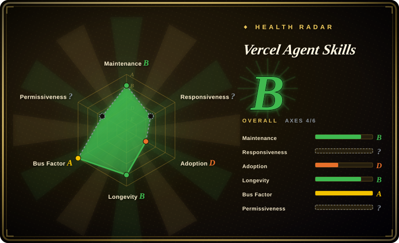
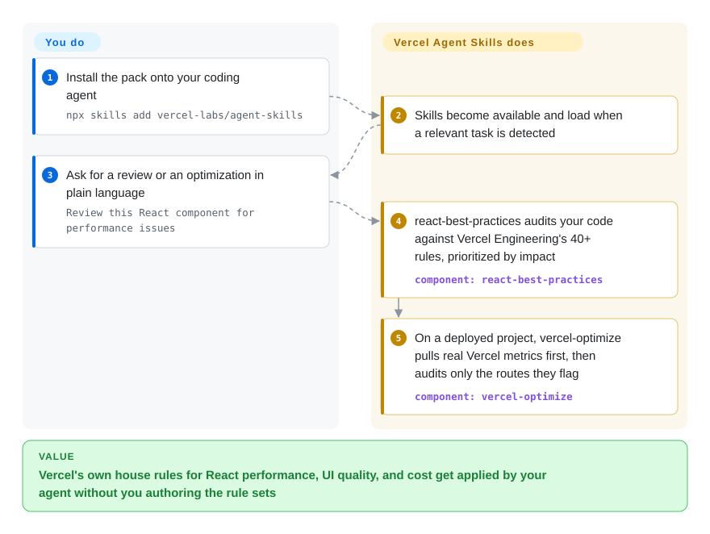

# Vercel Agent Skills

Vercel's official agent-skill collection: your React app runs but quietly regresses Core Web Vitals and burns function budget, and the agent doesn't know Vercel's own house rules to catch it. This pack installs 40+ React perf rules, 100+ UI-quality rules, and a metrics-first cost optimizer (`vercel-optimize`) as skills the agent loads only when the task matches.

## When to use

You're a frontend or full-stack engineer shipping a Next.js app on Vercel, working through a coding agent (Claude Code, Claude Desktop, or another harness that speaks the Agent Skills format). Your agent writes React that technically works but quietly regresses Core Web Vitals — request waterfalls, oversized bundles, needless re-renders — and you don't have Vercel's internal performance handbook memorized to catch it in review. Or your function bill crept up and you can't tell which routes are the cost drivers. You want the agent to apply Vercel Engineering's actual house rules instead of generic advice.

You run `npx skills add vercel-labs/agent-skills` and the agent gains a menu of on-demand skills it loads when the task matches: `react-best-practices` (40+ perf rules across 8 categories — waterfalls, bundle size, server-side perf), `composition-patterns` (avoid boolean-prop proliferation), `react-view-transitions`, `react-native-skills`, `web-design-guidelines` (100+ accessibility/UX rules), `writing-guidelines` (Vercel's writing handbook for docs review), `vercel-optimize` (pulls real Vercel metrics first, then audits only the routes those metrics flag for cost/caching/ISR/function issues), plus deploy helpers (`deploy-to-vercel`, `vercel-cli-with-tokens`). You reach for it when your stack *is* React + Vercel and you want the vendor's own opinionated guidance applied automatically rather than authoring those rule sets yourself.

## How it works

Each skill is a packaged `SKILL.md` instruction set (plus optional `scripts/` and `references/`) that a skill loader installs into your agent; there is no library to import — the substance is prose rule sets the agent pulls in when a task matches. The distinctive part is evidence-first auditing: `vercel-optimize` collects your real Vercel usage metrics *before* deciding which routes to investigate (cost, caching, ISR, middleware, function issues), and `react-best-practices` checks your code against 40+ perf rules ordered by impact rather than generic advice. Since 2026-08, every change to a skill on `main` also publishes an immutable GitHub release carrying an Agent Skills discovery index and one artifact per skill, so you can pin a snapshot even though there is no semver. What stays yours: nothing enforces the rules — the agent may deviate, and if you want merge-blocking gates you still have to wire them up yourself with separate tooling.

<!-- flow-steps:begin (generated from flows/vercel-agent-skills.json by tools/flow_card.py — do not edit) -->

Text version of the flow

1. **You**: Install the pack onto your coding agent — `npx skills add vercel-labs/agent-skills`
2. **Vercel Agent Skills**: Skills become available and load when a relevant task is detected
3. **You**: Ask for a review or an optimization in plain language — `Review this React component for performance issues`
4. **Vercel Agent Skills**: react-best-practices audits your code against Vercel Engineering's 40+ rules, prioritized by impact — component: `react-best-practices`
5. **Vercel Agent Skills**: On a deployed project, vercel-optimize pulls real Vercel metrics first, then audits only the routes they flag — component: `vercel-optimize`

**Value**: Vercel's own house rules for React performance, UI quality, and cost get applied by your agent without you authoring the rule sets

<!-- flow-steps:end -->

## When NOT to use

- **You're not on React/Next.js/Vercel.** The bulk of the value is React perf rules, Next.js patterns, and Vercel-specific deploy/cost audits. On a Vue/Svelte/Astro or non-Vercel-hosted stack, most skills don't apply and the deploy/optimize skills assume the Vercel platform outright.
- **You already run a curated web-quality skill stack.** If you've installed another web-perf or accessibility skill pack, layering Vercel's on top risks conflicting rule sets and double-routing during review — pick one source of truth per concern.
- **Your harness doesn't speak the Agent Skills format.** These activate via the agentskills.io / skills.sh loading mechanism; on a harness with no such loader, the markdown won't auto-fire and you'd be copy-pasting prompts by hand.
- **You want enforcement, not advice.** Rules live in prompt/markdown the agent *should* follow; nothing blocks a merge or fails CI. It's advisory review guidance, not a gate.
- **You need semver stability.** As of 2026-09 the repo publishes a GitHub release per skill change, but the tags are SHA-named snapshots (`agent-skills-<sha>`), not versioned rule sets — there is no "the 2.x ruleset" line to track, only pin-able snapshots.
- **You want a runnable library/CLI.** There's nothing to `import`; the helper scripts run *inside* a skill the agent invokes, not as a standalone tool you call yourself.

## Comparison

| Alternative | In index | Our verdict | Tradeoff |
|---|---|---|---|
| [Agent Skills (addyosmani)](addyosmani-agent-skills.md) | ✅ | Pick Addy Osmani's pack when you trust its broader personal engineering rules more than Vercel-specific rules. | Addy Osmani's personal engineering skill set; overlapping web-perf/quality focus but maintained by an individual and not Vercel-platform-coupled. Compare on which rule sources you trust and whether you're on Vercel. |
| [web-quality-skills](addyosmani-web-quality.md) | ✅ | Pick web-quality-skills for vendor-neutral performance, accessibility, and quality auditing. | Dedicated web-quality/perf/accessibility skills; narrower than Vercel's broader bundle (deploy + optimize + React patterns) but vendor-neutral, so it travels off Vercel. |
| [Waza](waza.md) | ✅ | Pick Waza when general engineering habits matter more than React/Vercel platform rules. | Another engineering skill pack in this leaf; compare on domain coverage and which workflows each actually encodes. |
| [Scientific Agent Skills](scientific-agent-skills.md) | ✅ | Pick Scientific Agent Skills for research/data workflows outside web/frontend engineering. | Scientific/eng-workflow skills — different domain (research/data) than web/frontend engineering; complementary, not a substitute. |
| [Superpowers](../../agent-dev-methodology/coding-agent-harnesses/superpowers.md) | ✅ | Pick methodology packs when you need planning/TDD discipline rather than React/Vercel domain rules. | General SDLC/methodology skill packs shape *how* the agent works (TDD, planning); Vercel's pack supplies *domain* rules for React/Vercel. Often run together, not either/or. |

## Health & viability

- **Responsiveness**: Cannot be scored — type_na.
- **Maintenance (2026-09):** active — last commit to `main` 2026-08-28, not archived; since 2026-08 each skill change ships an immutable SHA-tagged release with per-skill artifacts, an improvement over the untagged `main` tracked in June, though there is still no semver.
- **Governance & backing:** `Organization`-owned under `vercel-labs` — vendor-backed by Vercel, which is a longevity plus (real company, real eng team owns the roadmap), but it's a single-vendor `labs` repo, so it can be deprioritized or archived at the vendor's discretion. [推断]
- **Age & Lindy:** created 2025-12, so under a year old as of 2026-09 — young; unproven on Lindy despite ~31.6k stars (up from ~28.3k in June). Vendor backing is the stronger durability signal here, not age.
- **Risk flags:** advisory-only (prompt/markdown, nothing fails the build); Vercel-platform coupling in the deploy/optimize skills means value drops sharply off React + Vercel; license still rests on a README declaration only — no top-level `LICENSE` file and the GitHub license API returned null on 2026-09-27. [未验证]

## Caveats (unverified)

- [未验证] License is MIT per the repo README's `## License` section (one line); the GitHub license API still returns null and there is no top-level `LICENSE` file as of 2026-09-27, so the SPDX id rests on the README declaration alone — confirm before relying on it.
- [未验证] Primary language reported as JavaScript by GitHub metadata (2026-09-27); the substance is markdown skill definitions plus helper scripts, so the language tag reflects tooling/scripts, not a runnable JS app.
- [未验证] Releases exist as of 2026-08 but are SHA-named snapshot tags (`agent-skills-<sha>`, one per skill change per the README's discovery-index section), not semver; "maturity" is inferred from release/push activity, not a versioned rule set.
- [未验证] Star count (~31.6k per GitHub on 2026-09-27) is unreliable and date-sensitive; treat as indicative only, not a quality signal.
- [未验证] The skill inventory (9 directories under `skills/` on 2026-09-27: vercel-optimize, react-best-practices, composition-patterns, react-view-transitions, react-native-skills, web-design-guidelines, writing-guidelines, deploy-to-vercel, vercel-cli-with-tokens) and rule counts (40+/100+/80+/16) are from the README and directory listing; README section titles use slightly different names ("react-native-guidelines", "vercel-deploy-claimable"). Verify the live directory rather than trusting this snapshot, since it tracks an unversioned `main`.
- [推断] Activation fidelity depends on each harness's Agent Skills loader; README names claude.ai/Claude Desktop explicitly (the claimable-deploy skill), but behavior on other harnesses is not independently confirmed here.
- [推断] Because rules are prompt/markdown the agent loads, enforcement is advisory — the agent can deviate and nothing fails the build.
