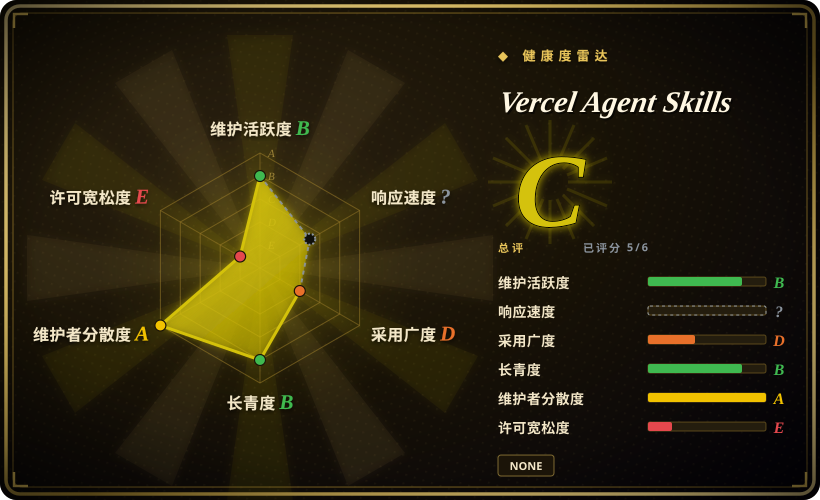
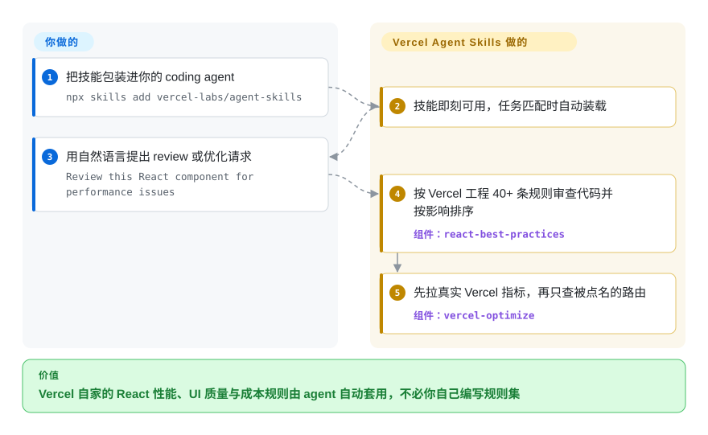

# Vercel Agent Skills

Vercel 官方的 agent 技能集：你的 React 应用能跑，却在悄悄拉低 Core Web Vitals、烧掉 function 预算，而 agent 并不知道 Vercel 自家的规则去拦住它。这个包把 40+ 条 React 性能规则、100+ 条 UI 质量规则与一个「指标优先」的成本优化器（`vercel-optimize`）做成技能，任务匹配时 agent 才加载。

## 何时使用

你是一名前端或全栈工程师，在 Vercel 上交付 Next.js 应用，通过 coding agent 工作（Claude Code、Claude Desktop，或其他支持 Agent Skills 格式的 harness）。你的 agent 写出的 React 在功能上能跑，却悄悄拉低 Core Web Vitals——请求瀑布、过大的 bundle、不必要的重渲染——而你并没有把 Vercel 内部那套性能手册背下来，review 时根本抓不出来。又或者你的 function 账单悄悄涨上去，你却说不清是哪些路由在烧钱。你希望 agent 套用 Vercel Engineering 真正的内部规则，而不是泛泛的通用建议。

你跑一句 `npx skills add vercel-labs/agent-skills`,agent 就拿到一组按需加载的 skill，任务匹配时才装载：`react-best-practices`（40+ 条性能规则、8 大类——瀑布、bundle 体积、服务端性能）、`composition-patterns`（避免布尔 prop 泛滥）、`react-view-transitions`、`react-native-skills`、`web-design-guidelines`（100+ 条可访问性/UX 规则）、`writing-guidelines`（按 Vercel 写作手册审文档）、`vercel-optimize`（先拉真实 Vercel 指标，再只审计这些指标指向的路由，排查成本/缓存/ISR/function 问题），外加部署辅助（`deploy-to-vercel`、`vercel-cli-with-tokens`）。当你的技术栈*就是* React + Vercel、并且想让厂商自家的硬核规则被自动套用、而不是自己从头写这些规则集时，就用它。

## 怎么用起来

每个技能是一个打包好的 `SKILL.md` 指令集（外加可选的 `scripts/` 与 `references/`），由技能加载器装进你的 agent；没有可 `import` 的库——实体是 agent 在任务匹配时拉进上下文的成文规则集。这套包的独特之处是「证据优先」的审计：`vercel-optimize` 先收集你在 Vercel 上的真实用量指标，再决定去查哪些路由（成本、缓存、ISR、middleware、function 问题）；`react-best-practices` 按影响排序的 40+ 条性能规则审查代码，而不是泛泛建议。2026-08 起，`main` 上每次技能变更还会发布一个不可变的 GitHub release，内含 Agent Skills discovery index 与每个技能一个产物，所以哪怕没有 semver，也能钉住某个快照。仍然归你的：没有任何东西强制执行这些规则——agent 可能偏离；想要卡 merge 的闸门，还得用别的工具自己搭。

<!-- flow-steps:begin (generated from flows/vercel-agent-skills.json by tools/flow_card.py — do not edit) -->

流程文字版

1. **你**：把技能包装进你的 coding agent — `npx skills add vercel-labs/agent-skills`
2. **Vercel Agent Skills**：技能即刻可用，任务匹配时自动装载
3. **你**：用自然语言提出 review 或优化请求 — `Review this React component for performance issues`
4. **Vercel Agent Skills**：按 Vercel 工程 40+ 条规则审查代码并按影响排序 — 组件：`react-best-practices`
5. **Vercel Agent Skills**：先拉真实 Vercel 指标，再只查被点名的路由 — 组件：`vercel-optimize`

**价值**：Vercel 自家的 React 性能、UI 质量与成本规则由 agent 自动套用，不必你自己编写规则集

<!-- flow-steps:end -->

## 何时不用

- **你不在 React/Next.js/Vercel 上。** 价值主体是 React 性能规则、Next.js 模式和 Vercel 专属的部署/成本审计。在 Vue/Svelte/Astro 或非 Vercel 托管的栈上，大多数 skill 不适用，而部署/优化 skill 直接假定了 Vercel 平台。
- **你已经在跑一套精挑过的 web-quality skill 栈。** 如果你已装了另一套 web 性能或可访问性 skill 包，再叠上 Vercel 这套，会引入规则冲突和 review 时的双重路由——每个关注点只留一个事实源。
- **你的 harness 不支持 Agent Skills 格式。** 这些 skill 通过 agentskills.io / skills.sh 的加载机制激活；在没有对应 loader 的 harness 上，markdown 不会自动触发，你只能手动复制粘贴 prompt。
- **你要的是强制执行，不是建议。** 规则存在于 agent *应当*遵循的 prompt/markdown 里；没有任何东西会拦下 merge 或让 CI 失败。它是建议性的 review 指引，不是闸门。
- **你需要 semver 级的版本稳定性。** 截至 2026-09，每次技能变更都会发一个 GitHub release，但 tag 是按 SHA 命名的快照（`agent-skills-<sha>`），不是带版本号的规则集——没有「2.x 规则线」可跟，只有可钉的快照。
- **你想要可运行的库/CLI。** 没有任何东西可供 `import`；辅助脚本是在 agent 调起的 skill *内部*运行，不是你自己调用的独立工具。

## 横向对比

| 替代品 | 是否收录 | 我们的评价 | 取舍 |
|---|---|---|---|
| [Agent Skills (addyosmani)](addyosmani-agent-skills.zh.md) | ✅ | 更信任 Addy Osmani 的宽泛个人工程规则、而非 Vercel 专属规则时，选它。 | Addy Osmani 个人的工程 skill 集；web 性能/质量焦点有重叠，但由个人维护、不绑定 Vercel 平台。按你信任哪套规则来源、以及你是否在 Vercel 上来选。 |
| [web-quality-skills](addyosmani-web-quality.zh.md) | ✅ | 需要厂商中立的性能、可访问性和质量审计时，选 web-quality-skills。 | 专注 web 质量/性能/可访问性的 skill；比 Vercel 的大杂烩（部署 + 优化 + React 模式）更窄，但厂商中立，能脱离 Vercel 使用。 |
| [Waza](waza.zh.md) | ✅ | 通用工程习惯比 React/Vercel 平台规则更重要时，选 Waza。 | 本 leaf 下另一个工程 skill 包；按领域覆盖面和各自实际编码了哪些工作流来对比。 |
| [Scientific Agent Skills](scientific-agent-skills.zh.md) | ✅ | 任务是 Web/前端工程以外的研究或数据工作流时，选 Scientific Agent Skills。 | 科学/工程工作流 skill——领域不同（研究/数据），与 web/前端工程互补而非替代。 |
| [Superpowers](../../agent-dev-methodology/coding-agent-harnesses/superpowers.zh.md) | ✅ | 需要规划/TDD 方法论纪律、而不是 React/Vercel 领域规则时，选方法论包。 | 通用 SDLC/方法论 skill 包塑造 agent *怎么干活*（TDD、规划）；Vercel 这套提供 React/Vercel 的*领域*规则。通常一起用，不是二选一。 |

## 健康度与可持续性

- **响应速度**：无法计算——type_na。
- **维护（2026-09）：** 活跃——最后提交 2026-08-28 于 `main`，未归档；2026-08 起每次技能变更都发一个按 SHA 命名的不可变 release（含每技能产物），比 6 月核查时只能跟裸 `main` 是改善，但依旧没有 semver。
- **治理与背书：** 仓库归 `vercel-labs` 这个 `Organization` 所有——由 Vercel 厂商背书，是耐久性的加分项（真实公司、真实工程团队掌控路线图），但它是单厂商的 `labs` 仓库，可能被厂商按自己的判断降优先级或归档。[推断]
- **年龄与 Lindy：** 创建于 2025-12，截至 2026-09 不满一年——年轻；尽管约 31.6k stars（6 月时约 28.3k），Lindy 维度未经检验。这里更强的耐久性信号是厂商背书，而非年龄。
- **风险标记：** 仅建议性（prompt/markdown，不会让构建失败）；部署／优化技能与 Vercel 平台耦合，离开 React + Vercel 价值骤降；许可证仍仅凭 README 声明——2026-09-27 依旧没有顶层 `LICENSE` 文件，GitHub license API 返回 null。[未验证]

## 存疑（未验证）

- [未验证] 许可证按仓库 README 的 `## License` 一节（仅一行）写的是 MIT；GitHub license API 仍返回 null，且 2026-09-27 顶层没有 `LICENSE` 文件，SPDX id 仅依据 README 声明——使用前请确认。
- [未验证] GitHub 元数据（2026-09-27）报告主语言为 JavaScript；实体是 markdown 技能定义加辅助脚本，语言标签反映的是工具/脚本，而非可运行的 JS 应用。
- [未验证] 2026-08 起有 release，但 tag 是按 SHA 命名的快照（`agent-skills-<sha>`，README 称每次技能变更一个），不是 semver；「maturity」是从 release/push 活跃度推断的，不是带版本号的规则集。
- [未验证] star 数（2026-09-27 GitHub 约 31.6k）不可靠且对日期敏感；仅作参考，不作质量信号。
- [未验证] 技能清单（2026-09-27 `skills/` 下 9 个目录：vercel-optimize、react-best-practices、composition-patterns、react-view-transitions、react-native-skills、web-design-guidelines、writing-guidelines、deploy-to-vercel、vercel-cli-with-tokens）与规则数（40+/100+/80+/16）来自 README 与目录列表；README 小节标题用了略有出入的名字（"react-native-guidelines"、"vercel-deploy-claimable"）。由于它跟的是无版本号的 `main`，请核对实时目录而非依赖此快照。
- [推断] 激活保真度取决于各 harness 的 Agent Skills loader；README 明确点名 claude.ai/Claude Desktop（可认领的部署技能），但在其他 harness 上的行为未在此独立确认。
- [推断] 由于规则是 agent 加载的 prompt/markdown，执行是建议性的——agent 可以偏离，且不会让构建失败。
