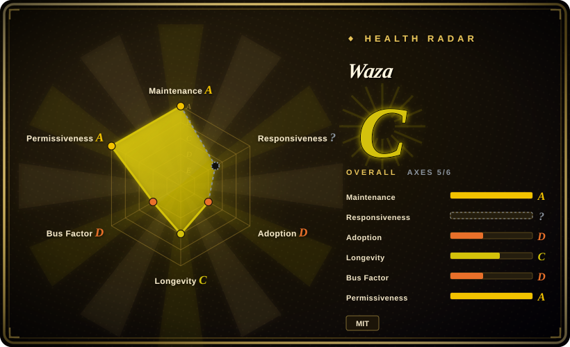
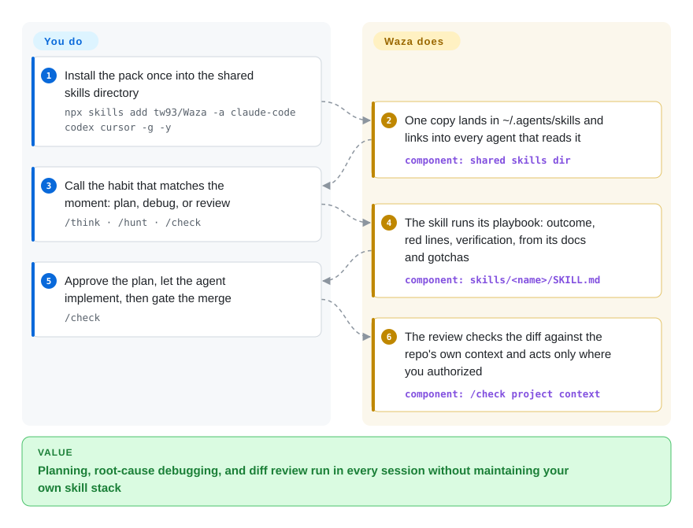

# Waza

You ask your agent to fix a regression and it patches by guessing, ships without reviewing its own diff, and starts coding before the design holds up. Waza installs eight named habit verbs — `/think`, `/ui`, `/check`, `/hunt` and friends — so the agent runs the engineering discipline you would run yourself, in Claude Code, Codex, Cursor and other skill-loading agents.

## When to use

You're an engineer working day-to-day inside Claude Code (or Codex / Cursor / Gemini CLI), and you notice the agent has no muscle memory for the disciplines you take for granted: it dives into code without thinking through the design, "fixes" bugs by guessing instead of finding the root cause, skips the diff review before declaring a release ready, and writes prose that reads like a robot. You don't want to assemble and maintain your own skill stack from scratch, and you want a small, opinionated set of habits rather than a sprawling framework. Waza drops in eight named skills you invoke directly — `/think` (challenges the problem, pressure-tests the design, produces a decision-complete plan), `/ui` (distinctive frontend UI, including screenshot-driven aesthetic iteration), `/check` (post-task diff review against project constraints, result verification, and approved release actions), `/hunt` (systematic debugging, root cause confirmed before any fix), `/write` (natural English/Chinese prose editing), `/learn` (a six-phase research workflow), `/read` (URL and PDF extraction), and `/health` (audits agent configuration — Codex/Claude Code setup, project instructions, verifier output, AI maintainability).

You reach for it when you want a curated, ready-made habit pack that follows you across harnesses, installed in one command (`npx skills add tw93/Waza -a claude-code codex cursor -g -y`). One copy lands in the shared `~/.agents/skills` directory and every agent that reads it — Claude Code, Codex, Cursor, Gemini CLI, Copilot, Amp, Kimi Code CLI — picks up the eight skills; there are also host-plugin routes (Claude Code `/plugin install waza@waza`, Codex `codex plugin add waza@waza`), a Claude Desktop release ZIP, and a Pi package (`pi install npm:@tw93/waza`). Each skill folder ships reference docs, helper scripts, and gotchas from real failures, so the behavior is more than a bare prompt — but it still activates through the host platform's skill loading, not as a standalone program you run.

## How it works

Waza is eight folders, each a `SKILL.md` playbook plus reference docs, helper scripts, and "gotchas from real failures". The design bet, stated in the README: each skill declares the outcome, the red lines, and how the result gets verified, then steps back and lets the model choose the path — as models improve, that restraint pays compound interest. What the pack does for you: when you invoke a verb (say `/hunt` on a regression), the agent follows that skill's playbook — reproduce, isolate, confirm the root cause *before* proposing a fix; or under `/check`, it reviews the diff against the repository's own public context (READMEs, manifests, Makefiles, CI workflows) rather than generic advice, and touches releases/issues only after you authorize it. What stays yours: you pick which verb fires when — "You decide how skills chain together" is the README's explicit rule — the habits are prompt-level playbooks, and optional extras (a Claude Code statusline, copy-in rules like `anti-patterns` and `english` coaching) are yours to enable one at a time.

<!-- flow-steps:begin (generated from flows/waza.json by tools/flow_card.py — do not edit) -->

Text version of the flow

1. **You**: Install the pack once into the shared skills directory — `npx skills add tw93/Waza -a claude-code codex cursor -g -y`
2. **Waza**: One copy lands in ~/.agents/skills and links into every agent that reads it — component: `shared skills dir`
3. **You**: Call the habit that matches the moment: plan, debug, or review — `/think · /hunt · /check`
4. **Waza**: The skill runs its playbook: outcome, red lines, verification, from its docs and gotchas — component: `skills/<name>/SKILL.md`
5. **You**: Approve the plan, let the agent implement, then gate the merge — `/check`
6. **Waza**: The review checks the diff against the repo's own context and acts only where you authorized — component: `/check project context`

**Value**: Planning, root-cause debugging, and diff review run in every session without maintaining your own skill stack

<!-- flow-steps:end -->

## When NOT to use

- **You already run a curated skill/command system.** Several Waza skills (`/think`, `/check`, `/hunt`, `/write`, `/health`, `/learn`, `/read`) overlap directly with common in-house planning/review/debug/research stacks. Layering them on top invites duplicate routing and conflicting instructions — pick one source of truth per habit.
- **Your agent has no skills loader.** The pack now travels through the shared `~/.agents/skills` directory (Claude Code, Codex, Cursor, Gemini CLI, Copilot, Amp, Kimi Code CLI) plus plugin/ZIP/npm routes; on a bespoke harness with nothing reading those files, the markdown alone won't auto-activate.
- **You want enforcement, not suggestion.** Behavior lives in prompt/skill markdown that the agent loads; the "habits" are advisory and the agent can still deviate. They are not hard gates.
- **You only need one habit.** It's a bundle of eight; if you just want, say, a debugging routine, installing the whole pack pulls in seven skills you won't route to.
- **Single-maintainer, fast-moving upstream.** A v3.x project with frequent releases and behavior baked into prompts; a version bump can change how a skill routes or what it checks (`/design` became `/ui` in the 3.x line). Pin and re-verify after upgrades.

## Comparison

| Alternative | In index | Our verdict | Tradeoff |
|---|---|---|---|
| [Superpowers](../../agent-dev-methodology/coding-agent-harnesses/superpowers.md) | ✅ | Pick Superpowers when you need a larger methodology-first library for brainstorm→plan→TDD→subagent→verify. | Larger, methodology-first skills library (brainstorm→plan→TDD→subagent→verify) targeting many harnesses; Waza is a smaller, habit-oriented bag of eight named commands, lighter to adopt but less of a full SDLC spine. |
| [SuperClaude Framework](../../agent-dev-methodology/coding-agent-harnesses/superclaude.md) | ✅ | Pick SuperClaude when you want persona, command, and MCP configuration rather than a lean habits pack. | Persona/command/MCP configuration framework with a much larger surface and heavier install; Waza is leaner and centers concrete engineering routines rather than a persona system. |
| [addyosmani/agent-skills](addyosmani-agent-skills.md) | ✅ | Pick addyosmani/agent-skills when you want framework-agnostic lifecycle coverage (idea→plan→execute→review, web perf, security) rather than eight tight verbs. | More than twice Waza's skill count with deeper each-phase guidance; Waza trades that coverage for eight habits you can actually keep in your head. |
| [web-quality-skills (addyosmani)](addyosmani-web-quality.md) | ✅ | Pick web-quality-skills when the task is specifically web performance or quality auditing. | Web-performance/quality-focused skills; narrower domain than Waza's general engineering habits. |
| [vercel-labs/agent-skills](vercel-agent-skills.md) | ✅ | Pick Vercel Agent Skills when vendor-curated React/Vercel rules matter more than general habits. | Vendor-curated skill collection; compare provenance and which agents it targets. |
| Anthropic's built-in skills / slash commands | not a repo | Pick native skills when you prefer the platform's own command ecosystem over third-party bundles. | The platform's native skill ecosystem, not a standalone repository; Waza is a third-party bundle layered on top and can duplicate or conflict with native commands. |

## Health & viability

- **Maintenance (2026-09):** very active — last default-branch commit 2026-09-25, latest release v3.38.0 ("Boundary", 2026-09-19), steady v3.x cadence with roughly monthly-or-faster tags, zero open issues, not archived. The fast cadence means a skill's routing/checks can change release-to-release (`/design` → `/ui` happened in the 3.x line).
- **Governance & bus factor:** single-maintainer `User` repo (`tw93`), ~7.1k stars. Adoption is now sizeable but the project still rests on one person with no org/foundation backing. [推断]
- **Age & Lindy:** created 2026-03, so ~6.5 months old — still unproven on Lindy; the sustained release cadence across that window is a mildly positive activity signal, not longevity evidence.
- **Risk flags:** advisory-only "habits" (prompt/skill markdown, not hard gates); single-maintainer + fast cadence ⇒ pin and re-verify after upgrades. The `/check` verb now performs release/maintainer actions, but only after explicit authorization per the README.

## Caveats (unverified)

- [未验证] The eight skills' behavior, helper scripts, and per-skill contents were read from the README's skill table and `skills/` layout on 2026-09-27, not exercised end-to-end.
- [未验证] Per-harness activation fidelity (Claude Code, Codex, Cursor, Gemini CLI, Copilot, Amp, Kimi Code CLI reading `~/.agents/skills`; Pi / Claude Desktop routes) is asserted by the README; not independently confirmed here.
- [未验证] The optional extras (statusline installer, `english` / `anti-patterns` / `waza-routing` rule scripts) were read from the README; their scripts were not run.
- [推断] Because behavior lives in prompt/skill markdown loaded by the agent, enforcement is advisory — "habits" are prompt-level instructions, not hard guarantees, and the agent can deviate.
- [推断] As a single-maintainer v3.x project with frequent releases, the skill set and routing can change release-to-release (observed once: `/design` renamed to `/ui`); check the current `skills/` directory rather than relying on this list.
