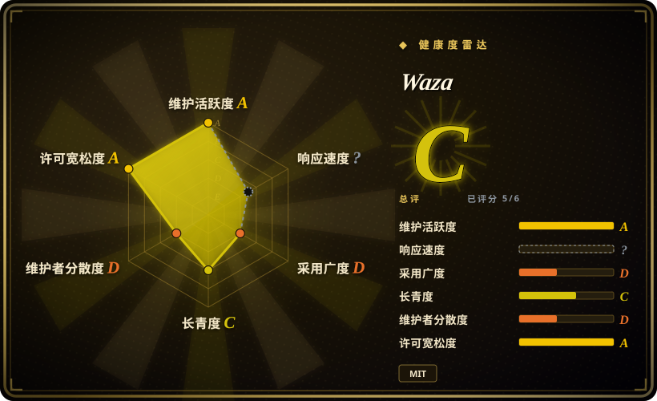
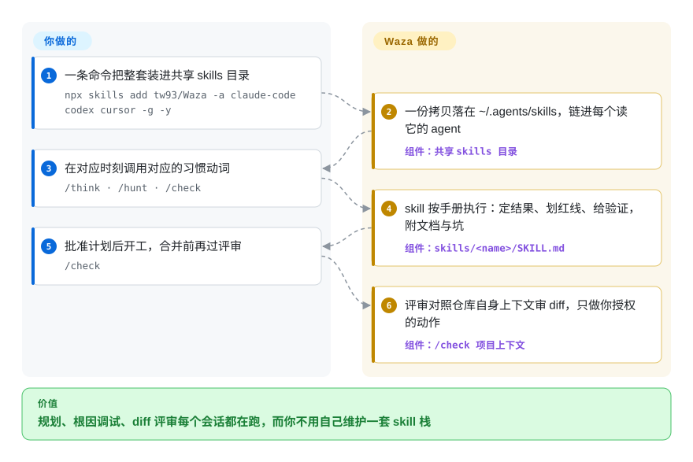

# Waza

你让 agent 修一个回归问题，它靠猜打补丁、写完不审自己的 diff、设计还没立住就开始写代码。Waza 装上八个具名的习惯动词——`/think`、`/ui`、`/check`、`/hunt` 等——让 agent 把你本来就会的工程纪律照做一遍，覆盖 Claude Code、Codex、Cursor 及其他支持 skills 的 agent。

## 何时使用

你是一名日常在 Claude Code（或 Codex / Cursor / Gemini CLI）里干活的工程师，发现 agent 完全没有你视为本能的那些纪律：不先想清楚设计就埋头写代码、靠猜而不是找根因来「修」bug、发布前不审一遍 diff 就宣布完工、写出来的英文/中文一股机器腔。你不想从零搭建并维护自己的 skill 栈，又想要一套有主见的小习惯集合，而不是一个庞大的框架。Waza 直接塞进八个具名 skill，由你直接调用——`/think`（质疑问题、压测设计，产出可交接的完整决策计划）、`/ui`（有辨识度的前端界面，含照截图迭代的审美打磨）、`/check`（任务后对照项目约束审 diff、验证结果、处理经你授权的发布动作）、`/hunt`（系统化调试，先确认根因再动手修）、`/write`（自然的中英文文稿润色）、`/learn`（六阶段调研工作流）、`/read`（URL 与 PDF 摘要或干净 Markdown 提取）、`/health`（审计 agent 配置——Codex/Claude Code 设置、项目指令、验证器输出、AI 可维护性）。

当你想要一套现成、有主见、能跨 harness 跟着你走的习惯包，且一条命令装好（`npx skills add tw93/Waza -a claude-code codex cursor -g -y`）时，就会用到它。一份拷贝落在共享目录 `~/.agents/skills`，凡是读这个目录的 agent——Claude Code、Codex、Cursor、Gemini CLI、Copilot、Amp、Kimi Code CLI——都能拿到这八个 skill；另外还有宿主插件路线（Claude Code `/plugin install waza@waza`、Codex `codex plugin add waza@waza`）、Claude Desktop 的发布 ZIP，以及 Pi 包（`pi install npm:@tw93/waza`）。每个 skill 文件夹附带参考文档、辅助脚本和来自真实失败的坑位说明，所以行为不止是一段裸 prompt——但它仍通过宿主平台的 skill 加载机制激活，而不是作为一个你自己运行的独立程序。

## 怎么用起来

Waza 是八个文件夹，每个都是一份 `SKILL.md` 手册加上参考文档、辅助脚本和「来自真实失败的坑」。README 里写明的设计取舍：每个 skill 只声明目标结果、红线、以及结果如何验证，然后把路径的选择让给模型——模型越强，这种克制复利越高。它替你做的：你调用一个动词（比如对回归问题用 `/hunt`），agent 就按该 skill 的手册走——先复现、再隔离、修之前必须确认根因；用 `/check` 时，它对照仓库自身的公开上下文（README、包清单、Makefile、CI workflow）审 diff，而不是泛泛建议，且只有你授权后才碰发布/issue。仍然归你管的：哪个动词何时触发由你决定——「链路怎么串由你定」是 README 的明文规则——这些习惯是 prompt 层手册；可选附加件（Claude Code 状态栏、`anti-patterns`、`english` 教练等拷入即用的规则）也由你逐个开关。

<!-- flow-steps:begin (generated from flows/waza.json by tools/flow_card.py — do not edit) -->

流程文字版

1. **你**：一条命令把整套装进共享 skills 目录 — `npx skills add tw93/Waza -a claude-code codex cursor -g -y`
2. **Waza**：一份拷贝落在 ~/.agents/skills，链进每个读它的 agent — 组件：`共享 skills 目录`
3. **你**：在对应时刻调用对应的习惯动词 — `/think · /hunt · /check`
4. **Waza**：skill 按手册执行：定结果、划红线、给验证，附文档与坑 — 组件：`skills/<name>/SKILL.md`
5. **你**：批准计划后开工，合并前再过评审 — `/check`
6. **Waza**：评审对照仓库自身上下文审 diff，只做你授权的动作 — 组件：`/check 项目上下文`

**价值**：规划、根因调试、diff 评审每个会话都在跑，而你不用自己维护一套 skill 栈

<!-- flow-steps:end -->

## 何时不用

- **你已有一套自建的 skill / 命令体系。** Waza 的多个 skill（`/think`、`/check`、`/hunt`、`/write`、`/health`、`/learn`、`/read`）与常见自建的规划/评审/调试/调研栈直接重叠。叠在上面会造成重复路由和指令冲突——每个习惯只保留一个事实源。
- **你的 agent 没有 skills 加载器。** 这套包现在通过共享目录 `~/.agents/skills` 分发（Claude Code、Codex、Cursor、Gemini CLI、Copilot、Amp、Kimi Code CLI），另有插件/ZIP/npm 路线；在没人读这些文件的自制 harness 上，单凭 markdown 不会自动激活。
- **你要的是强制约束而非建议。** 行为存在于 agent 加载的 prompt/skill markdown 里；这些「习惯」是建议性的，agent 仍可偏离，并非硬闸门。
- **你只需要其中一个习惯。** 它是八合一的包；若只想要个调试套路，装整包会一并带进七个你不会路由到的 skill。
- **单维护者、快速迭代的上游。** v3.x 项目，发布频繁、行为内嵌在 prompt 里；一次版本升级就可能改变某个 skill 的路由或检查内容（3.x 线上 `/design` 已改名 `/ui`）。升级后请锁版并重新核验。

## 横向对比

| 替代品 | 是否收录 | 我们的评价 | 取舍 |
|---|---|---|---|
| [Superpowers](../../agent-dev-methodology/coding-agent-harnesses/superpowers.zh.md) | ✅ | 需要更大、方法论优先的 brainstorm→plan→TDD→subagent→verify 库时，选 Superpowers。 | 更大、方法论优先的 skills 库（brainstorm→plan→TDD→subagent→verify），面向多 harness；Waza 是更小、面向习惯的八个具名命令的集合，更轻便上手，但不构成完整的 SDLC 主干。 |
| [SuperClaude Framework](../../agent-dev-methodology/coding-agent-harnesses/superclaude.zh.md) | ✅ | 想要 persona、命令和 MCP 配置框架，而不是轻量习惯包时，选 SuperClaude。 | persona/命令/MCP 配置框架，面更大、安装更重；Waza 更精简，围绕具体工程套路而非 persona 体系。 |
| [addyosmani/agent-skills](addyosmani-agent-skills.zh.md) | ✅ | 需要框架无关的全生命周期覆盖（构思→计划→执行→评审、web 性能、安全）而非八个紧凑动词时，选 addyosmani/agent-skills。 | skill 数量超过 Waza 的两倍、每个阶段的指导更深；Waza 用覆盖面换来了八个你真正记得住的习惯。 |
| [web-quality-skills（addyosmani）](addyosmani-web-quality.zh.md) | ✅ | 任务明确是 web 性能或质量审计时，选 web-quality-skills。 | 聚焦 web 性能/质量的 skill；领域比 Waza 的通用工程习惯更窄。 |
| [vercel-labs/agent-skills](vercel-agent-skills.zh.md) | ✅ | 厂商策划的 React/Vercel 规则比通用习惯更重要时，选 Vercel Agent Skills。 | 厂商策划的 skill 集合；比较来源与所面向的 agent。 |
| Anthropic 内置 skill / 斜杠命令 | 非仓库 | 更偏好平台原生命令生态，而非第三方 bundle 时，选内置 skill。 | 平台原生 skill 生态，并非独立仓库；Waza 是叠在上面的第三方包，可能与原生命令重复或冲突。 |

## 健康度与可持续性

- **维护（2026-09）：** 非常活跃——默认分支最后提交 2026-09-25，最新发布 v3.38.0（「Boundary」，2026-09-19），v3.x 保持约每月甚至更快的节奏，open issue 为零，未归档。快节奏意味着某个 skill 的路由／检查可能逐版本变化（3.x 线上已发生 `/design` 改名 `/ui`）。
- **治理与 bus factor：** 单维护者 `User` 仓库（`tw93`），约 7.1k stars。采用量已不小，但项目仍压在一个维护者身上，无组织或基金会背书。[推断]
- **年龄与 Lindy：** 创建于 2026-03，约六个半月——Lindy 维度仍未经验证；这段时间内持续的发布节奏只是活跃度信号，不构成存续证据。
- **风险标记：** 「习惯」仅建议性（prompt/skill markdown，而非硬闸门）；单维护者＋快节奏 ⇒ 升级后请锁版并重新核验。`/check` 现在会执行发布/维护动作，但按 README 仅在获得明确授权后。

## 存疑（未验证）

- [未验证] 八个 skill 的行为、辅助脚本与具体内容取自 2026-09-27 的 README skill 表与 `skills/` 目录结构，未端到端实操验证。
- [未验证] 各 harness 的激活保真度（Claude Code、Codex、Cursor、Gemini CLI、Copilot、Amp、Kimi Code CLI 读取 `~/.agents/skills`；Pi / Claude Desktop 路线）由 README 声称，此处未独立确认。
- [未验证] 可选附加件（状态栏安装脚本、`english` / `anti-patterns` / `waza-routing` 规则脚本）读自 README，脚本未运行验证。
- [推断] 由于行为存在于 agent 加载的 prompt/skill markdown，强制力是建议性的——「习惯」是 prompt 层指令而非硬保证，agent 可能偏离。
- [推断] 作为单维护者的 v3.x 项目、发布频繁，skill 集合与路由可能逐版本变化（已观察到一次：`/design` 改名 `/ui`）；请查当前 `skills/` 目录而非依赖此列表。
