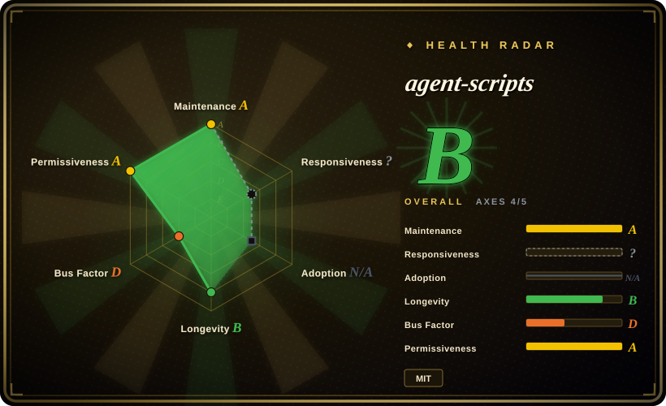
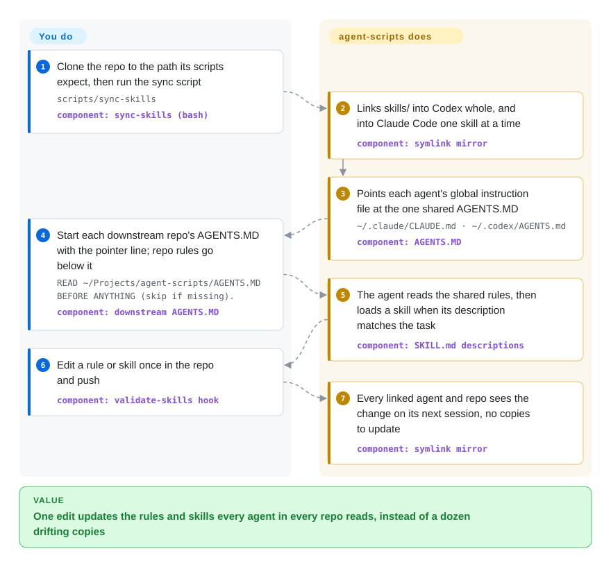

# agent-scripts

You run Codex and Claude Code across a dozen repos, and every repo carries its own slowly diverging copy of the same rules and skills — fix a rule in one and the other eleven are stale. Peter Steinberger's answer is one canonical repo: a shared `AGENTS.MD`, ~70 skills, and a script that symlinks both into every agent's config so each downstream repo holds a one-line pointer instead of a copy.

## When to use

You are a solo maintainer or a very small team shipping many repositories — CLIs, a macOS app, a few npm packages — and you drive Codex and Claude Code side by side. You notice the drift concretely: `repo-a/AGENTS.md` says "run `pnpm check` before commit", `repo-b/AGENTS.md` still says `npm test`, and the release-checklist skill you improved last week lives only in `~/.codex/skills`, so Claude Code never sees it. You want one place to edit, and every agent on every machine to pick the change up.

You reach for agent-scripts as a **working reference layout** for that problem, not as a skill bundle to install wholesale. What it shows that most skill packs don't: a single `AGENTS.MD` of hard rules linked into `~/.codex/AGENTS.md`, `~/.claude/CLAUDE.md` and `~/.claude/AGENTS.md`; downstream repos that start with `READ ~/Projects/agent-scripts/AGENTS.MD BEFORE ANYTHING (skip if missing).`; and `scripts/sync-skills`, which builds a whole-root link for Codex (it scans nested dirs) and a flat per-skill link mirror for Claude Code (it only loads `~/.claude/skills/<name>/SKILL.md`, one level deep). Pick it over [gstack](gstack.md) or [Superpowers](../../../agent-dev-methodology/coding-agent-harnesses/superpowers.md) when your pain is *distributing your own rules across repos and agents*, not *acquiring someone else's development process*. The skills themselves are a secondary draw — the Apple-platform ones (`release-mac-app`, `xcode-sync`, `native-app-performance`, `instruments-profiling`) and the `create-cli` guidelines are the most portable.

## How it works

The repo is a dotfiles-style source of truth, not a plugin. You clone it to the path its scripts hardcode (`~/Projects/agent-scripts`) and run `scripts/sync-skills`; that bash script creates symlinks — shortcuts on disk that point back at the repo — from each agent's config directory into the clone, so there is only ever one copy to edit. Codex gets a link to the whole `skills/` folder; Claude Code gets one link per skill because it does not look inside sub-folders; both agents get their global instruction file pointed at the shared `AGENTS.MD`. After that, the agents do the rest on their own: each skill's short `description` line is what the agent matches a task against, so it loads the right `SKILL.md` only when needed. Your part is adding the one-line pointer to each downstream repo and keeping repo-specific rules below it. Think of it as a household's single shared calendar rather than a sticky note on every door: everyone reads the same page. The public alternative entry — `npx skills add steipete/agent-scripts` via skills.sh — copies skills into one agent without the shared-rules half, and skips the 15 skills that are symlinks into sibling repos.

<!-- flow-steps:begin (generated from flows/agent-scripts.json by tools/flow_card.py — do not edit) -->

Text version of the flow

1. **You**: Clone the repo to the path its scripts expect, then run the sync script — `scripts/sync-skills` — component: `sync-skills (bash)`
2. **agent-scripts**: Links skills/ into Codex whole, and into Claude Code one skill at a time — component: `symlink mirror`
3. **agent-scripts**: Points each agent's global instruction file at the one shared AGENTS.MD — `~/.claude/CLAUDE.md · ~/.codex/AGENTS.md` — component: `AGENTS.MD`
4. **You**: Start each downstream repo's AGENTS.MD with the pointer line; repo rules go below it — `READ ~/Projects/agent-scripts/AGENTS.MD BEFORE ANYTHING (skip if missing).` — component: `downstream AGENTS.MD`
5. **agent-scripts**: The agent reads the shared rules, then loads a skill when its description matches the task — component: `SKILL.md descriptions`
6. **You**: Edit a rule or skill once in the repo and push — component: `validate-skills hook`
7. **agent-scripts**: Every linked agent and repo sees the change on its next session, no copies to update — component: `symlink mirror`

**Value**: One edit updates the rules and skills every agent in every repo reads, instead of a dozen drifting copies

<!-- flow-steps:end -->

## When NOT to use

- **You want a skill pack that works after `git clone`.** 15 of the ~69 entries in `skills/` (`autoreview`, `handoff`, `crabbox`, `peekaboo`, `gog`, `discrawl`, `imsg`, `wacli` …) are relative symlinks like `../../agent-skills/skills/autoreview` or `../../peekaboo/skills/peekaboo` — they resolve only if you also clone [openclaw/agent-skills](https://github.com/openclaw/agent-skills) and each tool repo next to it under `~/Projects`. Standalone, they are dangling links. If you want self-contained skills, take [Dimillian Skills](dimillian-skills.md) (where four of the SwiftUI skills here were copied from) or [antfu/skills](antfu-skills.md).
- **Your `~/.claude/CLAUDE.md` or `~/.codex/AGENTS.md` is already a symlink into your own dotfiles.** `sync-skills` preserves a *real* file (it warns and exits 1), but it retargets an existing *symlink* with `ln -sfn` without asking — your global instructions silently become Peter's. Read `scripts/sync-skills` and copy the mirror logic into your own harness instead of running it against your home directory; or keep your own setup and install a curated subset with the skills CLI.
- **You want neutral, general-purpose rules.** `AGENTS.MD` is one person's operating manual: sign emails "Peter's Claw 🦞", route GitHub reads through Octopool, prefer Codex for `$autoreview`, load `$one-password` before any `op` call, special-case `openclaw/openclaw` changelogs. Adopting it wholesale imports policies about infrastructure you don't have. For a process framework written for strangers, use [Superpowers](../../../agent-dev-methodology/coding-agent-harnesses/superpowers.md); for a ready-made sprint loop, [gstack](gstack.md).
- **Your skills depend on infrastructure you don't run.** A large share of the skills target Peter's own fleet and services — `maintainer-orchestrator`, `fleet-maintenance`, `clawsweeper-status`, `remote-mac`, `openclaw-relay`, `codex-huge-context`, `discord-clawd`, and `tools.md`'s list of his CLIs (`bird`, `sonoscli` …). On another machine they are documentation of someone else's setup. If you only want a portable browser driver for agents, [agent-browser](../../../web-automation/agent-browser-tools/agent-browser.md) is a maintained standalone CLI; `scripts/browser-tools.ts` here is a single-file helper.
- **You need Windows or Linux as the primary host.** Paths assume `~/Projects`, macOS Keychain, Xcode, Instruments and Homebrew; `docs/windows.md` exists but the CI only runs synthetic shell/Node/Ruby smoke tests on Ubuntu, not the agent workflows.
- **You need stability or a second maintainer.** 659 of ~666 commits are by one author (verified 2026-09-29), `main` moves several times a week, and the skills' behavior changes with the author's current model routing (the changelog swaps model names and review paths month to month). Pin a commit, vendor what you use, and expect no deprecation notice.

## Comparison

| Alternative | In index | Our verdict | Tradeoff |
|---|---|---|---|
| [gstack](gstack.md) | ✅ | Take gstack when you want someone's complete plan → build → review → ship loop installed by one `./setup`; take agent-scripts when you already have your own loop and need to share rules and skills across many repos and two agents. | gstack is a product-shaped harness with a driven browser and a heavy footprint; agent-scripts is a lighter, more personal source-of-truth layout whose skills mostly assume the author's machines. |
| [Dimillian Skills](dimillian-skills.md) | ✅ | For the SwiftUI skills alone, take Dimillian Skills — it is the upstream of `swiftui-liquid-glass`, `swift-concurrency-expert`, `swiftui-view-refactor` and `swiftui-performance-audit` here; take agent-scripts when you also want its macOS release, Xcode and Instruments workflows. | Dimillian's pack is self-contained and Codex-targeted but coasting; agent-scripts is active but carries copies that can lag or diverge from the upstream. |
| [Superpowers](../../../agent-dev-methodology/coding-agent-harnesses/superpowers.md) | ✅ | Take Superpowers when you want a general, TDD-first development process written for any team; take agent-scripts when the process is already yours and the missing piece is distributing it. | Superpowers ships a marketplace plugin and neutral skills; agent-scripts ships one maintainer's opinions plus the sync mechanism, with no install story beyond cloning. |
| [openclaw/agent-skills](https://github.com/openclaw/agent-skills) | not indexed | Take openclaw/agent-skills directly when you want the public OpenClaw skills (`autoreview`, `handoff`, `crabbox`) that agent-scripts only symlinks to; take agent-scripts for the personal glue around them. | It is the canonical source of the 15 symlinked skills and is maintained in the OpenClaw org rather than a personal repo; not added in this tab-intake batch. |
| Your own dotfiles repo with a sync script | not a repo | Write your own when you already have a dotfiles harness — borrow `sync-skills`'s Codex-vs-Claude link layout and the pointer-line convention, not the rules. | Full control over paths, conflict handling and policy; you re-derive the one-level-deep Claude skill discovery and collision rules yourself. |

## Health & viability

- **Responsiveness (2026-09):** the radar leaves this axis unscored for a skill pack; read by hand, volume is low — 44 issues+PRs in total, mostly the author's own same-day PRs. External PRs #28 and #29 (2026-07) were merged within two days, while two September contributions (#42, #43) and the bug report #41 (`markdown-converter` commands fail on PDF/Office) were still open at check time.
- **Maintenance (2026-09):** very active — commits in nearly every week of the last quarter (13-week totals 28 → 1, tapering in late September), last push 2026-09-27, two tags (`0.11.0`, `0.12.0` on 2026-07-17) with long curated release notes and a running `CHANGELOG.md`. A small CI runs syntax checks and synthetic tests for the sync script, npm, Codex-preflight and macOS-release helpers.
- **Governance & bus factor:** a `User`-owned personal repo; steipete authored 659 commits and the next seven contributors one each. The roadmap is whatever the author's own fleet needs next — the repo describes itself as "shared between my repositories".
- **Age & Lindy verdict:** created 2025-11-08, so ~11 months old — young, but continuously active since creation. Not yet Lindy; its durability tracks the author's continued interest in agent tooling (he also leads the OpenClaw ecosystem the skills reference).
- **Adoption:** ~6.8k stars and 552 forks (2026-09-29), and skills.sh reports 9.3K total installs; the fork ratio fits "copy the layout and customize" rather than "depend on it".
- **Risk flags:** personal-infrastructure coupling (hardcoded `~/Projects` paths, private services, 1Password, Octopool); `sync-skills` retargets existing symlinks in your home directory; one vendored skill (`frontend-design`) is Apache-2.0 inside an MIT repo; advisory-only rules with no enforcement beyond a local `validate-skills` pre-commit hook.

## Caveats (unverified)

- [未验证] Star, fork and install counts (~6.8k / 552 / 9.3K on skills.sh) are 2026-09-29 reads and move continuously; they measure attention, not fitness.
- [未验证] "~69 entries, 15 symlinks" is my count of the `main` tree at `3f8c6a3` on 2026-09-29 (54 directories with a `SKILL.md` plus 15 symlink entries); the set changes often and the README's own list of symlinked skills is shorter than the tree.
- [未验证] The claim that `npx skills add steipete/agent-scripts` skips the symlinked skills is inferred from how a symlink with a `../../` target behaves outside the author's `~/Projects` layout; I did not run the skills CLI install.
- [推断] The `ln -sfn` retargeting of an existing `~/.claude/CLAUDE.md` / `~/.codex/AGENTS.md` symlink is read from `scripts/sync-skills` (`link()` at lines ~138–148); I did not execute the script against a home directory.
- [未验证] Claude Code's one-level-deep skill discovery is the author's statement ("verified on 2.1.197") in the README and script header; later Claude Code versions may scan differently.
- [推断] Four SwiftUI skills carry an explicit "copied from @Dimillian's `Dimillian/Skills` (2025-12-31)" attribution; whether they have since diverged from the upstream was not diffed skill by skill.
- [推断] `type: skill-pack` hides real runtime pieces — Bun for `browser-tools.ts`, Ruby for `validate-skills`, Node for the npm and transcript helpers, `puppeteer-core` and `commander` in `package.json` — which is why this page has no Tech stack / Dependencies / Ops sections; read the footprint bullets in When NOT to use instead.
