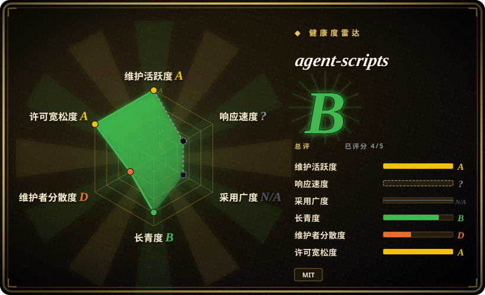
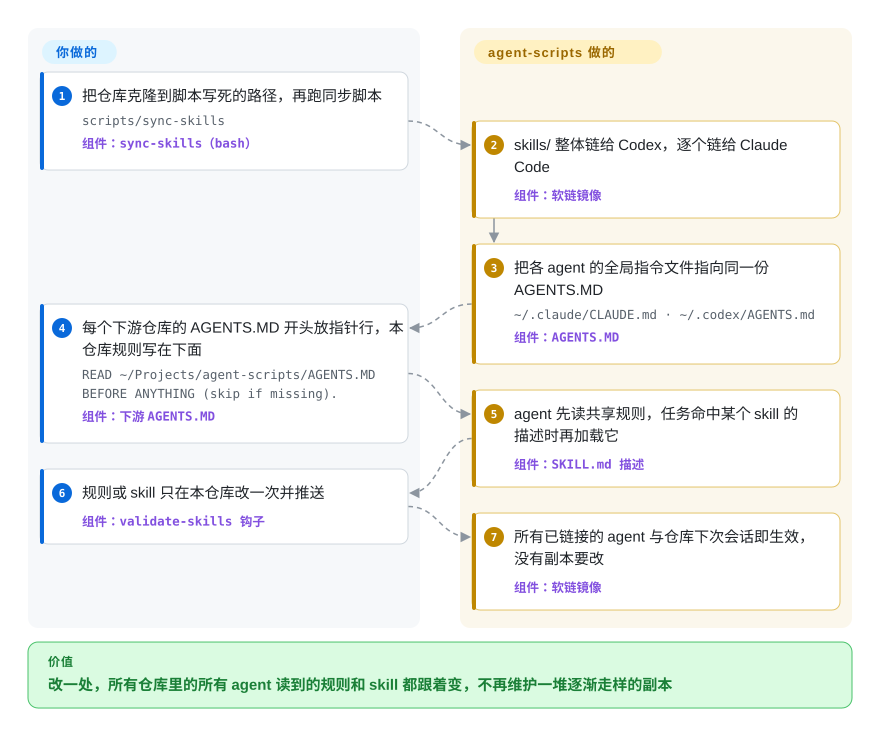

# agent-scripts

你在十几个仓库里同时用 Codex 和 Claude Code，每个仓库都揣着一份同样规则、同样 skill 的副本，各自慢慢走样——一处改了，另外十一处就过时了。Peter Steinberger 的做法是只留一个权威仓库：一份共享的 `AGENTS.MD`、约 70 个 skill，外加一个脚本，用软链把它们挂进每个 agent 的配置目录，下游仓库只放一行指针，不再放副本。

## 何时使用

你是一个人或两三个人维护一堆仓库——几个 CLI、一个 macOS 应用、几个 npm 包——Codex 和 Claude Code 轮着用。走样是看得见的：`repo-a/AGENTS.md` 写着“提交前跑 `pnpm check`”，`repo-b/AGENTS.md` 还停在 `npm test`；上周改好的发布检查 skill 只躺在 `~/.codex/skills` 里，Claude Code 根本看不到。你想要的是只改一个地方，所有机器上的所有 agent 都能读到。

这时把 agent-scripts 当作**一个跑通了的参考布局**来看，而不是整包装上的 skill 集合。它演示了多数 skill 包没做的事：一份硬规则 `AGENTS.MD`，同时链到 `~/.codex/AGENTS.md`、`~/.claude/CLAUDE.md` 和 `~/.claude/AGENTS.md`；下游仓库第一行写 `READ ~/Projects/agent-scripts/AGENTS.MD BEFORE ANYTHING (skip if missing).`；再加上 `scripts/sync-skills`，给 Codex 建整目录软链（它会递归扫子目录），给 Claude Code 建逐个 skill 的平铺软链（它只加载 `~/.claude/skills/<name>/SKILL.md` 这一层）。如果你的痛点是“把自己的规则分发到多个仓库和多个 agent”，而不是“拿一套别人的开发流程”，就选它而不是 [gstack](gstack.zh.md) 或 [Superpowers](../../../agent-dev-methodology/coding-agent-harnesses/superpowers.zh.md)。skill 本身是次要收获——Apple 平台那几个（`release-mac-app`、`xcode-sync`、`native-app-performance`、`instruments-profiling`）和 `create-cli` 的 CLI 设计指南最容易搬走。

## 怎么用起来

这个仓库是 dotfiles 式的唯一事实源，不是插件。你把它克隆到脚本写死的路径（`~/Projects/agent-scripts`），跑 `scripts/sync-skills`；这个 bash 脚本会创建软链——磁盘上指回仓库的快捷方式——从各 agent 的配置目录指进这份克隆，所以永远只有一份要改。Codex 拿到整个 `skills/` 目录的链接；Claude Code 不看子目录，所以每个 skill 单独一条链接；两个 agent 的全局指令文件都指向共享的 `AGENTS.MD`。之后的事 agent 自己做：每个 skill 开头那句简短的 `description` 是 agent 拿任务去匹配的依据，命中了才加载对应的 `SKILL.md`。你要做的只是在每个下游仓库放那行指针，把本仓库特有的规则写在它下面。打个比方：这是全家共用的一本日历，而不是每扇门上贴一张便签。另一个公开入口是 skills.sh 的 `npx skills add steipete/agent-scripts`，它把 skill 拷进单个 agent，但没有共享规则那一半，也拿不到那 15 个指向兄弟仓库的软链 skill。

<!-- flow-steps:begin (generated from flows/agent-scripts.json by tools/flow_card.py — do not edit) -->

流程文字版

1. **你**：把仓库克隆到脚本写死的路径，再跑同步脚本 — `scripts/sync-skills` — 组件：`sync-skills（bash）`
2. **agent-scripts**：skills/ 整体链给 Codex，逐个链给 Claude Code — 组件：`软链镜像`
3. **agent-scripts**：把各 agent 的全局指令文件指向同一份 AGENTS.MD — `~/.claude/CLAUDE.md · ~/.codex/AGENTS.md` — 组件：`AGENTS.MD`
4. **你**：每个下游仓库的 AGENTS.MD 开头放指针行，本仓库规则写在下面 — `READ ~/Projects/agent-scripts/AGENTS.MD BEFORE ANYTHING (skip if missing).` — 组件：`下游 AGENTS.MD`
5. **agent-scripts**：agent 先读共享规则，任务命中某个 skill 的描述时再加载它 — 组件：`SKILL.md 描述`
6. **你**：规则或 skill 只在本仓库改一次并推送 — 组件：`validate-skills 钩子`
7. **agent-scripts**：所有已链接的 agent 与仓库下次会话即生效，没有副本要改 — 组件：`软链镜像`

**价值**：改一处，所有仓库里的所有 agent 读到的规则和 skill 都跟着变，不再维护一堆逐渐走样的副本

<!-- flow-steps:end -->

## 何时不用

- **你要的是 `git clone` 下来就能用的 skill 包。** `skills/` 下约 69 个条目里有 15 个（`autoreview`、`handoff`、`crabbox`、`peekaboo`、`gog`、`discrawl`、`imsg`、`wacli` 等）是 `../../agent-skills/skills/autoreview`、`../../peekaboo/skills/peekaboo` 这类相对软链——只有你同时把 [openclaw/agent-skills](https://github.com/openclaw/agent-skills) 和各个工具仓库克隆到 `~/Projects` 下的相邻位置，它们才能解析；单独克隆时就是断链。想要自包含的 skill，选 [Dimillian Skills](dimillian-skills.zh.md)（这里有四个 SwiftUI skill 就是从它那里拷来的）或 [antfu/skills](antfu-skills.zh.md)。
- **你的 `~/.claude/CLAUDE.md` 或 `~/.codex/AGENTS.md` 已经是指向自己 dotfiles 的软链。** `sync-skills` 会保留**真实文件**（报警告并以 1 退出），但对已存在的**软链**直接用 `ln -sfn` 改指向，不问你——你的全局指令会悄悄变成 Peter 的。读一遍 `scripts/sync-skills`，把镜像逻辑抄进你自己的 harness，而不是对着自己的家目录直接跑；或者保留现有配置，用 skills CLI 挑几个装。
- **你要中立、通用的规则。** `AGENTS.MD` 是一个人的操作手册：代发邮件署名“Peter's Claw 🦞”、GitHub 读取走 Octopool、`$autoreview` 优先用 Codex、调 `op` 之前先加载 `$one-password`、`openclaw/openclaw` 的 changelog 特殊处理。整包照搬等于引入一堆关于你并不存在的基础设施的政策。想要写给陌生人用的流程框架，选 [Superpowers](../../../agent-dev-methodology/coding-agent-harnesses/superpowers.zh.md)；想要现成的冲刺流程，选 [gstack](gstack.zh.md)。
- **你没有这些 skill 依赖的基础设施。** 相当一部分 skill 面向作者自己的机器群和服务——`maintainer-orchestrator`、`fleet-maintenance`、`clawsweeper-status`、`remote-mac`、`openclaw-relay`、`codex-huge-context`、`discord-clawd`，还有 `tools.md` 里列的他自己的 CLI（`bird`、`sonoscli` 等）。换一台机器，这些只是别人配置的说明书。如果你只想要一个给 agent 用的便携浏览器驱动，[agent-browser](../../../web-automation/agent-browser-tools/agent-browser.zh.md) 是持续维护的独立 CLI；这里的 `scripts/browser-tools.ts` 只是单文件辅助脚本。
- **你的主力环境是 Windows 或 Linux。** 路径默认 `~/Projects`，依赖 macOS 钥匙串、Xcode、Instruments、Homebrew；虽有 `docs/windows.md`，但 CI 只在 Ubuntu 上跑合成的 shell／Node／Ruby 冒烟测试，不跑 agent 工作流本身。
- **你需要稳定性或第二个维护者。** 约 666 次提交里 659 次出自同一作者（2026-09-29 核对），`main` 一周动好几次，skill 行为还随作者当下的模型路由变化（changelog 里模型名和评审路径逐月更换）。锁定某个 commit，把用到的部分 vendor 进来，别指望有弃用预告。

## 横向对比

| 替代品 | 是否收录 | 我们的评价 | 取舍 |
|---|---|---|---|
| [gstack](gstack.zh.md) | ✅ | 想用一次 `./setup` 装上别人完整的“规划 → 构建 → 评审 → 发布”流程，选 gstack；已经有自己的流程、缺的是跨多个仓库和两个 agent 共享规则与 skill，选 agent-scripts。 | gstack 是产品形态的 harness，带受驱动的浏览器，安装面重；agent-scripts 更轻、更私人，是一套唯一事实源布局，但多数 skill 默认作者自己的机器。 |
| [Dimillian Skills](dimillian-skills.zh.md) | ✅ | 只要 SwiftUI skill，选 Dimillian Skills——它是这里 `swiftui-liquid-glass`、`swift-concurrency-expert`、`swiftui-view-refactor`、`swiftui-performance-audit` 的上游；还想要 macOS 发布、Xcode、Instruments 工作流，选 agent-scripts。 | Dimillian 的包自包含、面向 Codex，但已放缓更新；agent-scripts 活跃，但持有的是副本，可能落后或偏离上游。 |
| [Superpowers](../../../agent-dev-methodology/coding-agent-harnesses/superpowers.zh.md) | ✅ | 想要写给任何团队的通用、TDD 优先的开发流程，选 Superpowers；流程已经是你自己的、缺的是分发手段，选 agent-scripts。 | Superpowers 有插件市场安装和中立的 skill；agent-scripts 给的是一位维护者的主张加同步机制，除了克隆没有别的安装方式。 |
| [openclaw/agent-skills](https://github.com/openclaw/agent-skills) | 未收录 | 想要 agent-scripts 只是软链过去的那些公开 OpenClaw skill（`autoreview`、`handoff`、`crabbox`），直接用 openclaw/agent-skills；想要围绕它们的个人胶水层，选 agent-scripts。 | 它是那 15 个软链 skill 的权威来源，由 OpenClaw 组织而非个人仓库维护；本轮标签页收录批次未添加。 |
| 你自己的 dotfiles 仓库加同步脚本 | 非仓库 | 已经有自己的 dotfiles harness 时自己写——借 `sync-skills` 的 Codex／Claude 链接布局和指针行约定，不借规则本身。 | 路径、冲突处理和规则全由你掌控；代价是 Claude 只扫一层的 skill 发现方式和重名优先级要自己重新摸一遍。 |

## 健康度与可持续性

- **响应度（2026-09）：** 雷达对 skill 包不给这一轴打分；人工看，量很小——issue 和 PR 合计 44 个，大多是作者自己当天开当天合的 PR。外部 PR #28、#29（2026-07）两天内合入；而九月的两个外部贡献（#42、#43）和 bug 报告 #41（`markdown-converter` 的命令处理 PDF／Office 失败）核对时仍未处理。
- **维护（2026-09）：** 非常活跃——近一个季度几乎每周都有提交（13 周提交数从 28 递减到 1，九月下旬放缓），最后推送 2026-09-27；有两个 tag（`0.11.0`、2026-07-17 的 `0.12.0`），发布说明很长且经过整理，另有持续更新的 `CHANGELOG.md`。一个小型 CI 会跑语法检查，以及同步脚本、npm、Codex 预检和 macOS 发布辅助脚本的合成测试。
- **治理与巴士因子：** `User` 名下的个人仓库；steipete 贡献 659 次提交，其余七位贡献者各 1 次。路线图就是作者自己机器群下一步需要什么——仓库自述即“在我的各个仓库之间共享”。
- **年龄与 Lindy 判断：** 2025-11-08 创建，约 11 个月——年轻，但自创建起一直活跃。还谈不上 Lindy；它能活多久取决于作者对 agent 工具的持续兴趣（他同时主导 skill 里反复提到的 OpenClaw 生态）。
- **采用度：** 约 6.8k star、552 fork（2026-09-29），skills.sh 显示累计 9.3K 次安装；fork 比例更像“抄布局再改”，而不是“当依赖用”。
- **风险信号：** 与个人基础设施强耦合（写死的 `~/Projects` 路径、私有服务、1Password、Octopool）；`sync-skills` 会改写你家目录里已有的软链；有一个 vendor 进来的 skill（`frontend-design`）是 Apache-2.0，放在 MIT 仓库里；规则只是建议，除了本地 `validate-skills` pre-commit 钩子没有任何强制。

## 存疑（未验证）

- [未验证] star、fork 和安装数（约 6.8k／552／skills.sh 上 9.3K）是 2026-09-29 的读数，持续变化；它们衡量的是关注度，不是适配度。
- [未验证] “约 69 个条目、15 个软链”是我在 2026-09-29 对 `main`（`3f8c6a3`）目录树的计数（54 个含 `SKILL.md` 的目录加 15 个软链条目）；集合变化频繁，README 自己列出的软链 skill 比目录树里少。
- [未验证] “`npx skills add steipete/agent-scripts` 拿不到软链 skill”是按 `../../` 相对软链脱离作者 `~/Projects` 布局后的行为推出来的；我没有实际跑 skills CLI 安装。
- [推断] 对已存在的 `~/.claude/CLAUDE.md`／`~/.codex/AGENTS.md` 软链用 `ln -sfn` 改指向，这一点读自 `scripts/sync-skills`（`link()`，约第 138–148 行）；我没有在真实家目录上执行该脚本。
- [未验证] Claude Code 只扫一层 skill 目录，是作者在 README 和脚本头注释里的说法（“verified on 2.1.197”）；更新的 Claude Code 版本可能扫描方式不同。
- [推断] 四个 SwiftUI skill 带有“copied from @Dimillian's `Dimillian/Skills` (2025-12-31)”的显式署名；之后是否与上游分叉，没有逐个 diff。
- [推断] `type: skill-pack` 掩盖了真实的运行时组件——`browser-tools.ts` 要 Bun，`validate-skills` 要 Ruby，npm 和字幕辅助脚本要 Node，`package.json` 里有 `puppeteer-core` 和 `commander`——所以本页没有技术栈／依赖／运维小节；请把“何时不用”里关于安装面的几条当作替代。
