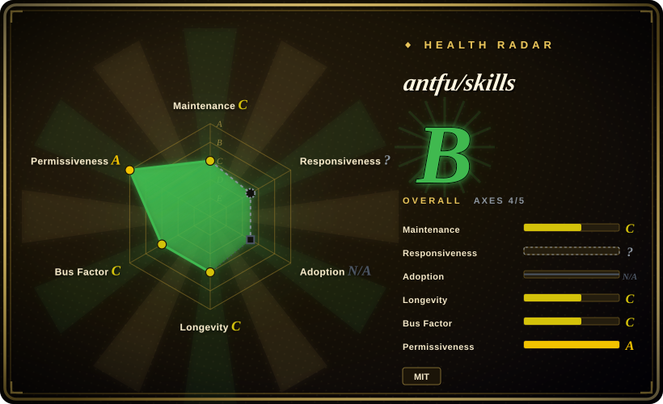
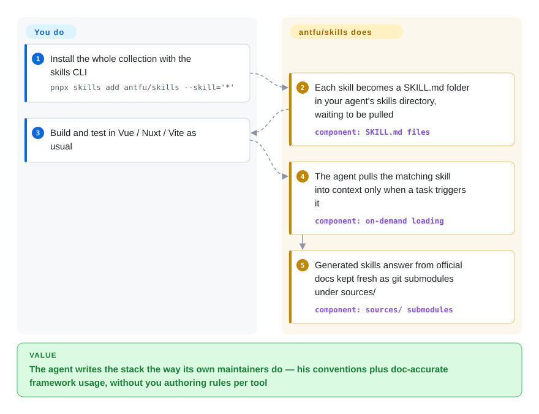

# antfu/skills

Your agent's Vue/Vite/Nuxt code works but reads like an outsider wrote it — wrong Vitest idioms, UnoCSS used like Tailwind, formatting that fights `@antfu/eslint-config`. antfu/skills packages Anthony Fu's own conventions plus framework skills generated from the official docs (kept fresh via git submodules), installed through the `skills` CLI and loaded on demand when a task matches.

## When to use

You're a frontend engineer living in Anthony Fu's stack — Vue 3, Nuxt, Vite, Vitest, UnoCSS, pnpm, his `@antfu/eslint-config` — and your coding agent keeps writing code that *works* but doesn't match how the ecosystem's own maintainers actually build things: wrong test idioms for Vitest, UnoCSS used like Tailwind, ESLint/formatting that fights your config, Vue patterns that ignore composition-API best practice. You don't want to hand-author a rule set for every tool in that stack. You want the opinions of the person who maintains a big chunk of it, applied automatically when the task matches.

You run `pnpx skills add antfu/skills --skill='*'` (add `-g` for global) and your agent gains a menu of on-demand skills it loads when relevant: two hand-maintained ones (`antfu` for app/library project preferences, `antfu-design` for UnoCSS-centered design), and nine generated from official documentation (Vue, Nuxt, Pinia, Vite, VitePress, Vitest, UnoCSS, pnpm, and — new since 2026-06 — Nitro). Because it ships in the [agentskills.io](https://agentskills.io/home) `SKILL.md` format, the `skills` CLI installs into your harness's own skills directory, so the same pack travels across Claude Code, Cursor, OpenCode, Codex and other supported agents. You reach for it when your stack *is* the antfu stack and you'd rather inherit his conventions than reinvent them. The repo also doubles as a template: fork it, edit `meta.ts`, re-clone the doc submodules (`pnpm start init`, `pnpm start sync`) and ask the agent to generate skills for your own projects. Note the author's own framing at the top of the README: it is a **proof-of-concept** for doc-synced skills whose real-world performance he "hasn't fully tested".

## How it works

The pack is plain markdown: each skill is a folder with a `SKILL.md` (name + trigger description + guidance) that the host's skill loader reads and pulls into context only when the task matches — "shareable and on-demand" is the README's own framing, and it openly notes the tradeoff: unlike an always-loaded `AGENTS.md`, skills can *not* fire when you expect. The load-bearing mechanism for staying fresh: the official documentation of the nine generated tools lives in the repo as **git submodules** under `sources/` (vuejs/docs, nuxt/nuxt, vitejs/vite, …), so generation and future re-generation read the upstream docs directly instead of a scraped copy. What the pack does for you: conventions and doc-accurate usage per tool. What stays yours: installing it into your harness, weighing his opinions (the two hand-maintained skills) separately from the doc-generated ones, and — since there are no releases — pinning yourself to a `main` snapshot you trust.

<!-- flow-steps:begin (generated from flows/antfu-skills.json by tools/flow_card.py — do not edit) -->

Text version of the flow

1. **You**: Install the whole collection with the skills CLI — `pnpx skills add antfu/skills --skill='*'`
2. **antfu/skills**: Each skill becomes a SKILL.md folder in your agent's skills directory, waiting to be pulled — component: `SKILL.md files`
3. **You**: Build and test in Vue / Nuxt / Vite as usual
4. **antfu/skills**: The agent pulls the matching skill into context only when a task triggers it — component: `on-demand loading`
5. **antfu/skills**: Generated skills answer from official docs kept fresh as git submodules under sources/ — component: `sources/ submodules`

**Value**: The agent writes the stack the way its own maintainers do — his conventions plus doc-accurate framework usage, without you authoring rules per tool

<!-- flow-steps:end -->

## When NOT to use

- **You're not on the Vue/antfu stack.** The value is concentrated in Vue/Nuxt/Vite/UnoCSS/Vitest and antfu's personal ESLint/pnpm conventions. On React/Svelte/Astro or a non-antfu toolchain, most skills don't apply and the design/lint opinions may actively conflict with yours.
- **You want a battle-tested pack.** The README opens with the author's own proof-of-concept notice — he hasn't fully tested how well the skills perform in practice — and his FAQ concedes skills can have false negatives (not firing when you expect). If you need guidance that is guaranteed to apply, put the rules in `AGENTS.md` instead.
- **You already run a curated skill stack for this stack.** Layering another opinionated Vue/design pack on top risks conflicting rule sets and double-routing during review — pick one source of truth per concern.
- **You want vendor-neutral or community-consensus rules.** The hand-maintained skills are explicitly *one person's* preferences (ESLint style, design choices); valuable if you share them, friction if you don't.
- **Your harness has no skills loader.** It activates through the `skills` CLI writing into each agent's skills directory; on a bespoke or unsupported agent there's nothing to fire the `SKILL.md` files and the markdown won't auto-apply.
- **You need enforcement, not advice.** Rules live in prompt/markdown the agent *should* follow; nothing blocks a merge or fails CI.
- **You need version stability.** No tagged releases as of this check — you track a moving `main`, and the generated skills are re-derived from upstream docs, so rule sets and skill boundaries can shift between pulls. The vendored set the page documented in 2026-06 (Slidev, VueUse, web-design-guidelines, …) has since been removed — treat the inventory as volatile.

## Comparison

| Alternative | In index | Our verdict | Tradeoff |
|---|---|---|---|
| [Vercel Agent Skills](../../engineering/vercel-agent-skills.md) | ✅ | Choose Vercel Agent Skills when your stack is React/Next.js/Vercel rather than Vue/Vite. | Vercel's official pack for the *React/Next.js/Vercel* ecosystem, distributed through the same `skills` CLI/format. Mirror image of antfu's: pick by which framework world (Vue vs. React) is yours; both are opinionated vendor/maintainer rule sets, not vendor-neutral. |
| [Agent Skills (addyosmani)](../../engineering/addyosmani-agent-skills.md) | ✅ | Choose addyosmani's Agent Skills when you need a framework-agnostic full-SDLC engineering pack. | Addy Osmani's personal full-SDLC engineering pack (spec→build→review→ship, web-perf, security). Broader lifecycle scope and framework-agnostic; antfu's is narrower and stack-specific (Vue toolchain conventions) rather than a methodology spine. |
| [web-quality-skills (addyosmani)](../../engineering/addyosmani-web-quality.md) | ✅ | Choose web-quality-skills when you need dedicated performance/accessibility/quality auditing rather than stack conventions. | Focused web performance/accessibility/quality auditing, vendor-neutral, and it survives leaving the Vue stack; antfu's pack no longer ships the web-design skill it once vendored, so auditing is simply out of its scope. |
| [Dimillian/Skills](dimillian-skills.md), [gstack](gstack.md), [ljg-skills](../knowledge-content/ljg-skills.md), [khazix-skills](../knowledge-content/khazix-skills.md), [taches-cc-resources](taches-cc-resources.md) | ✅ | Choose another indexed personal collection when that maintainer's stack and conventions match your work better. | Same genre — individual maintainers' curated skill/harness bundles — but each reflects a different person's stack and conventions; compare on whose toolchain and opinions you actually share. |
| Each agent's built-in skills / slash commands | not a repo | Choose built-in skills or slash commands when you want the platform-native surface. | The platform's own skill ecosystem, not a standalone repository; antfu/skills is a third-party bundle layered on top, so it can duplicate or conflict with native skills. |

## Health & viability

- **Maintenance (2026-09):** sporadic — the README-driven bursts of Jan–Jun were followed by a ~3-month gap, and only one commit landed on 2026-09-25 (the new Nitro skill). No tagged releases, so you track a moving `main` with no semver checkpoints.
- **Governance & bus factor:** a single high-profile maintainer's personal repo (antfu), `User`-owned, no foundation or vendor backing. ~5.9k stars on a one-person collection is a classic bus-factor flag — direction and continuity depend entirely on one person's continued interest.
- **Age & Lindy verdict:** created 2026-01, so ~8 months old — young and not yet Lindy-proven. Antfu's long track record across the Vue/Vite ecosystem is reassuring, but *this pack* has no longevity history; don't treat its age as a safety signal.
- **Risk flags:** the author labels it a proof-of-concept with untested real-world skill performance; generated skills are re-derived from upstream doc submodules, so rule sets can shift between pulls; no release pinning. Advisory-only (no enforcement gate). Repo and skills are MIT per the README (the vendored-skill license caveat from 2026-06 no longer applies — the vendored set is gone).

## Caveats (unverified)

- [未验证] License MIT and primary language TypeScript re-read from GitHub metadata on 2026-09-27 — the TypeScript reflects the generation tooling (`meta.ts`, `scripts/`), not a runnable app; the substance is markdown `SKILL.md` files.
- [未验证] No tagged releases as of 2026-09-27 (`releases/latest` returns 404); "maturity" is inferred from last commit (2026-09-25) and activity, not a semver. Repo is not archived.
- [未验证] Star count (~5.9k per GitHub on 2026-09-27) is unreliable and date-sensitive; treat as indicative only, not a quality signal.
- [未验证] The skill inventory (2 hand-maintained + 9 generated, incl. Nitro, per the `skills/` and `sources/` directory listings on 2026-09-27) is ahead of the README table, which still lists only 8 generated skills; the live `skills/` directory is the SSOT, not this snapshot. The 2026-06 vendored set (Slidev/tsdown/Turborepo/VueUse/…) was verified as removed.
- [未验证] Install via the third-party `skills` CLI (`pnpx skills add antfu/skills --skill='*'`, `-g` for global) and its supported-harness/target-directory behavior are properties of the vercel-labs `skills` tool, not of this repo; activation fidelity per harness is not independently confirmed here.
- [推断] Because behavior lives in prompt/markdown skills the agent loads, enforcement is advisory — the agent can deviate; the conventions are prompt-level instructions, not hard guarantees.
- [推断] Skills encode one maintainer's personal preferences; "best practice" framing is his opinion (and, for generated skills, a snapshot of official docs at generation time), not an independently verified standard.
