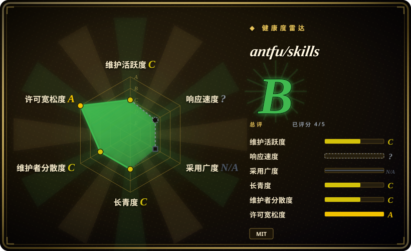
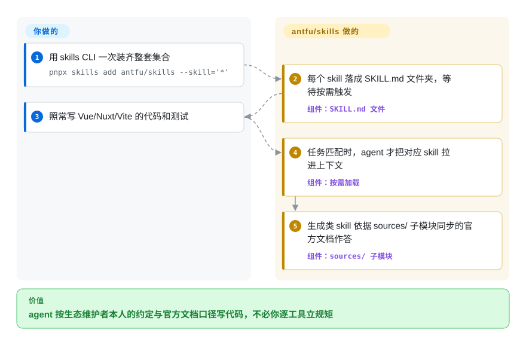

# antfu/skills

你的 agent 写出来的 Vue/Vite/Nuxt 代码能跑，却像外人写的——Vitest 惯用法不对、把 UnoCSS 当 Tailwind 用、格式化和 `@antfu/eslint-config` 打架。antfu/skills 把 Anthony Fu 本人的约定，加上从官方文档生成的框架 skill（靠 git 子模块与上游保持同步）打包在一起，用 `skills` CLI 安装，在任务匹配时按需加载。

## 何时使用

你是一名常驻 Anthony Fu 技术栈的前端工程师——Vue 3、Nuxt、Vite、Vitest、UnoCSS、pnpm，外加他的 `@antfu/eslint-config`——而你的 coding agent 写出来的代码虽然“能跑”，却不符合该生态维护者们的真实写法：Vitest 测试惯用法不对、把 UnoCSS 当 Tailwind 用、ESLint/格式化和你的配置打架、Vue 写法忽视组合式 API 的最佳实践。你不想为这套栈里每个工具手写一份规则集，而是想直接继承“维护了其中很大一部分的那个人”的意见，并在任务匹配时自动应用。

你运行 `pnpx skills add antfu/skills --skill='*'`（加 `-g` 走全局安装），agent 便获得一组按需加载的 skill 菜单：两个手工维护的（`antfu` 管 app/library 项目偏好，`antfu-design` 管以 UnoCSS 为中心的设计），以及九个由官方文档生成的（Vue、Nuxt、Pinia、Vite、VitePress、Vitest、UnoCSS、pnpm，以及 2026-06 之后新增的 Nitro）。由于它以 [agentskills.io](https://agentskills.io/home) 的 `SKILL.md` 格式分发，`skills` CLI 会把它装进你 harness 自己的 skills 目录，于是同一份 pack 可在 Claude Code、Cursor、OpenCode、Codex 等受支持 agent 间通用。当你的栈*就是* antfu 这套时，你会优先选它——与其重新发明，不如直接继承他的约定。这个仓库本身也是模板：fork 之后改 `meta.ts`、重新拉取文档子模块（`pnpm start init`、`pnpm start sync`），再让 agent 为你的项目生成 skill。注意 README 开头作者自己的定性：这是文档同步生成 skill 的**概念验证**项目，实际效果他「没有充分测试过」。

## 怎么用起来

这套包就是纯 markdown：每个 skill 是一个文件夹，内含一份 `SKILL.md`（名称＋触发描述＋指导），宿主的 skill loader 只在任务匹配时把它拉进上下文——「可共享、按需加载」是 README 自己的说法，他也坦承代价：与常驻加载的 `AGENTS.md` 不同，skill 可能在你期待的时机*不*触发。保持新鲜的承重机制是：九个生成类 skill 对应工具的官方文档以 **git 子模块**形式放在仓库的 `sources/` 下（vuejs/docs、nuxt/nuxt、vitejs/vite 等），所以生成和再生成读的是上游文档本身，而不是抓来的副本。它替你做的：逐工具的约定与符合官方文档的用法。仍然归你管的：装进你的 harness、把「他的个人意见」（两个手工维护的）与「文档生成类」分开权衡、以及——因为没有 release——自行锁定一个你信得过的 `main` 快照。

<!-- flow-steps:begin (generated from flows/antfu-skills.json by tools/flow_card.py — do not edit) -->

流程文字版

1. **你**：用 skills CLI 一次装齐整套集合 — `pnpx skills add antfu/skills --skill='*'`
2. **antfu/skills**：每个 skill 落成 SKILL.md 文件夹，等待按需触发 — 组件：`SKILL.md 文件`
3. **你**：照常写 Vue/Nuxt/Vite 的代码和测试
4. **antfu/skills**：任务匹配时，agent 才把对应 skill 拉进上下文 — 组件：`按需加载`
5. **antfu/skills**：生成类 skill 依据 sources/ 子模块同步的官方文档作答 — 组件：`sources/ 子模块`

**价值**：agent 按生态维护者本人的约定与官方文档口径写代码，不必你逐工具立规矩

<!-- flow-steps:end -->

## 何时不用

- **你不在 Vue/antfu 这套栈上。** 价值高度集中在 Vue/Nuxt/Vite/UnoCSS/Vitest 以及 antfu 个人的 ESLint/pnpm 约定。在 React/Svelte/Astro 或非 antfu 工具链上，大多数 skill 用不上，其设计/lint 意见还可能与你的冲突。
- **你要久经考验的包。** README 开头就是作者挂出的概念验证声明——skill 实际表现他没有充分测试——FAQ 也承认 skill 存在假阴性（该触发时不触发）。需要指导必然生效的话，把规则写进 `AGENTS.md`。
- **你已经有一套该栈的精选 skill 栈。** 再叠一套有主见的 Vue/设计 pack，容易出现规则集冲突和评审时的双重路由——每个关注点只留一个事实源。
- **你想要厂商中立或社区共识的规则。** 手工维护的那两个明确是*某一个人*的偏好（ESLint 风格、设计取舍）；与你一致则有价值，不一致则是摩擦。
- **你的 harness 没有 skills 加载器。** 它靠 `skills` CLI 把文件写进各 agent 的 skills 目录来激活；在自研或不受支持的 agent 上没有东西去触发这些 `SKILL.md`，markdown 不会自动生效。
- **你需要的是强制，而不是建议。** 规则活在 agent *应当*遵循的 prompt/markdown 里；没有任何东西会拦合并或让 CI 失败。
- **你需要版本稳定性。** 截至本次核查没有打 tag 的 release——你跟的是移动的 `main`，生成类 skill 会从上游文档再推导，规则集与 skill 边界可能在每次拉取间变化。本页面 2026-06 记录过的外部 vendored 集（Slidev、VueUse、web-design-guidelines 等）已被移除——请把清单视为易变的。

## 横向对比

| 替代品 | 是否收录 | 我们的评价 | 取舍 |
|---|---|---|---|
| [Vercel Agent Skills](../../engineering/vercel-agent-skills.zh.md) | ✅ | React/Next.js/Vercel 平台规则比 Vue/Vite 约定更重要时，选 Vercel Agent Skills。 | Vercel 官方为 *React/Next.js/Vercel* 生态出的 pack，走同一套 `skills` CLI/格式。与 antfu 的恰成镜像：按你属于哪个框架世界（Vue 还是 React）来选；两者都是有主见的厂商/维护者规则集，并非中立。 |
| [Agent Skills (addyosmani)](../../engineering/addyosmani-agent-skills.zh.md) | ✅ | 需要框架无关的全 SDLC 工程规则时，选 Agent Skills。 | Addy Osmani 个人的全 SDLC 工程 pack（spec→build→review→ship、web 性能、安全）。生命周期覆盖更广且框架无关；antfu 的更窄、更绑栈（Vue 工具链约定），而非一条方法论脊柱。 |
| [web-quality-skills (addyosmani)](../../engineering/addyosmani-web-quality.zh.md) | ✅ | 要的是专门的性能/可访问性/质量审计、而不是栈约定时，选 web-quality-skills。 | 专注 web 性能/可访问性/质量审计，厂商中立，脱离 Vue 栈也成立；antfu 的包已不再附带它曾 vendored 的 web-design skill，审计根本不在其射程内。 |
| [Dimillian/Skills](dimillian-skills.zh.md)、[gstack](gstack.zh.md)、[ljg-skills](../knowledge-content/ljg-skills.zh.md)、[khazix-skills](../knowledge-content/khazix-skills.zh.md)、[taches-cc-resources](taches-cc-resources.zh.md) | ✅ | 更认同某位维护者的个人栈和工作习惯时，选对应个人集合。 | 同一类型——个人维护者精选的 skill/harness 捆绑——但各自反映不同人的栈和约定；按你真正认同谁的工具链与意见来比。 |
| 各 agent 自带的 skills / 斜杠命令 | 非仓库 | 想优先使用平台维护的原生能力，而非第三方捆绑时，选内置 skill。 | 平台自身的 skill 生态，并非独立仓库；antfu/skills 是叠在其上的第三方捆绑，可能与原生 skill 重复或冲突。 |

## 健康度与可持续性

- **维护（2026-09）：** 零星——1 月至 6 月的集中提交之后是约三个月的空窗，直到 2026-09-25 才落了一个提交（新增 Nitro skill）。仍没有打 tag 的 release，你跟的是移动的 `main`，没有 semver 检查点。
- **治理与 bus factor：** 这是一位高知名度维护者（antfu）的个人仓库，`User` 所有，无基金会或厂商背书。一人维护的合集却有约 5.9k star，是典型的 bus-factor 风险信号——方向与延续性完全系于一个人是否持续投入。
- **年龄与 Lindy 判断：** 创建于 2026-01，约八个月——年轻，尚未经 Lindy 验证。antfu 在 Vue/Vite 生态的长期履历令人安心，但*这个 pack 本身*没有存续历史；别把它的年龄当作安全信号。
- **风险标记：** 作者自称概念验证、实际表现未经充分测试；生成类 skill 从上游文档子模块再推导，规则集可能在每次拉取间变化；无法 pin release。仅为建议性（无强制闸门）。仓库与 skill 均按 README 声明为 MIT（2026-06 记录过的 vendored 许可证问题已不存在——那批内容已被移除）。

## 存疑（未验证）

- [未验证] license MIT 与主语言 TypeScript 于 2026-09-27 重新核对自 GitHub 元数据——TypeScript 反映的是生成工具（`meta.ts`、`scripts/`），并非可运行的应用，实质内容是 markdown 的 `SKILL.md` 文件。
- [未验证] 截至 2026-09-27 没有打 tag 的 release（`releases/latest` 返回 404）；「maturity」由最后提交（2026-09-25）与活跃度推断，而非 semver。仓库未归档。
- [未验证] star 数（2026-09-27 GitHub 显示约 5.9k）不可靠且对日期敏感；仅作参考，不作质量信号。
- [未验证] skill 清单（2 个手工维护＋9 个生成类，含 Nitro，依据 2026-09-27 的 `skills/` 与 `sources/` 目录列表）比 README 表格更新更快——表格仍只列 8 个生成类；请以实时的 `skills/` 目录为准。2026-06 记录过的 vendored 集（Slidev/tsdown/Turborepo/VueUse 等）已验证移除。
- [未验证] 通过第三方 `skills` CLI 安装（`pnpx skills add antfu/skills --skill='*'`，`-g` 走全局）及其受支持 harness/目标目录行为，是 vercel-labs `skills` 工具的属性，而非本仓库的属性；各 harness 的激活保真度此处未独立验证。
- [推断] 由于行为活在 agent 加载的 prompt/markdown skill 里，强制力是建议性的——agent 仍可偏离；这些约定是 prompt 级指令，不是硬保证。
- [推断] skill 编码的是某一位维护者的个人偏好；「最佳实践」的措辞是他的意见（对生成类 skill 而言，是生成当时官方文档的快照），并非独立验证过的标准。
