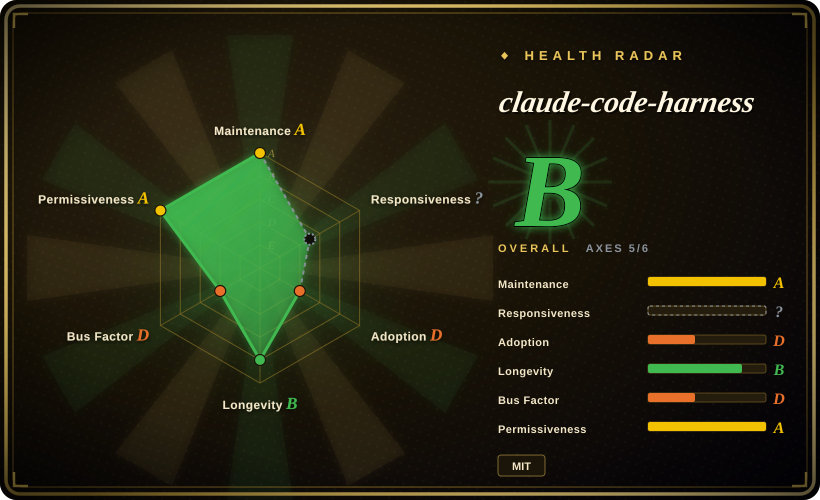
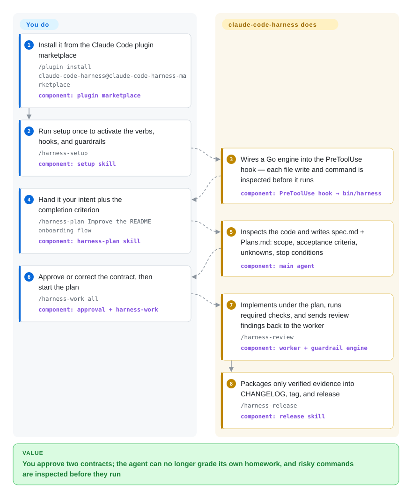

# claude-code-harness

You ask Claude Code for a feature and get back code you never planned and nobody reviewed. This plugin forces a delivery loop with real gates: it drafts `spec.md`/`Plans.md` contracts for you to approve, runs work under TDD gates, blocks completion on major review findings, and — since v5 — inspects risky operations through a Go guardrail engine before they execute.

## When to use

You're a developer who lives in Claude Code (or Codex CLI / Cursor / Grok — the four "supported" hosts as of v5) and keeps watching the agent do the same thing: it skips writing a spec, jumps straight into code, "fixes" bugs by guessing, lets review and tests happen retroactively (or not at all), and then declares the feature done. You want the agent to behave like a disciplined delivery team — write a spec you approve, break it into a plan, only then implement under TDD, pass an independent review, and package evidence before anything ships. You install it through Claude Code's plugin marketplace (`/plugin marketplace add Chachamaru127/claude-code-harness`, `/plugin install claude-code-harness@claude-code-harness-marketplace`), run `/harness-setup` once, and get five core verb skills out of 23 total — `/harness-plan` (turn intent into `spec.md` + `Plans.md`: scope, acceptance criteria, dependencies, unknowns, stop conditions), `/harness-work` (execute the approved scope, solo or team by task count, TDD when the task says so), `/harness-review` (review separated from implementation; major findings block completion), `/harness-sync` (diff the plan against what was actually implemented and report drift), and `/harness-release` (package only verified evidence into CHANGELOG, tag, release).

You reach for it specifically when you want the *whole* plan-to-release spine gated by explicit contract artifacts you approve or correct — plus, since v5, a Go-native safety layer that inspects operations before they run: a non-disableable "runtime floor" covering billing, network egress, secret reads, production deploys, and out-of-worktree destruction, on top of configurable R01–R16 guardrails (direct pushes to `main`, protected paths, forced pushes, history rewrites). The repo also ships `bin/harness doctor --migration-report` to inventory stale plugin caches, duplicate skills, and dead symlinks without deleting anything; optional extras include `/harness-loop` (repeated bounded execution), Breezing planner/critic/worker teams, and a cross-worktree session roster. Non-Claude hosts have deliberately tiered support — Codex CLI/Cursor/Grok via setup scripts count as supported, OpenCode is "internal-compatible" with runtime parity not claimed, Copilot CLI and others are candidates. [推断]

## How it works

The harness is a Claude Code plugin of 23 skills built around five verbs; its core move is converting ad-hoc prompting into *artifacts with gates*. You state an intent and completion criterion (`/harness-plan Fix duplicate orders. The completion criterion is that the same order is stored once.`); the plan stage inspects the existing code and writes `spec.md` + `Plans.md`, and nothing executes until you approve or correct that contract. `/harness-work` then dispatches workers (solo, or a planner/critic/worker team via Breezing when the task list grows) who stay inside the approved scope — data the agent hasn't seen is recorded as `unknown` rather than invented, and required checks plus TDD run per task. Before risky operations actually execute, a Go engine adjudicates them in two layers: the runtime floor (five categories, allow/deny, no global off-switch) and the R01–R16 guardrails (deny/confirm/warn, partly per-project configurable), with every verdict written to a decision log; note coverage depends on the host. What stays yours: defining what "complete" means, approving each contract, correcting review findings within the iteration limit, and the final `/harness-release` — the README itself is strict that a setup script on another tool means an *entry path*, not the same guarantees.

<!-- flow-steps:begin (generated from flows/claude-code-harness.json by tools/flow_card.py — do not edit) -->

Text version of the flow

1. **You**: Add the plugin marketplace in Claude Code — `/plugin marketplace add Chachamaru127/claude-code-harness`
2. **You**: Install the plugin and run the one-time setup — `/harness-setup`
3. **claude-code-harness**: Five core verbs and the Go guardrail engine become part of your session — component: `harness plugin`
4. **You**: Hand over one intent with a completion criterion — `/harness-plan Improve the README onboarding flow`
5. **claude-code-harness**: Drafts spec.md + Plans.md — scope, acceptance criteria, unknowns, stop conditions — for you to approve — component: `/harness-plan`
6. **You**: Approve or correct the contract, then execute the whole plan — `/harness-work all`
7. **claude-code-harness**: Workers run tasks with required checks; each operation is adjudicated by the Go engine before executing — component: `runtime floor + guardrails`
8. **You**: Review the result separately, then ship — `/harness-review · /harness-release`
9. **claude-code-harness**: Major findings block completion; the release packages only verified evidence — component: `/harness-release preflight`

**Value**: Every feature lands as an approved contract, TDD-gated work, independent review, and guarded operations — instead of 'trust me, it works'

<!-- flow-steps:end -->

## When NOT to use

- **You already run a curated workflow/methodology stack.** This harness is prescriptive (spec-before-code, TDD-gated work, review that blocks completion). Layering it over an existing plan→ship methodology — gstack, Superpowers, your own commands — invites conflicting routing and double-governance; pick one source of truth.
- **You don't want a runtime guardrail engine in the loop.** Since v5 operations pass a Go engine before executing, and the runtime floor has *no global disable switch* (limited allowlists only). That is enforcement, not ceremony — but its coverage depends on the host, and the deny behavior itself is the project's own claim. [未验证]
- **You're primarily on an off-tier host.** Claude Code v2.1+, Codex CLI, Cursor and Grok are the "supported" tier; OpenCode is internal-compatible with runtime parity explicitly not claimed; Codex app, Hermes and GitHub Copilot CLI are candidates; Antigravity has no install route. One entry path ≠ one product promise — the README says so.
- **One-off scripts, spikes, non-code tasks.** The plan→work→review→release ceremony is overhead when you just want a quick fix or config tweak; it assumes a real software-change loop with artifacts worth gating.
- **Fast-moving single-maintainer upstream.** At v5.x with frequent releases and behavior baked into prompts and skill routing — the v4→v5 line added the safety layer and `/harness-sync` mid-flight; a version bump can shift what the verbs enforce. Pin and re-check after upgrades. [推断]

## Comparison

| Alternative | In index | Our verdict | Tradeoff |
|---|---|---|---|
| [gstack](gstack.md) | ✅ | Choose gstack when you want a role-playing persona command loop instead of contract artifacts and a guardrail engine. | Garry Tan's personal Claude Code setup driving a similar plan → build → review → ship loop, but via ~23 role-playing persona commands (CEO/designer/QA/security). claude-code-harness is five named verbs with explicit `spec.md`/`Plans.md` contracts, a Go guardrail engine, and a `doctor` utility; gstack leans on personas over a contract artifact. |
| [shaping-skills](shaping-skills.md) | ✅ | Choose shaping-skills when you only need the Shape Up define-what-to-build front end. | Ryan Singer's Shape Up "shaping" pack covers only the *define-what-to-build* front end. This harness covers the full define→implement→review→release spine, so they're complementary rather than substitutes. |
| [Superpowers](../../../agent-dev-methodology/coding-agent-harnesses/superpowers.md) | ✅ | Choose Superpowers when lean methodology across many harnesses matters more than per-operation guardrails. | Cross-harness skills library with the same brainstorm/plan→TDD→verify spine, packaged for many agents. claude-code-harness goes harder on gates — spec/plan contract files, a Go runtime floor plus R01–R16 guardrails that inspect operations pre-execution, and release preflight — at the cost of a heavier, Claude-centric install; Superpowers is lighter methodology with broader reach and no enforcement engine. |
| harness-mem (optional companion) | not indexed | Pair harness-mem with this harness when you want cross-session memory; it is not a workflow substitute. | An optional memory add-on from the same maintainer, referenced (and explicitly not depended on) by this project; separate concern (agent memory), not a workflow alternative. |
| Claude Code's native skills / built-in slash commands | not a repo | Choose native Claude Code skills when you want the platform's own surface without third-party governance. | The platform's own skill ecosystem, not a standalone repository; this is a third-party bundle layered on top, so it can duplicate or conflict with native commands. |

## Health & viability

- **Maintenance (2026-09):** active — v5.15.0 released 2026-09-06 (last default-branch commit same day; ~15 open issues), on top of a steady v4.x→v5 line documented in 2026-06 at v4.16.3. Unlike most personal packs here it cuts tagged releases, so you *can* pin a version — and the v4→v5 jump shows the design is still moving under you.
- **Governance & bus factor:** single-maintainer `User`-owned repo (Chachamaru127), no foundation or vendor. ~3.1k stars is modest; roadmap, host-support tiers, and continuity rest entirely on one person.
- **Age & Lindy verdict:** created 2025-12, so ~9.5 months old — still not Lindy-proven. Rapid release churn signals energy but also instability; the safety layer and verb set changed between major versions, so prompt/routing behavior can shift across bumps.
- **Risk flags:** the v5 enforcement story (runtime floor with no global disable, guardrail verdicts, blocking review) is the project's own README claim, with host coverage explicitly uneven (hardening-parity doc); claims for non-Claude hosts are tiered and unproven here. Model routing pins specific model ids that may age out fast. Pin and re-check after upgrades.

## Caveats (unverified)

- [未验证] Enforcement behaviour (runtime floor allow/deny, R01–R16 verdicts, review blocking completion, release preflight) is read from README v5 on 2026-09-27; nothing was executed against a live Claude Code install here, and the README's own hardening-parity doc says host coverage varies.
- [未验证] Latest release v5.15.0 (2026-09-06), last default-branch commit 2026-09-06 (repo `pushed_at` 2026-09-21 from other branches), created 2025-12-12; MIT, primary language Shell per GitHub metadata on 2026-09-27 — re-verify before relying on a specific version's behavior.
- [未验证] Star count (~3.1k per GitHub on 2026-09-27) is unreliable and date-sensitive; treat as indicative only, not a quality signal.
- [未验证] The role→model routing table (e.g. Fable 5.1 `high` for deep decisions, Sonnet 5 `xhigh` for the dedicated reviewer, GPT-6 astra for Codex routes) is quoted from the README; whether those ids resolve in a given install and how overrides behave was not tested.
- [未验证] Install tiers per host (supported: Claude Code / Codex CLI / Cursor / Grok; internal-compatible: OpenCode; candidates: Codex app / Hermes / Copilot CLI) and the H1–H8 acceptance claims are the project's own; activation fidelity off Claude Code is not verified here.
- [推断] The verb set and skill routing change release-to-release (v4→v5 added `/harness-sync` and the safety layer); verify the current skill list rather than relying on this page.
- [推断] Despite the guardrail engine, prompt-level steps (spec-first, TDD gates) remain soft for the agent's *reasoning* — hard denial covers typed operations, not half-hearted execution, so review output still needs a human read.
