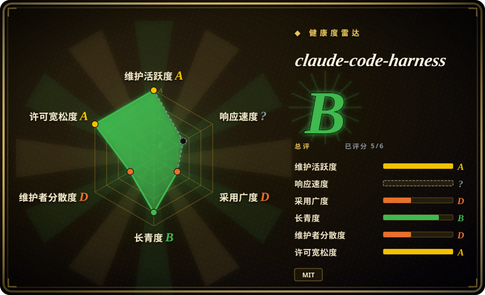
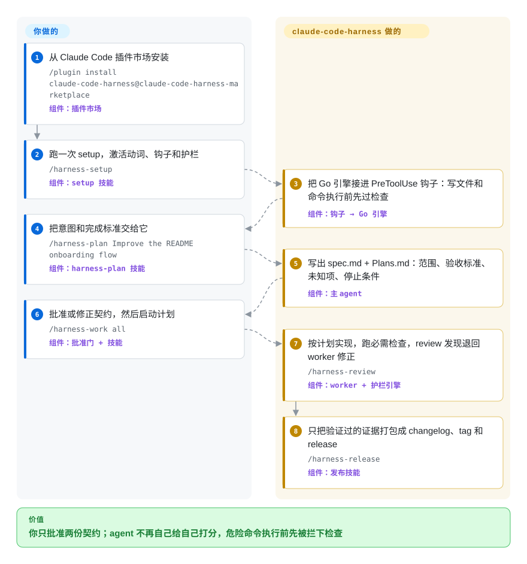

# claude-code-harness

agent 改文件、跑命令、然后自己宣布「做完了」——事前没有任何东西检查它，所谓 review 也只是同一个模型想写什么就写什么。claude-code-harness（CCH）给 Claude Code、Codex CLI、Cursor 和 Grok 装上受治理的 plan → work → review → release 闭环：动手写码之前你要先批准一份它生成的 `spec.md`/`Plans.md` 契约，完成由独立 review 把关，而每一次工具调用——写文件、跑 shell 命令——在执行前都要先过一个 Go 二进制的检查。

## 何时使用

你是个长期泡在 Claude Code 里的开发者，反复看到 agent 做同一件事：跳过写 spec、直接上手写代码、靠猜来「修」bug、让 review 和测试事后补（甚至根本不做），然后就宣布功能完成。你想让 agent 表现得像一支有纪律的交付团队——先写一份你批准的 spec、拆成计划、然后才在 TDD 下实现、跑一遍独立 review、并在声称「已交付」前打包好证据。你通过 Claude Code 的插件市场装上它，跑一次 `/harness-setup`，于是就有了一组命名好的动词——`/harness-plan`（生成 `spec.md` + `Plans.md` 作为事实源）、`/harness-work`（在计划范围内执行已批准任务）、`/harness-review`（与实现分离的验证）、`/harness-sync`（核对计划与实际的偏差）、`/harness-release`（只把验证过的证据打包成 changelog、tag 和 release）——把临时拼凑的 agent 编码变成可重复、契约驱动的循环。五个核心动词之下是 23 个已安装技能：Breezing 团队执行、`/harness-loop` 循环推进、多会话 roster 加本地收件箱（让并行 worktree 里的 agent 能互发消息），以及给非工程背景决策者看的单屏 HTML 视图（计划批准/进度/验收）。

当你想让整条规划到发布的脊柱既由你批准的契约约束、又有运行时闸门兜底（而不只是 prompt 引导）时，就选它。护栏引擎是一个单文件 Go 二进制（`bin/harness`，不依赖 Node.js），挂在 agent 的钩子上：PreToolUse 匹配 `Write|Edit|MultiEdit|Bash|Read`，把每条待执行的工具调用送进声明式规则表（R01–R16：直推 main、受保护路径、强推、改写历史）和五个 README 声称「没有全局关闭开关」的 runtime floor 类别（计费、网络外发、读 secret、生产部署、任务 worktree 之外的销毁）。仓库还带 `bin/harness doctor --migration-report`，在不删除任何东西的前提下盘点重复 skill、插件缓存和失效软链。Codex CLI、Cursor、Grok 有官方 setup 脚本；OpenCode 已接线但「不声称运行时对等」。[推断]

## 怎么用起来

CCH 是一个插件里耦合的两层。软层是 Markdown 技能：每个动词（`/harness-plan`、`/harness-work`……）指示 agent 去*写和读契约文件*——`spec.md` 与 `Plans.md`——于是阶段之间靠提交进仓库的产物交接，而不是靠对话记忆；agent 没见过的信息保持 `unknown`，不许悄悄编造。硬层是一个注册为 Claude Code 钩子的 Go 二进制（`hooks/hooks.json`）：每个 PreToolUse 事件里，它从 stdin 读入待执行的工具调用，对照规则表和 runtime floor 类别求值，在动作真正运行前回答放行/确认/拒绝——更像登机口前扫描行李的安检机，而不是事后回放的监控摄像头。模型按角色路由（独立的 dedicated reviewer 定义、`deep`/advisor 路线、各自的推理档位），手动的单次模型选择优先于默认。你这边：说清目标和完成标准、批准或修正生成的契约、看验收视图下判断；CCH 那边：规划、实现、跑检查、review、拦截命令、打包发布。

<!-- flow-steps:begin (generated from flows/claude-code-harness.json by tools/flow_card.py — do not edit) -->

流程文字版

1. **你**：从 Claude Code 插件市场安装 — `/plugin install claude-code-harness@claude-code-harness-marketplace` — 组件：`插件市场`
2. **你**：跑一次 setup，激活动词、钩子和护栏 — `/harness-setup` — 组件：`setup 技能`
3. **claude-code-harness**：把 Go 引擎接进 PreToolUse 钩子：写文件和命令执行前先过检查 — 组件：`钩子 → Go 引擎`
4. **你**：把意图和完成标准交给它 — `/harness-plan Improve the README onboarding flow` — 组件：`harness-plan 技能`
5. **claude-code-harness**：写出 spec.md + Plans.md：范围、验收标准、未知项、停止条件 — 组件：`主 agent`
6. **你**：批准或修正契约，然后启动计划 — `/harness-work all` — 组件：`批准门 + 技能`
7. **claude-code-harness**：按计划实现，跑必需检查，review 发现退回 worker 修正 — `/harness-review` — 组件：`worker + 护栏引擎`
8. **claude-code-harness**：只把验证过的证据打包成 changelog、tag 和 release — `/harness-release` — 组件：`发布技能`

**价值**：你只批准两份契约；agent 不再自己给自己打分，危险命令执行前先被拦下检查

<!-- flow-steps:end -->

## 何时不用

- **你已经在跑一套精选的工作流/方法论栈。** 这套 harness 是强主张的（spec 先于代码、work 受 TDD 门控、强制 review 动词）。把它叠在已有的 plan→ship 方法论上——gstack、Superpowers，或你自己的命令——会引发路由冲突和双重治理；只能选一个事实源。
- **你指望在所有 agent 工具上得到同一份保证。** README 自己就明说「四条安装路径不是四条同等的保证」：只有 Claude Code、Codex CLI、Cursor、Grok 过了它自定义的 H1–H8 验收档，OpenCode 不声称运行时对等，护栏覆盖面逐宿主不同（它自己的文档列了差异）。在原生 Codex 上，子 agent 可继承父会话的执行权限，所以光有 reviewer profile 并不构成文件系统级隔离。
- **一次性脚本、spike、非代码任务。** 当你只想快速改一处或调个配置时，plan→work→review→release 这套仪式是负担；它假定一个有值得门控产物的真实软件变更循环。
- **你做不到「上游每次升版都重新核对」。** 行为既烤在 prompt 里也烤在 Go 规则表里，而这个上游在本页两次核对之间就发了一次大版本（4 → 5），v5 系列到 2026-09 已打了 20 个 tag。请 pin 版本，升级后重新核对这些动词到底在强制什么。

## 横向对比

| 替代品 | 是否收录 | 我们的评价 | 取舍 |
|---|---|---|---|
| [gstack](gstack.zh.md) | ✅ | 想要角色扮演的 persona 命令体系、而不是契约文件加运行时闸门时，选 gstack。 | Garry Tan 的个人 Claude Code 配置驱动一个类似的 plan → build → review → ship 循环，但靠 ~54 个 persona/工具技能，没有执行时检查器。claude-code-harness 是更少、命名清晰的动词，压在显式的 `spec.md`/`Plans.md` 契约和一个执行前检查工具调用的 Go 护栏引擎之上；gstack 押注 persona 和一个能被驱动的浏览器。 |
| [shaping-skills](shaping-skills.zh.md) | ✅ | 只需要 Shape Up 式「定义要造什么」的前端塑形环节时，选 shaping-skills。 | Ryan Singer 的 Shape Up「shaping」包只覆盖*定义要造什么*这个前端环节。本 harness 覆盖完整的定义→实现→review→发布脊柱，外加执行闸门，因此二者互补而非互替。 |
| [Superpowers](../../../agent-dev-methodology/coding-agent-harnesses/superpowers.zh.md) | ✅ | 更看重精简的跨 harness 方法论、而不是带护栏引擎的受治理契约闭环时，选 Superpowers。 | 跨 harness 的 skills 库，具备相同的 brainstorm/plan→TDD→verify 脊柱，打包给多种 agent。claude-code-harness 如今也官方覆盖四个宿主，但它的差异点是 spec/plan 契约文件、PreToolUse 的 Go 闸门和发布前的证据链——Superpowers 三者皆无，停留在纯方法论。 |
| harness-mem（可选配套） | 未收录 | 只把它当本项目的可选跨会话记忆配套，而不是工作流替代品时，才看 harness-mem。 | 同一作者的独立仓库，做项目级跨会话记忆；属于另一关切（agent 记忆 vs 交付闭环），本批有意未收录。 |
| Claude Code 原生 skills / 内置 slash 命令 | 未收录 | 想要平台自带的 skill 生态、不叠第三方治理层时，选 Claude Code 内置能力。 | 平台自带的 skill 生态；本项目是叠在其上的第三方 bundle，可能与原生命令重复或冲突。 |

## 健康度与可持续性

- **响应速度**：无法计算——type_na。
- **维护（2026-09）：** 非常活跃——最后 push 于 2026-09-21，最新发布 v5.15.0（2026-09-06），此前数周 v5.13.x→v5.15.0 打 tag 密集，这个速度下 open issue 仅约 15 个。它确实打 tag 发版，你*可以* pin 版本——但把这种翻涌也读成成本：6 月以来已经跨了一次大版本（4 → 5）。
- **治理与 bus factor：** 单一维护者的 `User` 仓库（Chachamaru127，约 1,250 次提交里占 ~92%；下一个「贡献者」是 `claude` 机器人账号——作者本人在用自己造的这套工具开发它）。无基金会、无厂商背书，路线图与延续性压在一个人身上。约 3.1k star、300 fork，是真实但不大的采用面。
- **年龄与 Lindy 判断：** 创建于 2025-12-12，还不满一岁——年轻，存续性未经验证。发版速度是冲劲而非稳定性的信号；它把自家 `spec.md`/`Plans.md` 烤进仓库自用的事实，是*方法论*的耐用信号，不是项目存活的保证。尚不是 Lindy 意义上的安全押注。
- **风险标记：** Go 闸门的拒绝/放行行为已在代码里接线并有文档，但面对一个执意绕路的 agent，其实际效力未经田野验证；跨宿主的强制强度不一致；行为烤进 prompt 与规则表，版本跳变间会变——升级后请 pin 并重核。

## 存疑（未验证）

- [未验证] 执行前闸门在真实环境里的效果：接线已在仓库核实（`hooks/hooks.json` 的 PreToolUse 匹配 `Write|Edit|MultiEdit|Bash|Read` → `bin/harness`；`go/DESIGN.md` 描述 `internal/guardrail` 声明式规则表与 deny/allow 裁决），但本页没有实际执行过一次拦截来验证其行为。
- [未验证] 「runtime floor 没有全局关闭开关」以及逐宿主的 hardening parity（`docs/hardening-parity.md`）均为 README/文档声称；可能被弱化的配置面未逐一审计。
- [未验证] 支持分级（Claude Code / Codex CLI / Cursor / Grok 过了 H1–H8 为 supported；Codex app、Hermes Agent、GitHub Copilot CLI 为 candidate；OpenCode 为 internal-compatible）是项目自评；各宿主的实际激活保真度未经验证。
- [未验证] 模型角色路由默认值（如 `deep`/advisor 走 Fable 5.1 high、实现走 Sonnet 5、dedicated reviewer 走 Sonnet 5 xhigh、Codex 路线走 GPT-6 astra / GPT-5.6 luna）为 2026-09-27 的 README 值，随版本变化。
- [未验证] Star 数（2026-09-27 GitHub 上 3,140）、fork（302）、open issues（15）、语言占比（Shell ~48%、Go ~47%、Python ~2%、TS ~2%、JS ~1%）与最新发布 v5.15.0（2026-09-06）均为对日期敏感的元数据。
- [推断] 23 个技能的集合与动词语义随版本漂移（`breezing`、`session-send`、`failure-codifier` 等技能当前存在）；请核对当前 `skills/` 目录，而非依赖本页。
- [推断] 由于工作流仍有一部分活在 prompt/markdown 技能里，「强制」步骤（spec 先行、TDD）仍是 prompt 级指令——Go 闸门硬拦截的是危险操作，不是流程偷懒。
