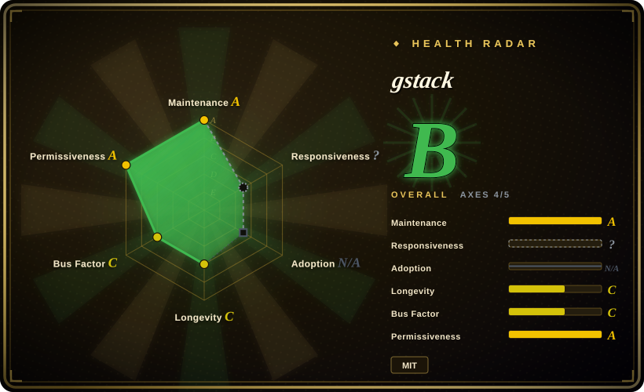
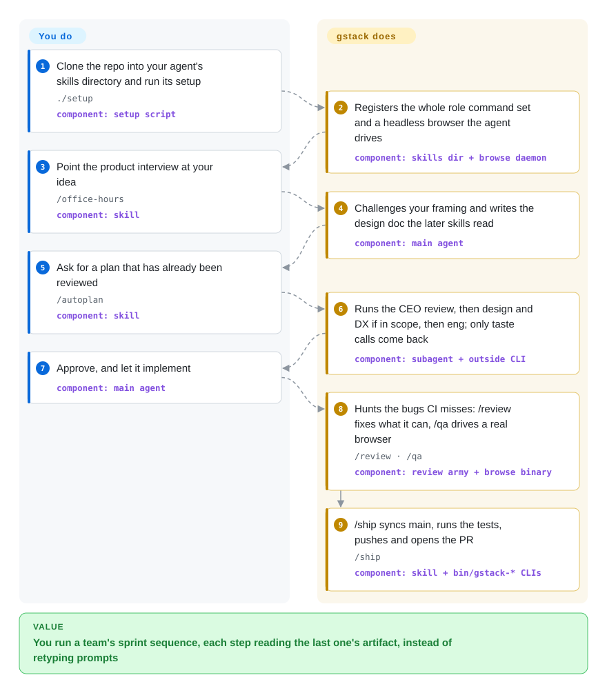

# gstack

Garry Tan's personal Claude Code harness: 54 skills — about half role personas (CEO, eng manager, designer, QA, security officer, release engineer, doc engineer), half utility commands — plus a browser the agent actually drives, wired into one plan → build → review → ship → retro sprint.

## When to use

You're a technical founder or a staff engineer on a very small team, and you do the whole pipeline yourself: decide whether a feature is worth building, lock the architecture, do a design pass, QA your own work, write the release notes, ship. You want that assembly line to exist as named, repeatable steps that read each other's output, not as prompts you retype every session. You clone gstack into your agent's skills directory, run `./setup`, and get role commands — `/office-hours` (product interrogation that leaves a design doc behind), `/plan-eng-review` (architecture lock), `/review`, `/qa` (drives a real browser), `/cso` (security audit), `/ship`, `/document-release`, `/retro` — each interrogating the work from one role's angle and handing its artifact to the next.

You reach for it over a composable skill library when you want one operator's *sequencing and taste* end to end rather than parts to assemble yourself, and over hand-written slash commands when you want the loop to survive the repo moving under it — gstack generates its own `SKILL.md` files from the source code, so the documented commands cannot silently drift from the implemented ones. The half most skill packs don't ship is the second one: a browser the agent really drives (your logged-in Aside browser on macOS when it's running, otherwise a headless Chromium daemon gstack bundles), which is what makes `/qa`, `/design-review`, `/devex-review`, `/benchmark`, and `/canary` check a live product instead of guessing from source.

## How it works

gstack installs as a directory of Markdown skills plus a compiled browser driver, and its `./setup` script registers both with whichever agent you run. What you get is not a library you import but a set of named roles the agent can be told to play — and the sequencing is the product, because each skill is written to read what the previous one wrote. Two mechanisms carry that weight underneath: the `SKILL.md` files are generated from templates against the source code, so the documented commands cannot silently drift from the implemented ones; and every browser-facing skill drives a real browser — your own Aside browser on macOS when it's running, otherwise a long-lived headless Chromium daemon that gstack ships and auto-starts (first call ~3s, then ~100–200ms per command). Your side of the line is invoking the right role at the right moment and answering the taste questions it stops on; the agent does the interrogation, the architecture lock, the review, the browser QA, and the release mechanics. The flow card below annotates every step with the component that actually performs it — the setup script, a skill, the main agent, a dispatched subagent, the bundled browser binary, or the `bin/gstack-*` helpers — so one run reads as a component trace rather than a second list of role names.

<!-- flow-steps:begin (generated from flows/gstack.json by tools/flow_card.py — do not edit) -->

Text version of the flow

1. **You**: Clone the repo into your agent's skills directory and run its setup — `./setup` — component: `setup script`
2. **gstack**: Registers the whole role command set and a headless browser the agent drives — component: `skills dir + browse daemon`
3. **You**: Point the product interview at your idea — `/office-hours` — component: `skill`
4. **gstack**: Challenges your framing and writes the design doc the later skills read — component: `main agent`
5. **You**: Ask for a plan that has already been reviewed — `/autoplan` — component: `skill`
6. **gstack**: Runs the CEO review, then design and DX if in scope, then eng; only taste calls come back — component: `subagent + outside CLI`
7. **You**: Approve, and let it implement — component: `main agent`
8. **gstack**: Hunts the bugs CI misses: /review fixes what it can, /qa drives a real browser — `/review · /qa` — component: `review army + browse binary`
9. **gstack**: /ship syncs main, runs the tests, pushes and opens the PR — `/ship` — component: `skill + bin/gstack-* CLIs`

**Value**: You run a team's sprint sequence, each step reading the last one's artifact, instead of retyping prompts

<!-- flow-steps:end -->

## When NOT to use

- **You already run a curated skill stack you trust.** gstack is prescriptive and personality-driven (a CEO that second-guesses your roadmap, an eng manager that locks architecture). Layering it over an existing harness gives you competing slash commands and double routing — keep one source of truth. If your stack is composable parts you assemble yourself, [Superpowers](../../../agent-dev-methodology/coding-agent-harnesses/superpowers.md) is the better fit; adopt gstack wholesale or not at all.
- **You want a library, an API, or just a browser driver to embed.** The deliverable is prompt-defined skills; outside a supporting agent the Markdown does nothing. If the browser half is the whole reason you looked, take [agent-browser](../../../web-automation/agent-browser-tools/agent-browser.md) or [playwright-cli](../../../web-automation/playwright-family/playwright-cli.md) instead — one CLI, no skill suite attached.
- **You're on a bespoke or unsupported agent.** gstack activates through a host adapter; `hosts/*.ts` covers Claude Code, Codex, OpenCode, Cursor, Factory Droid, Kiro, Slate, OpenClaw, Hermes, and GBrain (verified 2026-09). On anything else there is no loader — the fallback is the 2KB instruction-only digest (`agents-digest/gstack-AGENTS.md`), which carries the ethos and reuse rules but none of the commands.
- **You don't want the install and runtime footprint.** Setup clones into your skills directory, symlinks per-skill dirs, writes `.gstack/` state, and auto-starts a browser daemon; team mode commits `.claude/` + `CLAUDE.md` into your repo. `/cso` additionally wants Docker plus a native C toolchain, `/pair-agent` opens an ngrok tunnel, and the browser-first path wants the proprietary Aside browser on macOS 15+. If you want a few `.md` files and nothing else, write your own commands.
- **You need a support contract, stable versioning, or a second maintainer.** Garry Tan authored 356 of 397 commits (~90%) and the repo has **zero git tags and zero GitHub Releases** (verified 2026-09-21) — version 1.87.4.0 lives in a `VERSION` file, so pin a commit, not a version. If bus factor is a hard constraint, pick a foundation- or team-backed harness instead.
- **Your platform is Windows-first.** Cookie import is macOS-Keychain-only, `./setup` needs Git Bash/MSYS on Windows, and a Windows App-Bound v20 cookie-exfiltration path via `--remote-debugging-port` is open as issue #1136 (per ARCHITECTURE.md). Linux and macOS get the full suite; Windows gets a curated test subset.
- **You need enforcement, not advice.** Every "review", "lock", and "gate" is prompt-level prose the agent can still deviate from; nothing here is a CI check. If you need a hard gate, put it in your own CI and use gstack for the judgment steps.

## Comparison

| Alternative | In index | Our verdict | Tradeoff |
|---|---|---|---|
| [Superpowers](../../../agent-dev-methodology/coding-agent-harnesses/superpowers.md) | ✅ | Take Superpowers when you want to assemble a cross-harness SDLC process out of composable, TDD-first skills; take gstack when you want one operator's entire sprint sequence handed to you ready-made, browser included. | Superpowers gives you narrower, reusable process skills and a marketplace install across harnesses; gstack gives you a wider, more opinionated surface (security audit, release, live-browser QA) that you accept as a package. |
| [agent-browser](../../../web-automation/agent-browser-tools/agent-browser.md) | ✅ | Take agent-browser when the browser *is* the job and you want one CDP CLI to script from any agent; take gstack when you want the browser to arrive already attached to planning, review, and release skills that know how to use it. | A focused Rust CLI is easier to wire into your own pipeline and does not require buying into a skill suite; gstack's browser is less separable but its skills already encode what to do with it. |
| [antfu/skills](antfu-skills.md) | ✅ | Take antfu/skills when your stack is Vue/Vite/Nuxt and you want that author's framework conventions encoded; take gstack when you want a role-based process loop that is stack-agnostic. | Conventions tuned to one ecosystem are sharper inside it and mostly irrelevant outside; gstack's roles apply to any repo but carry Garry Tan's product and release opinions. |
| [Dimillian/Skills](dimillian-skills.md) | ✅ | Take Dimillian/Skills for Apple-platform work driven from Codex; take gstack when the loop you are missing is browser QA, release, and security rather than platform-specific review swarms. | A small, self-contained Codex collection is lighter to adopt and easier to reason about; gstack covers far more ground but at the cost of a heavier install and a moving `main`. |
| [wshobson/agents](../../subagent-collections/wshobson-agents.md) | ✅ | Take wshobson/agents when you want a broad subagent/persona catalog to draw individual agents from; take gstack when you want a fixed, ordered workflow you run end to end rather than a catalog you select from. | A large catalog maximizes optionality but leaves the sequencing to you; gstack supplies the sequencing and takes optionality away. |
| Your own hand-written slash commands | 未收录 | Write your own when maximum fit and zero dependency matter more than the months of iteration baked into someone else's sequencing. | Total control and no lock-in, but you re-derive the prompts, the hand-offs, and the browser plumbing yourself. |

## Health & viability

- **Responsiveness**: Cannot be scored — type_na (a skill pack has no package/issue response surface to measure).
- **Maintenance (2026-09):** very active — 397 commits, last push 2026-09-20, 18 GitHub workflows, and a `CHANGELOG.md` entry per version (10,535 lines of it). But there are still **no git tags and no GitHub Releases**: version 1.87.4.0 lives in a `VERSION` file, so there is no version to pin — you track a moving `main` or pin a commit.
- **Governance & bus factor:** still the standout flag. A `User`-owned personal repo (Garry Tan) carrying ~134k stars, 361 open issues and 569 open pull requests, where one person authored **356 of the 397 commits all-time (~90%)** and the next contributor has 17. The radar's 12-month window is softer than that all-time picture — 98 contributors with the top share at 0.70 — so the project is slowly widening, but the roadmap is still one person's. The very large unmerged-PR queue is the clearest sign that community contributions run ahead of what a single maintainer can absorb.
- **Age & Lindy verdict:** created 2026-03, so ~6 months old as of 2026-09 — still young, and the star count still outruns the project's history. What changed since the first review is that it kept shipping: six months, 397 commits, 54 skills, and a documented architecture rather than a pile of prompts. That is a real track record beginning, but it is not yet Lindy, and breaking changes can still land on any push.
- **Adoption note:** ~134k stars remain a popularity signal more than a maturity one; note that the fork count (19,942) is unusual even for that star count, consistent with "clone and customize" use rather than a stable dependency.
- **Risk flags:** heavy install and runtime footprint (clones into the skills dir, symlinks, `.gstack/` state, auto-started browser daemon, team mode commits `.claude/`+`CLAUDE.md`); `/cso` wants Docker plus a native C toolchain; the browser-first path prefers a proprietary macOS-only browser (Aside); advisory-only gates with no CI enforcement; MIT repo that also redistributes Apache-2.0-derived files (see Caveats); one open Windows security non-goal (#1136).

## Caveats (unverified)

- [未验证] License and language: GitHub metadata reports MIT and TypeScript (verified 2026-09-21), but the repo is not single-license — `NOTICE.md` lists files derived from Apache-2.0 work (Paul Bakaus's impeccable). All permissive, no copyleft, but a pure-MIT claim would be inaccurate.
- [未验证] Star count (~134k) and fork count (~19.9k) are date-sensitive popularity signals, not quality signals; re-read them before quoting.
- [未验证] "54 skills" is my count against `a6b3a57` on 2026-09-21: 53 top-level directories hold a `SKILL.md` (the tree lists 54, but `connect-chrome` is a symlink to `open-gstack-browser`), plus the root router skill. `docs/skills.md` has 55 rows but only 54 unique commands — `/spec` is listed twice, and `/claude-code` is documented with no top-level directory of its own. The project's own README and GitHub description still say "23 specialists and eight power tools"; that figure matches the role personas alone and omits the utility commands, so the advertised set and the actual set disagree. Neither number is contractual — read the current `skills/` tree.
- [未验证] Host coverage (10 agents) is inferred from `hosts/claude.ts, codex.ts, opencode.ts, cursor.ts, factory.ts, kiro.ts, slate.ts, openclaw.ts, hermes.ts, gbrain.ts`; I did not run `./setup --host <name>` for each, so per-agent activation fidelity is unconfirmed.
- [未验证] Install and runtime requirements (Git, Bun v1.0+, optional Node on Windows, an auto-starting browser daemon, Docker plus a native toolchain for `/cso`, optional Supabase/PGLite for the memory feature, the proprietary Aside browser for the macOS-first path) come from the README, `setup`, and ARCHITECTURE.md, not from a run I performed.
- [未验证] The security description (dual-listener tunnel, bearer tokens, keychain-gated cookie import, hash-chained egress ledger, L1–L6 prompt-injection defenses) is taken from ARCHITECTURE.md and its referenced tests; I read the documentation and file layout, not an independent audit.
- [未验证] Open-issue/PR counts (361 issues, 569 PRs) and the contributor share (356/397) are GitHub API reads on 2026-09-21 and move continuously; GitHub's `open_issues_count` (930) sums issues and PRs, so it should not be quoted as an issue count. The all-time commit share (356/397) and the health radar's `top1_share` (0.696) answer the same question over different windows — all-time commit attribution versus GitHub's 12-month contributor stats — so read them as two views, not a contradiction.
- [未验证] Self-reported productivity figures in the README (the "810× pace" and LOC normalizations) are the author's own methodology and were not independently checked.
- [推断] Because every review/lock/gate lives in prompt text loaded by the agent, all of them are advisory — the agent can deviate. Treat them as strong guidance, not enforced control.
- [推断] `type: skill-pack` is kept because the deliverable selected here is the skill collection (schema omits Tech stack / Dependencies / Ops difficulty for this type), but that classification now hides real infrastructure cost — a Bun-compiled browser daemon, Docker images, and a native toolchain for `/cso`. Read the footprint bullets in `When NOT to use` as the missing ops section.
