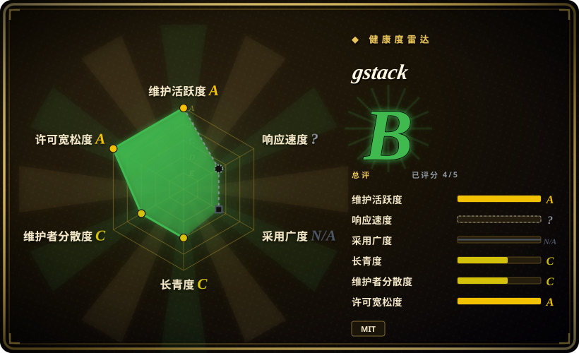
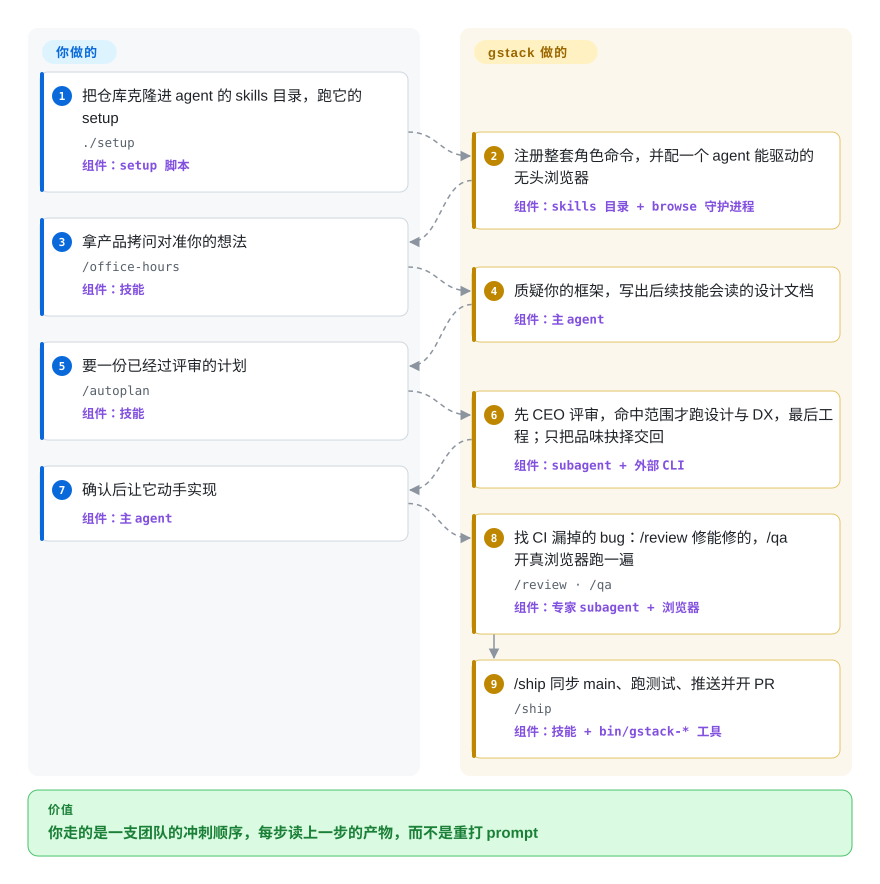

# gstack

Garry Tan 的私人 Claude Code harness：54 个 skill——约一半是角色人设（CEO、工程经理、设计师、QA、安全官、发布工程师、文档工程师），另一半是工具命令——外加一个 agent 真能驱动的浏览器，串成「规划 → 构建 → 评审 → 发布 → 复盘」一条冲刺流程。

## 何时使用

你是技术创始人，或者人很少的团队里的资深工程师，整条流水线都是你自己走：判断一个功能值不值得做、写码前锁架构、过一遍设计、自己给自己做 QA、写发布说明、上线。你想让这条流水线变成有名字、可重复、且互相读产物的步骤，而不是每个 session 重打一遍 prompt。你把 gstack 克隆进 agent 的 skills 目录、跑 `./setup`，就得到一批角色命令——`/office-hours`（产品拷问，会留下设计文档）、`/plan-eng-review`（锁架构）、`/review`、`/qa`（驱动真浏览器）、`/cso`（安全审计）、`/ship`、`/document-release`、`/retro`——每个都从某一个角色的视角审查当前工作，并把产物交给下一个。

比起可组合的技能库，你选它是因为想要某个人的*编排顺序与品味*端到端整套，而不是自己拼零件；比起自己手写 slash 命令，你选它是因为想让这套循环在仓库自身持续演进时不掉队——gstack 的 `SKILL.md` 是由源码生成的，文档里的命令不会和实现悄悄脱节。多数技能包不提供的另一半是这里的浏览器（macOS 上优先用你已登录的 Aside，否则用 gstack 自带的常驻无头 Chromium），正因如此 `/qa`、`/design-review`、`/devex-review`、`/benchmark`、`/canary` 是去验证线上真实产品，而不是靠读源码猜。

## 怎么用起来

gstack 的安装形态是一个 Markdown 技能目录加一个编译好的浏览器驱动，它的 `./setup` 会把这些注册给你正在用的 agent。你拿到的不是一个可 import 的库，而是一组有名字、可以要求 agent 扮演的角色——真正值钱的是编排顺序，因为每个技能都被写成去读上一个技能的产物。底下有两条机制在承重：`SKILL.md` 是由模板对着源码生成的，所以文档里的命令不会和实现悄悄脱节；所有涉及浏览器的技能都驱动真浏览器——macOS 上优先用你已经在跑的 Aside，否则就用 gstack 自带、自动拉起的常驻无头 Chromium（首次约 3 秒，之后每条命令约 100–200 毫秒）。你和它的分工线在于：你在对的时机点对的角色，并回答它停下来问你的品味问题；拷问、锁架构、评审、浏览器 QA 和发布机制由它做。下面的流程卡在每个步骤下标注了真正执行该步的组件——setup 脚本、技能、主 agent、被派发的 subagent、自带的浏览器二进制，或 `bin/gstack-*` 辅助工具——所以一次运行读起来是一条组件轨迹，而不是又一份角色名单。

<!-- flow-steps:begin (generated from flows/gstack.json by tools/flow_card.py — do not edit) -->

流程文字版

1. **你**：把仓库克隆进 agent 的 skills 目录，跑它的 setup — `./setup` — 组件：`setup 脚本`
2. **gstack**：注册整套角色命令，并配一个 agent 能驱动的无头浏览器 — 组件：`skills 目录 + browse 守护进程`
3. **你**：拿产品拷问对准你的想法 — `/office-hours` — 组件：`技能`
4. **gstack**：质疑你的框架，写出后续技能会读的设计文档 — 组件：`主 agent`
5. **你**：要一份已经过评审的计划 — `/autoplan` — 组件：`技能`
6. **gstack**：先 CEO 评审，命中范围才跑设计与 DX，最后工程；只把品味抉择交回 — 组件：`subagent + 外部 CLI`
7. **你**：确认后让它动手实现 — 组件：`主 agent`
8. **gstack**：找 CI 漏掉的 bug：/review 修能修的，/qa 开真浏览器跑一遍 — `/review · /qa` — 组件：`专家 subagent + 浏览器`
9. **gstack**：/ship 同步 main、跑测试、推送并开 PR — `/ship` — 组件：`技能 + bin/gstack-* 工具`

**价值**：你走的是一支团队的冲刺顺序，每步读上一步的产物，而不是重打 prompt

<!-- flow-steps:end -->

## 何时不用

- **你已经有一套自己信任的技能栈。** gstack 主张强、人格化（一个会质疑你路线图的 CEO、一个会锁架构的工程经理）。把它叠在已有 harness 上会产生互相打架的 slash 命令和双重路由——只能留一个事实源。如果你的栈是自己拼的可组合零件，[Superpowers](../../../agent-dev-methodology/coding-agent-harnesses/superpowers.zh.md) 更合适；gstack 要么整套采纳，要么别用。
- **你想要可 import 的库、API，或者只想要一个能嵌进自己流程的浏览器驱动。** 它的交付物是 prompt 定义的技能，脱离支持它的 agent，这些 markdown 什么都不做。如果你只是冲着浏览器那一半来的，直接选 [agent-browser](../../../web-automation/agent-browser-tools/agent-browser.zh.md) 或 [playwright-cli](../../../web-automation/playwright-family/playwright-cli.zh.md)——一个 CLI，不带整套技能。
- **你用的是自制或不被支持的 agent。** gstack 靠 host 适配器激活，`hosts/*.ts` 覆盖 Claude Code、Codex、OpenCode、Cursor、Factory Droid、Kiro、Slate、OpenClaw、Hermes、GBrain（2026-09 核实）。在别的 agent 上没有加载器，退路只有那份 2KB 的纯指令摘要（`agents-digest/gstack-AGENTS.md`），它带去了理念和复用规则，但一条命令都没有。
- **你不想要这套安装与运行时足迹。** setup 会克隆进你的 skills 目录、按技能建符号链接目录、写 `.gstack/` 状态，还会自启一个浏览器守护进程；team 模式会把 `.claude/` 与 `CLAUDE.md` 提交进你的仓库。`/cso` 另外要 Docker 加本地 C 工具链，`/pair-agent` 会开 ngrok 隧道，浏览器优先路径要 macOS 15+ 上的专有 Aside 浏览器。如果你只想要几个 `.md` 文件、别的都不要，那就自己写命令。
- **你需要支持合同、稳定版本号，或者第二位维护者。** 397 次提交里 Garry Tan 本人写了 356 次（约 90%），且仓库**既没有 git tag 也没有 GitHub Release**（2026-09-21 核实）——1.87.4.0 这个版本号只存在于 `VERSION` 文件里，所以只能 pin commit，不能 pin 版本。如果 bus factor 是硬约束，请改选有基金会或团队背书的 harness。
- **你的主平台是 Windows。** Cookie 导入只支持 macOS 钥匙串，Windows 上 `./setup` 需要 Git Bash 或 MSYS，而 Windows App-Bound v20 下通过 `--remote-debugging-port` 导出已解密 cookie 的路径仍是未修的安全非目标（issue #1136，见 ARCHITECTURE.md）。Linux 和 macOS 拿全套，Windows 只有精选测试子集。
- **你要的是强制，而不是建议。** 这里的每个「评审」「锁定」「闸门」都是 prompt 级文字，agent 仍可偏离；没有任何一项是 CI 检查。需要硬闸门就放进你自己的 CI，把 gstack 留给需要判断力的那些步骤。

## 横向对比

| 替代品 | 是否收录 | 我们的评价 | 取舍 |
|---|---|---|---|
| [Superpowers](../../../agent-dev-methodology/coding-agent-harnesses/superpowers.zh.md) | ✅ | 想把跨 harness 的 SDLC 流程用可组合、TDD 优先的技能自己拼起来时，选 Superpowers；想要某个操作者整套冲刺顺序开箱可用、连浏览器一起给你时，选 gstack。 | Superpowers 提供更窄、更可复用的流程技能和跨 harness 的 marketplace 安装；gstack 提供更宽、主张更强的面（安全审计、发布、真浏览器 QA），代价是整包接受。 |
| [agent-browser](../../../web-automation/agent-browser-tools/agent-browser.zh.md) | ✅ | 如果浏览器*就是*任务本身、你想在任何 agent 里脚本化一个 CDP CLI，选 agent-browser；如果你想让浏览器一到位就已经接在规划、评审、发布技能上，选 gstack。 | 专注的 Rust CLI 更容易接进你自己的流水线，且不必买下整套技能；gstack 的浏览器更难拆出来单独用，但它的技能已经写好了拿这个浏览器该干什么。 |
| [antfu/skills](antfu-skills.zh.md) | ✅ | 技术栈是 Vue/Vite/Nuxt、想把该作者的框架约定直接编码进来时，选 antfu/skills；想要一套与技术栈无关的角色流程循环时，选 gstack。 | 为某一生态调过的约定在该生态内更锋利，出了生态基本不适用；gstack 的角色对任何仓库都适用，但带着 Garry Tan 的产品与发布主张。 |
| [Dimillian/Skills](dimillian-skills.zh.md) | ✅ | 做 Apple 平台、从 Codex 驱动时选 Dimillian/Skills；如果你缺的是浏览器 QA、发布和安全，而不是平台专属的评审 swarm，选 gstack。 | 一个小而自包含的 Codex 合集更轻、更容易理解；gstack 覆盖面大得多，代价是安装更重、跟的是移动的 `main`。 |
| [wshobson/agents](../../subagent-collections/wshobson-agents.zh.md) | ✅ | 想从一个宽泛的 subagent/persona 目录里挑单个 agent 时，选 wshobson/agents；想要一条固定有序、端到端跑完的工作流而不是可选目录时，选 gstack。 | 大目录把可选性最大化，但编排顺序留给你；gstack 提供编排顺序，同时拿走可选性。 |
| 自己手写 slash 命令 | 未收录 | 当最大贴合度和零依赖比「别人迭代数月沉淀出的编排顺序」更重要时，选自己手写。 | 完全掌控、零 lock-in，但 prompt、步骤交接、浏览器管线都得你自己重新推导一遍。 |

## 健康度与可持续性

- **响应速度**：无法计算——type_na（skill pack 没有可度量的包/issue 响应面）。
- **维护（2026-09）：** 非常活跃——397 次提交，最后 push 于 2026-09-20，18 个 GitHub workflow，每个版本都有 `CHANGELOG.md` 条目（共 10,535 行）。但**仍然没有 git tag、也没有 GitHub Release**：1.87.4.0 这个版本号只存在于 `VERSION` 文件里，所以没有可 pin 的版本——你要么跟移动的 `main`，要么 pin 某个 commit。
- **治理与 bus factor：** 仍是最突出的风险信号。一个 `User` 所有的个人仓库（Garry Tan），背着约 13.4 万 star、361 个 open issue 和 569 个 open PR，其中**全时段 397 次提交里有 356 次（约 90%）出自 Garry Tan 本人**，第二贡献者只有 17 次。健康雷达的 12 个月窗口比这个全时段图景温和——98 位贡献者、头名占比 0.70——说明项目在缓慢放宽，但路线图仍归一个人。极大量未合并 PR 是最清楚的信号：社区贡献跑在单一维护者的消化能力之前。
- **年龄与 Lindy 判断：** 创建于 2026-03，截至 2026-09 约 6 个月——仍然年轻，star 数依然跑在项目历史前面。相比首评时变好的一点是它一直在出货：六个月、397 次提交、54 个技能，而且有了成体系的架构文档，不再是一堆 prompt。这算是真实存续记录的起点，但还不是 Lindy，破坏性变更仍可能在任意一次 push 落地。
- **采用度提示：** 约 13.4 万 star 依然更像人气信号而非成熟度信号；值得注意的是 fork 数（19,942）对这个 star 量级也属异常之高，符合「克隆下来自己改」的用法，而不是被当作稳定依赖。
- **风险标记：** 安装与运行时足迹重（克隆进 skills 目录、建符号链接、写 `.gstack/` 状态、自启浏览器守护进程，team 模式会提交 `.claude/`+`CLAUDE.md`）；`/cso` 要 Docker 加本地 C 工具链；浏览器优先路径偏好专有且仅 macOS 的 Aside；所有闸门只是建议性、无 CI 强制；仓库是 MIT 但同时再分发了派生自 Apache-2.0 的文件（见存疑）；Windows 上有一个未修的 cookie 导出安全非目标（#1136）。

## 存疑（未验证）

- [未验证] 许可与语言：GitHub 元数据报告为 MIT 与 TypeScript（2026-09-21 核实），但该仓库并非单一许可——`NOTICE.md` 列出派生自 Apache-2.0 作品（Paul Bakaus 的 impeccable）的文件。都属宽松许可、无 copyleft，但「纯 MIT」的说法不准确。
- [未验证] Star 数（约 13.4 万）与 fork 数（约 1.99 万）对日期敏感，是人气信号而非质量信号；引用前请重读。
- [未验证] 「54 个技能」是 2026-09-21 对着 `a6b3a57` 的统计口径：53 个含 `SKILL.md` 的顶层目录（文件树列出 54 个，但 `connect-chrome` 是指向 `open-gstack-browser` 的软链接），再加上根目录的路由技能。`docs/skills.md` 有 55 行，但只对应 54 个不重复命令——`/spec` 被列了两次，`/claude-code` 则有文档而没有自己的顶层目录。项目自己的 README 与 GitHub 描述仍写着「23 个专家加 8 个强力工具」，那个数字只对得上角色人设、漏掉了工具命令，即宣传集合与实际集合不一致。两个数字都不是契约性的，应以当前 `skills/` 目录为准。
- [未验证] host 覆盖（10 个 agent）是从 `hosts/claude.ts、codex.ts、opencode.ts、cursor.ts、factory.ts、kiro.ts、slate.ts、openclaw.ts、hermes.ts、gbrain.ts` 推断的；我没有逐个运行 `./setup --host <name>`，因此各 agent 的实际激活保真度未确认。
- [未验证] 安装与运行要求（Git、Bun v1.0+、Windows 下可选 Node、自启浏览器守护进程、`/cso` 需 Docker 加本地工具链、记忆功能可选用 Supabase/PGLite、macOS 优先路径需专有 Aside 浏览器）取自 README、`setup` 与 ARCHITECTURE.md，而非我亲自运行的结果。
- [未验证] 安全描述（双监听器隧道、Bearer token、钥匙串授权的 cookie 导入、哈希链出网收据、L1–L6 提示注入防御）取自 ARCHITECTURE.md 及其引用的测试；我读的是文档和文件布局，没有做独立审计。
- [未验证] open issue/PR 数（361 / 569）与贡献者占比（356/397）是 2026-09-21 的 GitHub API 读取值，持续变动；GitHub 的 `open_issues_count`（930）是 issue 与 PR 之和，不能当作 issue 数引用。全时段提交占比（356/397）与健康雷达的 `top1_share`（0.696）是同一问题的不同窗口口径——全时段提交归属对 GitHub 12 个月贡献者统计——应视为两个视角，而非互相矛盾。
- [未验证] README 中自报的生产力数字（「810 倍节奏」及 LOC 归一化）来自作者自己的方法论，未独立核实。
- [推断] 因为每个评审／锁定／闸门都存在于 agent 加载的 prompt 文本里，它们全是建议性的——agent 可以偏离。请当作强指引，而非强制控制。
- [推断] 保留 `type: skill-pack` 是因为这里被选中的交付物是技能集合（该类型按 schema 省略技术栈／依赖／运维难度），但这个分类如今掩盖了真实的基础设施成本——Bun 编译的浏览器守护进程、Docker 镜像、`/cso` 需要的本地工具链。请把「何时不用」里的足迹条目当作缺失的运维章节来读。
