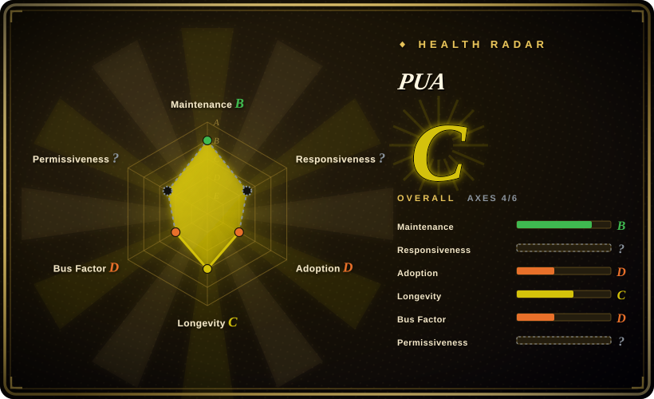
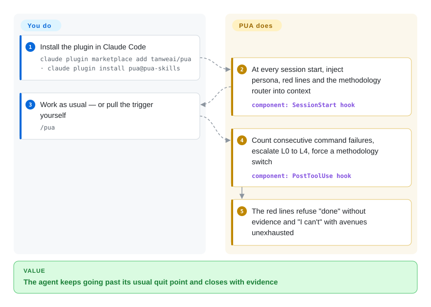

# PUA

A high-agency persona skill pack that frames your coding agent as a P8 engineer on a 30-day PIP, using "corporate PUA / PIP" rhetoric to push it to exhaust debugging approaches instead of giving up early.

## When to use

You're a developer running Claude Code (or Codex CLI, Cursor, Kiro, OpenCode…) and your agent keeps bailing too soon: it hits an error twice, shrugs, declares "this is a known limitation," and stops — or it claims a fix is done without ever re-running the failing command. You want it to behave like a stubborn senior engineer who treats "I can't" as unacceptable until every avenue is genuinely exhausted. PUA installs a persona that reframes the agent as a once-promising P8 placed on a performance-improvement plan, then escalates pressure as failures accumulate: L0 normal → L1 "switch to a fundamentally different approach" → L2 "search + read the source + form three hypotheses" → L3 "complete a 7-point checklist" → L4 "desperation mode." Layered on top are "Three Red Lines" (no false completion claims, verify facts with tools, exhaust approaches before quitting) and methodology routing that picks a debugging strategy and rotates it on repeated failure.

You reach for it when you'd rather adopt an opinionated, theatrical persistence layer than hand-write your own "don't give up" prompting, and especially when you want that nudge to follow you across harnesses. The repo ships per-platform assets (Claude Code plugin, Codex skills, Cursor `.mdc` rules, Kiro steering, VSCode/Copilot instructions, plus persona variants like `/pua:p7`, `/pua:p9`, `/pua:p10`, `/pua:yes`, `/pua:mama`), and since v3.5.1 also portable standalone skill packages for Claude Code / Codex / ChatGPT that ship without the plugin's commands and hooks. On Claude Code it goes beyond pure prompting: the plugin's `hooks/hooks.json` wires `SessionStart`, `PreToolUse`, `PostToolUse`, `PostToolUseFailure`, `UserPromptSubmit`, `PreCompact`, `Stop` and `SubagentStop` to inject context and count failures more deterministically than prompt text alone (verified in source, 2026-09-28). The sub-modes (p7/p9/p10/pro/yes/pua-loop) are Claude Code only — every other platform installs the core skill alone.

## How it works

PUA is a behavioral overlay, not a toolchain. Once installed on Claude Code, its `SessionStart` hook — an event script Claude Code runs at the start of every session — injects the P8-on-a-PIP persona, the Three Red Lines and a methodology router into system context, so the pressure is present from the first turn rather than something you must remember to ask for. When the agent runs a shell command and it fails, `PostToolUse` counts consecutive failures, escalates the pressure level (L0 → L4), and forces a switch of debugging methodology (e.g. Huawei 5-Why → Musk's "The Algorithm"); `UserPromptSubmit` intercepts frustration phrases like "try harder" before the model even sees them. What it does for you: persistence pressure, failure accounting, and refusing "done" without evidence. What stays yours: deciding when quitting is actually right — outside Claude Code there are no hooks, and the whole thing degrades to skill markdown the agent can ignore. You can also trigger it manually with `/pua`.

<!-- flow-steps:begin (generated from flows/pua.json by tools/flow_card.py — do not edit) -->

Text version of the flow

1. **You**: Install the plugin in Claude Code — `claude plugin marketplace add tanweai/pua · claude plugin install pua@pua-skills`
2. **PUA**: At every session start, inject persona, red lines and the methodology router into context — component: `SessionStart hook`
3. **You**: Work as usual — or pull the trigger yourself — `/pua`
4. **PUA**: Count consecutive command failures, escalate L0 to L4, force a methodology switch — component: `PostToolUse hook`
5. **PUA**: The red lines refuse "done" without evidence and "I can't" with avenues unexhausted

**Value**: The agent keeps going past its usual quit point and closes with evidence

<!-- flow-steps:end -->

## When NOT to use

- **You already run a persistence / debugging discipline.** If your stack already enforces verification-before-completion, systematic debugging, or a "don't claim done without evidence" rule (many curated skill systems do), PUA's Three Red Lines overlap and its persona prompts can double-route or contradict yours. Pick one source of truth.
- **You would take the "double your productivity" headline as evidence.** v3.5.1's own changelog states this is *not* an all-model pass and no productivity gain has been established by the evaluation; its model matrix records open failures (Fable first-response errors, an Opus explanation mistake, OMP verification blocked by approvals, a rate-limited GLM run). Treat the benchmark table as the maintainer's self-report, not a verdict.
- **Zero telemetry is a hard requirement.** The README says five data-collection channels (full-transcript upload, rating feedback, heartbeat telemetry, a phone/email leaderboard, the pua-api platform) existed in earlier versions and were all removed in 3.5.x, guarded by an offline `evals/test-no-telemetry.sh` — that history is README-sourced; audit before installing where any upload is unacceptable.
- **You want enforcement, not vibes.** Outside the Claude Code hook path, the persona is prompt injection — the agent can ignore "L4 desperation mode" the same way it ignores any instruction. It increases the odds of persistence; it does not compel it.
- **The "PUA" framing is a non-starter.** The whole pitch is psychological-pressure rhetoric (Chinese corporate-management and Western PIP culture). If you find that distasteful, want a neutral tone, or are wiring an agent for others, the theme itself is the product and can't be cleanly stripped out.
- **You're not on a supported harness.** Activation depends on each platform's loader (Claude `Skill`/plugin, Codex skills, Cursor rules, Kiro steering). On a bespoke or unsupported agent the markdown does nothing on its own.
- **Single-maintainer, theme-heavy.** Behavior is baked into persona prompts; a version bump can still shift escalation logic or which flavors exist. The release cadence has also slowed since the launch hype (v3.5.0 2026-06 → v3.5.1 2026-09-09), so fixes you need may not arrive. Pin and re-check after upgrades. [推断]

## Comparison

| Alternative | In index | Our verdict | Tradeoff |
|---|---|---|---|
| [antfu/skills](antfu-skills.md) | ✅ | Choose antfu/skills when you need a broad utility collection rather than a persistence persona. | A maintainer's personal general-purpose skill collection; broad utility skills, no persona/pressure theme. PUA is single-purpose: it only adds a persistence persona, not a toolbox. |
| [awesome-claude-code-subagents](../../subagent-collections/awesome-claude-code-subagents.md) | ✅ | Choose awesome-claude-code-subagents when you need a dispatchable roster of role specialists. | A large catalog of role-based subagents to dispatch work to. PUA is not a roster of specialists — it's a behavioral overlay that changes how one agent persists. |
| [Superpowers](../../../agent-dev-methodology/coding-agent-harnesses/superpowers.md) | ✅ | Choose Superpowers when you need the full brainstorm→plan→TDD→verify lifecycle. | Full brainstorm→plan→TDD→verify SDLC methodology pack; its `verification-before-completion` / `systematic-debugging` skills overlap PUA's Red Lines but ship a whole lifecycle, where PUA is just the persistence/anti-quit layer with a persona skin. |
| Anthropic's built-in skills / native slash commands | 未收录 | Choose built-in skills or native slash commands when you want the platform's own skill surface. | The platform's own skill surface; PUA is a third-party persona bundle layered on top and can duplicate or conflict with native behavior. |

## Health & viability

- **Responsiveness**: Cannot be scored — type_na.
- **Maintenance** — active but decelerating: latest release v3.5.1 (2026-09-09), last pushed 2026-09-09, not archived (GitHub API, 2026-09-28). Only 5 commits to main in the three months since 2026-06-26 — the launch-window frenzy is over, and the 3.5.1 cycle was compatibility fixes with published model limitations, not new capability.
- **Governance & bus factor** — single-maintainer personal repo (`User`-owned, 探微安全实验室 / TanWei Security Lab); ~19.7k stars but one author owns the roadmap and the whole persona theme. Heavy theme + one maintainer = real key-person risk.
- **Age & Lindy** — created 2026-03, ~0.6 years old as of 2026-09: still young and visibly hyped (fast to ~19.7k stars), so Lindy-unproven. Stars signal interest, not durability — treat as a bet on a trend, not a settled tool.
- **Risk flags** — the "PUA / PIP" psychological-pressure framing is the product and can't be cleanly stripped; a non-starter for neutral-tone or shared-agent setups. Earlier versions shipped five telemetry/collection channels that the README says were all removed in 3.5.x — an unusual privacy history to weigh. License declared MIT (README footer + `plugin.json`) but GitHub still detects no LICENSE file — verify before relying on it.

## Caveats (unverified)

- [未验证] No LICENSE file at the repo root as of 2026-09-28 (GitHub `licenseInfo` null); MIT is declared in the README footer and in `plugin.json`. Frontmatter records MIT per those declarations — verify enforceability before relying on it.
- [未验证] v3.5.1 release date (2026-09-09), last push (2026-09-09), primary language Python (GitHub languages API 2026-09-28: Python > Shell > TypeScript), created 2026-03-08 — per GitHub metadata; re-verify before relying on a specific version's behavior.
- [未验证] The benchmark table (+36% fixes, +65% verifications, 18 controlled experiments) is the maintainer's own self-evaluation; v3.5.1's changelog explicitly disclaims an all-model pass and any established productivity gain. No independent replication exists here.
- [未验证] The privacy history (five collection channels removed in 3.5.x) and the `evals/test-no-telemetry.sh` regression guard are README/changelog-sourced; the removal was not independently audited in this pass.
- [未验证] The supported-harness list (Claude Code, Codex CLI, pi, Trae, Cursor, Kiro, CodeBuddy, OpenClaw, Google Antigravity, OpenCode, VSCode/Copilot) and install methods (`npx skills add`, `claude plugin install`, manual curl) are from the README; per-harness activation fidelity is not independently confirmed here.
- [未验证] The command/flavor list (`/pua:pua`, `/pua:on|off|offline`, `/pua:p7|p9|p10|pro`, `/pua:yes`, `/pua:mama`, `/pua:shot`, `/pua:pua-loop`, `/pua:survey`, `/pua:flavor`, `/pua:kpi`, `/pua:team-status`, `/pua:reap-orphans`, `/pua:teardown-all`) and the L0–L4 escalation table are from the README and may change release-to-release.
- [推断] Hooks are verified to exist and register those events (`hooks/hooks.json` read 2026-09-28), but hook *effects* are still context injection into a probabilistic model: the agent can in principle ignore injected pressure text, and "L4 desperation mode" is not a hard guarantee.
