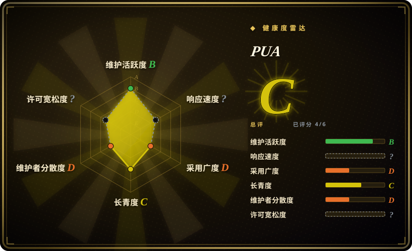
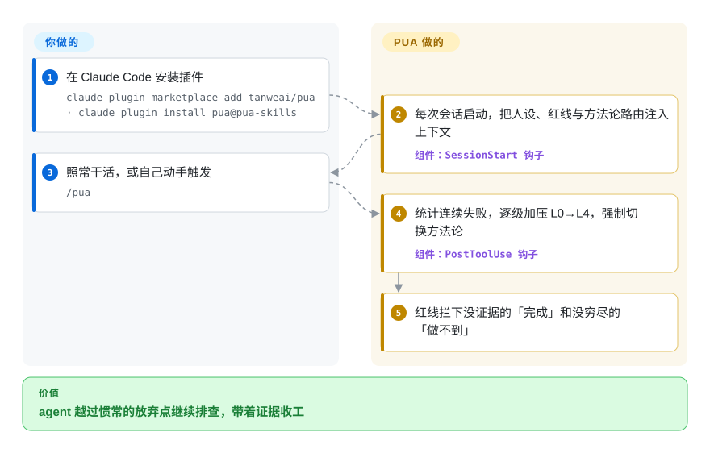

# PUA

一个高能动性人设 skill 包：把你的 coding agent 设定成「被放进 30 天 PIP 的 P8 工程师」，用「职场 PUA / PIP」话术逼它穷尽排查手段，而不是早早放弃。

## 何时使用

你是一名在跑 Claude Code（或 Codex CLI、Cursor、Kiro、OpenCode……）的开发者，而你的 agent 总是太早投降：报错两次就耸耸肩说「这是已知限制」然后停手——或者根本没重跑那条失败命令，就宣称已经修好了。你希望它像个倔强的资深工程师那样，在真正穷尽所有路径之前把「我做不到」当作不可接受。PUA 装上一套人设，把 agent 重塑为「曾被寄予厚望、如今进了绩效改进计划的 P8」，并随失败累积逐级加压：L0 正常 → L1「换一个根本不同的思路」→ L2「搜索 + 读源码 + 提三个假设」→ L3「完成 7 点检查清单」→ L4「绝望模式」。叠在上面的是「三条红线」（不许虚报完成、用工具核实事实、放弃前先穷尽方案）以及方法论路由：挑一种排查策略，失败重复时轮换。

当你宁可采用一套有主张、带戏剧化的「坚持」覆盖层，也不想自己手写「别放弃」式提示时，就会用它；尤其当你希望这种推力能跨 harness 跟着你走。仓库为各平台分别打包了资产（Claude Code 插件、Codex skills、Cursor `.mdc` 规则、Kiro steering、VSCode/Copilot 指令，以及 `/pua:p7`、`/pua:p9`、`/pua:p10`、`/pua:yes`、`/pua:mama` 等人设变体），自 v3.5.1 起另附 Claude Code / Codex / ChatGPT 的可独立携带技能包——独立包不含插件的命令与钩子。在 Claude Code 上它不止于纯提示：插件的 `hooks/hooks.json` 接了 `SessionStart`、`PreToolUse`、`PostToolUse`、`PostToolUseFailure`、`UserPromptSubmit`、`PreCompact`、`Stop`、`SubagentStop` 钩子来注入上下文、统计失败，比纯提示文本更确定（2026-09-28 已在源码核实）。子模式（p7/p9/p10/pro/yes/pua-loop）仅 Claude Code 有——其他平台装到的只有核心 skill。

## 怎么用起来

PUA 是行为覆盖层，不是工具链。装进 Claude Code 后，它的 `SessionStart` 钩子——Claude Code 每次会话启动都会执行的事件脚本——把「PIP 上的 P8」人设、三条红线和方法论路由注入系统上下文，压力从第一轮就在，不用你想起来去要。当 agent 跑的 shell 命令失败时，`PostToolUse` 数连续失败次数、逐级加压（L0 → L4），并强制切换排查方法论（如华为 5-Why → 马斯克的「The Algorithm」）；`UserPromptSubmit` 会在模型看到之前就拦下「try harder」这类用户泄愤短语。它替你做的：坚持施压、失败记账、拦下没证据的「完成」。仍归你的：判断什么时候放弃才是对的——出了 Claude Code 就没有钩子，整套东西退化为 agent 可理可不理的 skill markdown。也可以手动 `/pua` 触发。

<!-- flow-steps:begin (generated from flows/pua.json by tools/flow_card.py — do not edit) -->

流程文字版

1. **你**：在 Claude Code 安装插件 — `claude plugin marketplace add tanweai/pua · claude plugin install pua@pua-skills`
2. **PUA**：每次会话启动，把人设、红线与方法论路由注入上下文 — 组件：`SessionStart 钩子`
3. **你**：照常干活，或自己动手触发 — `/pua`
4. **PUA**：统计连续失败，逐级加压 L0→L4，强制切换方法论 — 组件：`PostToolUse 钩子`
5. **PUA**：红线拦下没证据的「完成」和没穷尽的「做不到」

**价值**：agent 越过惯常的放弃点继续排查，带着证据收工

<!-- flow-steps:end -->

## 何时不用

- **你已经有一套「坚持 / 排查」纪律。** 如果你的栈里已经强制 verification-before-completion、系统化排查，或「没证据不许声称完成」（很多精选 skill 系统都有），PUA 的三条红线会重叠，它的人设提示会和你的双重路由或互相打架。只留一个事实源。
- **你会把「效率翻倍」的标题当证据。** v3.5.1 自己的更新说明写明：这不是全模型通过认证，本轮评测也未确立生产力提升；其模型矩阵记录了未解决的问题（Fable 首轮开场/诊断失败、Opus 讲解有事实错误、OMP 的验证被审批阻断、GLM 限流）。基准表要当作维护者的自测报告，而非结论。
- **零遥测是硬要求。** README 称早期版本存在五类数据收集通道（全文转录上传、评分反馈、心跳遥测、含手机/邮箱的排行榜、pua-api 平台），3.5.x 已全部移除，并由离线的 `evals/test-no-telemetry.sh` 做回归守卫——这段历史取自 README；对上传零容忍的环境，装前先自行审计。
- **你要的是强制，而不是氛围。** 在 Claude Code 钩子路径之外，这套人设就是提示注入——agent 可以无视「L4 绝望模式」，就像它无视任何指令一样。它提高坚持的概率，但不强制坚持。
- **「PUA」这个框架本身让你无法接受。** 整个卖点就是心理施压话术（中式职场管理 + 西方 PIP 文化）。如果你反感这种调性、想要中性语气，或要给别人配 agent，那么主题本身就是产品，无法干净地剥掉。
- **你不在受支持的 harness 上。** 激活依赖各平台的加载器（Claude `Skill`/插件、Codex skills、Cursor 规则、Kiro steering）。在自研或不受支持的 agent 上，markdown 本身什么都不做。
- **单人维护、主题厚重。** 行为烤进人设提示，一次版本升级仍可能改掉加压逻辑或某些「味道」。发版节奏也已从发布热潮中慢下来（v3.5.0 2026-06 → v3.5.1 2026-09-09），你需要的修复未必会来。建议锁版本，升级后复查。[推断]

## 横向对比

| 替代品 | 是否收录 | 我们的评价 | 取舍 |
|---|---|---|---|
| [antfu/skills](antfu-skills.zh.md) | ✅ | 需要广谱工具型个人 skill 合集，而不是“坚持”人设覆盖层时，选 antfu/skills。 | 一位维护者的个人通用 skill 合集；偏广谱工具型 skill，没有人设 / 加压主题。PUA 是单一目的：只加一层「坚持」人设，不是工具箱。 |
| [awesome-claude-code-subagents](../../subagent-collections/awesome-claude-code-subagents.zh.md) | ✅ | 需要按角色分发任务的专家目录时，选 awesome-claude-code-subagents。 | 一个庞大的按角色分发任务的 subagent 目录。PUA 不是专家名册——它是改变单个 agent「怎么坚持」的行为覆盖层。 |
| [Superpowers](../../../agent-dev-methodology/coding-agent-harnesses/superpowers.zh.md) | ✅ | 需要完整 brainstorm→plan→TDD→verify SDLC 方法论包时，选 Superpowers。 | 完整的 brainstorm→plan→TDD→verify SDLC 方法论包；其 `verification-before-completion` / `systematic-debugging` 与 PUA 的红线重叠，但交付的是整套生命周期，而 PUA 只是带人设外皮的「坚持 / 反放弃」层。 |
| 平台内置 skills / 原生 slash 命令 | 未收录 | 优先使用平台维护的原生 skill 面时，选内置 slash 命令。 | 平台自身的 skill 面；PUA 是叠在上面的第三方人设包，可能与原生行为重复或冲突。 |

## 健康度与可持续性

- **响应速度**：无法计算——type_na。
- **维护** —— 活跃但在减速：最新发布 v3.5.1（2026-09-09），最后推送 2026-09-09，未归档（GitHub API，2026-09-28）。自 2026-06-26 以来主干仅 5 个提交——发布窗口的狂热已过，3.5.1 周期是带着公开模型局限说明的兼容性修复，而非新能力。
- **治理与 bus factor** —— 单维护者的个人仓库（`User` 所有，探微安全实验室）；约 19.7k stars，但路线图和整套人设主题都由一个作者把控。厚重主题 + 单人维护 = 实打实的关键人风险。
- **年龄与 Lindy** —— 创建于 2026-03，截至 2026-09 约 0.6 年：仍然年轻且明显被热捧（短期内冲到约 19.7k stars），因此 Lindy 上未经验证。Star 反映关注度而非耐久度——当作押注一个趋势，而非已沉淀的工具。
- **风险旗标** —— 「PUA / PIP」心理施压框架就是产品本体，无法干净剥离；对中性语气或共享 agent 的场景是劝退点。早期版本存在五类遥测/收集通道、README 称 3.5.x 已全部移除——一段不寻常的隐私历史，值得掂量。License 按 README 页脚与 `plugin.json` 声明 MIT，但 GitHub 至今检测不到 LICENSE 文件——依赖前请核实。

## 存疑（未验证）

- [未验证] 截至 2026-09-28 仓库根目录没有 LICENSE 文件（GitHub `licenseInfo` 为 null）；MIT 由 README 页脚与 `plugin.json` 声明。frontmatter 按这两处声明记为 MIT——依赖前请核实其可执行性。
- [未验证] v3.5.1 发布日期（2026-09-09）、最后 push（2026-09-09）、主语言 Python（GitHub languages API 2026-09-28：Python > Shell > TypeScript）、创建于 2026-03-08——均取自 GitHub 元数据；依赖某具体版本行为前请复核。
- [未验证] 基准表（+36% 修复、+65% 验证、18 组对照实验）是维护者自评；v3.5.1 更新说明明确否认全模型通过、否认已确立生产力提升。此处没有独立复现。
- [未验证] 隐私历史（五类收集通道于 3.5.x 移除）与 `evals/test-no-telemetry.sh` 回归守卫均取自 README/更新说明；本轮未独立审计移除是否彻底。
- [未验证] 受支持 harness 列表（Claude Code、Codex CLI、pi、Trae、Cursor、Kiro、CodeBuddy、OpenClaw、Google Antigravity、OpenCode、VSCode/Copilot）与安装方式（`npx skills add`、`claude plugin install`、手动 curl）均来自 README；各 harness 的实际激活保真度未在此独立确认。
- [未验证] 命令 / 味道列表（`/pua:pua`、`/pua:on|off|offline`、`/pua:p7|p9|p10|pro`、`/pua:yes`、`/pua:mama`、`/pua:shot`、`/pua:pua-loop`、`/pua:survey`、`/pua:flavor`、`/pua:kpi`、`/pua:team-status`、`/pua:reap-orphans`、`/pua:teardown-all`）与 L0–L4 加压表均来自 README，可能随版本变化。
- [推断] 钩子已核实存在并注册这些事件（2026-09-28 读取 `hooks/hooks.json`），但钩子的*效果*仍是向概率模型注入上下文：agent 原则上可无视注入的施压文本，「L4 绝望模式」不是硬保证。
