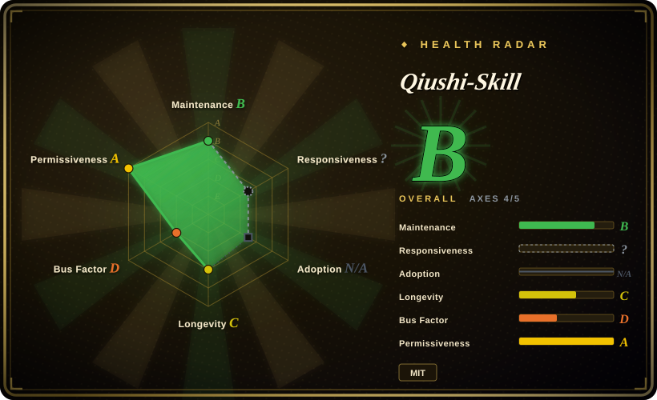
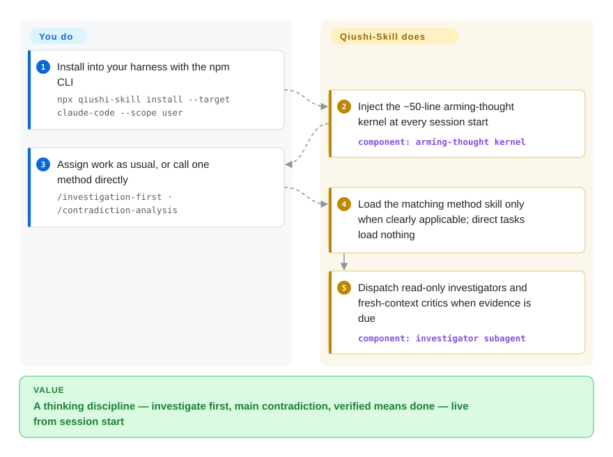

# Qiushi-Skill

A methodology skill pack (求是 Skill) that arms a coding agent with one core principle — "seek truth from facts" (实事求是) — plus nine dialectical-materialist / practice-philosophy "tools" (contradiction analysis, investigation-first, practice-cognition, mass line, criticism & self-criticism, protracted strategy, concentrate forces, spark-prairie-fire, overall planning), installable across Claude Code, Cursor, Codex, OpenCode and others via an `npx` installer.

## When to use

You're a developer (or a heavy agent user) who is tired of an obsequious assistant that agrees with whatever you say, jumps to a plausible-sounding answer, and declares victory without checking reality. You want the agent to behave like a disciplined analyst: investigate before deciding, name the *primary* contradiction instead of fixing the loudest symptom, validate hypotheses against actual practice (run it, observe it), and keep pushing until the work is genuinely done rather than nominally finished. Qiushi-Skill packages that posture as a set of on-demand skills: an "arming-thought" entry skill that injects the core principle at session start, plus nine method skills the agent loads only when a situation clearly calls for one (`/contradiction-analysis`, `/investigation-first`, etc.), with a `workflows/` layer to chain them.

You reach for it when you want a ready-made *thinking discipline* rather than building your own from scratch, and especially when you want that discipline to follow you across harnesses. The core assets are just three directories — `skills/`, `commands/`, `hooks/` — and the `npx qiushi-skill install --target claude-code,cursor,codex,opencode,openclaw,hermes,nanobot` CLI copies the right subset into each host's native skill directory (on Claude Code it's a full plugin bundle with agents and a SessionStart hook), so the same "facts first, main contradiction, validate in practice" spine activates through each platform's own skill-loading mechanism.

## How it works

Qiushi-Skill is markdown behavior files plus one thin installer — no runtime. The `arming-thought` entry skill, an ~50-line kernel carrying the "seek truth from facts" hard rules (follow the evidence, separate fact from inference from unknown, verified means done, diagnose before reporting a blocker), is injected at every session start by a `SessionStart` hook on Claude Code; on other hosts the same file is loaded through their native skill mechanism. From there the kernel decides per task whether one of the nine method skills clearly applies — direct execution tasks load nothing, and where the host already has an equivalent flow, the host wins. When investigation or review matters, it can dispatch two subagents: `investigator`, a read-only researcher that returns a facts / inferences / unknowns report, and `self-critic`, which reviews the artifact in fresh context without the author's narration. What it does for you: the routing discipline, the operating procedures, the output templates. What stays yours: actually running things and reading the evidence — every "mandatory" step is still a prompt, not a gate.

<!-- flow-steps:begin (generated from flows/qiushi-skill.json by tools/flow_card.py — do not edit) -->

Text version of the flow

1. **You**: Install into your harness with the npm CLI — `npx qiushi-skill install --target claude-code --scope user`
2. **Qiushi-Skill**: Inject the ~50-line arming-thought kernel at every session start — component: `arming-thought kernel`
3. **You**: Assign work as usual, or call one method directly — `/investigation-first · /contradiction-analysis`
4. **Qiushi-Skill**: Load the matching method skill only when clearly applicable; direct tasks load nothing
5. **Qiushi-Skill**: Dispatch read-only investigators and fresh-context critics when evidence is due — component: `investigator subagent`

**Value**: A thinking discipline — investigate first, main contradiction, verified means done — live from session start

<!-- flow-steps:end -->

## When NOT to use

- **You already run a curated thinking/planning skill stack.** This pack is opinionated and prescriptive (mandatory investigation-first, contradiction-naming before action). Layering its nine methods on top of an existing methodology system invites overlapping routing and competing instructions — pick one source of truth for "how the agent thinks."
- **Conceptual overlap with general dev-methodology packs.** Investigation-first, practice-cognition and criticism overlap heavily with brainstorm→plan→TDD→verify style packs; if you already have one, the added value is mostly the *contradiction / prioritization* framing, not the loop itself.
- **You're on an unsupported or bespoke harness.** Activation depends on each platform's loader; outside the shipped targets there's no mechanism to auto-fire the skills, and the markdown alone does nothing.
- **You want a runtime/library, not behavior shaping.** The `bin/` CLI is only an installer that copies skill files into your harness — there's no API or service to call; the product is prompts.
- **Enforcement is advisory.** "Mandatory" steps are prompt-level instructions the agent can still skip; this shapes behavior, it does not gate it. [推断]
- **Single-maintainer, version drift, naming may be a barrier.** Upstream is one author; the npm package is at 2.0.0 (2026-09) while the newest git tag is still v1.4.0 (2026-04) and there is no GitHub Release, so a known-good state means pinning an npm version, not a source tag. The dialectical-materialism / historical-vocabulary framing (despite the README's "methodology, not propaganda" disclaimer) may be a non-starter for some teams or audiences.

## Comparison

| Alternative | In index | Our verdict | Tradeoff |
|---|---|---|---|
| [antfu/skills](antfu-skills.md) | ✅ | Choose antfu/skills when you need task-oriented build/repo chores rather than a thinking methodology. | Personal task-oriented skill set (build/repo chores) rather than a thinking methodology; complementary, not a substitute — Qiushi shapes *how to reason*, antfu's shape *how to do specific jobs*. |
| [Dimillian/Skills](dimillian-skills.md) | ✅ | Choose Dimillian/Skills when a stack-specific personal collection is the better fit. | Another personal curated collection skewed to a specific stack/workflow; overlaps as "someone's skill bundle" but not on the methodology/discipline axis. |
| [gstack](gstack.md) | ✅ | Choose gstack when you need harness configuration rather than a cognitive-method spine. | Personal harness-config collection; same leaf, different intent — config/tooling vs. a cognitive-method spine. |
| [wshobson/agents](../../subagent-collections/wshobson-agents.md) | ✅ | Choose wshobson/agents when you need a roster of role-specialist subagents. | Large subagent persona library (role specialists). Qiushi is a small set of *thinking methods*, not a roster of domain agents — combine rather than choose. |
| [awesome-claude-code-subagents](../../subagent-collections/awesome-claude-code-subagents.md) | ✅ | Choose awesome-claude-code-subagents when breadth-first subagent coverage matters most. | Breadth-first subagent catalog; Qiushi is depth-first on one methodology. Pick by whether you need many personas or one disciplined loop. |
| [Superpowers](../../../agent-dev-methodology/coding-agent-harnesses/superpowers.md) / general SDLC methodology packs | 部分已收录 | Choose Superpowers when brainstorm→plan→TDD→verify discipline is the core requirement. | Brainstorm→plan→TDD→verify methodology plugins occupy the same "discipline as skills" niche; Qiushi differs by leading with contradiction-analysis and prioritization rather than a test-first lifecycle. |

## Health & viability

- **Responsiveness**: Cannot be scored — type_na.
- **Maintenance** — active: last pushed 2026-09-06 (GitHub API, 2026-09-28), npm `qiushi-skill` 2.0.0 published 2026-09-06 with ~383 downloads/month (npm registry, trailing month) — real install cadence now exists, but the git tags lag (newest v1.4.0, 2026-04-30) and there are no GitHub Releases, so release hygiene trails the code.
- **Governance & bus factor** — single-maintainer personal repo (`User`-owned, HughYau), ~3.8k stars. One author owns the methodology, the npm CLI and the per-platform install targets; modest stars and a niche framing mean limited community backstop if the maintainer steps away.
- **Age & Lindy** — created 2026-03, ~0.5 years old as of 2026-09: young, Lindy-unproven. The *underlying* method (dialectical-materialist analysis) is old, but this packaging is new and untested across CLI churn — adopt for the discipline, not for longevity.
- **Risk flags** — the dialectical-materialism / historical-vocabulary framing (despite a "methodology, not propaganda" disclaimer) can be a non-starter for some teams or audiences; no enforcement (advisory prompts only). License MIT — a LICENSE file is now present at the root and GitHub detects it (2026-09-28).

## Caveats (unverified)

- [未验证] The skill inventory (1 core kernel "arming-thought" + 9 methods + a `workflows/` orchestration layer, ~50-line kernel) and the supported-target list (claude-code, cursor, codex, opencode, openclaw, hermes, nanobot) are from the README and `docs/platforms.md`; the actual `skills/` tree contents and per-harness activation fidelity were not inspected file-by-file here.
- [未验证] The hook-based session injection (`SessionStart` auto-injecting the kernel, methods loading "only when clearly applicable") is described by the README and `docs/platforms.md`; whether it fires reliably in any given harness is not confirmed.
- [未验证] The `investigator` / `self-critic` subagents exist as files in `agents/` (repo tree, 2026-09-28); their behavior inside a live session was not exercised here.
- [推断] Because the methods live in prompt/markdown skills loaded by the agent, enforcement is advisory — the agent can still deviate from "mandatory" investigation-first / contradiction-naming steps.
- [推断] `type` is recorded as `skill-pack` because the `npx qiushi-skill` CLI is an installer for the skill files, not a standalone runtime; if you depend on the installer as tooling, evaluate it separately.
