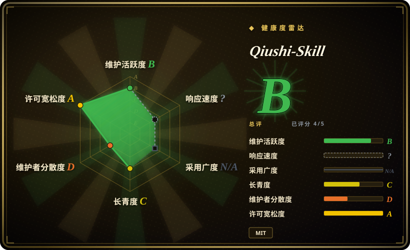
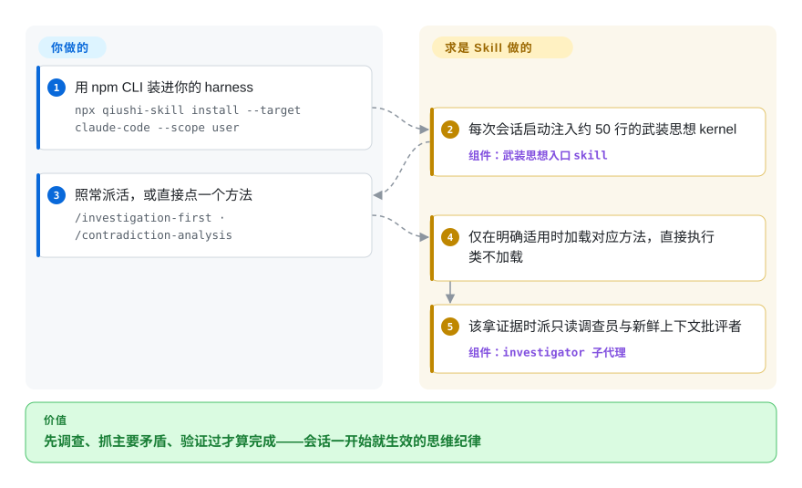

# Qiushi-Skill

一套方法论 skill 包（求是 Skill）：用一条总原则——「实事求是」——加九个唯物辩证法/实践哲学「工具」（矛盾分析、调查研究、实践认识论、群众路线、批评与自我批评、持久战略、集中兵力、星火燎原、统筹兼顾）武装编程 agent，并通过 `npx` 安装器跨 Claude Code、Cursor、Codex、OpenCode 等多 harness 落地。

## 何时使用

你是一名开发者（或重度 agent 用户），受够了那种唯唯诺诺的助手：你说什么它都附和，张口就给一个听上去合理的答案，活儿没核对就宣布完成。你希望 agent 像个有纪律的分析者：先调查再决策、抓住*主要*矛盾而不是去修最吵的那个症状、把假设拿到实践里检验（跑起来、观察它），并且一直推进到事情真正做完而非名义上做完。Qiushi-Skill 把这种姿态打包成一组按需加载的 skill：一个「武装思想」入口 skill 在会话开始时注入总原则，外加九个方法 skill，仅在情形明确适用时才由 agent 加载（`/contradiction-analysis`、`/investigation-first` 等），并有 `workflows/` 层把它们串起来。

当你想要一套现成的*思维纪律*而非从零自建、尤其想让这套纪律跨 harness 跟着你走时，就会用到它——核心资产只有三个目录（`skills/`、`commands/`、`hooks/`），`npx qiushi-skill install --target claude-code,cursor,codex,opencode,openclaw,hermes,nanobot` 这个 CLI 会把对应的子集拷进各宿主的原生 skills 目录（在 Claude Code 上是带 agents 与 SessionStart 钩子的完整插件包），让同一条「先看事实、抓主要矛盾、实践中检验」的主干通过各平台原生的 skill 加载机制激活。

## 怎么用起来

求是 Skill 是 markdown 行为文件加一个薄安装器——没有运行时。入口 skill「武装思想」是一条约 50 行的常驻 kernel，承载「实事求是」四条硬规则：结论跟着证据走、分清事实/推断/未知、验证过才算完成、遇阻先诊断；在 Claude Code 上由 `SessionStart` 钩子每次会话开始时注入，其他宿主则通过各自的 skill 加载机制进入上下文。之后 kernel 按任务判断九个方法里是否有明确适用的一个——直接执行类任务什么都不加载，宿主已有等价流程时以宿主为准。需要调查或审查时，它能派出两个子代理：`investigator` 是只读调查员，产出「事实/推断/未知」三栏报告；`self-critic` 是新鲜上下文审查员，只看制品不看作者叙述。它替你做的：路由纪律、操作规程、输出模板。仍归你的：真正去跑、去读证据——所谓「强制」仍是 prompt，不是闸门。

<!-- flow-steps:begin (generated from flows/qiushi-skill.json by tools/flow_card.py — do not edit) -->

流程文字版

1. **你**：用 npm CLI 装进你的 harness — `npx qiushi-skill install --target claude-code --scope user`
2. **Qiushi-Skill**：每次会话启动注入约 50 行的武装思想 kernel — 组件：`武装思想入口 skill`
3. **你**：照常派活，或直接点一个方法 — `/investigation-first · /contradiction-analysis`
4. **Qiushi-Skill**：仅在明确适用时加载对应方法，直接执行类不加载
5. **Qiushi-Skill**：该拿证据时派只读调查员与新鲜上下文批评者 — 组件：`investigator 子代理`

**价值**：先调查、抓主要矛盾、验证过才算完成——会话一开始就生效的思维纪律

<!-- flow-steps:end -->

## 何时不用

- **你已有一套精挑的思考/规划 skill 栈。** 这个包很有主见且强制性强（强制先调查、动手前先命名矛盾）。把它的九个方法叠在既有方法论体系之上，会带来路由重叠与指令打架——「agent 怎么思考」只能有一个事实源。
- **与通用 dev-methodology 包概念重叠。** 调查研究、实践认识论、批评等与 brainstorm→plan→TDD→verify 风格的包高度重叠；若你已有一套，本包的增量主要是*矛盾/优先级*这层框架，而非那个循环本身。
- **你在不受支持或定制的 harness 上。** 激活依赖各平台的 loader；在未附带的 target 之外没有机制自动触发这些 skill，光有 markdown 不起作用。
- **你想要的是运行时/库，而非行为塑形。** `bin/` 里的 CLI 只是把 skill 文件拷进 harness 的安装器——没有可调用的 API 或服务；产品本体是 prompt。
- **强制是 advisory 的。** 那些「强制」步骤是 prompt 级指令，agent 仍可跳过；它塑形行为，但不构成闸门。[推断]
- **单人维护、版本错位、命名可能是门槛。** 上游是一名维护者；npm 包已到 2.0.0（2026-09），但最新的 git tag 还停在 v1.4.0（2026-04），也没有 GitHub Release——要锁定已知良好状态只能 pin npm 版本，锁不了源码 tag。尽管 README 声明「是方法论不是宣传」，其唯物辩证法/历史词汇的框架对某些团队或受众可能直接是劝退点。

## 横向对比

| 替代品 | 是否收录 | 我们的评价 | 取舍 |
|---|---|---|---|
| [antfu/skills](antfu-skills.zh.md) | ✅ | 需要构建或仓库杂务等任务型个人 skill 时，选 antfu/skills。 | 偏任务向的个人 skill 集（构建/仓库杂务），不是思维方法论；互补而非替代——Qiushi 塑形*如何推理*，antfu 的塑形*如何做具体活儿*。 |
| [Dimillian/Skills](dimillian-skills.zh.md) | ✅ | 任务贴近特定技术栈或工作流收藏，而非方法论纪律时，选 Dimillian/Skills。 | 另一份偏特定技术栈/工作流的个人收藏；作为「某人的 skill 包」有重叠，但不在方法论/纪律这条轴上。 |
| [gstack](gstack.zh.md) | ✅ | 需要个人 Claude Code harness 配置集，而不是认知方法主干时，选 gstack。 | 个人 harness 配置集；同 leaf、不同意图——配置/工具 vs. 一条认知方法主干。 |
| [wshobson/agents](../../subagent-collections/wshobson-agents.zh.md) | ✅ | 需要大型角色专家 subagent 库时，选 wshobson/agents。 | 大型 subagent 人格库（角色专家）。Qiushi 是一小组*思维方法*，不是一排领域 agent——宜组合而非二选一。 |
| [awesome-claude-code-subagents](../../subagent-collections/awesome-claude-code-subagents.zh.md) | ✅ | 需要广度优先的 subagent 目录时，选 awesome-claude-code-subagents。 | 广度优先的 subagent 目录；Qiushi 在单一方法论上做深度。按你需要「多人格」还是「一条有纪律的循环」来选。 |
| [Superpowers](../../../agent-dev-methodology/coding-agent-harnesses/superpowers.zh.md) | ✅ | 需要 brainstorm→plan→TDD→verify 的通用 SDLC 方法论包时，选 Superpowers。 | brainstorm→plan→TDD→verify 类方法论插件占据同一个「把纪律做成 skill」的位置；Qiushi 的不同在于以矛盾分析与优先级排序打头，而非测试先行的生命周期。 |

## 健康度与可持续性

- **响应速度**：无法计算——type_na。
- **维护** —— 活跃：最后推送 2026-09-06（GitHub API，2026-09-28），npm 包 `qiushi-skill` 2.0.0 发布于 2026-09-06、月下载约 383 次（npm registry，近一月）——真实的安装通道已经出现；但 git tag 滞后（最新 v1.4.0，2026-04-30）、没有 GitHub Release，发布卫生落后于代码推进。
- **治理与 bus factor** —— 单维护者的个人仓库（`User` 所有，HughYau），约 3.8k stars。方法论、npm CLI 与各平台安装目标都由一个作者把控；star 数一般、框架小众，意味着维护者一旦离场，社区兜底有限。
- **年龄与 Lindy** —— 创建于 2026-03，截至 2026-09 约 0.5 年：年轻，Lindy 上未经验证。其*底层*方法（唯物辩证法分析）很老，但这套封装是新的，跨 CLI 更迭尚未验证——为这套纪律而采用，不为长寿。
- **风险旗标** —— 唯物辩证法/历史词汇的框架（尽管声明「是方法论不是宣传」）对某些团队或受众可能直接是劝退点；无强制（仅建议性 prompt）。License 为 MIT——仓库根目录现有 LICENSE 文件，GitHub 也能检测到（2026-09-28）。

## 存疑（未验证）

- [未验证] skill 清单（1 条入口 kernel「武装思想」+ 9 个方法 + 一个 `workflows/` 编排层，kernel 约 50 行）与受支持 target 列表（claude-code、cursor、codex、opencode、openclaw、hermes、nanobot）来自 README 与 `docs/platforms.md`；这里未逐文件检视实际 `skills/` 目录内容与各 harness 的激活保真度。
- [未验证] 基于钩子的会话注入（`SessionStart` 自动注入 kernel、方法「仅在明确适用时」加载）由 README 与 `docs/platforms.md` 描述；它在任一具体 harness 中是否可靠触发未经确认。
- [未验证] `investigator` / `self-critic` 子代理作为 `agents/` 下的文件存在（2026-09-28 仓库树）；其在真实会话中的行为未被实测。
- [推断] 由于这些方法存在于 agent 加载的 prompt/markdown skill 中，强制是 advisory 的——agent 仍可能偏离「强制」的先调查/先命名矛盾步骤。
- [推断] `type` 记为 `skill-pack`，因为 `npx qiushi-skill` CLI 是 skill 文件的安装器而非独立运行时；若你把该安装器当工具依赖，请单独评估。
